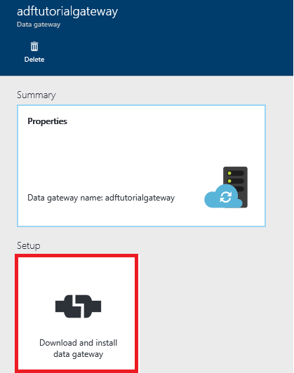
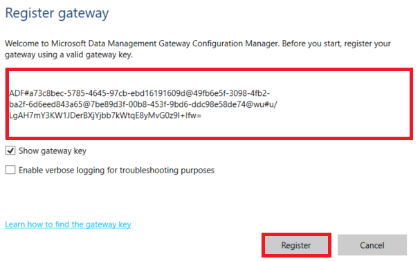
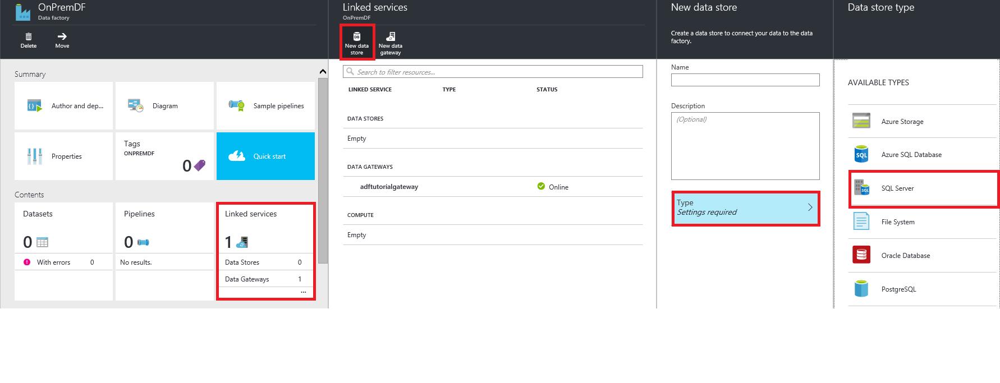
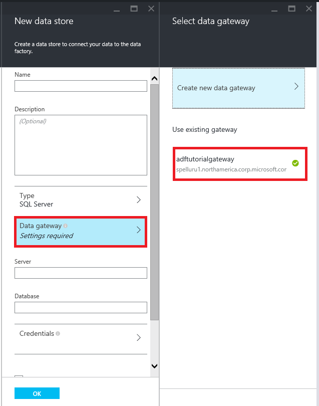
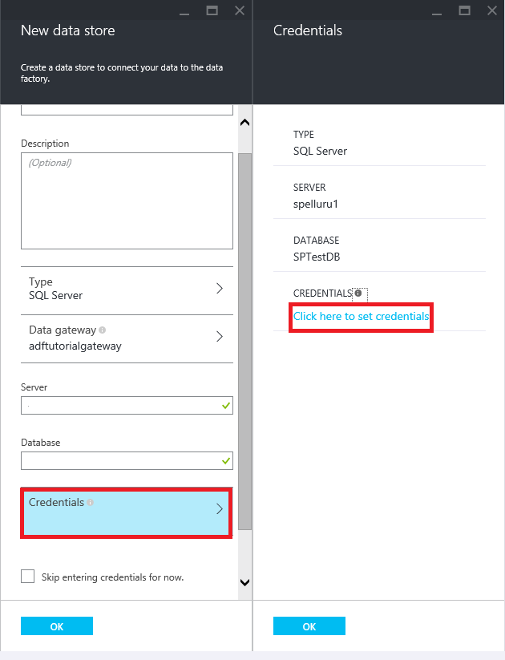
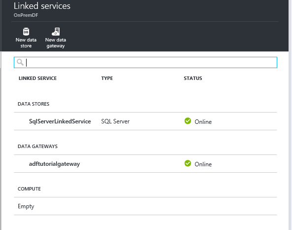
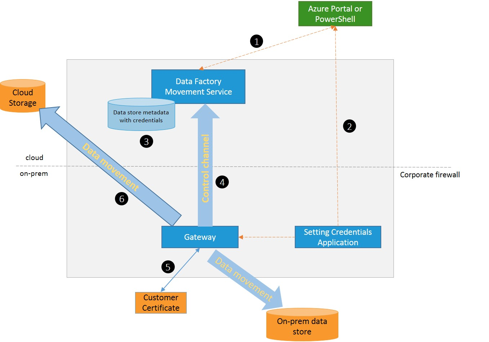

<properties 
	pageTitle="Move data between on-premises and cloud using Azure Data Factory" 
	description="Learn about moving data between on-premises and cloud using Data Management Gateway and Azure Data Factory." 
	services="data-factory" 
	documentationCenter="" 
	authors="spelluru" 
	manager="jhubbard" 
	editor="monicar"/>

<tags 
	ms.service="data-factory" 
	ms.workload="data-services" 
	ms.tgt_pltfrm="na" 
	ms.devlang="na" 
	ms.topic="article" 
	ms.date="10/23/2015" 
	ms.author="spelluru"/>

# Move Data Between On-premises Sources and Cloud with Data Management Gateway
One of the challenges for modern data integration is to seamlessly move data to and from on-premises to cloud. Data factory makes this integration seamless with data management gateway. Data factory management gateway  is an agent you can install on-premises to enable hybrid pipelines.

This article provides an overview of integrating on-premises data stores with cloud data stores and cloud processing using data factory. This article builds on the [Data Movement Activities](data-factory-data-movement-activities.md) article and other data factory core concepts articles. The following overview assumes you are familiar with data factory concepts like pipelines, activities, datasets and the copy activity.

The data gateway provides the following capabilities:

1.	Model on-premises data sources and cloud data sources within the same data factory and move data.
2.	Have a single pane of glass for monitoring and management with visibility into gateway status with data factory cloud dashboard.
3.	Manage access to on-premises data sources securely.
	1. No changes required to corporate firewall. Gateway only makes outbound HTTP based connections to open internet.
	2. Encrypt credentials for your on-premises data stores with your certificate.
4.	Move data efficiently – data is transferred in parallel, resilient to intermittent network issues with auto retry logic.

## Considerations for using Data Management Gateway
1.	A single instance of Data Management Gateway can be used for multiple on-premises data sources, but note that **a single gateway instance is tied to only one Azure data factory** and cannot be shared with another data factory.
2.	You can have **only one instance of Data Management Gateway** installed on a single machine. Suppose, you have two data factories that need to access on-premises data sources, you need to install gateways on two on-premises computers where each gateway tied to a separate data factory.
3.	The **gateway does not need to be on the same machine as the data source**, but staying closer to the data source reduces the time for the gateway to connect to the data source. We recommend that you install the gateway on a machine that is different from the one that hosts on-premises data source so that the gateway does not compete for resources with data source.
4.	You can have **multiple gateways on different machines connecting to the same on-premises data source**. For example, you may have two gateways serving two data factories but the same on-premises data source is registered with both the data factories.
5.	If you already have a gateway installed on your computer serving a **Power BI** scenario, please install a **separate gateway for Azure Data Factory** on another machine.
6.	You must **use the gateway even when you use ExpressRoute**. 
7.	You should treat your data source as an on-premises data source (that is behind a firewall) even when you use **ExpressRoute** and **use the gateway** to establish connectivity between the service and the data source. 

## Gateway installation - prerequisites
1.	The supported **Operating System** versions are Windows 7, Windows 8/8.1, Windows Server 2008 R2, Windows Server 2012.
2.	The recommended **configuration** for the gateway machine is at least 2 GHz, 4 cores, 8 GB RAM and 80 GB disk.
3.	If the host machine hibernates, the gateway won’t be able to respond to data requests. Therefore, configure an appropriate **power plan** on the computer before installing the gateway. The gateway installation prompts a message if the machine is configured to hibernate.

Due to the fact that copy activity runs happen on a specific frequency, the resource usage (CPU, memory) on the machine also follows the same pattern with peak and idle times. Resource utilization also depends heavily on the amount of data being moved. When multiple copy jobs are in progress you will observe resource usage go up during peak times. While above is the minimum configuration it is always better to have a configuration with more resources than the min configuration described above depending on your specific load for data movement.

## Installation
Data Management Gateway can be installed by downloading an MSI setup package from the Microsoft Download Center.  The MSI can also be used to upgrade existing Data Management Gateway to the latest version, with all settings preserved. You can find the link to the MSI package from Azure portal by following the step by step walkthrough below.

### Installation Best practices:
1.	Configure power plan on the host machine for the gateway so that the machine does not hibernate. If the host machine hibernates, the gateway won’t be able to respond to data requests.
2.	You should backup the certificate associated with the gateway.

### Installation Troubleshooting:
If your company uses a firewall or proxy server, additional steps may be required in case Data Management Gateway cannot connect to Microsoft cloud services. 

#### Looking at Gateway logs with Event Viewer:

Gaetway configuration manager application shows status for gateway like “Disconnected” or “Connecting”.

For more detailed information you can look at gateway logs in Windows event logs. You can find them by using Windows **Event Viewer** under **Application and Services Logs** > **Data Management Gateway** While troubleshooting gateway related issues look for error level events in the event viewer.

#### Possible symptoms for firewall related issues:

1. When you try to register the gateway, you receive the following error: "Failed to register the gateway key. Before trying to register the gateway key again, confirm that the Data Management Gateway is in a connected state and the Data Management Gateway Host Service is Started."
2. When you open Configuration Manager, you see status as “Disconnected” or “Connecting”. When viewing Windows event logs, under “Event Viewer” > “Application and Services Logs” > “Data Management Gateway” you see error messages such as “Unable to connect to the remote server” or “A component of Data Management Gateway has become unresponsive and will restart automatically. Component name: Gateway.”

These are caused by the improper configuration of the firewall or proxy server, which blocks Data Management Gateway from connecting to cloud services to authenticate itself.

The two firewalls that are possibly in scope are: corporate firewall running on the central router of the organization, and Windows firewall configured as a daemon on the local machine where the gateway is installed. Here are the some considerations:

- There is no need to change the inbound policy for corporate firewall.
- Both corporate firewall and Windows firewall should enable outbound rule for TCP ports: 80, 440, and from 9305 to 9354. These are used by Microsoft Azure Service Bus to establish connection between the cloud services and Data Management Gateway.

The MSI setup will automatically configure Windows firewall rules for inbound ports for the gateway machine (see ports and security considerations section above).

But the setup assumes the above mentioned outbound ports are allowed by default on the local machine and corporate firewall. You need to enable these outbound ports if that is not the case. If you have replaced the Windows firewall with a third party firewall, these ports might need to be opened manually. 

If your company uses a proxy server, then you need to add Microsoft Azure to the whitelist. You can download a list of valid Microsoft Azure IP addresses from the [Microsoft Download Center](http://msdn.microsoft.com/library/windowsazure/dn175718.aspx).

## Using the Data Gateway – Step by Step Walkthrough
In this walkthrough, you create a data factory with a pipeline that moves data from an on-premises SQL Server database to an Azure blob. 

### Step 1: Create an Azure data factory
In this step, you use the Azure Management Portal to create an Azure Data Factory instance named **ADFTutorialOnPremDF**. You can also create a data factory by using Azure Data Factory cmdlets. 

1.	After logging into the [Azure Preview Portal](https://portal.azure.com), click **NEW** from the bottom-left corner, select **Data analytics** in the **Create** blade, and click **Data Factory** on the **Data analytics** blade.

	 
  
6. In the **New data factory** blade:
	1. Enter **ADFTutorialOnPremDF** for the **name**.
	2. Click **RESOURCE GROUP NAME** and select **ADFTutorialResourceGroup**. You can select an existing resource group or create a new one. To create a new resource group:
		1. Click **Create a new resource group**.
		2. In the **Create resource group blade**, enter a **name** for the resource group, and click **OK**.

7. Note that **Add to Startboard** is checked on the **New data factory** blade.

	

8. In the **New data factory** blade, click **Create**.

	The name of the Azure data factory must be globally unique. If you receive the error: **Data factory name “ADFTutorialOnPremDF” is not available**, change the name of the data factory (for example, yournameADFTutorialOnPremDF) and try creating again. Use this name in place of ADFTutorialOnPremDF while performing remaining steps in this tutorial.  

9. Look for notifications from the creation process by clicking the **Notifications** button on the title bar as shown in the following image. Click on it again to close the notifications window. 

	

11. After creation is complete, you will see the **Data Factory** blade as shown below:

	

### Step 2: Create a data management gateway
5. In the **DATA FACTORY** blade, click **Author and deploy** tile to launch the **Editor** for the data factory.

	 
6.	In the Data Factory Editor, click **... (ellipsis)** on the toolbar and then click **New data gateway**. 

	
2. In the **Create** blade, enter **adftutorialgateway** for the **name**, and click **OK**. 	

	

3. In the **Configure** blade, click **Install directly on this computer**. This will download the installation package for the gateway, install, configure, and register the gateway on the computer.  

	> [AZURE.NOTE] Please use Internet Explorer or a Microsoft ClickOnce compatible web browser.

	

	This is the easiest way (one-click) to download, install, configure, and register the gateway in one single step. You can see the **Microsoft Data Management Gateway Configuration Manager** application is installed on your computer. You can also find the executable **ConfigManager.exe** in the folder: **C:\Program Files\Microsoft Data Management Gateway\1.0\Shared**.

	You can also download and install gateway manually by using the links in this blade and register it using the key shown in the **REGISTER WITH KEY** text box.
	
	See the sections at the beginning of this article for details about the gateway including best practices and important considerations.

	>[AZURE.NOTE] You must be an administrator on the local computer to install and configure the Data Management Gateway successfully. You can add additional users to the Data Management Gateway Users local Windows group. The members of this group will be able to use the Data Management Gateway Configuration Manager tool to configure the gateway. 

5. Wait for a couple of minutes and launch **Data Management Gateway Configuration Manager** application  on your computer. In the **Search** window, type **Data Management Gateway** to access this utility. You can also find the executable **ConfigManager.exe** in the folder: **C:\Program Files\Microsoft Data Management Gateway\1.0\Shared** 

	

6. Wait until the values are set as follows :
	1. **Status** is set to **Started**.
	2. **Gateway name** is set to **adftutorialgateway**.
	3. **Instance name** is set to **adftutorialgateway**.
	4. **Registration** is set to **Registered**.
	5. The status bar the bottom displays **Connected to Data Management Gateway Cloud Service** along with a **green check mark**.

8. Switch to **Certificates**. The certificate specified on this tab is used to encrypt/decrypt credentials for the on-premises data store that you specify on the portal. Click **Change** to use your own certificate instead. By default, the gateway uses the certificate that is auto-generated by the Data Factory service.

	
9. In the Azure Portal, click **OK** on the **Configure** blade and then on the **New data gateway** blade.
6. You should see **adftutorialgateway** under **Data Gateways** in the tree view on the left.  If you click on it, you should see the associated JSON. 
	

### Step 3: Create linked services 
In this step, you will create two linked services: **StorageLinkedService** and **SqlServerLinkedService**. The **SqlServerLinkedService** links an on-premises SQL Server database and the **StorageLinkedService** linked service links an Azure blob store to the data factory. You will create a pipeline later in this walkthrough that copies data from the on-premises SQL Server database to the Azure blob store. 

#### Add a linked service to an on-premises SQL Server database
1.	In the **Data Factory Editor**, click **New data store** on the toolbar and select **SQL Server**. 

	 
3.	In the **JSON editor**, do the following: 
	1. For the **gatewayName**, specify **adftutorialgateway**.	
	2. If you are using Windows authentication:
		1. In the **connectionString**: 
			1. Set the **Integrated Security** to **true**..
			2. Specify database **server name** and **database name**. 
			2. Remove **User ID** and **Password**. 
		3. Specify user name and password for **userName** and **password** properties.
		
				"typeProperties": {
            		"connectionString": "Data Source=<servername>;Initial Catalog=<databasename>;Integrated Security=True;",
            		"gatewayName": "adftutorialgateway",
            		"userName": "<Specify user name if you are using Windows Authentication>",
            		"password": "<Specify password for the user account>"
        		}

	4. If you are using SQL Authentication:
		1. Specify database **server name**, **database name**, **User ID**, and **Password** in the **connectionString**.       
		2. Remove last two JSON properties - **userName** and **password** - from the JSON.
		3. Remove the trailing **, (comma)** at the end of the line that specifies the value for the **gatewayName** property. 

				"typeProperties": {
            		"connectionString": "Data Source=<servername>;Initial Catalog=<databasename>;Integrated Security=False;User ID=<username>;Password=<password>;",
	           		"gatewayName": "<Name of the gateway that the Data Factory service should use to connect to the on-premises SQL Server database>"
    		    }
	   
2.	Click **Deploy** on the command bar to deploy the SQL Server linked service. 

#### Add a linked service for an Azure storage account
 
1. In the **Data Factory Editor**, click **New data store** on the command bar and click **Azure storage**.
2. Enter the name of your Azure storage account for the **Account name**.
3. Enter the key for your Azure storage account for the **Account key**.
4. Click **Deploy** to deploy the **StorageLinkedService**.
   
 
### Step 4: Create input and output datasets
In this step, you will create input and output datasets that represent input and output data for the copy operation (On-premises SQL Server database => Azure blob storage). Before creating datasets or tables (rectangular datasets), you need to do the following (detailed steps follows the list):

- Create a table named **emp** in the SQL Server Database you added as a linked service to the data factory and insert couple of sample entries into the table.
- Create a blob container named **adftutorial** in the Azure blob storage account you added as a linked service to the data factory.

### Prepare On-premises SQL Server for the tutorial

1. In the database you specified for the on-premises SQL Server linked service (**SqlServerLinkedService**), use the following SQL script to create the **emp** table in the database.

        CREATE TABLE dbo.emp
		(
			ID int IDENTITY(1,1) NOT NULL, 
			FirstName varchar(50),
			LastName varchar(50),
    		CONSTRAINT PK_emp PRIMARY KEY (ID)
		)
		GO
 

2. Insert some sample into the table: 

        INSERT INTO emp VALUES ('John', 'Doe')
		INSERT INTO emp VALUES ('Jane', 'Doe')

### Create input table

1. In the **Data Factory Editor**, click **New dataset** on the command bar, and click **SQL Server table**. 
2.	Replace the JSON in the right pane with the following text:    

		{
		  "name": "EmpOnPremSQLTable",
		  "properties": {
		    "type": "SqlServerTable",
		    "linkedServiceName": "SqlServerLinkedService",
		    "typeProperties": {
		      "tableName": "emp"
		    },
		    "external": true,
		    "availability": {
		      "frequency": "Hour",
		      "interval": 1
		    },
		    "policy": {
		      "externalData": {
		        "retryInterval": "00:01:00",
		        "retryTimeout": "00:10:00",
		        "maximumRetry": 3
		      }
		    }
		  }
		}

	Note the following: 
	
	- **type** is set to **SqlServerTable**.
	- **tableName** is set to **emp**.
	- **linkedServiceName** is set to **SqlServerLinkedService** (you had created this linked service in Step 2).
	- For an input table that is not generated by another pipeline in Azure Data Factory, you must set **external** to **true**. It denotes the input data is produced external to the Azure Data Factory service. You can optionally specify any external data policies using the **externalData** element in the **Policy** section.    

	See [JSON Scripting Reference][json-script-reference] for details about JSON properties.

2. Click **Deploy** on the command bar to deploy the dataset (table is a rectangular dataset). Confirm that you see a message on the title bar that says **TABLE DEPLOYED SUCCESSFULLY**. 

### Create output table

1.	In the **Data Factory Editor**, click **New dataset** on the command bar, and click **Azure Blob storage**.
2.	Replace the JSON in the right pane with the following text: 

		{
		  "name": "OutputBlobTable",
		  "properties": {
		    "type": "AzureBlob",
		    "linkedServiceName": "StorageLinkedService",
		    "typeProperties": {
		      "folderPath": "adftutorial/outfromonpremdf",
		      "format": {
		        "type": "TextFormat",
		        "columnDelimiter": ","
		      }
		    },
		    "availability": {
		      "frequency": "Hour",
		      "interval": 1
		    }
		  }
		}
  
	Note the following: 
	
	- **type** is set to **AzureBlob**.
	- **linkedServiceName** is set to **StorageLinkedService** (you had created this linked service in Step 2).
	- **folderPath** is set to **adftutorial/outfromonpremdf** where outfromonpremdf is the folder in the adftutorial container. You just need to create the **adftutorial** container.
	- The **availability** is set to **hourly** (**frequency** set to **hour** and **interval** set to **1**).  The Data Factory service will generate an output data slice every hour in the **emp** table in the Azure SQL Database. 

	if you don't specify a **fileName** for an **input table**, all files/blobs from the input folder (**folderPath**) are considered as inputs. If you specify a fileName in the JSON, only the specified file/blob is considered asn input. See the sample files in the [tutorial][adf-tutorial] for examples.
 
	If you do not specify a **fileName** for an **output table**, the generated files in the **folderPath** are named in the following format: Data.<Guid>.txt (for example: : Data.0a405f8a-93ff-4c6f-b3be-f69616f1df7a.txt.).

	To set **folderPath** and **fileName** dynamically based on the **SliceStart** time, use the partitionedBy property. In the following example, folderPath uses Year, Month, and Day from from the SliceStart (start time of the slice being processed) and fileName uses Hour from the SliceStart. For example, if a slice is being produced for 2014-10-20T08:00:00, the folderName is set to wikidatagateway/wikisampledataout/2014/10/20 and the fileName is set to 08.csv. 

	  	"folderPath": "wikidatagateway/wikisampledataout/{Year}/{Month}/{Day}",
        "fileName": "{Hour}.csv",
        "partitionedBy": 
        [
        	{ "name": "Year", "value": { "type": "DateTime", "date": "SliceStart", "format": "yyyy" } },
            { "name": "Month", "value": { "type": "DateTime", "date": "SliceStart", "format": "MM" } }, 
            { "name": "Day", "value": { "type": "DateTime", "date": "SliceStart", "format": "dd" } }, 
            { "name": "Hour", "value": { "type": "DateTime", "date": "SliceStart", "format": "hh" } } 
        ],

 

	See [JSON Scripting Reference][json-script-reference] for details about JSON properties.

2.	Click **Deploy** on the command bar to deploy the dataset (table is a rectangular dataset). Confirm that you see a message on the title bar that says **TABLE DEPLOYED SUCCESSFULLY**.
  

### Step 5: Create and run a pipeline
In this step, you create a **pipeline** with one **Copy Activity** that uses **EmpOnPremSQLTable** as input and **OutputBlobTable** as output.

1.	In the **DATA FACTORY** blade, click **Author and deploy** tile to launch the **Editor** for the data factory.

	 
2.	Click **New pipeline** on the command bar. If you do not see the button, click **... (ellipsis)** to expand the command bar.
2.	Replace the JSON in the right pane with the following text:   

		{
		  "name": "ADFTutorialPipelineOnPrem",
		  "properties": {
		    "description": "This pipeline has one Copy activity that copies data from an on-prem SQL to Azure blob",
		    "activities": [
		      {
		        "name": "CopyFromSQLtoBlob",
		        "description": "Copy data from on-prem SQL server to blob",
		        "type": "Copy",
		        "inputs": [
		          {
		            "name": "EmpOnPremSQLTable"
		          }
		        ],
		        "outputs": [
		          {
		            "name": "OutputBlobTable"
		          }
		        ],
		        "typeProperties": {
		          "source": {
		            "type": "SqlSource",
		            "sqlReaderQuery": "select * from emp"
		          },
		          "sink": {
		            "type": "BlobSink"
		          }
		        },
		        "Policy": {
		          "concurrency": 1,
		          "executionPriorityOrder": "NewestFirst",
		          "style": "StartOfInterval",
		          "retry": 0,
		          "timeout": "01:00:00"
		        }
		      }
		    ],
		    "start": "2015-02-13T00:00:00Z",
		    "end": "2015-02-14T00:00:00Z",
		    "isPaused": false
		  }
		}

	Note the following:
 
	- In the activities section, there is only activity whose **type** is set to **Copy**.
	- **Input** for the activity is set to **EmpOnPremSQLTable** and **output** for the activity is set to **OutputBlobTable**.
	- In the **transformation** section, **SqlSource** is specified as the **source type** and **BlobSink **is specified as the **sink type**.
	- SQL query **select * from emp** is specified for the **sqlReaderQuery** property of **SqlSource**.

	Replace the value of the **start** property with the current day and **end** value with the next day. Both start and end datetimes must be in [ISO format](http://en.wikipedia.org/wiki/ISO_8601). For example: 2014-10-14T16:32:41Z. The **end** time is optional, but we will use it in this tutorial. 
	
	If you do not specify value for the **end** property, it is calculated as "**start + 48 hours**". To run the pipeline indefinitely, specify **9/9/9999** as the value for the **end** property. 
	
	You are defining the time duration in which the data slices will be processed based on the **Availability** properties that were defined for each Azure Data Factory table.
	
	In the example above, there will be 24 data slices as each data slice is produced hourly.
	
2. Click **Deploy** on the command bar to deploy the dataset (table is a rectangular dataset). Confirm that you see a message on the title bar that says **PIPELINE DEPLOYED SUCCESSFULLY**.  
5. Now, close the **Editor** blade by clicking **X**. Click **X** again to close the ADFTutorialDataFactory blade with the toolbar and tree view. If you see **your unsaved edits will be discarded** message, click **OK**.
6. You should be back to the **DATA FACTORY** blade for the **ADFTutorialOnPremDF**.

**Congratulations!** You have successfully created an Azure data factory, linked services, tables, and a pipeline and scheduled the pipeline.

#### View the data factory in a Diagram View 
1. In the **Azure Preview Portal**, click **Diagram** tile on the home page for the **ADFTutorialOnPremDF** data factory. :

	

2. You should see the diagram similar to the following:

	

	You can zoom in, zoom out, zoom to 100%, zoom to fit, automatically position pipelines and tables, and show lineage information (highlights upstream and downstream items of selected items).  You can double-blick on an object (input/output table or pipeline) to see properties for it. 

### Step 6: Monitor the datasets and pipelines
In this step, you will use the Azure Portal to monitor what’s going on in an Azure data factory. You can also use PowerShell cmdlets to monitor datasets and pipelines. For details about monitoring, see [Monitor and Manage Pipelines](monitor-manage-pipelines.md).

1. Navigate to **Azure Preview Portal** (if you have closed it)
2. If the blade for **ADFTutorialOnPremDF** is not open, open it by clicking **ADFTutorialOnPremDF** on the **Startboard**.
3. You should see the **count** and **names** of tables and pipeline you created on this blade.

	
4. Now, click **Datasets** tile.
5. On the **Datasets** blade, click the **EmpOnPremSQLTable**.

	

6. Notice that the data slices up to the current time have already been produced and they are **Ready**. It is because you have inserted the data in the SQL Server database and it is there all the time. Confirm that no slices show up in the **Problem slices** section at the bottom.

	Both **Recently updated slices** and **Recently failed slices** lists are sorted by the **LAST UPDATE TIME**. The update time of a slice is changed in the following situations. 
    

	-  You update the status of the slice manually, for example, by using the **Set-AzureDataFactorySliceStatus** (or) by clicking **RUN** on the **SLICE** blade for the slice.
	-  The slice changes status due to an execution (e.g. a run started, a run ended and failed, a run ended and succeeded, etc).
 
	Click on the title of the lists or **... (ellipses)** to see the larger list of slices. Click **Filter** on the toolbar to filter the slices.  
	
	To view the data slices sorted by the slice start/end times instead, click **Data slices (by slice time)** tile.

7. Now, In the **Datasets** blade, click **OutputBlobTable**.

	![OputputBlobTable slices][image-data-factory-output-blobtable-slices]
8. Confirm that slices up to the current time are produced and **Ready**. Wait until the statuses of slices up to the current time are set to **Ready**.
9. Click on any data slice from the list and you should see the **DATA SLICE** blade.

	

	If the slice is not in the **Ready** state, you can see the upstream slices that are not Ready and are blocking the current slice from executing in the **Upstream slices that are not ready** list.

10. Click on the **activity run** from the list at the bottom to see **activity run details**.

	![Activity Run Details blade][image-data-factory-activity-run-details]

11. Click **X** to close all the blades until you 
12. get back to the home blade for the **ADFTutorialOnPremDF**.
14. (optional) Click **Pipelines**, click **ADFTutorialOnPremDF**, and drill through input tables (**Consumed**) or output tables (**Produced**).
15. Use tools such as **Azure Storage Explorer** to verify the output.

	

## Moving gateway from a machine to another
This section provides steps for moving gateway client from one machine to another machine. 

2. In the portal, navigate to the **Data Factory home page**, and click the **Linked Services** tile. 

	 
3. Select your gateway in the **DATA GATEWAYS** section of the **Linked Services** blade.
	
	
4. In the **Data gateway** blade, click **Download and install data gateway**.
	
	 
5. In the **Configure** blade, click **Download and install data gateway** and follow instructions to install the data gateway on the machine. 

	
6. Keep the **Microsoft Data Management Gateway Configuration Manager** open. 
 
		
7. In the **Configure** blade in the portal, click **Recreate key** on the command bar and click **Yes** for the warning message. Click **copy button** next to key text to copy the key to the clipboard.
	
	
8. Paste the **key** into text box in the **Register Gateway** page of the **Data Management Gateway Configuration Manager** on your machine. (optional) Click **Show gateway key** check box to see the key text. 
 
	
9. Click **Register** to register the gateway with the cloud service.
10. In the **Specify certificate** page, click **Browse** to select the same certificate that was used with the old gateway, enter the **password**, and click **Finish**. 
 
	

	You can export a certificate from the old gateway by doing the following: launch Data Management Gateway Configuration Manager on the old machine, switch to the **Certifcate** tab, click **Export** button and follow the instructions. 
10. After successful registration of the gateway, you should see the **Registration** set to **Registered** and **Status** set to **Started** on the Home page of the Gateway Configuration Manager. 

## Setting Credentials and Security

You can also create a SQL Server linked service using the Linked Services blade instead of using the Data Factory Editor. 
 
3.	On the Data Factory home page, click **Linked Services** tile. 
4.	In the **Linked services** blade, click **New data store** on the command bar. 
4.	Enter **SqlServerLinkedService** for the **name**. 
2.	Click arrow next to the **Type**, and select **SQL Server**.

	
3.	You should more settings below the **Type** setting.
4.	For the **Data gateway** setting, select the gateway you just created. 

	
4.	Enter the name of your database server for the **Server** setting.
5.	Enter the name of the database for the **Database** setting.
6.	Click arrow next to **Credentials**.

	
7.	In the **Credentials** blade, click **Click here to set credentials**.
8.	In the **Setting Credentials** dialog box, do the following:

	
	1.	Select **authentication** that you want the Data Factory service to use to connect to the database. 
	2.	Enter name of the user who has access to the database for the **USERNAME** setting. 
	3.	Enter password for the user for the **PASSWORD** setting.  
	4.	Click **OK** to close the dialog box. 
4. Click **OK** to close the **Credentials** blade. 
5. Click **OK** on the **New data store** blade. 	
6. Confirm that the status for **SqlServerLinkedService** is set to Online in the Linked Services blade.
	

If you access the portal from a machine that is different from the gateway machine, you must make sure that the Credentials Manager application can connect to the gateway machine. If the application cannot reach the gateway machine, it will not allow you to set credentials for the data source and to test connection to the data source. 

When you use the “Setting Credentials” application launched from Azure Portal to set credentials for an on-premises data source, the portal encrypts the credentials with the certificate you specified in the Certificate tab of the Data Management Gateway Configuration Manager on the gateway machine. 

If you are looking for an API based approach for encrypting the credentials you can  use the [New-AzureDataFactoryEncryptValue](https://msdn.microsoft.com/library/azure/dn834940.aspx) PowerShell cmdlet to encrypt credentials. The cmdlet uses the certificate that gateway is configured to use to encrypt the credentials. You can the encrypted credentials returned by this cmdlet and add it to EncryptedCredential element of the connectionString in the JSON file that you will use with the [New-AzureDataFactoryLinkedService](https://msdn.microsoft.com/library/azure/dn820246.aspx) cmdlet or in the JSON snippet in the Data Factory Editor in the portal. 

	"connectionString": "Data Source=<servername>;Initial Catalog=<databasename>;Integrated Security=True;EncryptedCredential=<encrypted credential>",

**Note:** If you use the “Setting Credentials” application it automatically sets the encrypted credentials in the linked service as shown above.

There is one more approach for setting credentials using Data Factory Editor. If you create a SQL Server linked service by using the editor and you enter credentials in plain text, the credentials are encrypted using a certificate that the Data Factory service owns, NOT the certificate that gateway is configured to use. While this approach might be a little faster in some cases it is less secure. Therefore, we recommend that you follow this approach only for development/testing purposes. 

## Creating and registering a gateway using Azure PowerShell 
This section describes how to create and register a gateway using Azure PowerShell cmdlets. 

1. Launch **Azure PowerShell** in administrator mode. 
2. The Azure Data Factory cmdlets are available in the **AzureResourceManager** mode. Execute the following command to switch to the **AzureResourceManager** mode.     

        switch-azuremode AzureResourceManager

2. Use the **New-AzureDataFactoryGateway** cmdlet to create a logical gateway as follows:

		New-AzureDataFactoryGateway -Name <gatewayName> -DataFactoryName <dataFactoryName> -ResourceGroupName ADF –Description <desc>

	**Example command and output**:

		PS C:\> New-AzureDataFactoryGateway -Name MyGateway -DataFactoryName $df -ResourceGroupName ADF –Description “gateway for walkthrough”

		Name              : MyGateway
		Description       : gateway for walkthrough
		Version           :
		Status            : NeedRegistration
		VersionStatus     : None
		CreateTime        : 9/28/2014 10:58:22
		RegisterTime      :
		LastConnectTime   :
		ExpiryTime        :
		ProvisioningState : Succeeded

3. Use the **New-AzureDataFactoryGatewayKey** cmdlet to generate a registration key for the newly created gateway, and store the key in a local variable **$Key**:

		New-AzureDataFactoryGatewayKey -GatewayName <gatewayname> -ResourceGroupName ADF -DataFactoryName <dataFactoryName>

	
	**Example command output:**

		PS C:\> $Key = New-AzureDataFactoryGatewayKey -GatewayName MyGateway -ResourceGroupName ADF -DataFactoryName $df 

	
4. In Azure PowerShell, switch to the folder: **C:\Program Files\Microsoft Data Management Gateway\1.0\PowerShellScript\** and Run **RegisterGateway.ps1** script associated with the local variable **$Key** as shown in the following command to register the client agent installed on your machine with the logical gateway you create earlier.

		PS C:\> .\RegisterGateway.ps1 $Key.GatewayKey
		
		Agent registration is successful!

5. You can use the **Get-AzureDataFactoryGateway** cmdlet to get the list of Gateways in your data factory. When the **Status** shows **online**, it means your gateway is ready to use.

		Get-AzureDataFactoryGateway -DataFactoryName <dataFactoryName> -ResourceGroupName ADF

You can remove a gateway using the **Remove-AzureDataFactoryGateway** cmdlet and update description for a gateway using the **Set-AzureDataFactoryGateway** cmdlets. For syntax and other details about these cmdlets, see Data Factory Cmdlet Reference.  

## Data flow for copy Using Data Management Gateway
When you use a copy activity in a data pipeline to ingest on-premises data to cloud for further processing, or export result data in the cloud back to an on-premises data store, the copy activity internally uses a gateway to transfer data from on-premises data source to cloud and vice versa.

Here high level data flow for and summary of steps for copy with data gateway:

1.	Data developer creates a new gateway for an Azure Data Factory using either the [Azure Portal](http://portal.azure.com) or [PowerShell Cmdlet](https://msdn.microsoft.com/library/dn820234.aspx). 
2.	Data developer uses “Linked services” panel to define a new linked service for an on-premises data store with the gateway. As part of setting up the linked service data developer uses the Setting Credentials application as show in the step by step walkthrough to specify authentication types and credentials.  The Setting Credentials application dialog will communicate with the data store to test connection and the gateway to save credentials.
3.	Gateway will encrypt the credentials with the certificate associated with the gateway (supplied by data developer), before saving the credentials in the cloud.
4.	Data factory movement service communicates with the gateway for scheduling & management of jobs via a control channel that uses a shared Azure service bus queue. When copy activity job needs to be kicked off, data factory queues up the request along with credential information. Gateway kicks off the job after polling the queue.
5.	The gateway decrypts the credentials with the same certificate and then connects to the on-premises data store with the proper authentication type.
6.	The gateway copies data from the on-premises store to a cloud storage, or from a cloud storage to an on-premises data store depending on how the Copy Activity is configured in the data pipeline. Note: For this step the gateway directly communicates with cloud based storage service (e.g. Azure Blob, Azure SQL etc) over secure (HTTPS) channel.

### Ports and security considerations

1. As mentioned above in the step by step walkthrough there are multiple ways of setting credentials for on-prem data stores with data factory. The port considerations vary for these options.	

	- Using the **Setting Credentials** App: The Data Management Gateway installation program by default opens **8050** and **8051** ports on the local windows firewall for the gateway machine. These ports are used by the Setting Credentials application to relay the credentials to the gateway. These ports are only opened for the machine on local windows firewall. They cannot be reached from internet and you do not need have these opened in the corporate wide firewall.
	2.	Using the [New-AzureDataFactoryEncryptValue](https://msdn.microsoft.com/library/dn834940.aspx) powershell commandlet: a.	If you are using powershell command to encrypt the credentials and as a result you do not want gateway installation to open the inbound ports on gateway machine in windows firewall you can do that by using the following command during installation:
	
			msiexec /q /i DataManagementGateway.msi NOFIREWALL=1
3.	If you are using the **Setting Credentials** application you must launch it on a computer that is able to connect to the Data Management Gateway to be able to set credentials for the data source and to test connection to the data source.
4.	When copying data from/to an on-premises SQL Server database to/from an Azure SQL database, ensure the following:	
	- 	Firewall on the gateway machine allows outgoing TCP communication on **TCP** port **1433**.
	- 	Configure [Azure SQL firewall settings](https://msdn.microsoft.com/library/azure/jj553530.aspx) to add the **IP address of the gateway** machine to the **allowed IP addresses**.
5.	When copying data to/from on-premises SQL Server to any destination and the gateway and SQL Server machines are different, do the following: [configure Windows Firewall](https://msdn.microsoft.com/library/ms175043.aspx) on the SQL Server machine so that the gateway can access the database via ports that the SQL Server instance listens on. For the default instance, it is port 1433.

## Send Feedback
We would really appreciate your feedback on this article. Please take a few minutes to submit your feedback via [email](mailto:adfdocfeedback@microsoft.com?subject=data-factory-move-data-between-onprem-and-cloud.md). 

