<properties 
	pageTitle="Move data - Data Management Gateway | Microsoft Azure"
	description="Set up a data gateway to move data between on-premises and the cloud. Use Data Management Gateway in Azure Data Factory to move your data." 
    keywords="data gateway, data integration, move data, gateway credentials"
	services="data-factory" 
	documentationCenter="" 
	authors="spelluru" 
	manager="jhubbard" 
	editor="monicar"/>

<tags 
	ms.service="data-factory" 
	ms.workload="data-services" 
	ms.tgt_pltfrm="na" 
	ms.devlang="na" 
	ms.topic="article" 
	ms.date="07/08/2016" 
	ms.author="spelluru"/>

# Move data between on-premises sources and the cloud with Data Management Gateway
This article provides an overview of data integration between on-premises data stores and cloud data stores using Data Factory. It builds on the [Data Movement Activities](data-factory-data-movement-activities.md) article and other data factory core concepts articles: [datasets](data-factory-create-datasets.md) and [pipelines](data-factory-create-pipelines.md). 

## Data Management Gateway
You must install Data Management Gateway on your on-premises machine to enable moving data to/from an on-premises data store. The gateway can be installed on the same machine as the data store or on a different machine as long as the gateway can connect to the data store. See [Data Management Gateway](data-factory-data-management-gateway.md) article for all the details about Data Management Gateway.   

The following walkthrough shows you how to create a data factory with a pipeline that moves data from an on-premises SQL Server database to an Azure blob. As part of the walkthrough, you will install and configure the Data Management Gateway on your machine. 

## Walkthrough: copy on-prem data to cloud
  
## Create data factory
In this step, you use the Azure Portal to create an Azure Data Factory instance named **ADFTutorialOnPremDF**. You can also create a data factory by using Azure Data Factory cmdlets. 

1.	After logging into the [Azure Portal](https://portal.azure.com), click **NEW** from the bottom-left corner, select **Data analytics** in the **Create** blade, and click **Data Factory** on the **Data analytics** blade.

	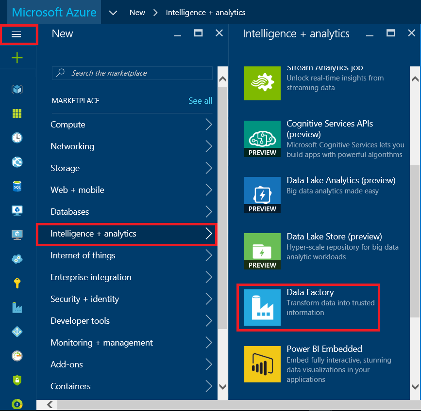 
  
6. In the **New data factory** blade:
	1. Enter **ADFTutorialOnPremDF** for the **name**.
	2. Click **RESOURCE GROUP NAME** and select **ADFTutorialResourceGroup**. You can select an existing resource group or create a new one. To create a new resource group:
		1. Click **Create a new resource group**.
		2. In the **Create resource group blade**, enter a **name** for the resource group, and click **OK**.

7. Note that **Add to Startboard** is checked on the **New data factory** blade.

	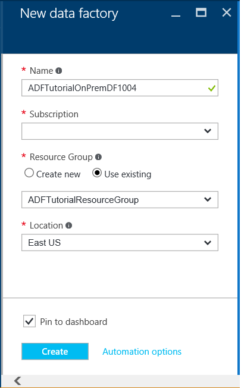

8. In the **New data factory** blade, click **Create**.

	The name of the Azure data factory must be globally unique. If you receive the error: **Data factory name “ADFTutorialOnPremDF” is not available**, change the name of the data factory (for example, yournameADFTutorialOnPremDF) and try creating again. Use this name in place of ADFTutorialOnPremDF while performing remaining steps in this tutorial.  

9. Look for notifications from the creation process by clicking the **Notifications** button on the title bar as shown in the following image. Click on it again to close the notifications window. 

	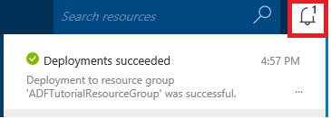

11. After creation is complete, you will see the **Data Factory** blade as shown below:

	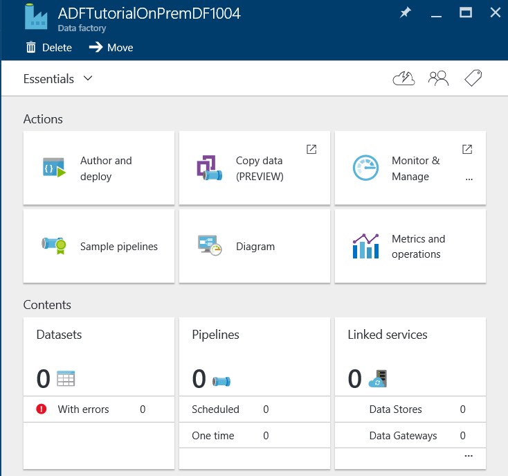

## Create gateway
5. In the **DATA FACTORY** blade, click **Author and deploy** tile to launch the **Editor** for the data factory.

	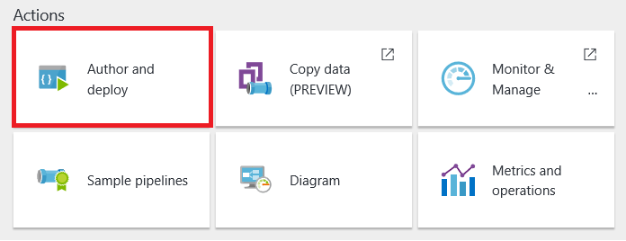 
6.	In the Data Factory Editor, click **... (ellipsis)** on the toolbar and then click **New data gateway**. 

	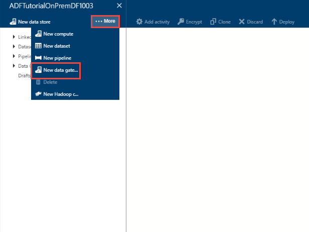
2. In the **Create** blade, enter **adftutorialgateway** for the **name**, and click **OK**. 	

	

3. In the **Configure** blade, click **Install directly on this computer**. This will download the installation package for the gateway, install, configure, and register the gateway on the computer.  

	> [AZURE.NOTE] 
	> Please use Internet Explorer or a Microsoft ClickOnce compatible web browser.
	> 
	> If you are using Chrome, go to the [Chrome web store](https://chrome.google.com/webstore/), search with "ClickOnce" keyword, choose one of the ClickOnce extensions, and install it. 
	>  
	> You need to do the same for Firefox (install add-in). Click **Open Menu** button on the toolbar (**three horizontal lines** in the top-right corner), click **Add-ons**, search with "ClickOnce" keyword, choose one of the ClickOnce extensions, and install it.    

	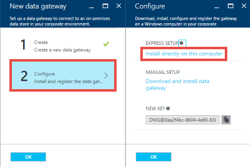

	This is the easiest way (one-click) to download, install, configure, and register the gateway in one single step. You can see the **Microsoft Data Management Gateway Configuration Manager** application is installed on your computer. You can also find the executable **ConfigManager.exe** in the folder: **C:\Program Files\Microsoft Data Management Gateway\1.0\Shared**.

	You can also download and install gateway manually by using the links in this blade and register it using the key shown in the **NEW KEY** text box.
	
	See [Data Management Gateway](data-factory-data-management-gateway.md) article for all the details about the gateway.

	>[AZURE.NOTE] You must be an administrator on the local computer to install and configure the Data Management Gateway successfully. You can add additional users to the Data Management Gateway Users local Windows group. The members of this group will be able to use the Data Management Gateway Configuration Manager tool to configure the gateway. 

5. Wait for a couple of minutes and launch **Data Management Gateway Configuration Manager** application  on your computer. In the **Search** window, type **Data Management Gateway** to access this utility. You can also find the executable **ConfigManager.exe** in the folder: **C:\Program Files\Microsoft Data Management Gateway\1.0\Shared** 

	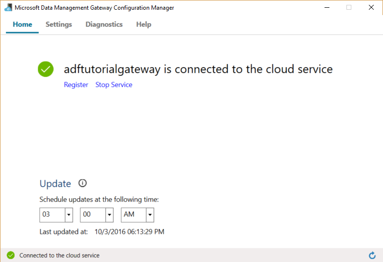

6. Wait until the values are set as follows :
	2. **Gateway name** is set to **adftutorialgateway**.
	4. The status bar the bottom displays **Connected to the cloud service** along with a **green check mark**.

	On the **Home** tab, you can also do the following: 
		- **Register** a gateway with a key from the Azure Portal by using the Register button. 
		- **Stop** the Data Management Gateway Host Service running on your gateway machine. 
		- **Schedule updates** to be installed at a specific time of the day. 
		- View when the gateway was **last updated**. 

8. Switch to the **Settings** tab. The certificate specified in the Certificate section is used to encrypt/decrypt credentials for the on-premises data store that you specify on the portal. (optional for the purpose of this tutorial) Click **Change** to use your own certificate instead. By default, the gateway uses the certificate that is auto-generated by the Data Factory service.

	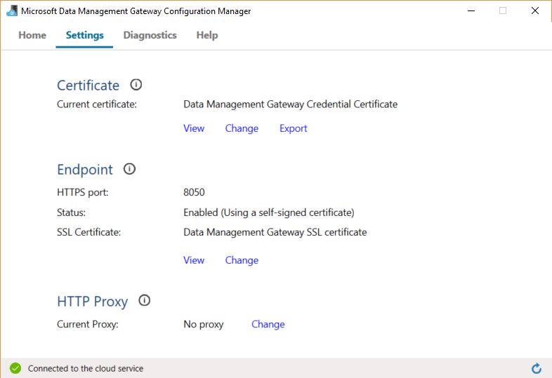

	You can also do the following on the Settings tab: 
		- View or export the certificate being used by the gateway.
		- Change the HTTPS endpoint used by the gateway		- 
9. (optional) Switch to the **Diagnostics** tab, check the **Enable verbose logging** option if you want to enable verbose logging that you can use to troubleshoot any issues with the gateway. The logging information can be found in **Event Viewer** under **Applications and Services Logs** -> **Data Management Gateway** node. 

	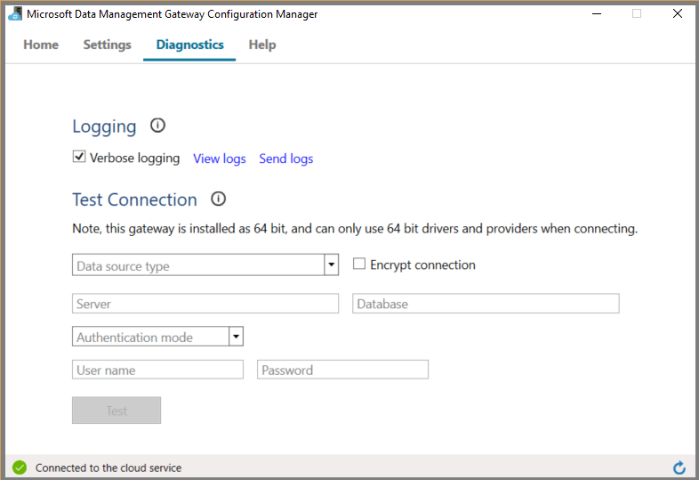

	You can also do the following in the **Diagnostics** tab: 
	
		- Use *Test Connection** section to an on-premises data source using the gateway.
		- Click **View Logs** to see the Data Management Gateway log in a Event Viewer window. 
		- Click **Send Logs** to upload a zip file with logs of last 7 days to Microsoft to facilitate troubleshooting of your issues. 
10. In the Azure Portal, click **OK** on the **Configure** blade and then on the **New data gateway** blade.
6. You should see **adftutorialgateway** under **Data Gateways** in the tree view on the left.  If you click on it, you should see the associated JSON. 
	

## Create linked services 
In this step, you will create two linked services: **AzureStorageLinkedService** and **SqlServerLinkedService**. The **SqlServerLinkedService** links an on-premises SQL Server database and the **AzureStorageLinkedService** linked service links an Azure blob store to the data factory. You will create a pipeline later in this walkthrough that copies data from the on-premises SQL Server database to the Azure blob store. 

#### Add a linked service to an on-premises SQL Server database
1.	In the **Data Factory Editor**, click **New data store** on the toolbar and select **SQL Server**. 

	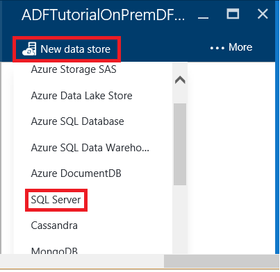 
3.	In the **JSON editor**, do the following: 
	1. For the **gatewayName**, specify **adftutorialgateway**.	
	2. If you are using Windows authentication:
		1. In the **connectionString**: 
			1. Set the **Integrated Security** to **true**..
			2. Specify database **server name** and **database name**. 
			2. Remove **User ID** and **Password**. 
		3. Specify user name and password for **userName** and **password** properties.  
		
				"typeProperties": {
            		"connectionString": "Data Source=<servername>;Initial Catalog=<databasename>;Integrated Security=True;",
            		"gatewayName": "adftutorialgateway",
            		"userName": "<Specify user name if you are using Windows Authentication. Example: <domain>\\<user>",
            		"password": "<Specify password for the user account>"
        		}

	4. If you are using SQL Authentication:
		1. Specify database **server name**, **database name**, **User ID**, and **Password** in the **connectionString**.       
		2. Remove last two JSON properties - **userName** and **password** - from the JSON.
		3. Remove the trailing **, (comma)** at the end of the line that specifies the value for the **gatewayName** property. 

				"typeProperties": {
            		"connectionString": "Data Source=<servername>;Initial Catalog=<databasename>;Integrated Security=False;User ID=<username>;Password=<password>;",
	           		"gatewayName": "<Name of the gateway that the Data Factory service should use to connect to the on-premises SQL Server database>"
    		    }
	
		the credentials will be **encrypted** by using a certificate that the Data Factory service owns. If you want to use the certificate that is associated with the Data Management Gateway instead, see [Set credentials securly](#set-credentials-and-security). 
    
2.	Click **Deploy** on the command bar to deploy the SQL Server linked service. 

#### Add a linked service for an Azure storage account
 
1. In the **Data Factory Editor**, click **New data store** on the command bar and click **Azure storage**.
2. Enter the name of your Azure storage account for the **Account name**.
3. Enter the key for your Azure storage account for the **Account key**.
4. Click **Deploy** to deploy the **AzureStorageLinkedService**.
   
 
## Create datasets
In this step, you will create input and output datasets that represent input and output data for the copy operation (On-premises SQL Server database => Azure blob storage). Before creating datasets or tables (rectangular datasets), you need to do the following (detailed steps follows the list):

- Create a table named **emp** in the SQL Server Database you added as a linked service to the data factory and insert couple of sample entries into the table.
- Create a blob container named **adftutorial** in the Azure blob storage account you added as a linked service to the data factory.

### Prepare On-premises SQL Server for the tutorial

1. In the database you specified for the on-premises SQL Server linked service (**SqlServerLinkedService**), use the following SQL script to create the **emp** table in the database.

        CREATE TABLE dbo.emp
		(
			ID int IDENTITY(1,1) NOT NULL, 
			FirstName varchar(50),
			LastName varchar(50),
    		CONSTRAINT PK_emp PRIMARY KEY (ID)
		)
		GO
 

2. Insert some sample into the table: 

        INSERT INTO emp VALUES ('John', 'Doe')
		INSERT INTO emp VALUES ('Jane', 'Doe')

### Create input table

1. In the **Data Factory Editor**, click **New dataset** on the command bar, and click **SQL Server table**. 
2.	Replace the JSON in the right pane with the following text:    

		{
		  "name": "EmpOnPremSQLTable",
		  "properties": {
		    "type": "SqlServerTable",
		    "linkedServiceName": "SqlServerLinkedService",
		    "typeProperties": {
		      "tableName": "emp"
		    },
		    "external": true,
		    "availability": {
		      "frequency": "Hour",
		      "interval": 1
		    },
		    "policy": {
		      "externalData": {
		        "retryInterval": "00:01:00",
		        "retryTimeout": "00:10:00",
		        "maximumRetry": 3
		      }
		    }
		  }
		}

	Note the following: 
	
	- **type** is set to **SqlServerTable**.
	- **tableName** is set to **emp**.
	- **linkedServiceName** is set to **SqlServerLinkedService** (you had created this linked service in Step 2).
	- For an input table that is not generated by another pipeline in Azure Data Factory, you must set **external** to **true**. It denotes the input data is produced external to the Azure Data Factory service. You can optionally specify any external data policies using the **externalData** element in the **Policy** section.    

	See [JSON Scripting Reference][json-script-reference] for details about JSON properties.

2. Click **Deploy** on the command bar to deploy the dataset (table is a rectangular dataset). Confirm that you see a message on the title bar that says **TABLE DEPLOYED SUCCESSFULLY**. 

### Create output table

1.	In the **Data Factory Editor**, click **New dataset** on the command bar, and click **Azure Blob storage**.
2.	Replace the JSON in the right pane with the following text: 

		{
		  "name": "OutputBlobTable",
		  "properties": {
		    "type": "AzureBlob",
		    "linkedServiceName": "AzureStorageLinkedService",
		    "typeProperties": {
		      "folderPath": "adftutorial/outfromonpremdf",
		      "format": {
		        "type": "TextFormat",
		        "columnDelimiter": ","
		      }
		    },
		    "availability": {
		      "frequency": "Hour",
		      "interval": 1
		    }
		  }
		}
  
	Note the following: 
	
	- **type** is set to **AzureBlob**.
	- **linkedServiceName** is set to **AzureStorageLinkedService** (you had created this linked service in Step 2).
	- **folderPath** is set to **adftutorial/outfromonpremdf** where outfromonpremdf is the folder in the adftutorial container. You just need to create the **adftutorial** container.
	- The **availability** is set to **hourly** (**frequency** set to **hour** and **interval** set to **1**).  The Data Factory service will generate an output data slice every hour in the **emp** table in the Azure SQL Database. 

	if you don't specify a **fileName** for an **input table**, all files/blobs from the input folder (**folderPath**) are considered as inputs. If you specify a fileName in the JSON, only the specified file/blob is considered asn input. See the sample files in the [tutorial][adf-tutorial] for examples.
 
	If you do not specify a **fileName** for an **output table**, the generated files in the **folderPath** are named in the following format: Data.<Guid>.txt (for example: : Data.0a405f8a-93ff-4c6f-b3be-f69616f1df7a.txt.).

	To set **folderPath** and **fileName** dynamically based on the **SliceStart** time, use the partitionedBy property. In the following example, folderPath uses Year, Month, and Day from from the SliceStart (start time of the slice being processed) and fileName uses Hour from the SliceStart. For example, if a slice is being produced for 2014-10-20T08:00:00, the folderName is set to wikidatagateway/wikisampledataout/2014/10/20 and the fileName is set to 08.csv. 

	  	"folderPath": "wikidatagateway/wikisampledataout/{Year}/{Month}/{Day}",
        "fileName": "{Hour}.csv",
        "partitionedBy": 
        [
        	{ "name": "Year", "value": { "type": "DateTime", "date": "SliceStart", "format": "yyyy" } },
            { "name": "Month", "value": { "type": "DateTime", "date": "SliceStart", "format": "MM" } }, 
            { "name": "Day", "value": { "type": "DateTime", "date": "SliceStart", "format": "dd" } }, 
            { "name": "Hour", "value": { "type": "DateTime", "date": "SliceStart", "format": "hh" } } 
        ],

 

	See [JSON Scripting Reference][json-script-reference] for details about JSON properties.

2.	Click **Deploy** on the command bar to deploy the dataset (table is a rectangular dataset). Confirm that you see a message on the title bar that says **TABLE DEPLOYED SUCCESSFULLY**.
  

## Create pipeline
In this step, you create a **pipeline** with one **Copy Activity** that uses **EmpOnPremSQLTable** as input and **OutputBlobTable** as output.

1.	In the **DATA FACTORY** blade, click **Author and deploy** tile to launch the **Editor** for the data factory.

	 
2.	Click **New pipeline** on the command bar. If you do not see the button, click **... (ellipsis)** to expand the command bar.
2.	Replace the JSON in the right pane with the following text:   

		{
		  "name": "ADFTutorialPipelineOnPrem",
		  "properties": {
		    "description": "This pipeline has one Copy activity that copies data from an on-prem SQL to Azure blob",
		    "activities": [
		      {
		        "name": "CopyFromSQLtoBlob",
		        "description": "Copy data from on-prem SQL server to blob",
		        "type": "Copy",
		        "inputs": [
		          {
		            "name": "EmpOnPremSQLTable"
		          }
		        ],
		        "outputs": [
		          {
		            "name": "OutputBlobTable"
		          }
		        ],
		        "typeProperties": {
		          "source": {
		            "type": "SqlSource",
		            "sqlReaderQuery": "select * from emp"
		          },
		          "sink": {
		            "type": "BlobSink"
		          }
		        },
		        "Policy": {
		          "concurrency": 1,
		          "executionPriorityOrder": "NewestFirst",
		          "style": "StartOfInterval",
		          "retry": 0,
		          "timeout": "01:00:00"
		        }
		      }
		    ],
		    "start": "2016-07-05T00:00:00Z",
		    "end": "2016-07-06T00:00:00Z",
		    "isPaused": false
		  }
		}

	Note the following:
 
	- In the activities section, there is only activity whose **type** is set to **Copy**.
	- **Input** for the activity is set to **EmpOnPremSQLTable** and **output** for the activity is set to **OutputBlobTable**.
	- In the **transformation** section, **SqlSource** is specified as the **source type** and **BlobSink **is specified as the **sink type**.
	- SQL query **select * from emp** is specified for the **sqlReaderQuery** property of **SqlSource**.

	Replace the value of the **start** property with the current day and **end** value with the next day. Both start and end datetimes must be in [ISO format](http://en.wikipedia.org/wiki/ISO_8601). For example: 2014-10-14T16:32:41Z. The **end** time is optional, but we will use it in this tutorial. 
	
	If you do not specify value for the **end** property, it is calculated as "**start + 48 hours**". To run the pipeline indefinitely, specify **9/9/9999** as the value for the **end** property. 
	
	You are defining the time duration in which the data slices will be processed based on the **Availability** properties that were defined for each Azure Data Factory table.
	
	In the example above, there will be 24 data slices as each data slice is produced hourly.
	
2. Click **Deploy** on the command bar to deploy the dataset (table is a rectangular dataset). Confirm that you see a message on the title bar that says **PIPELINE DEPLOYED SUCCESSFULLY**.  
5. Now, close the **Editor** blade by clicking **X**. Click **X** again to close the ADFTutorialDataFactory blade with the toolbar and tree view. If you see **your unsaved edits will be discarded** message, click **OK**.
6. You should be back to the **DATA FACTORY** blade for the **ADFTutorialOnPremDF**.

**Congratulations!** You have successfully created an Azure data factory, linked services, tables, and a pipeline and scheduled the pipeline.

#### View the data factory in a Diagram View 
1. In the **Azure Portal**, click **Diagram** tile on the home page for the **ADFTutorialOnPremDF** data factory. :

	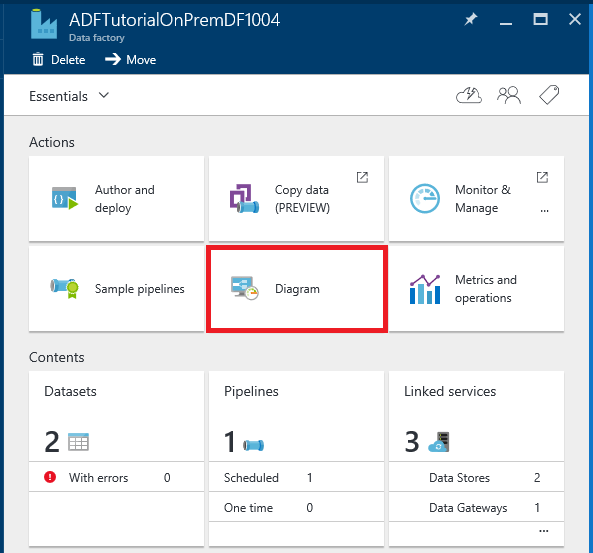

2. You should see the diagram similar to the following:

	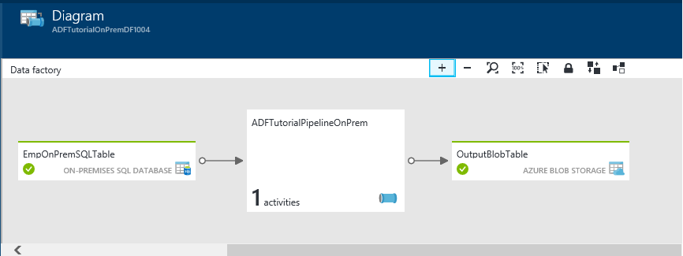

	You can zoom in, zoom out, zoom to 100%, zoom to fit, automatically position pipelines and tables, and show lineage information (highlights upstream and downstream items of selected items).  You can double-blick on an object (input/output table or pipeline) to see properties for it. 

## Monitor pipeline
In this step, you will use the Azure Portal to monitor what’s going on in an Azure data factory. You can also use PowerShell cmdlets to monitor datasets and pipelines. For details about monitoring, see [Monitor and Manage Pipelines](data-factory-monitor-manage-pipelines.md).

1. Navigate to **Azure Portal** (if you have closed it)
2. If the blade for **ADFTutorialOnPremDF** is not open, open it by clicking **ADFTutorialOnPremDF** on the **Startboard**.
3. You should see the **count** and **names** of tables and pipeline you created on this blade.

	
4. Now, click **Datasets** tile.
5. On the **Datasets** blade, click the **EmpOnPremSQLTable**.

	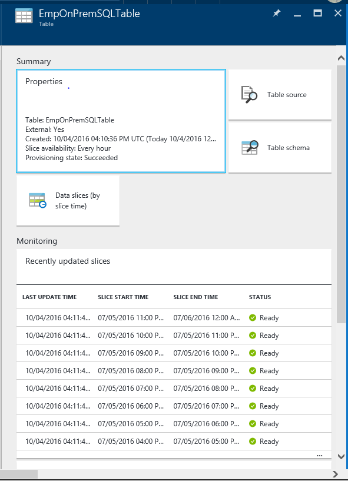

6. Notice that the data slices up to the current time have already been produced and they are **Ready**. It is because you have inserted the data in the SQL Server database and it is there all the time. Confirm that no slices show up in the **Problem slices** section at the bottom.

	Both **Recently updated slices** and **Recently failed slices** lists are sorted by the **LAST UPDATE TIME**. The update time of a slice is changed in the following situations. 
    

	-  You update the status of the slice manually, for example, by using the **Set-AzureRmDataFactorySliceStatus** (or) by clicking **RUN** on the **SLICE** blade for the slice.
	-  The slice changes status due to an execution (e.g. a run started, a run ended and failed, a run ended and succeeded, etc).
 
	Click on the title of the lists or **... (ellipses)** to see the larger list of slices. Click **Filter** on the toolbar to filter the slices.  
	
	To view the data slices sorted by the slice start/end times instead, click **Data slices (by slice time)** tile.

7. Now, In the **Datasets** blade, click **OutputBlobTable**.

	![OputputBlobTable slices][image-data-factory-output-blobtable-slices]
8. Confirm that slices up to the current time are produced and **Ready**. Wait until the statuses of slices up to the current time are set to **Ready**.
9. Click on any data slice from the list and you should see the **DATA SLICE** blade.

	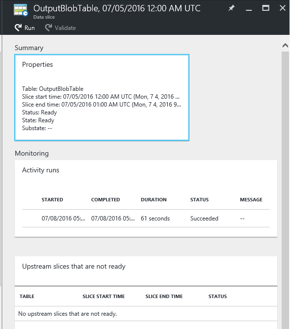

	If the slice is not in the **Ready** state, you can see the upstream slices that are not Ready and are blocking the current slice from executing in the **Upstream slices that are not ready** list.

10. Click on the **activity run** from the list at the bottom to see **activity run details**.

	![Activity Run Details blade][image-data-factory-activity-run-details]

11. Click **X** to close all the blades until you 
12. get back to the home blade for the **ADFTutorialOnPremDF**.
14. (optional) Click **Pipelines**, click **ADFTutorialOnPremDF**, and drill through input tables (**Consumed**) or output tables (**Produced**).
15. Use tools such as **Azure Storage Explorer** to verify the output.

	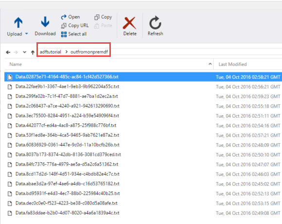

## Next Steps

- See [Data Management Gateway](data-factory-data-management-gateway.md) article for all the details about the Data Management Gateway.
- See [Copy data from Azure Blob to Azure SQL](data-factory-copy-data-from-azure-blob-storage-to-sql-database.md) to learn about how to use Copy Activity to move data from a source data store to a sink data store in general. 
