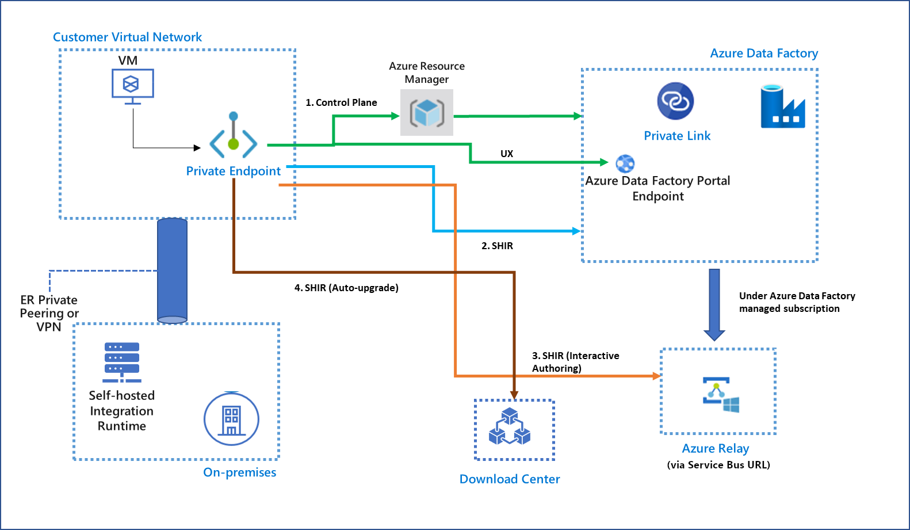
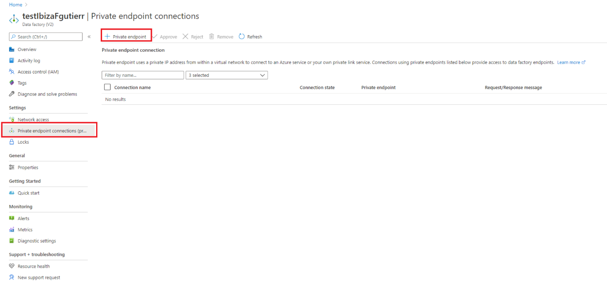
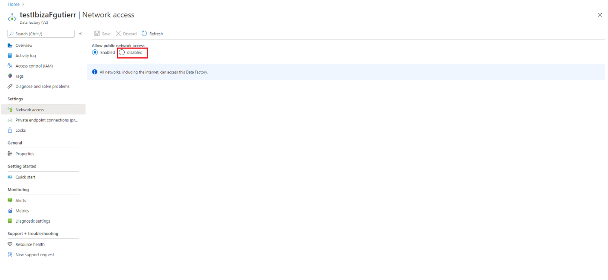

# Azure Private Link for Azure Data Factory

[!INCLUDE[appliesto-adf-asa-md](includes/appliesto-adf-xxx-md.md)]

By using Azure Private Link, you can connect to various platform as a service (PaaS) deployments in Azure via a private endpoint. A private endpoint is a private IP address within a specific virtual network and subnet. For a list of PaaS deployments that support Private Link functionality, see [Private Link documentation](https://docs.microsoft.com/azure/private-link/). 

## Secure communication between customer networks and Azure Data Factory 
You can set up an Azure virtual network as a logical representation of your network in the cloud. Doing so provides the following benefits:
* You help protect your Azure resources from attacks in public networks.
* You let the networks and Data Factory securely communicate with each other. 

You can also connect an on-premises network to your virtual network by setting up an Internet Protocol security (IPsec) VPN (site-to-site) connection or an Azure ExpressRoute (private peering) connection. 

You can also install a self-hosted integration runtime on an on-premises machine or a virtual machine in the virtual network. Doing so lets you:
* Run copy activities between a cloud data store and a data store in a private network.
* Dispatch transform activities against compute resources in an on-premises network or an Azure virtual network. 

Several communication channels are required between Azure Data Factory and the customer virtual network, as shown in the following table:

| Domain | Port | Description |
| ---------- | -------- | --------------- |
| `adf.azure.com` | 443 | A control plane, required by Data Factory authoring and monitoring. |
| `*.{region}.datafactory.azure.net` | 443 | Required by the self-hosted integration runtime to connect to the Data Factory service. |
| `*.servicebus.windows.net` | 443 | Required by the self-hosted integration runtime for interactive authoring. |
| `download.microsoft.com` | 443 | Required by the self-hosted integration runtime for downloading the updates. |

With the support of Private Link for Azure Data Factory, you can:
* Create a private endpoint in your virtual network.
* Enable the private connection to a specific data factory instance. 

The communications to Azure Data Factory service go through Private Link and help provide secure private connectivity. You don’t need to configure the preceding domain and port in a virtual network or your corporate firewall to provide a more secure way to protect your resources.  

Enabling the Private Link service for each of the preceding communication channels offers the following functionality:
- **Supported**:
   - You can author and monitor the data factory in your virtual network, even if you block all outbound communications.
   - The command communications between the self-hosted integration runtime and the Azure Data Factory service can be performed securely in a private network environment. The traffic between the self-hosted integration runtime and the Azure Data Factory service goes through Private Link. 
- **Not currently supported**:
   - Interactive authoring that uses a self-hosted integration runtime, such as test connection, browse folder list and table list, get schema, and preview data, goes through Private Link.
   - The new version of the self-hosted integration runtime can be automatically downloaded from Microsoft Download Center if you enable AutoUpdate.

   > [!NOTE]
   > For functionality that's not currently supported, you still need to configure the previously mentioned domain and port in the virtual network or your corporate firewall. 

> [!WARNING]
> When you create a linked service, make sure that your credentials are stored in an Azure key vault. Otherwise, the credentials won't work when you enable Private Link in Azure Data Factory.

## Set up Private Link for Azure Data Factory
You can create private endpoints by using [the Azure portal](https://docs.microsoft.com/azure/private-link/create-private-endpoint-portal), PowerShell, or the Azure CLI.

You can also go to your Azure data factory in the Azure portal and create a private endpoint, as shown here:

If you want to block public access to the Azure data factory and allow access only through Private Link, disable network access to Azure Data Factory in the Azure portal, as shown here:

> [!NOTE]
> Disabling public network access is applicable only to the self-hosted integration runtime, not to Azure Integration Runtime and SQL Server Integration Services (SSIS) Integration Runtime.

> [!NOTE]
> You can still access the Azure Data Factory portal through a public network after you disable public network access.

## Next steps

- [Create a data factory by using the Azure Data Factory UI](quickstart-create-data-factory-portal.md)
- [Introduction to Azure Data Factory](introduction.md)
- [Visual authoring in Azure Data Factory](author-visually.md)

