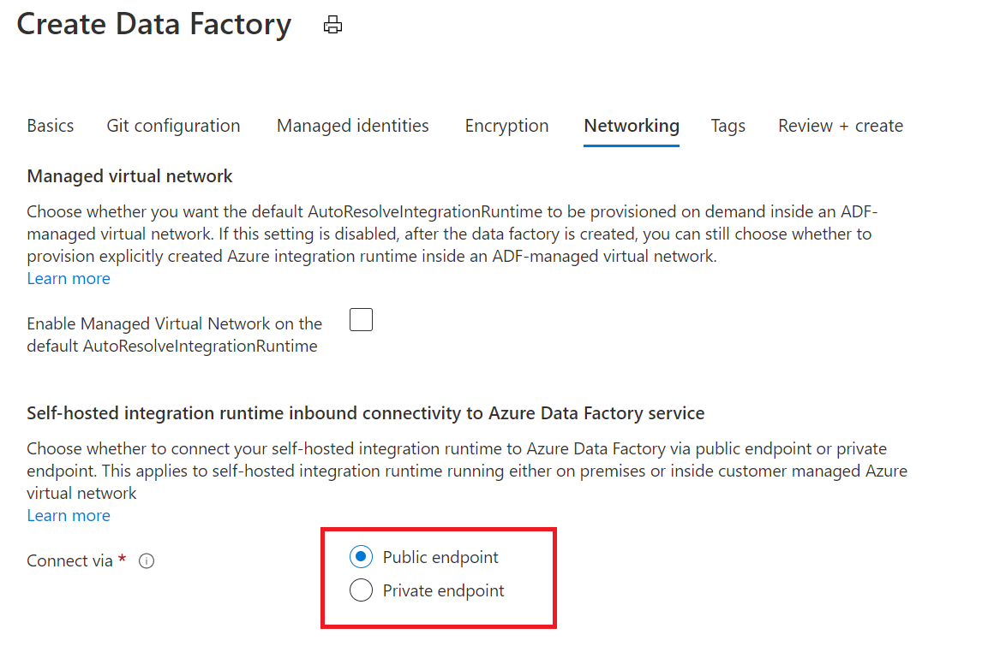
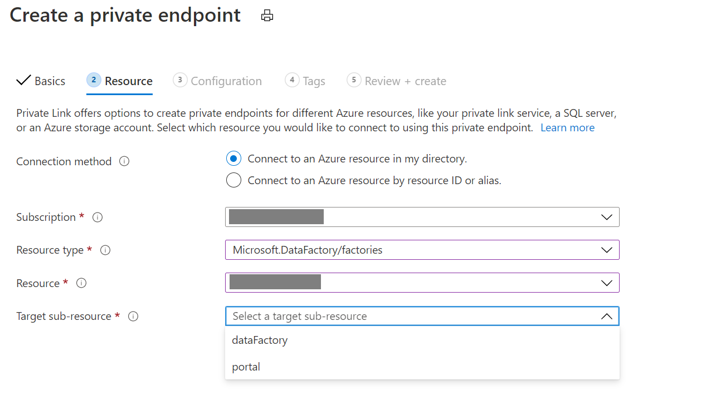

# Azure Private Link for Azure Data Factory

[!INCLUDE[appliesto-adf-asa-md](includes/appliesto-adf-xxx-md.md)]

By using Azure Private Link, you can connect to various platforms as a service (PaaS) deployments in Azure via a private endpoint. A private endpoint is a private IP address within a specific virtual network and subnet. For a list of PaaS deployments that support Private Link functionality, see [Private Link documentation](../private-link/index.yml). 

## Secure communication between customer networks and Azure Data Factory 
You can set up an Azure virtual network as a logical representation of your network in the cloud. Doing so provides the following benefits:
* You help protect your Azure resources from attacks in public networks.
* You let the networks and Data Factory securely communicate with each other. 

You can also connect an on-premises network to your virtual network by setting up an Internet Protocol security (IPsec) VPN (site-to-site) connection or an Azure ExpressRoute (private peering) connection. 

You can also install a self-hosted integration runtime on an on-premises machine or a virtual machine in the virtual network. Doing so lets you:
* Run copy activities between a cloud data store and a data store in a private network.
* Dispatch transform activities against compute resources in an on-premises network or an Azure virtual network. 

Several communication channels are required between Azure Data Factory and the customer virtual network, as shown in the following table:

| Domain | Port | Description |
| ---------- | -------- | --------------- |
| `adf.azure.com` | 443 | A control plane, required by Data Factory authoring and monitoring. |
| `*.{region}.datafactory.azure.net` | 443 | Required by the self-hosted integration runtime to connect to the Data Factory service. |
| `*.servicebus.windows.net` | 443 | Required by the self-hosted integration runtime for interactive authoring. |
| `download.microsoft.com` | 443 | Required by the self-hosted integration runtime for downloading the updates. |

With the support of Private Link for Azure Data Factory, you can:
* Create a private endpoint in your virtual network.
* Enable the private connection to a specific data factory instance. 

The communications to Azure Data Factory service go through Private Link and help provide secure private connectivity. 

Enabling the Private Link service for each of the preceding communication channels offers the following functionality:
- **Supported**:
   - You can author and monitor the data factory in your virtual network, even if you block all outbound communications.
   - The command communications between the self-hosted integration runtime and the Azure Data Factory service can be performed securely in a private network environment. The traffic between the self-hosted integration runtime and the Azure Data Factory service goes through Private Link. 
- **Not currently supported**:
   - Interactive authoring that uses a self-hosted integration runtime, such as test connection, browse folder list and table list, get schema, and preview data, goes through Private Link.
   - The new version of the self-hosted integration runtime can be automatically downloaded from Microsoft Download Center if you enable Auto-Update.

   > [!NOTE]
   > For functionality that's not currently supported, you still need to configure the previously mentioned domain and port in the virtual network or your corporate firewall. 

   > [!NOTE]
   > Connecting to Azure Data Factory via private endpoint is only applicable to self-hosted integration runtime in data factory. It's not supported in Synapse.

> [!WARNING]
> When you create a linked service, make sure that your credentials are stored in an Azure key vault. Otherwise, the credentials won't work when you enable Private Link in Azure Data Factory.

## DNS changes for Private Endpoints
When you create a private endpoint, the DNS CNAME resource record for the Data Factory is updated to an alias in a subdomain with the prefix 'privatelink'. By default, we also create a [private DNS zone](../dns/private-dns-overview.md), corresponding to the 'privatelink' subdomain, with the DNS A resource records for the private endpoints.

When you resolve the data factory endpoint URL from outside the VNet with the private endpoint, it resolves to the public endpoint of the data factory service. When resolved from the VNet hosting the private endpoint, the storage endpoint URL resolves to the private endpoint's IP address.

For the illustrated example above, the DNS resource records for the Data Factory 'DataFactoryA', when resolved from outside the VNet hosting the private endpoint, will be:

| Name | Type | Value |
| ---------- | -------- | --------------- |
| DataFactoryA.{region}.datafactory.azure.net |	CNAME	| DataFactoryA.{region}.privatelink.datafactory.azure.net |
| DataFactoryA.{region}.privatelink.datafactory.azure.net |	CNAME	| < data factory service public endpoint > |
| < data factory service public endpoint >	| A | < data factory service public IP address > |

The DNS resource records for DataFactoryA, when resolved in the VNet hosting the private endpoint, will be:

| Name | Type | Value |
| ---------- | -------- | --------------- |
| DataFactoryA.{region}.datafactory.azure.net | CNAME	| DataFactoryA.{region}.privatelink.datafactory.azure.net |
| DataFactoryA.{region}.privatelink.datafactory.azure.net	| A | < private endpoint IP address > |

If you are using a custom DNS server on your network, clients must be able to resolve the FQDN for the Data Factory endpoint to the private endpoint IP address. You should configure your DNS server to delegate your private link subdomain to the private DNS zone for the VNet, or configure the A records for ' DataFactoryA.{region}.privatelink.datafactory.azure.net' with the private endpoint IP address.

For more information on configuring your own DNS server to support private endpoints, refer to the following articles:
- [Name resolution for resources in Azure virtual networks](../virtual-network/virtual-networks-name-resolution-for-vms-and-role-instances.md#name-resolution-that-uses-your-own-dns-server)
- [DNS configuration for private endpoints](../private-link/private-endpoint-overview.md#dns-configuration)

## Set up Private Link for Azure Data Factory
You can create private endpoints by using [the Azure portal](../private-link/create-private-endpoint-portal.md).

You can choose whether to connect your self-hosted integration runtime to Azure Data Factory via public endpoint or private endpoint. 

You can also go to your Azure data factory in the Azure portal and create a private endpoint, as shown here:

In the step of **Resource**, select **Microsoft.Datafactory/factories** as **Resource type**. And if you want to create private endpoint for command communications between the self-hosted integration runtime and the Azure Data Factory service, select **datafactory** as **Target sub-resource**.

> [!NOTE]
> Disabling public network access is applicable only to the self-hosted integration runtime, not to Azure Integration Runtime and SQL Server Integration Services (SSIS) Integration Runtime.

If you want to create private endpoint for authoring and monitoring the data factory in your virtual network, select **portal** as **Target sub-resource**.

> [!NOTE]
> You can still access the Azure Data Factory portal through a public network after you create private endpoint for portal.

## Next steps

- [Create a data factory by using the Azure Data Factory UI](quickstart-create-data-factory-portal.md)
- [Introduction to Azure Data Factory](introduction.md)
- [Visual authoring in Azure Data Factory](author-visually.md)