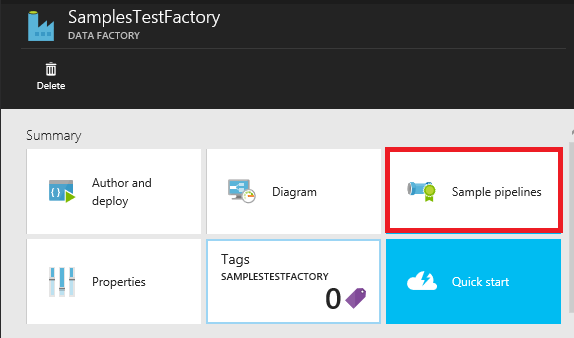
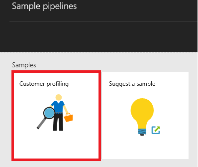

<properties 	
	pageTitle="Azure Data Factory - Samples" 
	description="Provides details about samples that ship with the Azure Data Factory service." 
	services="data-factory" 
	documentationCenter="" 
	authors="spelluru" 
	manager="jhubbard" 
	editor="monicar"/>

<tags 
	ms.service="data-factory" 
	ms.workload="data-services" 
	ms.tgt_pltfrm="na" 
	ms.devlang="na" 
	ms.topic="article" 
	ms.date="05/23/2016" 
	ms.author="spelluru"/>

# Azure Data Factory - Samples

## Samples on GitHub
The [GitHub Azure-DataFactory repository](https://github.com/azure/azure-datafactory) contains several samples that help you quickly ramp up with Azure Data Factory service (or) modify the scripts and use it in own application. The Samples\JSON folder contains JSON snippets for common scenarios.

| Sample | Description |
| :----- | :---------- | 
| [ADF Walkthrough](https://github.com/Azure/Azure-DataFactory/tree/master/Samples/ADFWalkthrough) | This sample provides an end-to-end walkthrough for processing log files using Azure Data Factory to turn data from log files into insights.   In this walkthrough, the Data Factory pipeline collects sample logs, processes and enriches the data from logs with reference data, and transforms the data to evaluate the effectiveness of a marketing campaign that was recently launched. |
| [JSON samples](https://github.com/Azure/Azure-DataFactory/tree/master/Samples/JSON) | This sample provides JSON examples for common scenarios. | 
| [Http Data Downloader Sample](https://github.com/Azure/Azure-DataFactory/tree/master/Samples/HttpDataDownloaderSample) | This sample showcases downloading of data from an HTTP endpoint to Azure Blob Storage using custom .NET activity. |
| [Cross AppDomain Dot Net Activity Sample](https://github.com/Azure/Azure-DataFactory/tree/master/Samples/CrossAppDomainDotNetActivitySample) | This sample allows you to author a custom .NET activity that is not constrained to assembly versions used by the ADF launcher (e.g., WindowsAzure.Storage v4.3.0, Newtonsoft.Json v6.0.x, etc.). |
| [Run R script](https://github.com/Azure/Azure-DataFactory/tree/master/Samples/RunRScriptUsingADFSample) |  This sample includes the Data Factory custom activity that can be used to invoke RScript.exe. This sample works only with your own (not on-demand) HDInsight cluster that already has R Installed on it. |
| [Invoke Spark jobs on HDInsight Hadoop cluster](https://github.com/Azure/Azure-DataFactory/tree/master/Samples/Spark) | This sample shows how to use MapReduce activity to invoke a Spark program. The spark program just copies data from one Azure Blob container to another. |
| [Twitter Analysis using Azure Machine Learning Batch Scoring Activity](https://github.com/Azure/Azure-DataFactory/tree/master/Samples/TwitterAnalysisSample-AzureMLBatchScoringActivity) | This sample shows how to use AzureMLBatchScoringActivity to invoke an Azure Machine Learning model that performs twitter sentiment analysis, scoring, prediction etc. |
| [Twitter Analysis using custom activity](https://github.com/Azure/Azure-DataFactory/tree/master/Samples/TwitterAnalysisSample-CustomC%23Activity) |  This sample shows how to use a custom .NET activity to invoke an Azure Machine Learning model that performs twitter sentiment analysis, scoring, prediction etc. |
| [Parameterized Pipelines for Azure Machine Learning](https://github.com/Azure/Azure-DataFactory/tree/master/Samples/ParameterizedPipelinesForAzureML/) | The sample provides an end-to-end C# code to deploy N pipelines for scoring and retraining each with a different region parameter where the list of regions is coming from a parameters.txt file which is included with this sample. | 
| [Reference Data Refresh for Azure Stream Analytics jobs](https://github.com/Azure/Azure-DataFactory/tree/master/Samples/ReferenceDataRefreshForASAJobs) |  This sample shows how to leverage Azure Data Factory and Azure Stream Analytics together to run the queries with reference data and setup the refresh for reference data on a schedule. |
| [Hybrid Pipeline with On-premises Hortonworks Hadoop](https://github.com/Azure/Azure-DataFactory/tree/master/Samples/HybridPipelineWithOnPremisesHortonworksHadoop) | The sample uses an on-premises Hadoop cluster as a compute target for running jobs in Data Factory just like you would add other compute targets like an HDInsight based Hadoop cluster in cloud. |
| [JSON Conversion Tool](https://github.com/Azure/Azure-DataFactory/tree/master/Samples/JSONConversionTool) | This tool allows you to convert JSONs from version prior to 2015-07-01-preview to latest or 2015-07-01-preview (default). |  
| [U-SQL sample input file](https://github.com/Azure/Azure-DataFactory/tree/master/Samples/U-SQL%20Sample%20Input%20File) |  This is a sample file used by an U-SQL activity. | 

## Samples in Azure Portal
You can use the **Sample pipelines** tile on the home page of your data factory to deploy sample pipelines and their associated entities (datasets and linked services) into your data factory. 

1. Create a new data factory or open an existing data factory. See [Getting started with Azure Data Factory](data-factory-copy-data-from-azure-blob-storage-to-sql-database.md#CreateDataFactory) for steps to create a data factory.
2. In the **DATA FACTORY** blade for the data factory, click the **Sample pipelines** tile.

	

2. In the **Sample pipelines** blade, click the **sample** that you want to deploy. 
	
	

3. Specify configuration settings for the sample. For example, your Azure storage account name and account key, Azure SQL server name, database, User ID, and password, etc... 

	

4. After you are done with specifying the configuration settings, click **Create** to create/deploy the sample pipelines and linked services/tables used by the pipelines.
5. You will see the status of deployment on the sample tile you clicked earlier on the **Sample pipelines** blade.

	

6. When you see the **Deployment succeeded** message on the tile for the sample, close the **Sample pipelines** blade.  
5. On **DATA FACTORY** blade, you will see that linked services, data sets, and pipelines are added to your data factory.  

	
   
## Samples in Visual Studio

### Prerequisites

You must have the following installed on your computer: 

- Visual Studio 2013 or Visual Studio 2015
- Download Azure SDK for Visual Studio 2013 or Visual Studio 2015. Navigate to [Azure Download Page](https://azure.microsoft.com/downloads/) and click **VS 2013** or **VS 2015** in the **.NET** section.
- Download the latest Azuer Data Factory plugin for Visual Studio : [VS 2013](https://visualstudiogallery.msdn.microsoft.com/754d998c-8f92-4aa7-835b-e89c8c954aa5) or [VS 2015](https://visualstudiogallery.msdn.microsoft.com/371a4cf9-0093-40fa-b7dd-be3c74f49005). If you are using Visual Studio 2013, you can also update the plugin by doing the following: On the menu, click **Tools** -> **Extensions and Updates** -> **Online** -> **Visual Studio Gallery** -> **Microsoft Azure Data Factory Tools for Visual Studio** -> **Update**.

### Use Data Factory Templates

1. Click **File** on the menu, point to **New**, and click **Project**. 
2. In the **New Project** dialog box, do the following: 
	1. Select **DataFactory** under **Templates**. 
	2. Select **Data Factory Templates** in the right pane. 
	3. Enter a **name** for the project. 
	4. Select a **location** for the project. 
	5. Click **OK**. 

	
6. In the **Data Factory Templates** dialog box, select the sample template from the **Use-Case Templates** section, and click **Next**. The following steps walk you through using the **Customer Profiling** template. Steps are similar for the other sample(s). 

	 
7. In the **Data Factory Configuration** dialog, click **Next** on the **Data Factory Basics** page.
8. On the **Configure data factory** page, do the following: 
	1. select **Create New Data Factory** for the purpose of this walkthrough. You can also select **Use existing data factory**.
	2. Enter a **name** for the data factory.
	3. Select the **Azure subscription** in which you want the data factory to be created. 
	4. Select the **resource group** for the data factory.
	5. Select the **West US**, **East US** or **North Europe** for the **region**.
	6. Click **Next**. 
9. In the **Configure data stores** page, specify an existing **Azure SQL database** and **Azure storage account** (or) create new ones, and click Next. 
10. In the **Configure compute** page, select defaults, and click **Next**. 
11. In the **Summary** page, review all settings, and click **Next**. 
12. In the **Deployment Status** page, wait until the deployment is finished, and click **Finish**.
13. Right-click project in the Solution Explorer, and click **Publish**. 
19. If you see **Sign in to your Microsoft account** dialog box, enter your credentials for the account that has Azure subscription, and click **sign in**.
20. You should see the following dialog box:

	

21. In the **Configure data factory** page, do the following: 
	1. Confirm that **Use existing data factory** option.
	2. Select the **data factory** you had select when using the template above. 
	6. Click **Next** to switch to the **Publish Items** page. (Press **TAB** to move out of the Name field to if the **Next** button is disabled.) 
23. In the **Publish Items** page, ensure that all the Data Factories entities are selected, and click **Next** to switch to the **Summary** page.     
24. Review the summary and click **Next** to start the deployment process and view the **Deployment Status**.
25. In the **Deployment Status** page, you should see the status of the deployment process. Click Finish after the deployment is done. 

See [Build your first data factory (Visual Studio)](data-factory-build-your-first-pipeline-using-vs.md) for details about using Visual Studio to author Data Factory entities and publishing them to Azure.          