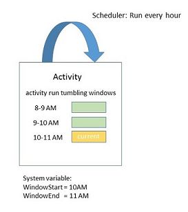
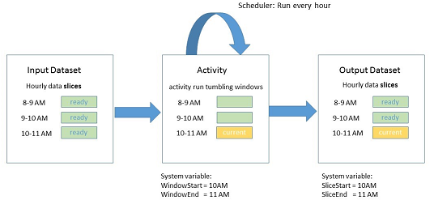
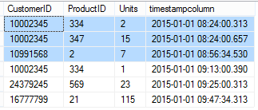
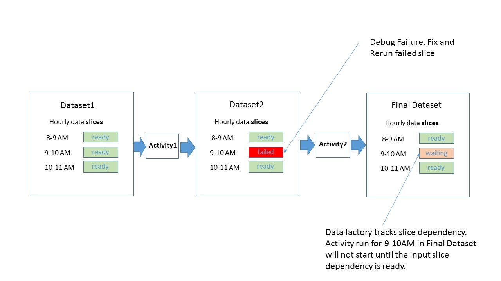
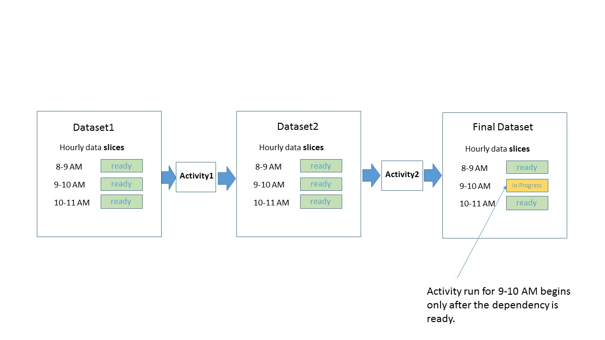
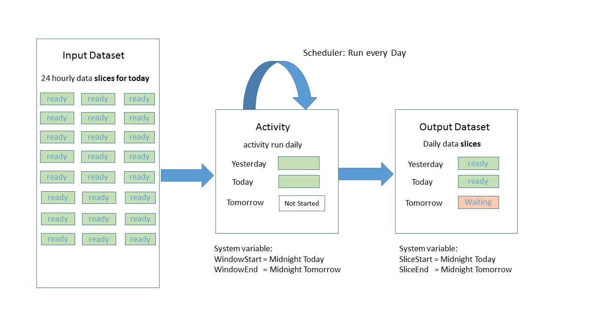

<properties 
	pageTitle="Scheduling and Execution with Data Factory" 
	description="Learn scheduling and execution aspects of Azure Data Factory application model." 
	services="data-factory" 
	documentationCenter="" 
	authors="spelluru" 
	manager="jhubbard" 
	editor="monicar"/>

<tags 
	ms.service="data-factory" 
	ms.workload="data-services" 
	ms.tgt_pltfrm="na" 
	ms.devlang="na" 
	ms.topic="article" 
	ms.date="06/06/2016" 
	ms.author="spelluru"/>

# Scheduling & Execution with Data Factory
  
This article explains the scheduling and execution aspects of Azure Data Factory application model. This article builds on [Creating Pipelines](data-factory-create-pipelines.md) and [Creating Datasets](data-factory-create-datasets.md) articles and assumes that you understand basics of data factory application model concepts: activity, pipelines, linked services and datasets.

## Scheduling Activities

With the **scheduler** section in the activity JSON, you can specify a recurring schedule for the activity. For example you can schedule an activity every hour as follows:

	"scheduler": {
		"frequency": "Hour",
	    "interval": 1
	},  
    

As shown above, specifying a schedule for the activity creates a series of tumbling windows. Tumbling windows are series of fixed-sized, non-overlapping and contiguous time intervals. These logical tumbling windows for the activity are called **activity windows**.
 
For the currently executing activity window, the time interval associated with the activity window can be accessed with [WindowStart](data-factory-functions-variables.md#data-factory-system-variables) and [WindowEnd](data-factory-functions-variables.md#data-factory-system-variables) system variables in the activity JSON. You can use these variables for different purposes in your activity JSON and scripts associated with the activity including selecting data from input, output datasets representing time series data.

The **scheduler** property supports the same sub-properties as the **availability** property in a dataset. For more information on different properties available for scheduler including scheduling at a specific time offset, setting the mode to align processing at the beginning of interval for the activity window or at the end please refer to the [Dataset availability](data-factory-create-datasets.md#Availability) article. 

Specifying scheduler properties for an activity is optional at this time. If you do specify, it must match the cadence you specify in the output dataset definition. At this time, output dataset is what drives the schedule, so you must create an output dataset even if the activity does not produce any output. If the activity doesn't take any input, you can skip creating the input dataset. 

## Time series datasets and data Slices

Time series data is a continuous sequence of data points typically consisting of successive measurements made over a time interval. Common examples of time series data include sensor data, application telemetry data etc.

With Azure Data Factory, you can process time series data in batched fashion with activity runs. Typically, there are recurring cadences at which input data arrives and output data needs to be produced. This cadence is modeled by specifying **availability** section on the dataset as follows:

    "availability": {
      "frequency": "Hour",
      "interval": 1
    },

Each unit of data consumed and produced by an activity run is called a data **slice**. The diagram below shows an example of an activity with an input time series dataset and an output time series dataset each with availability set to hourly frequency.

The hourly data slices for the input and output dataset are shown in the diagram above. The diagram shows 3 input slices that are ready for processing and the 10-11 AM activity run in progress producing the 10-11 AM output slice. 

The time interval associated with the current slice being produced can be accessed in the dataset JSON with variables [SliceStart](data-factory-functions-variables.md#data-factory-system-variables) and [SliceEnd](data-factory-functions-variables.md#data-factory-system-variables).

Currently data factory requires that the schedule specified in the activity exactly match the schedule specified in availability of the output dataset. This means WindowStart, WindowEnd and SliceStart and SliceEnd always map to the same time period and a single output slice.

For more information on different properties available for availability section please refer to the [Creating Datasets](data-factory-create-datasets.md) article.

## Sample – Copy Activity moving data from Azure SQL to Azure Blob

Let’s put some thing together and in action by revisiting the sample for copy activity shown in the [Creating Pipelines](data-factory-create-pipelines.md) article that copies data from an Azure SQL table to Azure blob every hour.

**Input: Azure SQL dataset**

	{
	    "name": "AzureSqlInput",
	    "properties": {
	        "published": false,
	        "type": "AzureSqlTable",
	        "linkedServiceName": "AzureSqlLinkedService",
	        "typeProperties": {
	            "tableName": "MyTable"
	        },
	        "availability": {
	            "frequency": "Hour",
	            "interval": 1
	        },
	        "external": true,
	        "policy": {}
	    }
	}

Note that the **frequency** is set to **Hour** and **interval** is set to **1** in the **availability** section. 

**Output: Azure Blob dataset**
	
	{
	    "name": "AzureBlobOutput",
	    "properties": {
	        "published": false,
	        "type": "AzureBlob",
	        "linkedServiceName": "StorageLinkedService",
	        "typeProperties": {
	            "folderPath": "mypath/{Year}/{Month}/{Day}/{Hour}",
	            "format": {
	                "type": "TextFormat"
	            },
	            "partitionedBy": [
	                {
	                    "name": "Year",
	                    "value": {
	                        "type": "DateTime",
	                        "date": "SliceStart",
	                        "format": "yyyy"
	                    }
	                },
	                {
	                    "name": "Month",
	                    "value": {
	                        "type": "DateTime",
	                        "date": "SliceStart",
	                        "format": "%M"
	                    }
	                },
	                {
	                    "name": "Day",
	                    "value": {
	                        "type": "DateTime",
	                        "date": "SliceStart",
	                        "format": "%d"
	                    }
	                },
	                {
	                    "name": "Hour",
	                    "value": {
	                        "type": "DateTime",
	                        "date": "SliceStart",
	                        "format": "%H"
	                    }
	                }
	            ]
	        },
	        "availability": {
	            "frequency": "Hour",
	            "interval": 1
	        }
	    }
	}

Note that the **frequency** is set to **Hour** and **interval** is set to **1** in the **availability** section.

**Activity: Copy activity**

	{
	    "name": "SamplePipeline",
	    "properties": {
	        "description": "copy activity",
	        "activities": [
	            {
	                "type": "Copy",
	                "name": "AzureSQLtoBlob",
	                "description": "copy activity",	
	                "typeProperties": {
	                    "source": {
	                        "type": "SqlSource",
	                        "sqlReaderQuery": "$$Text.Format('select * from MyTable where timestampcolumn >= \\'{0:yyyy-MM-dd HH:mm}\\' AND timestampcolumn < \\'{1:yyyy-MM-dd HH:mm}\\'', WindowStart, WindowEnd)"
	                    },
	                    "sink": {
	                        "type": "BlobSink",
	                        "writeBatchSize": 100000,
	                        "writeBatchTimeout": "00:05:00"
	                    }
	                },
	                "inputs": [
	                    {
	                        "name": "AzureSQLInput"
	                    }
	                ],
	                "outputs": [
	                    {
	                        "name": "AzureBlobOutput"
	                    }
	                ],
	       			"scheduler": {
	          			"frequency": "Hour",
	          			"interval": 1
	        		}
	            }
	        ],
	        "start": "2015-01-01T08:00:00Z",
	        "end": "2015-01-01T11:00:00Z"
	    }
	}

The sample above shows activity schedule and dataset availability sections set to hourly frequency. The sample shows how you can leverage the **WindowStart** and **WindowEnd** variables to select the relevant data for the given activity run and send it to a blob with appropriate dynamic **folderPath** parameterized to have the folder for every hour.

When 3 of the slices between 8 – 11 AM execute, this is what it will look like for a sample Azure table and Blob.

Suppose the data in Azure SQL is as follows:

On deploying the above pipeline the Azure blob will populated as follows:

1.	File mypath/2015/1/1/8/Data.<Guid>.txt with data 

		10002345,334,2,2015-01-01 08:24:00.3130000
		10002345,347,15,2015-01-01 08:24:00.6570000
		10991568,2,7,2015-01-01 08:56:34.5300000

	**Note:** <Guid> will be replaced with an actual guid. Example file name: Data.bcde1348-7620-4f93-bb89-0eed3455890b.txt
2.	File mypath/2015/1/1/9/Data.<Guid>.txt with data:

		10002345,334,1,2015-01-01 09:13:00.3900000
		24379245,569,23,2015-01-01 09:25:00.3130000
		16777799,21,115,2015-01-01 09:47:34.3130000
3.	File mypath/2015/1/1/10/Data.<Guid>.txt with no data.

## Data Slices, Active Period for Pipeline and Concurrent Slice Execution

The [Creating Pipelines](data-factory-create-pipelines.md) article introduced the concept of active period for a pipeline specified by setting the **start** and **end** properties of the pipeline.
 
You can set the start date for the pipeline active period in the past and data factory will automatically calculate (back fill) all data slices in the past and will begin processing them.

With back filled data slices, it is possible to configure them to be run in parallel. You can do that by setting the **concurrency** property in **policy** section of the activity JSON as shown in the [Creating Pipelines](data-factory-create-pipelines.md) article.

## Rerunning Failed Data Slices and Automatic Data Dependency Tracking

You can monitor execution of slices in a rich visual way. See **Monitoring and managing pipelines using** [Azure portal blades](data-factory-monitor-manage-pipelines.md) (or) [Monitor and Manage app](data-factory-monitor-manage-app.md) for details. 

Consider the following example which shows two activities. Activity1 produces a time series dataset with slices as output that is consumed as input by Activity2 to produce the final output time series dataset.

 

The above diagram shows that out of 3 recent slices there was a failure producing the 9-10 AM slice for **Dataset2**. Data factory automatically tracks dependency for time series dataset and as a result holds off kicking off the activity run for 9-10 AM downstream slice.

Data factory monitoring & management tools allow you to drill into the diagnostic logs for the failed slice easily find the root cause for the issue and fix it. Once you have fixed the issue you can also easily kick off the activity run to produce the failed slice. For more details on how to kick off reruns, understand state transitions for data slices please see **Monitoring and managing pipelines using** [Azure portal blades](data-factory-monitor-manage-pipelines.md) (or) [Monitor and Manage app](data-factory-monitor-manage-app.md) for details. 

Once you kick off the rerun and the 9-10 AM slice for dataset2 is ready, data factory kicks off the run for the 9-10 AM dependent slice on final dataset as shown in the diagram below.

For deeper dive on specifying dependency and tracking the dependencies for complex chain of activities and datasets, refer to sections below.

## Chaining activities
You can chain two activities by having the output dataset of one activity as the input dataset of the other activity. The activities can be in the same pipeline or in different pipelines. The second activity executes only when the first one completes successfully. 

For example, consider the following case:
 
1.	Pipeline P1 has Activity A1 that requires external input dataset D1, and produce **output** dataset **D2**.
2.	Pipeline P2 has Activity A2 that requires **input** from dataset **D2**, and produces output dataset D3.
 
In this scenario, the activity A1 will run when the external data is available, and the scheduled availability frequency is reached.  The activity A2 will run when the scheduled slices from D2 become available and the scheduled availability frequency is reached. If there is an error in one of the slices in dataset D2, A2 will not run for that slice until it becomes available.

The Diagram View would look like below:

The Diagram View with both activities in the same pipeline would look like below: 

### Ordered copy
It is possible to run multiple copy operations one after another in a sequential/ordered manner. Say you have two copy activities in a pipeline: CopyActivity1 and CopyActivity with the following input data output datasets.   

CopyActivity1: 
Input: Dataset1
Output Dataset2

CopyActivity2: 
Inputs: Dataset2
Output: Dataset4

CopyActivity2 would run only if the CopyActivity1 has run successfully and Dataset2 is available. 

In the above example, CopyActivity2 can have a different input, say Dataset3, but you will need to specify Dataset2 also as an input to CopyActivity2 so the activity will not run until CopyActivity1 completes. For example: 

CopyActivity1: 
Input: Dataset1
Output Dataset2

CopyActivity2: 
Inputs: Dataset3, Dataset2
Output: Dataset4

When multiple inputs are specified, only the first input dataset is used for copying data but other datasets are used as dependencies. CopyActivity2 would only start executing when the following conditions are met: 

- CopyActivity1 has successfully completed and Dataset2 is available. This dataset will not be used when copying data to Dataset4. It only acts as a scheduling dependency for CopyActivity2.   
- Dataset3 is available. This dataset represents the data that is copied to the destination.  

## Modeling datasets with different frequencies

In the samples shown above, the frequencies for input and output datasets and activity schedule window were same. Some scenarios require the ability to produce output at a frequency different than frequencies of one or more inputs. Data factory supports modeling these scenarios.

### Sample 1: Producing daily output report for input data that is available every hour

Consider a scenario where we have input measurement data from sensors available every hour in Azure Blob and we want to produce a daily aggregate report with statistics like mean, max, min etc... for the day with data factory [Hive activity](data-factory-hive-activity.md).

Here is how you can model this with data factory:

**Input Azure blob dataset:**

The hourly input files are dropped in the folder for the given day. Availability for input is set Hourly (frequency: Hour, interval: 1).

	{
	  "name": "AzureBlobInput",
	  "properties": {
	    "type": "AzureBlob",
	    "linkedServiceName": "StorageLinkedService",
	    "typeProperties": {
	      "folderPath": "mycontainer/myfolder/{Year}/{Month}/{Day}/",
	      "partitionedBy": [
	        { "name": "Year", "value": {"type": "DateTime","date": "SliceStart","format": "yyyy"}},
	        { "name": "Month","value": {"type": "DateTime","date": "SliceStart","format": "%M"}},
	        { "name": "Day","value": {"type": "DateTime","date": "SliceStart","format": "%d"}}
	      ],
	      "format": {
	        "type": "TextFormat"
	      }
	    },
		"external": true,
	    "availability": {
	      "frequency": "Hour",
	      "interval": 1
	    }
	  }
	}

**Output Azure blob dataset**

One output file will be dropped every day in the folder for the day. Availability of output is set Daily (frequency: Day and interval: 1).

	{
	  "name": "AzureBlobOutput",
	  "properties": {
	    "type": "AzureBlob",
	    "linkedServiceName": "StorageLinkedService",
	    "typeProperties": {
	      "folderPath": "mycontainer/myfolder/{Year}/{Month}/{Day}/",
	      "partitionedBy": [
	        { "name": "Year", "value": {"type": "DateTime","date": "SliceStart","format": "yyyy"}},
	        { "name": "Month","value": {"type": "DateTime","date": "SliceStart","format": "%M"}},
	        { "name": "Day","value": {"type": "DateTime","date": "SliceStart","format": "%d"}}
	      ],
	      "format": {
	        "type": "TextFormat"
	      }
	    },
	    "availability": {
	      "frequency": "Day",
	      "interval": 1
	    }
	  }
	}

**Activity: Hive activity in a pipeline**

The hive script receives the appropriate datetime information as parameters leveraging the **WindowStart** variable as shown below. The hive script uses this variable to load the data from the right folder for the day and run the aggregation to generate the output.

		{  
		    "name":"SamplePipeline",
		    "properties":{  
		    "start":"2015-01-01T08:00:00",
		    "end":"2015-01-01T11:00:00",
		    "description":"hive activity",
		    "activities": [
		        {
		            "name": "SampleHiveActivity",
		            "inputs": [
		                {
		                    "name": "AzureBlobInput"
		                }
		            ],
		            "outputs": [
		                {
		                    "name": "AzureBlobOutput"
		                }
		            ],
		            "linkedServiceName": "HDInsightLinkedService",
		            "type": "HDInsightHive",
		            "typeProperties": {
		                "scriptPath": "adftutorial\\hivequery.hql",
		                "scriptLinkedService": "StorageLinkedService",
		                "defines": {
		                    "Year": "$$Text.Format('{0:yyyy}',WindowsStart)",
		                    "Month": "$$Text.Format('{0:%M}',WindowStart)",
		                    "Day": "$$Text.Format('{0:%d}',WindowStart)"
		                }
		            },
		            "scheduler": {
		                "frequency": "Day",
		                "interval": 1
		            },			
		            "policy": {
		                "concurrency": 1,
		                "executionPriorityOrder": "OldestFirst",
		                "retry": 2,
		                "timeout": "01:00:00"
		            }
	             }
		     ]
		   }
		}

Here is how this looks like from data dependency point of view.

The output slice for every day depends on 24 hourly slices from input dataset. Data factory computes these dependencies automatically by figuring out the input data slices that fall in the same time period as the output slice to be produced. If any of the 24 input slices is not available (due to processing happening in an activity upstream that produces the that slice for example) data factory will wait for the input slice to be ready before kicking off the daily activity run.

### Sample 2: Specify dependency with expressions and data factory functions

Let’s consider another scenario. Suppose you have a Hive activity that processes two input datasets, one of them has new data daily but one of them gets new data every week. Suppose you wanted to do a join across the two inputs and produce an output daily.
 
The simple approach so far where data factory automatically figures out the right input slices to process by including input data slices aligned to the output data slice’s time period no longer works.

You need a way to specify for every activity run the data factory should use last week’s data slice for the weekly input dataset. You can do that with the help of Azure Data Factory functions as shows below.

**Input1: Azure Blob**

First input is Azure blob updated **daily**.
	
	{
	  "name": "AzureBlobInputDaily",
	  "properties": {
	    "type": "AzureBlob",
	    "linkedServiceName": "StorageLinkedService",
	    "typeProperties": {
	      "folderPath": "mycontainer/myfolder/{Year}/{Month}/{Day}/",
	      "partitionedBy": [
	        { "name": "Year", "value": {"type": "DateTime","date": "SliceStart","format": "yyyy"}},
	        { "name": "Month","value": {"type": "DateTime","date": "SliceStart","format": "%M"}},
	        { "name": "Day","value": {"type": "DateTime","date": "SliceStart","format": "%d"}}
	      ],
	      "format": {
	        "type": "TextFormat"
	      }
	    },
		"external": true,
	    "availability": {
	      "frequency": "Day",
	      "interval": 1
	    }
	  }
	}

**Input2: Azure Blob**

Input2 is Azure blob updated **weekly**.

	{
	  "name": "AzureBlobInputWeekly",
	  "properties": {
	    "type": "AzureBlob",
	    "linkedServiceName": "StorageLinkedService",
	    "typeProperties": {
	      "folderPath": "mycontainer/myfolder/{Year}/{Month}/{Day}/",
	      "partitionedBy": [
	        { "name": "Year", "value": {"type": "DateTime","date": "SliceStart","format": "yyyy"}},
	        { "name": "Month","value": {"type": "DateTime","date": "SliceStart","format": "%M"}},
	        { "name": "Day","value": {"type": "DateTime","date": "SliceStart","format": "%d"}}
	      ],
	      "format": {
	        "type": "TextFormat"
	      }
	    },
		"external": true,
	    "availability": {
	      "frequency": "Day",
	      "interval": 7
	    }
	  }
	}

**Output: Azure Blob**

One output file will be dropped every day in the folder for the day. Availability of output is set Daily (frequency: Day, interval: 1).
	
	{
	  "name": "AzureBlobOutputDaily",
	  "properties": {
	    "type": "AzureBlob",
	    "linkedServiceName": "StorageLinkedService",
	    "typeProperties": {
	      "folderPath": "mycontainer/myfolder/{Year}/{Month}/{Day}/",
	      "partitionedBy": [
	        { "name": "Year", "value": {"type": "DateTime","date": "SliceStart","format": "yyyy"}},
	        { "name": "Month","value": {"type": "DateTime","date": "SliceStart","format": "%M"}},
	        { "name": "Day","value": {"type": "DateTime","date": "SliceStart","format": "%d"}}
	      ],
	      "format": {
	        "type": "TextFormat"
	      }
	    },
	    "availability": {
	      "frequency": "Day",
	      "interval": 1
	    }
	  }
	}

**Activity: Hive activity in a pipeline**

The hive activity takes the 2 inputs and produces an output slice every day. You can specify every day’s output slice to depend on last week’s input slice for weekly input as follows.
	
	{  
	    "name":"SamplePipeline",
	    "properties":{  
	    "start":"2015-01-01T08:00:00",
	    "end":"2015-01-01T11:00:00",
	    "description":"hive activity",
	    "activities": [
	      {
	        "name": "SampleHiveActivity",
	        "inputs": [
	          {
	            "name": "AzureBlobInputDaily"
	          },
	          {
	            "name": "AzureBlobInputWeekly",
	            "startTime": "Date.AddDays(SliceStart, - Date.DayOfWeek(SliceStart))",
	            "endTime": "Date.AddDays(SliceEnd,  -Date.DayOfWeek(SliceEnd))"  
	          }
	        ],
	        "outputs": [
	          {
	            "name": "AzureBlobOutputDaily"
	          }
	        ],
	        "linkedServiceName": "HDInsightLinkedService",
	        "type": "HDInsightHive",
	        "typeProperties": {
	          "scriptPath": "adftutorial\\hivequery.hql",
	          "scriptLinkedService": "StorageLinkedService",
	          "defines": {
	            "Year": "$$Text.Format('{0:yyyy}',WindowsStart)",
	            "Month": "$$Text.Format('{0:%M}',WindowStart)",
	            "Day": "$$Text.Format('{0:%d}',WindowStart)"
	          }
	        },
	        "scheduler": {
	          "frequency": "Day",
	          "interval": 1
	        },			
	        "policy": {
	          "concurrency": 1,
	          "executionPriorityOrder": "OldestFirst",
	          "retry": 2,  
	          "timeout": "01:00:00"
	        }
		   } 
	     ]
	   }
	}

## Data Factory functions and system variables   

See [Data Factory Functions and System Variables](data-factory-functions-variables.md) article for a list of functions and system variables supported by Azure Data Factory. 

## Data Dependency Deep Dive

In order to generate a dataset slice by an activity run, data factory uses the following **dependency model** to determine the relationships between the dataset(s) consumed by an activity and the dataset(s) produced by an activity.

The time range of the input dataset(s) required to generate the output dataset slice called the **dependency period**.

An activity run generates a dataset slice only after the data slices in input dataset(s) within the dependency period are available. It means that all the input slices comprising the dependency period must be in **Ready** status  for the output dataset slice to be produced by an activity run. 

To generate the dataset slice [start, end], a function is needed to map the dataset slice to its dependency period. This function is essentially a formula that converts the start and end of the dataset slice to the start and end of the dependency period. More formally, 
	
	DatasetSlice = [start, end]
	DependecyPeriod = [f(start, end), g(start, end)]

where f and g are mapping functions that calculate the start and end of the dependency period for each activity input.

As seen in samples shown above in most cases the dependency period is same as the period for the data slice to be produced. In these cases data factory automatically computes the input slices that fall in the dependency period.  

For example: In the aggregation sample above where output is produced daily and input data is available every hour, the data slice period is 24 hours. Data factory finds the relevant hourly input slices for this time period and makes the output slice dependent on the input slice.

You can also provide your own mapping for the dependency period as shown in the sample above where one of the inputs was weekly and the output slice is produced daily.
   
## Data Dependency and Validation

A dataset can optionally have a validation policy defined that specifies how the data generated by a slice execution can be validated before it is ready for consumption. See [Creating datasets](data-factory-create-datasets.md) article for details. 

In such cases, once the slice has finished execution, the output slice status is changed to **Waiting** with a substatus of **Validation**. Once the slices are validated, the slice status changes to **Ready**.
   
If a data slice has been produced but did not pass the validation, activity runs for downstream slices depending on the slice that failed validation will not be processed.

The various states of data slices in data factory are covered in the [Monitor and manage pipelines](data-factory-monitor-manage-pipelines.md) article.

## External Data

A dataset can be marked as external (as shown in the JSON below), implying it was not generated with Azure Data Factory. In such a case, the Dataset policy can have an additional set of parameters describing validation and retry policy for the dataset.  Please see [Creating Pipelines](data-factory-create-pipelines.md) for a description of all the properties. 

Similar to datasets that are produced by data factory the data slices for external data need to be ready   before dependent slices can be processed.

	{
		"name": "AzureSqlInput",
		"properties": 
		{
			"type": "AzureSqlTable",
			"linkedServiceName": "AzureSqlLinkedService",
			"typeProperties": 
			{
				"tableName": "MyTable"	
			},
			"availability": 
			{
				"frequency": "Hour",
				"interval": 1     
			},
			"external": true,
			"policy": 
			{
				"externalData": 
				{
					"retryInterval": "00:01:00",
					"retryTimeout": "00:10:00",
					"maximumRetry": 3
				}
			}  
		} 
	} 

## Onetime pipeline
You can create and schedule a pipeline to run periodically (hourly, daily, etc...) within the start and end times you specify in the pipeline definition. See [Scheduling activities](#scheduling-and-execution) for details. You can also create a pipeline that runs only once. To do so, you set the **pipelineMode** property in the pipeline definition to **onetime** as shown in the JSON sample below. The default value for this property is **scheduled**. 

	{
	    "name": "CopyPipeline",
	    "properties": {
	        "activities": [
	            {
	                "type": "Copy",
	                "typeProperties": {
	                    "source": {
	                        "type": "BlobSource",
	                        "recursive": false
	                    },
	                    "sink": {
	                        "type": "BlobSink",
	                        "writeBatchSize": 0,
	                        "writeBatchTimeout": "00:00:00"
	                    }
	                },
	                "inputs": [
	                    {
	                        "name": "InputDataset"
	                    }
	                ],
	                "outputs": [
	                    {
	                        "name": "OutputDataset"
	                    }
	                ]
	                "name": "CopyActivity-0"
	            }
	        ]
	        "pipelineMode": "OneTime"
	    }
	}

Note the following:
 
- You do not need to specify **start** and **end** times for the pipeline. 
- You need to specify availability of input and output datasets (frequency and interval) at this time even though the values are not used by Data Factory.  
- Diagram view does not show one-time pipelines. This is by design. 
- One time pipelines cannot be updated. You can clone a one-time pipeline, rename it, update properties, and deploy it to create another one. 

  

  

 
 

      

  

