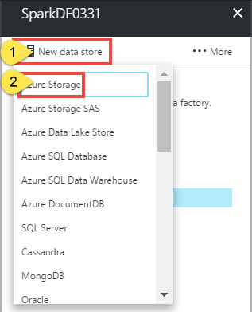
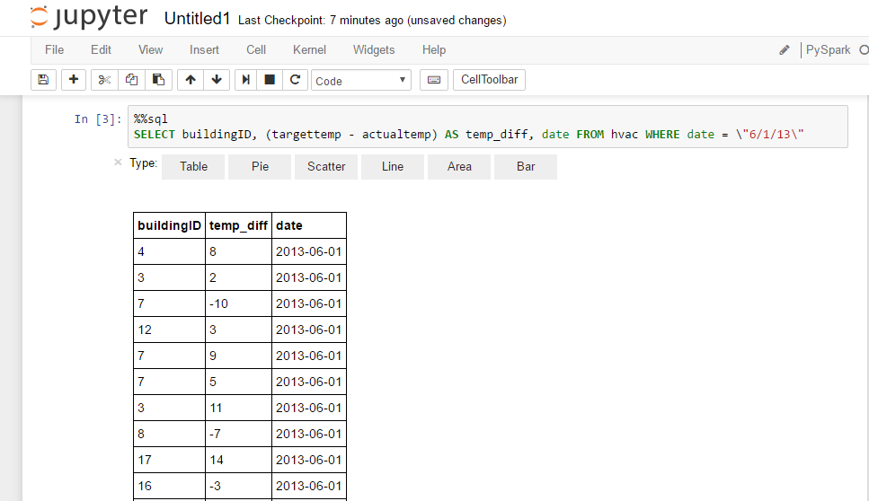

# Invoke Spark programs from Azure Data Factory pipelines

> [!div class="op_single_selector" title1="Transformation Activities"]
> * [Hive Activity](data-factory-hive-activity.md)
> * [Pig Activity](data-factory-pig-activity.md)
> * [MapReduce Activity](data-factory-map-reduce.md)
> * [Hadoop Streaming Activity](data-factory-hadoop-streaming-activity.md)
> * [Spark Activity](data-factory-spark.md)
> * [Machine Learning Batch Execution Activity](data-factory-azure-ml-batch-execution-activity.md)
> * [Machine Learning Update Resource Activity](data-factory-azure-ml-update-resource-activity.md)
> * [Stored Procedure Activity](data-factory-stored-proc-activity.md)
> * [Data Lake Analytics U-SQL Activity](data-factory-usql-activity.md)
> * [.NET Custom Activity](data-factory-use-custom-activities.md)

## Introduction
Spark Activity is one of the [data transformation activities](data-factory-data-transformation-activities.md) supported by Azure Data Factory. This activity runs the specified Spark program on your Apache Spark cluster in Azure HDInsight.    

> [!IMPORTANT]
> - Spark Activity does not support HDInsight Spark clusters that use an Azure Data Lake Store as primary storage.
> - Spark Activity supports only existing (your own) HDInsight Spark clusters. It does not support an on-demand HDInsight linked service.

## Walkthrough: create a pipeline with Spark activity
Here are the typical steps to create a Data Factory pipeline with a Spark activity.  

1. Create a data factory.
2. Create an Azure Storage linked service to link your Azure storage that is associated with your HDInsight Spark cluster to the data factory.     
2. Create an Azure HDInsight linked service to link your Apache Spark cluster in Azure HDInsight to the data factory.
3. Create a dataset that refers to the Azure Storage linked service. Currently, you must specify an output dataset for an activity even if there is no output being produced.  
4. Create a pipeline with Spark activity that refers to the HDInsight linked service created in #2. The activity is configured with the dataset you created in the previous step as an output dataset. The output dataset is what drives the schedule (hourly, daily, etc.). Therefore, you must specify the output dataset even though the activity does not really produce an output.

### Prerequisites
1. Create a **general-purpose Azure Storage Account** by following instructions in the walkthrough: [Create a storage account](../storage/storage-create-storage-account.md#create-a-storage-account).  
2. Create an **Apache Spark cluster in Azure HDInsight** by following instructions in the tutorial: [Create Apache Spark cluster in Azure HDInsight](../hdinsight/hdinsight-apache-spark-jupyter-spark-sql.md). Associate the Azure storage account you created in step #1 with this cluster.  
3. Download and review the python script file **test.py** located at: [https://adftutorialfiles.blob.core.windows.net/sparktutorial/test.py](https://adftutorialfiles.blob.core.windows.net/sparktutorial/test.py).  
3.  Upload **test.py** to the **pyFiles** folder in the **adfspark** container in your Azure Blob storage. Create the container and the folder if they do not exist.

### Create data factory
Let's start with creating the data factory in this step.

1. Log in to the [Azure portal](https://portal.azure.com/).
2. Click **NEW** on the left menu, click **Data + Analytics**, and click **Data Factory**.
3. In the **New data factory** blade, enter **SparkDF** for the Name.

   > [!IMPORTANT]
   > The name of the Azure data factory must be **globally unique**. If you see the error: **Data factory name “SparkDF” is not available**. Change the name of the data factory (for example, yournameSparkDFdate, and try creating again. See [Data Factory - Naming Rules](data-factory-naming-rules.md) topic for naming rules for Data Factory artifacts.   
4. Select the **Azure subscription** where you want the data factory to be created.
5. Select an existing **resource group** or create an Azure resource group.
6. Select **Pin to dashboard** option.  
6. Click **Create** on the **New data factory** blade.

   > [!IMPORTANT]
   > To create Data Factory instances, you must be a member of the [Data Factory Contributor](../active-directory/role-based-access-built-in-roles.md#data-factory-contributor) role at the subscription/resource group level.
7. You see the data factory being created in the **dashboard** of the Azure portal as follows:   
8. After the data factory has been created successfully, you see the data factory page, which shows you the contents of the data factory. If you do not see the data factory page, click the tile for your data factory on the dashboard.

    

### Create linked services
In this step, you create two linked services, one to link your Spark cluster to your data factory, and the other to link your Azure storage to your data factory.  

#### Create Azure Storage linked service
In this step, you link your Azure Storage account to your data factory. A dataset you create in a step later in this walkthrough refers to this linked service. The HDInsight linked service that you define in the next step refers to this linked service too.  

1. Click **Author and deploy** on the **Data Factory** blade for your data factory. You should see the Data Factory Editor.
2. Click **New data store** and choose **Azure storage**.

   
3. You should see the **JSON script** for creating an Azure Storage linked service in the editor.

   
4. Replace **account name** and **account key** with the name and access key of your Azure storage account. To learn how to get your storage access key, see the information about how to view, copy, and regenerate storage access keys in [Manage your storage account](../storage/storage-create-storage-account.md#manage-your-storage-account).
5. To deploy the linked service, click **Deploy** on the command bar. After the linked service is deployed successfully, the **Draft-1** window should disappear and you see **AzureStorageLinkedService** in the tree view on the left.

#### Create HDInsight linked service
In this step, you create Azure HDInsight linked service to link your HDInsight Spark cluster to the data factory. The HDInsight cluster is used to run the Spark program specified in the Spark activity of the pipeline in this sample.  

1. Click **... More** on the toolbar, click **New compute**, and then click **HDInsight cluster**.

	
2. Copy and paste the following snippet to the **Draft-1** window. In the JSON editor, do the following steps:
	1. Specify the **URI** for the HDInsight Spark cluster. For example: `https://<sparkclustername>.azurehdinsight.net/`.
	2. Specify the name of the **user** who has access to the Spark cluster.
	3. Specify the **password** for user.
	4. Specify the **Azure Storage linked service** that is associated with the HDInsight Spark cluster. In this example, it is: **AzureStorageLinkedService**.

	```json
	{
		"name": "HDInsightLinkedService",
	    "properties": {
	        "type": "HDInsight",
	        "typeProperties": {
	            "clusterUri": "https://<sparkclustername>.azurehdinsight.net/",
	            "userName": "admin",
	            "password": "**********",
	            "linkedServiceName": "AzureStorageLinkedService"
	        }
	    }
	}
	```

	> [!IMPORTANT]
	> - Spark Activity does not support HDInsight Spark clusters that use an Azure Data Lake Store as primary storage.
	> - Spark Activity supports only existing (your own) HDInsight Spark cluster. It does not support an on-demand HDInsight linked service.

	See [HDInsight Linked Service](data-factory-compute-linked-services.md#azure-hdinsight-linked-service) for details about the HDInsight linked service.
3.  To deploy the linked service, click **Deploy** on the command bar.  

### Create output dataset
The output dataset is what drives the schedule (hourly, daily, etc.). Therefore, you must specify an output dataset for the spark activity in the pipeline even though the activity does not really produce any output. Specifying an input dataset for the activity is optional.

1. In the **Data Factory Editor**, click **... More** on the command bar, click **New dataset**, and select **Azure Blob storage**.  
2. Copy and paste the following snippet to the Draft-1 window. The JSON snippet defines a dataset called **OutputDataset**. In addition, you specify that the results are stored in the blob container called **adfspark** and the folder called **pyFiles/output**. As mentioned earlier, this dataset is a dummy dataset. The Spark program in this example does not produce any output. The **availability** section specifies that the output dataset is produced daily.  

	```json
	{
	    "name": "OutputDataset",
	    "properties": {
	        "type": "AzureBlob",
	        "linkedServiceName": "AzureStorageLinkedService",
	        "typeProperties": {
	            "fileName": "sparkoutput.txt",
	            "folderPath": "adfspark/pyFiles/output",
	            "format": {
	                "type": "TextFormat",
	                "columnDelimiter": "\t"
	            }
	        },
	        "availability": {
	            "frequency": "Day",
	            "interval": 1
	        }
	    }
	}
	```
3. To deploy the dataset, click **Deploy** on the command bar.


### Create pipeline
In this step, you create a pipeline with a **HDInsightSpark** activity. Currently, output dataset is what drives the schedule, so you must create an output dataset even if the activity does not produce any output. If the activity doesn't take any input, you can skip creating the input dataset. Therefore, no input dataset is specified in this example.

1. In the **Data Factory Editor**, click **… More** on the command bar, and then click **New pipeline**.
2. Replace the script in the Draft-1 window with the following script:

	```json
	{
	    "name": "SparkPipeline",
	    "properties": {
	        "activities": [
	            {
	                "type": "HDInsightSpark",
	                "typeProperties": {
	                    "rootPath": "adfspark\\pyFiles",
	                    "entryFilePath": "test.py",
                    	"getDebugInfo": "Always"
	                },
	                "outputs": [
	                    {
	                        "name": "OutputDataset"
	                    }
	                ],
	                "name": "MySparkActivity",
	                "linkedServiceName": "HDInsightLinkedService"
	            }
	        ],
	        "start": "2017-02-05T00:00:00Z",
	        "end": "2017-02-06T00:00:00Z"
	    }
	}
	```
	Note the following points:
	- The **type** property is set to **HDInsightSpark**.
	- The **rootPath** is set to **adfspark\\pyFiles** where adfspark is the Azure Blob container and pyFiles is fine folder in that container. In this example, the Azure Blob Storage is the one that is associated with the Spark cluster. You can upload the file to a different Azure Storage. If you do so, create an Azure Storage linked service to link that storage account to the data factory. Then, specify the name of the linked service as a value for the **sparkJobLinkedService** property. See [Spark Activity properties](#spark-activity-properties) for details about this property and other properties supported by the Spark Activity.  
	- The **entryFilePath** is set to the **test.py**, which is the python file.
	- The **getDebugInfo** property is set to **Always**, which means the log files are always generated (success or failure).

		> [!IMPORTANT]
		> We recommend that you do not set this property to `Always` in a production environment unless you are troubleshooting an issue.
	- The **outputs** section has one output dataset. You must specify an output dataset even if the spark program does not produce any output. The output dataset drives the schedule for the pipeline (hourly, daily, etc.).  

		For details about the properties supported by Spark activity, see [Spark activity properties](#spark-activity-properties) section.
3. To deploy the pipeline, click **Deploy** on the command bar.

### Monitor pipeline
1. Click **X** to close Data Factory Editor blades and to navigate back to the Data Factory home page. Click **Monitor and Manage** to launch the monitoring application in another tab.

	
2. Change the **Start time** filter at the top to **2/1/2017**, and click **Apply**.
3. You should see only one activity window as there is only one day between the start (2017-02-01) and end times (2017-02-02) of the pipeline. Confirm that the data slice is in **ready** state.

	    
4. Select the **activity window** to see details about the activity run. If there is an error, you see details about it in the right pane.

### Verify the results

1. Launch **Jupyter notebook** for your HDInsight Spark cluster by navigating to: https://CLUSTERNAME.azurehdinsight.net/jupyter. You can also launch cluster dashboard for your HDInsight Spark cluster, and then launch **Jupyter Notebook**.
2. Click **New** -> **PySpark** to start a new notebook.

	
3. Run the following command by copy/pasting the text and pressing **SHIFT + ENTER** at the end of the second statement.  

	```sql
	%%sql

	SELECT buildingID, (targettemp - actualtemp) AS temp_diff, date FROM hvac WHERE date = \"6/1/13\"
	```
4. Confirm that you see the data from the hvac table:  

	

See [Run a Spark SQL query](../hdinsight/hdinsight-apache-spark-jupyter-spark-sql.md#run-an-interactive-spark-sql-query) section for detailed instructions. 

### Troubleshooting
Since you set **getDebugInfo** to **Always**, you see a **log** subfolder in the **pyFiles** folder in your Azure Blob container. The log file in the log folder provides additional details. This log file is especially useful when there is an error. In a production environment, you may want to set it to **Failure**.

For further troubleshooting, do the following steps:


1. Navigate to `https://<CLUSTERNAME>.azurehdinsight.net/yarnui/hn/cluster`.

	  
2. Click **Logs** for one of the run attempts.

	
3. You should see additional error information in the log page.

	

The following sections provide information about Data Factory entities to use Apache Spark cluster and Spark Activity in your data factory.

## Spark activity properties
Here is the sample JSON definition of a pipeline with Spark Activity:    

```json
{
    "name": "SparkPipeline",
    "properties": {
        "activities": [
            {
                "type": "HDInsightSpark",
                "typeProperties": {
                    "rootPath": "adfspark\\pyFiles",
                    "entryFilePath": "test.py",
					"arguments": [ "arg1", "arg2" ],
					"sparkConfig": {
						"spark.python.worker.memory": "512m"
					}
                    "getDebugInfo": "Always"
                },
                "outputs": [
                    {
                        "name": "OutputDataset"
                    }
                ],
                "name": "MySparkActivity",
                "description": "This activity invokes the Spark program",
                "linkedServiceName": "HDInsightLinkedService"
            }
        ],
        "start": "2017-02-01T00:00:00Z",
        "end": "2017-02-02T00:00:00Z"
    }
}
```

The following table describes the JSON properties used in the JSON definition:

| Property | Description | Required |
| -------- | ----------- | -------- |
| name | Name of the activity in the pipeline. | Yes |
| description | Text describing what the activity does. | No |
| type | This property must be set to HDInsightSpark. | Yes |
| linkedServiceName | Name of the HDInsight linked service on which the Spark program runs. | Yes |
| rootPath | The Azure Blob container and folder that contains the Spark file. The file name is case-sensitive. | Yes |
| entryFilePath | Relative path to the root folder of the Spark code/package. | Yes |
| className | Application's Java/Spark main class | No |
| arguments | A list of command-line arguments to the Spark program. | No |
| proxyUser | The user account to impersonate to execute the Spark program | No |
| sparkConfig | Specify values for Spark configuration properties listed in the topic: [Spark Configuration - Application properties](https://spark.apache.org/docs/latest/configuration.html#available-properties). | No |
| getDebugInfo | Specifies when the Spark log files are copied to the Azure storage used by HDInsight cluster (or) specified by sparkJobLinkedService. Allowed values: None, Always, or Failure. Default value: None. | No |
| sparkJobLinkedService | The Azure Storage linked service that holds the Spark job file, dependencies, and logs.  If you do not specify a value for this property, the storage associated with HDInsight cluster is used. | No |

## Folder structure
The Spark activity does not support an in-line script as Pig and Hive activities do. Spark jobs are also more extensible than Pig/Hive jobs. For Spark jobs, you can provide multiple dependencies such as jar packages (placed in the java CLASSPATH), python files (placed on the PYTHONPATH), and any other files.

Create the following folder structure in the Azure Blob storage referenced by the HDInsight linked service. Then, upload dependent files to the appropriate sub folders in the root folder represented by **entryFilePath**. For example, upload python files to the pyFiles subfolder and jar files to the jars subfolder of the root folder. At runtime, Data Factory service expects the following folder structure in the Azure Blob storage:     

| Path | Description | Required | Type |
| ---- | ----------- | -------- | ---- |
| .	| The root path of the Spark job in the storage linked service	| Yes | Folder |
| &lt;user defined &gt; | The path pointing to the entry file of the Spark job | Yes | File |
| ./jars | All files under this folder are uploaded and placed on the java classpath of the cluster | No | Folder |
| ./pyFiles | All files under this folder are uploaded and placed on the PYTHONPATH of the cluster | No | Folder |
| ./files | All files under this folder are uploaded and placed on executor working directory | No | Folder |
| ./archives | All files under this folder are uncompressed | No | Folder |
| ./logs | The folder where logs from the Spark cluster are stored.| No | Folder |

Here is an example for a storage containing two Spark job files in the Azure Blob Storage referenced by the HDInsight linked service.

```
SparkJob1
	main.jar
	files
		input1.txt
		input2.txt
	jars
		package1.jar
		package2.jar
	logs

SparkJob2
	main.py
	pyFiles
		scrip1.py
		script2.py
	logs
```
