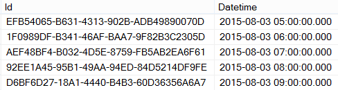
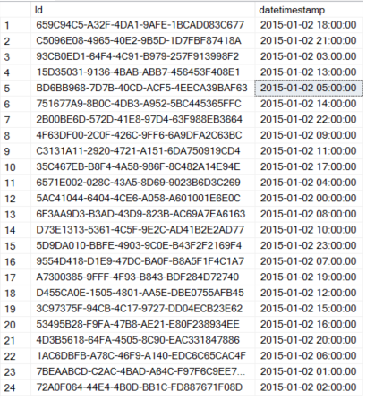
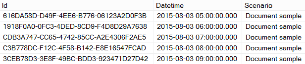

<properties 
	pageTitle="SQL Server Stored Procedure Activity" 
	description="Learn how you can use the SQL Server Stored Procedure Activity to invoke a stored procedure in an Azure SQL Database or Azure SQL Data Warehouse from a Data Factory pipeline." 
	services="data-factory" 
	documentationCenter="" 
	authors="spelluru" 
	manager="jhubbard" 
	editor="monicar"/>

<tags 
	ms.service="data-factory" 
	ms.workload="data-services" 
	ms.tgt_pltfrm="na" 
	ms.devlang="na" 
	ms.topic="article" 
	ms.date="06/27/2016" 
	ms.author="spelluru"/>

# SQL Server Stored Procedure Activity

You can use the SQL Server Stored Procedure activity in a Data Factory [pipeline](data-factory-create-pipelines.md) to invoke a stored procedure in one of the following data stores. 

- Azure SQL Database 
- Azure SQL Data Warehouse  
- SQL Server Database in your enterprise or an Azure VM. You need to install Data Management Gateway on the same machine that hosts the database or on a separate machine to avoid competing for resources with the database. Data Management Gateway is a software that connects on-premises data sources/data sources hosed in Azure VMs to cloud services in a secure and managed way. See [Move data between on-premises and cloud](data-factory-move-data-between-onprem-and-cloud.md) article for details about Data Management Gateway. 

This article builds on the [data transformation activities](data-factory-data-transformation-activities.md) article which presents a general overview of data transformation and the supported transformation activities.

## Syntax
	{
    	"name": "SQLSPROCActivity",
    	"description": "description", 
    	"type": "SqlServerStoredProcedure",
    	"inputs":  [ { "name": "inputtable"  } ],
    	"outputs":  [ { "name": "outputtable" } ],
    	"typeProperties":
    	{
        	"storedProcedureName": "<name of the stored procedure>",
        	"storedProcedureParameters":  
        	{
				"param1": "param1Value"
				…
        	}
    	}
	}

## Syntax details

Property | Description | Required
-------- | ----------- | --------
name | Name of the activity | Yes
description | Text describing what the activity is used for | No
type | SqlServerStoredProcedure | Yes
inputs | Input dataset(s) that must be available (in ‘Ready’ status) for the stored procedure activity to execute. The input(s) to the stored procedure activity only serve as dependency management when chaining this activity with others. The input dataset(s) cannot be consumed in the stored procedure as a parameter | No
outputs | Output dataset(s) produced by the stored procedure activity. Ensure that the output table uses a linked service that links an Azure SQL Database or an Azure SQL Data Warehouse or a SQL Server Database to the data factory. The output(s) in the stored procedure activity can serve as a way to pass the result of the stored procedure activity for subsquent processing and/or it can serve as dependency management when chaining this activity with others | Yes
storedProcedureName | Specify the name of the stored procedure in the Azure SQL database or Azure SQL Data Warehouse that is represented by the  linked service that the output table uses. | Yes
storedProcedureParameters | Specify values for stored procedure parameters | No

## Sample Walkthrough

### Sample table and stored procedure
> [AZURE.NOTE] This samples uses Azure SQL Database but works in the same manner for Azure SQL Data Warehouse and SQL Server Database. 

1. Create the following **table** in your Azure SQL Database using SQL Server Management Studio or any other tool you are comfortable with. The datetimestamp column is the date and time when the corresponding ID is generated. 

		CREATE TABLE dbo.sampletable
		(
			Id uniqueidentifier,
			datetimestamp nvarchar(127)
		)
		GO

		CREATE CLUSTERED INDEX ClusteredID ON dbo.sampletable(Id);
		GO

	Id is the unique identified and the datetimestamp column is the date and time when the corresponding ID is generated.
	

2. Create the following **stored procedure** that inserts data into the **sampletable**.

		CREATE PROCEDURE sp_sample @DateTime nvarchar(127)
		AS
		
		BEGIN
		    INSERT INTO [sampletable]
		    VALUES (newid(), @DateTime)
		END

	> [AZURE.IMPORTANT] **Name** and **casing** of the parameter (DateTime in this example) must match that of parameter specified in the pipeline/activity JSON . In the stored procedure definition, ensure that **@** is used as a prefix for the parameter.
	
### Create a data factory  
4. After logging into the [Azure Portal](https://portal.azure.com/), do the following:
	1.	Click **NEW** on the left menu. 
	2.	Click **Data analytics** in the **Create** blade.
	3.	Click **Data Factory** on the **Data analytics** blade.
4.	In the **New data factory** blade, enter **SProcDF** for the Name. Azure Data Factory names are globally unique. You will need to prefix the name of the data factory with your name, to enable the successful creation of the factory. 
3.	If you have not created any resource group,  you will need to create a resource group. To do this:
	1.	Click on **RESOURCE GROUP NAME**.
	2.	Select **Create a new resource group** in the **Resource group** blade.
	3.	Enter **ADFTutorialResourceGroup** for the **Name** in the **Create resource group** blade.
	4.	Click **OK**.
4.	After you have selected the resource group, verify that you are using the correct subscription where you want the data factory to be created.
5.	Click **Create** on the **New data factory** blade.
6.	You will see the data factory being created in the **Startboard** of the Azure Portal. After the data factory has been created successfully, you will see the data factory page, which shows you the contents of the data factory.

### Create an Azure SQL linked service  
After creating the data factory, you create an Azure SQL linked service that links your Azure SQL Database to the data factory. This is the database that contains the sampletable table and sp_sample stored procedure.

7.	Click **Author and deploy** on the **DATA FACTORY** blade for **SProcDF**. This launches the Data Factory Editor. 
2.	Click **New data store** on the command bar and choose **Azure SQL**. You should see the JSON script for creating an Azure SQL linked service in the editor. 
4. Replace **servername** with the name of your Azure SQL Database server, **databasename** with the database in which you created the table and the stored procedure, **username@servername** with the user account that has access to the database, and **password** with the password for the user account. 
5. Click **Deploy** on the command bar to deploy the linked service.

### Create an output dataset
6. Click **New dataset** on the command bar and select **Azure SQL**.
7. Copy/paste the following JSON script into the JSON editor.

		{			    
			"name": "sprocsampleout",
			"properties": {
				"type": "AzureSqlTable",
				"linkedServiceName": "AzureSqlLinkedService",
				"typeProperties": {
					"tableName": "sampletable"
				},
				"availability": {
					"frequency": "Hour",
					"interval": 1
				}
			}
		}
7. Click **Deploy** on the command bar to deploy the dataset. 

### Create a pipeline with SqlServerStoredProcedure activity
Now, let's create a pipeline with a SqlServerStoredProcedure activity.
 
9. Click **... (ellipsis)** on the command bar and click **New pipeline**. 
9. Copy/paste the following JSON snippet. The  **storedProcedureName** set to **sp_sample**. Name and casing of the parameter **DateTime** must match the name and casing of the parameter in the stored procedure definition.  

		{
		    "name": "SprocActivitySamplePipeline",
		    "properties": {
		        "activities": [
		            {
		                "type": "SqlServerStoredProcedure",
		                "typeProperties": {
		                    "storedProcedureName": "sp_sample",
		                    "storedProcedureParameters": {
		                        "DateTime": "$$Text.Format('{0:yyyy-MM-dd HH:mm:ss}', SliceStart)"
		                    }
		                },
		                "outputs": [
		                    {
		                        "name": "sprocsampleout"
		                    }
		                ],
		                "scheduler": {
		                    "frequency": "Hour",
		                    "interval": 1
		                },
		                "name": "SprocActivitySample"
		            }
		        ],
		        "start": "2015-01-02T00:00:00Z",
		        "end": "2015-01-03T00:00:00Z",
		        "isPaused": false
		    }
		}
9. Click **Deploy** on the toolbar to deploy the pipeline.  

### Monitor the pipeline

6. Click **X** to close Data Factory Editor blades and to navigate back to the Data Factory blade, and click on **Diagram**.
7. In the Diagram View, you will see an overview of the pipelines, and datasets used in this tutorial. 
8. In the Diagram View, double-click on the dataset **sprocsampleout**. You will see the slices in Ready state. There should be 24 slices because a slice is produced for each hour between 2015/01/02 and 2015/01/03. 
10. When a slice is in **Ready** state, run a **select * from sampledata** query against the the Azure SQL database to verify that the data was inserted into the table by the stored procedure.

	

	See [Monitor the pipeline](data-factory-monitor-manage-pipelines.md) for detailed information about monitoring Azure Data Factory pipelines.  

> [AZURE.NOTE] In the above example, the SprocActivitySample has no inputs. If you want to chain this with an activity upstream (i.e. prior processing), the output(s) of the upstream activity can be used as input(s) in this activity.  In such a  case, this activity will not execute until the upstream activity is completed and the output(s) of the upstream activities are available (in Ready status). The input(s) cannot be used directly as a parameter to the stored procedure activity

## Passing a static value 
Now, let’s consider adding another column named ‘Scenario’ in the table containing a static value called ‘Document sample’.

	CREATE PROCEDURE sp_sample @DateTime nvarchar(127) , @Scenario nvarchar(127)
	
	AS
	
	BEGIN
	    INSERT INTO [sampletable]
	    VALUES (newid(), @DateTime, @Scenario)
	END

To accomplish this, pass the Scenario parameter and the value from the stored procedure activity. The typeProperties section in the above sample looks like this:

	"typeProperties":
	{
		"storedProcedureName": "sp_sample",
	    "storedProcedureParameters": 
	    {
	    	"DateTime": "$$Text.Format('{0:yyyy-MM-dd HH:mm:ss}', SliceStart)",
			"Scenario": "Document sample"
		}
	}
