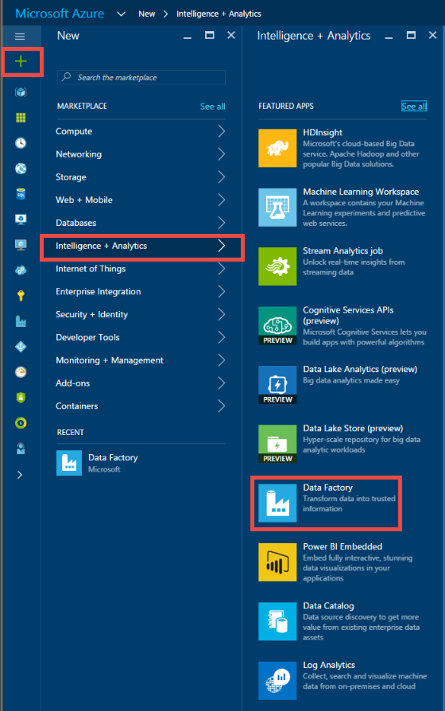

<properties 
	pageTitle="SQL Server Stored Procedure Activity" 
	description="Learn how you can use the SQL Server Stored Procedure Activity to invoke a stored procedure in an Azure SQL Database or Azure SQL Data Warehouse from a Data Factory pipeline." 
	services="data-factory" 
	documentationCenter="" 
	authors="spelluru" 
	manager="jhubbard" 
	editor="monicar"/>

<tags 
	ms.service="data-factory" 
	ms.workload="data-services" 
	ms.tgt_pltfrm="na" 
	ms.devlang="na" 
	ms.topic="article" 
	ms.date="09/30/2016" 
	ms.author="spelluru"/>

# SQL Server Stored Procedure Activity
> [AZURE.SELECTOR]
[Hive](data-factory-hive-activity.md)  
[Pig](data-factory-pig-activity.md)  
[MapReduce](data-factory-map-reduce.md)  
[Hadoop Streaming](data-factory-hadoop-streaming-activity.md)
[Machine Learning](data-factory-azure-ml-batch-execution-activity.md) 
[Stored Procedure](data-factory-stored-proc-activity.md)
[Data Lake Analytics U-SQL](data-factory-usql-activity.md)
[.NET custom](data-factory-use-custom-activities.md)

You can use the SQL Server Stored Procedure activity in a Data Factory [pipeline](data-factory-create-pipelines.md) to invoke a stored procedure in one of the following data stores: 

- Azure SQL Database 
- Azure SQL Data Warehouse  
- SQL Server Database in your enterprise or an Azure VM. You need to install Data Management Gateway on the same machine that hosts the database or on a separate machine to avoid competing for resources with the database. Data Management Gateway is a software that connects on-premises data sources/data sources hosed in Azure VMs to cloud services in a secure and managed way. See [Move data between on-premises and cloud](data-factory-move-data-between-onprem-and-cloud.md) article for details about Data Management Gateway. 

This article builds on the [data transformation activities](data-factory-data-transformation-activities.md) article, which presents a general overview of data transformation and the supported transformation activities.

## Walkthrough

### Sample table and stored procedure
1. Create the following **table** in your Azure SQL Database using SQL Server Management Studio or any other tool you are comfortable with. The datetimestamp column is the date and time when the corresponding ID is generated. 

		CREATE TABLE dbo.sampletable
		(
			Id uniqueidentifier,
			datetimestamp nvarchar(127)
		)
		GO

		CREATE CLUSTERED INDEX ClusteredID ON dbo.sampletable(Id);
		GO

	Id is the unique identified and the datetimestamp column is the date and time when the corresponding ID is generated.
	

	> [AZURE.NOTE] This sample uses Azure SQL Database but works in the same manner for Azure SQL Data Warehouse and SQL Server Database. 
2. Create the following **stored procedure** that inserts data in to the **sampletable**.

		CREATE PROCEDURE sp_sample @DateTime nvarchar(127)
		AS
		
		BEGIN
		    INSERT INTO [sampletable]
		    VALUES (newid(), @DateTime)
		END

	> [AZURE.IMPORTANT] **Name** and **casing** of the parameter (DateTime in this example) must match that of parameter specified in the pipeline/activity JSON. In the stored procedure definition, ensure that **@** is used as a prefix for the parameter.
	
### Create a data factory  
4. Log in to [Azure portal](https://portal.azure.com/). 
5. Click **NEW** on the left menu, click **Intelligence + Analytics**, and click **Data Factory**.
	
		
4.	In the **New data factory** blade, enter **SProcDF** for the Name. Azure Data Factory names are **globally unique**. You need to prefix the name of the data factory with your name, to enable the successful creation of the factory.

			 
3.	Select your **Azure subscription**. 
4.	For **Resource Group**, do one of the following steps: 
	1.	Click **Create new** and enter a name for the resource group.
	2.	Click **Use existing** and select an existing resource group.  
5.	Select the **location** for the data factory.
6.	Select **Pin to dashboard** so that you can see the data factory on the dashboard next time you log in. 
6.	Click **Create** on the **New data factory** blade.
6.	You see the data factory being created in the **dashboard** of the Azure portal. After the data factory has been created successfully, you see the data factory page, which shows you the contents of the data factory.
	

### Create an Azure SQL linked service  
After creating the data factory, you create an Azure SQL linked service that links your Azure SQL Database to the data factory. This database contains the sampletable table and sp_sample stored procedure.

7.	Click **Author and deploy** on the **Data Factory** blade for **SProcDF** to launch the Data Factory Editor.
2.	Click **New data store** on the command bar and choose **Azure SQL Database**. You should see the JSON script for creating an Azure SQL linked service in the editor. 

	
4. In the JSON script, make the following changes: 
	1. Replace **&lt;servername&gt;** with the name of your Azure SQL Database server.
	2. Replace **&lt;databasename&gt;** with the database in which you created the table and the stored procedure.
	3. Replace **&lt;username@servername&gt;** with the user account that has access to the database.
	4. Replace **&lt;password&gt;** with the password for the user account. 

	
5. Click **Deploy** on the command bar to deploy the linked service. Confirm that you see the AzureSqlLinkedService in the tree view on the left. 

	

### Create an output dataset
6. Click **... More** on the toolbar, click **New dataset**, and click **Azure SQL**. **New dataset** on the command bar and select **Azure SQL**.

	
7. Copy/paste the following JSON script in to the JSON editor.

		{			    
			"name": "sprocsampleout",
			"properties": {
				"type": "AzureSqlTable",
				"linkedServiceName": "AzureSqlLinkedService",
				"typeProperties": {
					"tableName": "sampletable"
				},
				"availability": {
					"frequency": "Hour",
					"interval": 1
				}
			}
		}
7. Click **Deploy** on the command bar to deploy the dataset. Confirm that you see the dataset in the tree view. 

	

### Create a pipeline with SqlServerStoredProcedure activity
Now, let's create a pipeline with a SqlServerStoredProcedure activity.
 
9. Click **... More** on the command bar and click **New pipeline**. 
9. Copy/paste the following JSON snippet. The **storedProcedureName** set to **sp_sample**. Name and casing of the parameter **DateTime** must match the name and casing of the parameter in the stored procedure definition.  

		{
		    "name": "SprocActivitySamplePipeline",
		    "properties": {
		        "activities": [
		            {
		                "type": "SqlServerStoredProcedure",
		                "typeProperties": {
		                    "storedProcedureName": "sp_sample",
		                    "storedProcedureParameters": {
		                        "DateTime": "$$Text.Format('{0:yyyy-MM-dd HH:mm:ss}', SliceStart)"
		                    }
		                },
		                "outputs": [
		                    {
		                        "name": "sprocsampleout"
		                    }
		                ],
		                "scheduler": {
		                    "frequency": "Hour",
		                    "interval": 1
		                },
		                "name": "SprocActivitySample"
		            }
		        ],
         		"start": "2016-08-02T00:00:00Z",
         		"end": "2016-08-02T05:00:00Z",
		        "isPaused": false
		    }
		}

	If you need pass null for a parameter, use the syntax: "param1": null (all lowercase). 
9. Click **Deploy** on the toolbar to deploy the pipeline.  

### Monitor the pipeline

6. Click **X** to close Data Factory Editor blades and to navigate back to the Data Factory blade, and click **Diagram**.

	
7. In the **Diagram View**, you see an overview of the pipelines, and datasets used in this tutorial. 

	
8. In the Diagram View, double-click the dataset **sprocsampleout**. You see the slices in Ready state. There should be five slices because a slice is produced for each hour between the start time and end time from the JSON.

	 
10. When a slice is in **Ready** state, run a **select * from sampletable** query against the Azure SQL database to verify that the data was inserted in to the table by the stored procedure.

	

	See [Monitor the pipeline](data-factory-monitor-manage-pipelines.md) for detailed information about monitoring Azure Data Factory pipelines.  

> [AZURE.NOTE] In this example, the SprocActivitySample has no inputs. If you want to chain this activity with an activity upstream (that is, prior processing), the outputs of the upstream activity can be used as inputs in this activity. In such a case, this activity does not execute until the upstream activity is completed and the outputs of the upstream activities are available (in Ready status). The inputs cannot be used directly as a parameter to the stored procedure activity

## JSON format
	{
    	"name": "SQLSPROCActivity",
    	"description": "description", 
    	"type": "SqlServerStoredProcedure",
    	"inputs":  [ { "name": "inputtable"  } ],
    	"outputs":  [ { "name": "outputtable" } ],
    	"typeProperties":
    	{
        	"storedProcedureName": "<name of the stored procedure>",
        	"storedProcedureParameters":  
        	{
				"param1": "param1Value"
				…
        	}
    	}
	}

## JSON properties

Property | Description | Required
-------- | ----------- | --------
name | Name of the activity | Yes
description | Text describing what the activity is used for | No
type | SqlServerStoredProcedure | Yes
inputs | Optional. If you do specify an input dataset, it must be available (in ‘Ready’ status) for the stored procedure activity to run. The input dataset cannot be consumed in the stored procedure as a parameter. It is only used to check the dependency before starting the stored procedure activity. | No
outputs | You must specify an output dataset for a stored procedure activity. Output dataset specifies the **schedule** for the stored procedure activity (hourly, weekly, monthly, etc.).   The output dataset must use a **linked service** that refers to an Azure SQL Database or an Azure SQL Data Warehouse or a SQL Server Database in which you want the stored procedure to run.   The output dataset can serve as a way to pass the result of the stored procedure for subsequent processing by another activity ([chaining activities](data-factory-scheduling-and-execution.md#chaining-activities)) in the pipeline. However, Data Factory does not automatically write the output of a stored procedure to this dataset. It is the stored procedure that writes to a SQL table that the output dataset points to.   In some cases, the output dataset can be a **dummy dataset**, which is used only to specify the schedule for running the stored procedure activity. | Yes
storedProcedureName | Specify the name of the stored procedure in the Azure SQL database or Azure SQL Data Warehouse that is represented by the linked service that the output table uses. | Yes
storedProcedureParameters | Specify values for stored procedure parameters. If you need to pass null for a parameter, use the syntax: "param1": null (all lower case). See the following sample to learn about using this property.| No

## Passing a static value 
Now, let’s consider adding another column named ‘Scenario’ in the table containing a static value called ‘Document sample’.

	CREATE PROCEDURE sp_sample @DateTime nvarchar(127) , @Scenario nvarchar(127)
	
	AS
	
	BEGIN
	    INSERT INTO [sampletable]
	    VALUES (newid(), @DateTime, @Scenario)
	END

Now, pass the Scenario parameter and the value from the stored procedure activity. The typeProperties section in the preceding sample looks like the following snippet:

	"typeProperties":
	{
		"storedProcedureName": "sp_sample",
	    "storedProcedureParameters": 
	    {
	    	"DateTime": "$$Text.Format('{0:yyyy-MM-dd HH:mm:ss}', SliceStart)",
			"Scenario": "Document sample"
		}
	}

