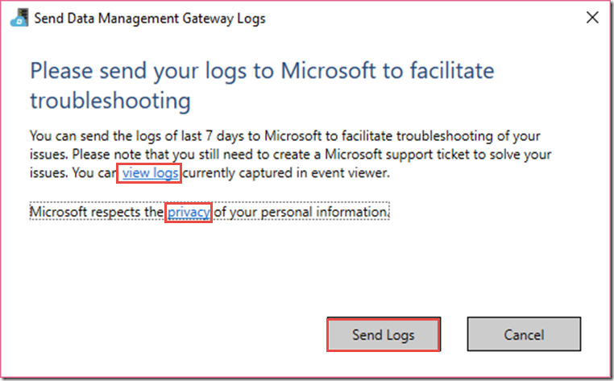

<properties 
	pageTitle="Troubleshoot Data Management Gateway issues | Microsoft Azure"
	description="Provides tips to troubleshoot Data Management Gateway related issues." 
	services="data-factory" 
	documentationCenter="" 
	authors="linda33wj" 
	manager="jhubbard" 
	editor="monicar"/>

<tags 
	ms.service="data-factory" 
	ms.workload="data-services" 
	ms.tgt_pltfrm="na" 
	ms.devlang="na" 
	ms.topic="article" 
	ms.date="11/01/2016" 
	ms.author="jingwang"/>

# Data Management Gateway
This article provides information on troubleshooting issues with using Data Management Gateway. It has the following subsections: 

- [Failed to install or register gateway](#failed-to-install-or-register-gateway)
- [Gateway is online with limited functionality](#gateway-is-online-with-limited-functionality)
- [Authoring linked service fails](#authoring-linked-service-fails)
- [Copy Activity fails](#copy-activity-fails)
- [Gateway logs](#gateway-logs)

> [AZURE.NOTE] See [Data Management Gateway](data-factory-data-management-gateway.md) article for detailed information about the gateway. See [Move data between on-premises and cloud](data-factory-move-data-between-onprem-and-cloud.md) article for a walkthrough of moving data from an on-premises SQL Server database to an Azure blob storage by using the gateway. 

## Failed to install or register gateway

### Problem
You see this error message when installing/registering a gateway, specifically, while downloading the gateway installation file. 

`Unable to connect to the remote server". Please check your local settings (Error Code: 10003).`

### Cause
The machine on which you are trying to install the gateway has failed to download the latest gateway installation file from download center due to a network issue.

### Resolution
Check your firewall / proxy server settings to see whether the settings block network connection from the machine to the [download center](https://download.microsoft.com/), and update the settings accordingly. 

Alternatively, you can download installation file for the latest gateway from the [download center](https://www.microsoft.com/en-US/download/details.aspx?id=39717) on other machines that can access the download center, copy the installer file to the gateway host machine, and run it manually to install/update the gateway.

### Problem
You see this error when attempting to install a gateway by clicking 'install directly on this computer' in the Azure portal. 

`Error:  Abort installing a new gateway on this computer because this computer has an existing installed gateway and a computer without any installed gateway is required for installing a new gateway.`  

### Cause
A gateway is already installed on the machine. 

### Resolution
Uninstall the existing gateway on the machine and click the “install directly on this computer” link again.

### Problem
You may see this error when registering a new gateway.

`Error: The gateway has encountered an error during registration.`

### Cause
You may see this message for one of the following reasons:

- The format of the gateway key is invalid.
- The gateway key has been invalidated.
- The gateway key has been regenerated from portal.  

### Resolution
Verify whether you are using the right gateway key from the Azure portal. If needed, regenerate a key and use the key to register the gateway.

### Problem
You may see the following error message when registering a gateway: 

`Error: The content or format of the gateway key "{gatewayKey}" is invalid, please go to azure portal to create one new gateway or regenerate the gateway key.`

as shown in the following screen shot:

	
### Cause
The content or format of the input gateway key is incorrect. One of the reasons could be that you copied only portion of the copy from the portal (or) using an invalid key.
 
### Resolution
Generate a gateway key in the Azure portal, and use the copy button to copy the whole key, and then paste it in this window to register the gateway.

### Problem
You may see the following error message when registering a gateway:

`Error: The gateway key is invalid or empty. Specify a valid gateway key from the portal.`

### Cause
The gateway key has been regenerated or the gateway has been deleted in the Azure portal.
 
### Resolution
If gateway still exists, regenerate the gateway key in the Azure portal, and use the copy button to copy the whole key, and then paste it in this window to register the gateway. Otherwise, recreate the gateway and start over.

### Problem
You may see the following error message when registering a gateway:

`Error: Gateway has been online for a while, then shows “Gateway is not registered” with the status “Gateway key is invalid”`

### Cause
This error may happen because either the gateway has been deleted or the associated gateway key has been regenerated.

### Resolution
If the gateway has been deleted, recreate the gateway from the portal, click Register, copy the key from the portal, paste it, and try registering the gateway.

If the gateway still exists but its key has been regenerated, use the new key to register the gateway. If you don’t have the key, regenerate the key again from the portal. 

### Problem
When registering a gateway, you may need to enter path and password for a certificate. 

### Cause
The gateway has been registered on other machines before. During the initial registration of a gateway, an encryption certificate has been associated with the gateway. The certificate can either be self-generated by the gateway or provided by the user.  This certificate is used to encrypt credentials of the data store (linked service).  

When restoring the gateway on a different host machine, the registration wizard asks for this certificate to decrypt credentials previously encrypted with this certificate.  Without this certificate, the credentials cannot be decrypted by the new gateway and subsequent copy activity executions associated with this new gateway will fail.  
 
### Resolution
If you have exported the credential certificate from the original gateway machine by using the Export button on the **Settings** tab of **Gateway Configuration Manager**, use the certificate here.

You cannot skip this stage when recovering a gateway. If the certificate is missing, you need to delete the gateway from the portal and recreate a new gateway.  In addition, all linked services related to the gateway need to be updated by reentering their credentials. 

### Problem
You may see the following error message: 

`Error: The remote server returned an error: (407) Proxy Authentication Required.`

### Cause
This error happens when your gateway is in an environment that requires an HTTP proxy to access internet resources or your proxy's authentication password is changed but it's not updated accordingly in your gateway. 

### Resolution
Follow instructions in the [Proxy server considerations](#proxy-server-considerations) section in this document and configure proxy settings with Configuration Manager.

## Gateway is online with limited functionality 
### Problem
You see status of the gateway as **online with limited functionality**. 

### Cause
You see status of the gateway as online with limited functionality for one of the following reasons:

- Gateway cannot connect to cloud service through service bus.
- Cloud service cannot connect to gateway through service bus.

When gateway is online with limited functionality, you may not be able to use the Data Factory Copy Wizard to create data pipelines for copying data to/from on-premises data stores. As a workaround, you can use Data Factory Editor in Azure portal (or) Visual Studio (or) Azure PowerShell.

### Resolution
Resolution for this issue (online with limited functionality) is based on whether gateway cannot connect to cloud service or the other way. The following sections provide these resolutions. 

### Problem
You see the following error: 

`Error: Gateway cannot connect to cloud service through service bus`

### Cause
Gateway cannot connect to cloud service through service bus.
 
### Resolution
Follow these steps to get the gateway back online:
 
- Allow IP address outbound rules on gateway machine and corporate firewall. You can find IP addresses from Windows Event Log (ID == 401): An attempt was made to access a socket in a way forbidden by its access permissions XX.XX.XX.XX:9350
- Configure proxy settings on the gateway. See [Proxy server considerations](#proxy-server-considerations) section for detail.
- Enable outbound ports 5671 and 9350-9354 on both the Windows Firewall on gateway machine and corporate firewall. See [Ports and firewall](#ports-and-firewall) section for detail. This step is optional, but recommended for performance consideration.

### Problem
You see the following error: 

`Error: Cloud service cannot connect to gateway through service bus.`

### Cause
A transient error in network connectivity.

### Resolution
Follow these steps to get the gateway back online:

- Wait for a couple of minutes, the connectivity will be automatically recovered when the error is gone.
- If the error persists, restart the gateway service.

## Failed to author linked service 

### Problem
You may see this error when you try to use Credential Manager on the portal to input credentials for a new linked service, or update credentials for an existing linked service.

`Error: The data store '<Server>/<Database>' cannot be reached. Check connection settings for the data source.`

When you see this error, the settings page of Configuration Manager may look like:

### Cause
The SSL Certificate may have been lost on the gateway machine. Gateway cannot load the certificate currently used for SSL encryption. You may also see error message in event log similar to the following one: "Unable to get the gateway settings from cloud service. Check the gateway key and the network connection. (Certificate with thumbprint cannot be loaded.)"

### Resolution
Follow these steps to solve the problem:

1.	Launch **Data Management Gateway Configuration Manager**.
2.	Switch to the **Settings** tab.  
3.	Click **Change** button to change SSL Certificate.

		 
4.	Select a new certificate as SSL Certificate. (You can use any SSL Cert generated by either yourself or any organization).

		

## Copy activity fails

### Problem
You may notice the following "UserErrorFailedToConnectToSqlserver" failure after you set up a pipeline in the Azure portal. 

`Error: Copy activity encountered a user error: ErrorCode=UserErrorFailedToConnectToSqlServer,'Type=Microsoft.DataTransfer.Common.Shared.HybridDeliveryException,Message=Cannot connect to SQL Server`

### Cause
This could happen for different reasons, and mitigation varies accordingly. 

### Resolution
Allow outbound TCP connections over port TCP/1433 on Data Management Gateway client side before connecting to SQL Database. 

If the target database is an Azure SQL Database, check Azure SQL Server firewall settings as well.

On the gateway machine, there is a quick connectivity diagnostics tool, you can follow the instructions in Data store connection or driver-related errors to test the connectivity.  

## Gateway logs
### Send gateway logs to Microsoft
When you contact Microsoft Support to get help with troubleshooting gateway issues, you may be asked to share your gateway logs. The release of the gateway allows you to easily share required gateway logs through two button clicks in Gateway Configuration Manager.    

1. Switch to **Diagnostics** tab of gateway configuration manager.
 
	
2. Click **Send logs** link to see the following dialog box: 

	
3. (optional) Click **view logs** to review logs in the event viewer.
4. (optional) Click **privacy** to review Microsoft online services privacy statement. 
3. Once you are satisfied with what you are about to upload, click **Send logs** to actually send logs from last seven days to Microsoft for troubleshooting. You should see the status of the Send logs operation as shown in the following image:

	
4. Once the operation is complete, you see a dialog box as shown in the following image:
	
	
5. Note down the **report ID** and share it with Microsoft Support. The report ID is used to locate your gateway logs you uploaded for troubleshooting.  The report ID is also saved in event viewer for your reference.  You can find it by looking at the event ID “25” and check the date and time.
	
		

### Archive gateway logs on gateway host machine
There are some scenarios where you have gateway issues and you cannot share gateway logs directly: 

- You manually install the gateway and register the gateway;
- You try to register the gateway with a regenerated key on configuration manager; 
- You try to send logs and the gateway host service cannot be connected;

In such cases, you can save gateway logs as a zip file and share it when contacting Microsoft support later. For example, if you receive an error while registering the gateway as shown in the following image:   

Click **Archive gateway** logs link to archive and save logs and then share the zip file with Microsoft support. 

### Locate gateway logs
You can find detailed information in gateway logs in Windows event logs. You can find them by using Windows **Event Viewer** under **Application and Services Logs** > **Data Management Gateway**. When troubleshooting gateway-related issues, look for error level events in the event viewer.

