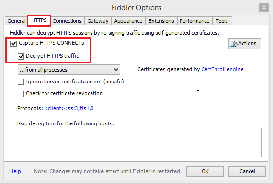

# Troubleshooting Azure Data Factory
This article lists common troubleshooting questions.

- [Azure Databricks (notebook, jars, python)](#azure-databricks)
- [Azure Data Lake Analytics (U-SQL)](#azure-data-lake-analytics-u-sql)
- [Azure Functions](#azure-functions)
- [Custom (Azure Batch)](#custom-azure-batch)
- [HDInsight (Spark, Hive, MapReduce, Pig, Hadoop Streaming)](#hdinsight-spark-hive-mapreduce-pig-hadoop-streaming)
- [Web Activity](#web-activity)

## Azure Databricks
| Error Code | Error Message                                          | Problem Description                             | Possible Fix/ Recommended Action                            |
| -------------- | ----------------------------------------------------- | --------------------------------------------------------------| :----------------------------------------------------------- |
| 3200           | Error 403                                                    | Databricks access token has expired.                         | By default, Databricks access token is valid for 90 days.  Please create a new token and update linked service. |
| 3201           | Missing   required field: settings.task.notebook_task.notebook_path | Bad authoring: Notebook path not specified correctly. | Please specify notebook path in Databricks activity. |
| 3201           | Cluster   ... does not exist                                 | Authoring   error: Databricks cluster does not exist or has been deleted. | Please verify that the Databricks cluster exists. |
| 3201           | Invalid   python file URI: .... Please visit Databricks user guide for supported URI   schemes. | Bad authoring                                                | Specify either absolute paths for workspace addressing schemes, or   "dbfs:/folder/subfolder/foo.py" for DBFS-stored files. |
| 3201           | {0}   LinkedService should have domain and accessToken as required properties | Bad authoring                                                | Please verify [linked service definition](compute-linked-services.md#azure-databricks-linked-service). |
| 3201           | {0}   LinkedService should specify either existing cluster Id or new cluster   information for creation | Bad authoring                                                | Please verify [linked service definition](compute-linked-services.md#azure-databricks-linked-service). |
| 3201           | Node   type Standard_D16S_v3 is not supported. Supported node types:   Standard_DS3_v2, Standard_DS4_v2, Standard_DS5_v2, Standard_D8s_v3,   Standard_D16s_v3, Standard_D32s_v3, Standard_D64s_v3, Standard_D3_v2,   Standard_D8_v3, Standard_D16_v3, Standard_D32_v3, Standard_D64_v3,   Standard_D12_v2, Standard_D13_v2, Standard_D14_v2, Standard_D15_v2,   Standard_DS12_v2, Standard_DS13_v2, Standard_DS14_v2, Standard_DS15_v2,   Standard_E8s_v3, Standard_E16s_v3, Standard_E32s_v3, Standard_E64s_v3,   Standard_L4s, Standard_L8s, Standard_L16s, Standard_L32s, Standard_F4s,   Standard_F8s, Standard_F16s, Standard_H16, Standard_F4s_v2, Standard_F8s_v2,   Standard_F16s_v2, Standard_F32s_v2, Standard_F64s_v2, Standard_F72s_v2,   Standard_NC12, Standard_NC24, Standard_NC6s_v3, Standard_NC12s_v3,   Standard_NC24s_v3, Standard_L8s_v2, Standard_L16s_v2, Standard_L32s_v2,   Standard_L64s_v2, Standard_L80s_v2 | Bad authoring                                                | Refer error message                                          |
| 3201           | Invalid notebook_path: .... Only absolute paths are currently supported. Paths must   begin with '/'. | Bad authoring                                                | Refer error message                                          |
| 3202           | There were already 1000 jobs created in past 3600 seconds, exceeding rate limit:   1000 job creations per 3600 seconds. | Too many Databricks runs in an hour.                         | Check all pipelines that use this Databricks workspace for job   creation rate.  If pipelines launched   too many Databricks runs in aggregate, migrate some pipelines to a new   workspace. |
| 3202           | Could not parse request object: Expected 'key' and 'value' to be set for JSON map field base_parameters, got 'key: "..."' instead. | Authoring error: No value provided for the parameter         | Inspect pipeline json and ensure all parameters in Notebook baseParameters have a non-empty value specified. |
| 3202           | User: SimpleUserContext{userId=..., name=user@company.com, orgId=…} is not   authorized to access cluster | User that generated the access token is not allowed to access the   Databricks cluster specified in the linked service. | Ensure user has the required permissions in the workspace.   |
| 3203           | The cluster is in Terminated state, not available to receive jobs. Please fix the   cluster or retry later. | Cluster has been terminated.    For interactive cluster, this might be a race condition. | Best way to avoid this is to use job clusters.             |
| 3204           | Job execution failed. There can be any   number of error messages, from unexpected cluster state to activity-specific   message.  Most common is no error   message at all. | N/A                                                          | N/A                                                          |

## Azure Data Lake Analytics (U-SQL)

| Error   Code         | Error Message                                                | Problem Description                                          | Possible Fix/ Recommended Action                             |
| -------------------- | ------------------------------------------------------------ | ------------------------------------------------------------ | ------------------------------------------------------------ |
| 2709                 | The access token is from the wrong tenant                    | Incorrect AAD tenant                                         | The Service Principal used to access the ADLA belongs to another AAD tenant. Please create new Service Principal in the same tenant as ADLA account. |
| 2711,   2705,   2704 | Forbidden. ACL verification failed. Either the resource does not exist or the user is not authorized to perform the requested operation  User is   not able to access to datalake store    User is  not authorized to data lake analytics | The Service Principal or certificate provided doesn't have access to the file in storage | Please make sure the Service Principal or certificate they provide for ADLA jobs has access to both ADLA account and the default ADLS storage for it from   root folder. |
| 2711                 | Cannot find the 'Azure Data Lake Store' file or folder       | The   path to USQL file is either wrong or the linked service credentials don't have access | Please verify the path, and the credentials provided in linked service |
| 2707                 | Cannot resolve the account of   AzureDataLakeAnalytics. Please check 'AccountName' and   'DataLakeAnalyticsUri'. | The ADLA account in linked service is wrong                  | Please verify that the right account is provided             |
| 2703                 | Error Id: E_CQO_SYSTEM_INTERNAL_ERROR or any error the starts with "Error   Id:" | Error is coming from ADLA                                    | Any   error that looks like the example means the job was submitted to ADLA and the   script there failed. The investigation must be done on ADLA. If you open the   portal and navigate to the ADLA account, look for the job by using ADF   activity run Id (not pipeline run Id). The job there will have more   information about the error and will help to troubleshoot. If resolution is not clear, please contact ADLA support team and provide the job URL, which   includes your account name and the job ID. |
| 2709                 | We cannot accept your job at this moment. The maximum number of queued jobs for   your account is 200. | Throttling on ADLA                                           | Reduce the number of submitted jobs to ADLA by changing ADF triggers and concurrency settings on activities, or increase the limits on ADLA |
| 2709                 | This job was rejected because it requires 24 AUs and this account has an administrator-defined policy that prevents a job from using more than 5 AUs. | Throttling on ADLA                                           | Reduce the number of submitted jobs to ADLA by changing ADF triggers and concurrency settings on activities, or increase the limits on ADLA |

## Azure Functions

| Error   Code | Error Message                           | Description                                                  | Possible Fix/   Recommended Action                           |
| ------------ | --------------------------------------- | ------------------------------------------------------------ | ------------------------------------------------------------ |
| 3600         | Response Content is not a valid JObject | This means that the Azure function that got called did not return a JSON Payload in the response. ADF Azure function activity only supports JSON response content. | Update Azure function to return a valid JSON Payload e.g. a C# function can return (ActionResult)new<OkObjectResult("{`\"Id\":\"123\"`}"); |
| 3600         | Invalid HttpMethod: ‘..’.               | This means that Http method specified in the   activity payload is not supported by Azure Function Activity. | The Http methods that are supported are:   PUT, POST,GET, DELETE, OPTIONS, HEAD, TRACE |

## Custom (Azure Batch)
| Error   Code | Error Message                                                | Description                                                  | Possible Fix/   Recommended Action                           |
| ------------ | ------------------------------------------------------------ | ------------------------------------------------------------ | ------------------------------------------------------------ |
| 2500         | Hit   unexpected exception and execution failed.             | Cannot launch command, or the program returned an error code. | Check that the executable exists. If program launched, check the stdout.txt and stderr.txt uploaded to the storage account. It is a good practice to emit copious logs in your code for debugging. |
| 2501         | Can not   access user batch account, please check batch account settings. | Incorrect Batch access key or pool name provided.            | Need to verify pool name and Batch access key in the linked   service. |
| 2502         | Can not   access user storage account, please check storage account settings. | Incorrect storage account name or access key provided.       | Need to verify storage account name and access key in linked service. |
| 2504         | Operation   returned an invalid status code 'BadRequest'     | Too many files in folderPath if the custom activity.  (Total   size of resourceFiles cannot be more than 32768 characters.) | Remove unnecessary files, or zip them and add an unzip command to extract, for example: powershell.exe -nologo -noprofile   -command "& { Add-Type -A 'System.IO.Compression.FileSystem';   [IO.Compression.ZipFile]::ExtractToDirectory($zipFile, $folder); }" ;  $folder\yourProgram.exe |
| 2505         | Cannot   create Shared Access Signature unless Account Key credentials are used. | Custom activities only support storage accounts that use an access   key. | Refer description                                            |
| 2507         | The   folder path does not exist or is empty: ...            | No files in the storage account at the specified path.       | The folderPath must contain the executables that you want to run. |
| 2508         | There’re   duplicate files in resource folder.               | There are multiple files of the same name in different subfolders   of folderPath. | Custom activities flatten folder structure under folderPath.  If folder structure needs to be preserved,   zip the files and extract them on Azure Batch with an unzip command, for   example:   powershell.exe -nologo -noprofile   -command "& { Add-Type -A 'System.IO.Compression.FileSystem';   [IO.Compression.ZipFile]::ExtractToDirectory($zipFile, $folder); }" ;   $folder\yourProgram.exe |
| 2509         | Batch   url ...is invalid, it must be in Uri format.         | Batch URLs must be similar to https:\//mybatchaccount.eastus.batch.azure.com | Refer description                                            |
| 2510         | An   error occurred while sending the request.               | Batch URL is invalid                                         | Verify batch URL.                                            |

## HDInsight (Spark, Hive, MapReduce, Pig, Hadoop Streaming)

| Error   Code | Error Message                                                | Description                                                  | Possible Fix/   Recommended Action                           |
| ------------ | ------------------------------------------------------------ | ------------------------------------------------------------ | ------------------------------------------------------------ |
| 2300,   2310 | Hadoop job submission failed. Error: The remote name could not be resolved.   The cluster not found. | Provided cluster URI is invalid                              | Please make sure the cluster has not been deleted, and the provided URI is correct. You can open the URI in any browser, and you   should see the Ambari UI. If the cluster is in a vNet, then the URI should be   the private URI, and you should try to open it from a VM that is part of the same vNet. More info for [Virtual Network in HDInsight](https://docs.microsoft.com/azure/hdinsight/hdinsight-extend-hadoop-virtual-network#directly-connect-to-apache-hadoop-services). |
| 2300         | Hadoop   job submission failed. Job: …, Cluster: …/. Error: A task was canceled. | The submission of the job timed out.                         | This could be either general HDInsight connectivity issue or network   connectivity issue. First confirm that HDInsight Ambari UI is available via any   browser and your credentials are still valid. Make sure to do this from the   VM/machine where self-hosted IR is installed if using self-hosted IR. Then   try submitting the job from ADF again. If it still fails, contact ADF team   for support. |
| 2300         | Unauthorized:   Ambari user name or password is incorrect    Unauthorized:   User admin is locked out in Ambari     403 -   Forbidden: Access is denied | Provided credentials for the HDInsight are incorrect or are expired | Please correct them and redeploy the linked service. Make sure the   credentials work on HDInsight first by opening the cluster URI on any browser and   trying to login. If they don't work, you can reset them from Azure Portal. |
| 2300,   2310 | 502 - Web server received an invalid response while acting as a gateway or proxy server        Bad Gateway | Error is coming from HDInsight                               | This error is coming from HDInsight cluster. Refer [HDInsight troubleshooter](https://hdinsight.github.io/ambari/ambari-ui-502-error.html) with common errors .     For Spark clusters it could be also caused due to [this](https://hdinsight.github.io/spark/spark-thriftserver-errors.html).   [Additional link](https://docs.microsoft.com/azure/application-gateway/application-gateway-troubleshooting-502) |
| 2300         | Hadoop job submission failed. Job: …, Cluster: ... Error:   {\"error\":\"Unable to service the submit job request as   templeton service is busy with too many submit job requests. Please wait for   some time before retrying the operation. Please refer to the config   templeton.parallellism.job.submit to configure concurrent requests.\    Hadoop   job submission failed. Job: 161da5d4-6fa8-4ef4-a240-6b6428c5ae2f, Cluster: https:\//abc-analytics-prod-hdi-hd-trax-prod01.azurehdinsight.net/.   Error: {\"error\":\"java.io.IOException:   org.apache.hadoop.yarn.exceptions.YarnException: Failed to submit   application_1561147195099_3730 to YARN :   org.apache.hadoop.security.AccessControlException: Queue root.joblauncher   already has 500 applications, cannot accept submission of application:   application_1561147195099_3730\ | Too many jobs are being submitted to HDInsight at the same time | Consider limiting the number of concurrent jobs being   submitted to the HDI. Please refer to ADF activity concurrency if they are   being submitted by the same activity. Change the triggers so the concurrent   pipeline runs are spread out over time. Also refer to HDInsight docs in order to   tweak the "templeton.parallellism.job.submit" as error suggests. |
| 2303,   2347 | Hadoop job failed with exit code '5'. See   'wasbs://adfjobs@adftrialrun.blob.core.windows.net/StreamingJobs/da4afc6d-7836-444e-bbd5-635fce315997/18_06_2019_05_36_05_050/stderr'   for more details.    Hive execution failed with error code 'UserErrorHiveOdbcCommandExecutionFailure'.   See 'wasbs://adfjobs@eclsupplychainblobd.blob.core.windows.net/HiveQueryJobs/16439742-edd5-4efe-adf6-9b8ff5770beb/18_06_2019_07_37_50_477/Status/hive.out'   for more details | The job was submitted to HDInsight, and it failed on HDInsight | The job has been submitted to HDInsight successfully. It failed on the   cluster. Please either open the job on HDInsight Ambari UI, and open the logs   there, or open the file from storage as the error message points out. The details of the error will be in that file. |
| 2328         | Internal server error occurred while processing the request. Please retry the request   or contact support | Happens on HDInsight on Demand.                              | This error is coming from HDInsight service when the HDInsight provisioning fails. Please contact the HDInsight team and provide them the on demand cluster name. |
| 2310         | java.lang.NullPointerException                               | Error happened when submitting the job to Spark cluster      | This exception is coming from HDInsight and is hiding the actual issue.   Please contact the HDInsight team for support, and provide them with cluster name,   and the activity run time range. |
|              | All other errors                                             |                                                              | Please refer to [HDInsight  troubleshooter](../hdinsight/hdinsight-troubleshoot-guide.md) and [HDInsight FAQ](https://hdinsight.github.io/) |

## Web Activity

| Error   Code | Error Message                                                | Description                                                  | Possible Fix/   Recommended Action                           |
| ------------ | ------------------------------------------------------------ | ------------------------------------------------------------ | ------------------------------------------------------------ |
| 2108         | Invalid HttpMethod: ‘..’.                                    | This means that Http method specified in the activity payload is   not supported by Web Activity. | The Http methods that are supported are:  PUT, POST, GET, DELETE |
| 2108         | Invalid Server Error 500                                     | Internal error on the endpoint                               | Check the functionality on the URL (with Fiddler/Postman): [How to use Fiddler to create an HTTP session](#how-to-use-fiddler-to-create-an-http-session-of-the-monitored-web-application) |
| 2108         | Unauthorized 401                                             | Missing valid authentication on request                      | Provide valid authentication method (token may have expired).     Check the functionality on the URL (with Fiddler/Postman): [How to use Fiddler to create an HTTP session](#how-to-use-fiddler-to-create-an-http-session-of-the-monitored-web-application) |
| 2108         | Forbidden 403                                                | Missing required permissions                                 | Check user permissions on the accessed resource.     Check the functionality on the URL (with Fiddler/Postman): [How to use Fiddler to create an HTTP session](#how-to-use-fiddler-to-create-an-http-session-of-the-monitored-web-application) |
| 2108         | Bad Request 400                                              | Invalid Http request                                         | Check the URL, verb and body of the request.     Use Fiddler/Postman to validate the request: [How to use Fiddler to create an HTTP session](#how-to-use-fiddler-to-create-an-http-session-of-the-monitored-web-application) |
| 2108         | Not found 404                                                | Resource was not found                                       | Use Fiddler/Postman to validate the request: [How to use Fiddler to create an HTTP session](#how-to-use-fiddler-to-create-an-http-session-of-the-monitored-web-application) |
| 2108         | Service unavailable                                          | Service is unavailable                                       | Use Fiddler/Postman to validate the request: [How to use Fiddler to create an HTTP session](#how-to-use-fiddler-to-create-an-http-session-of-the-monitored-web-application) |
| 2108         | Unsupported Media Type                                       | Mismatched Content-Type with the Web activity body           | Specify the correct Content-Type that matches the payload format   Use Fiddler/Postman to validate the request: [How to use Fiddler to create an HTTP session](#how-to-use-fiddler-to-create-an-http-session-of-the-monitored-web-application) |
| 2108         | The resource you are looking for has been removed, had its name changed, or is temporarily unavailable. | The resource is not available                                | Use Fiddler/Postman to check the endpoint: [How to use Fiddler to create an HTTP session](#how-to-use-fiddler-to-create-an-http-session-of-the-monitored-web-application) |
| 2108         | The page you are looking for cannot be displayed because an invalid method (HTTP   verb) is being used. | Incorrect Web activity method was specified in the request   | Use Fiddler/Postman to check the endpoint: [How to use Fiddler to create an HTTP session](#how-to-use-fiddler-to-create-an-http-session-of-the-monitored-web-application) |
| 2108         | invalid_payload                                              | The body for Web activity is incorrect                       | Use Fiddler/Postman to check the endpoint: [How to use Fiddler to create an HTTP session](#how-to-use-fiddler-to-create-an-http-session-of-the-monitored-web-application) |

#### How to use Fiddler to create an HTTP session of the monitored web application

1. Download and install [Fiddler](https://www.telerik.com/download/fiddler)

2. If your web application uses HTTPS:

   1. Open Fiddler

   2. Go to **Tools > Fiddler Options** and select as in below screenshot. 

      

3. If your application uses SSL certificates, you must also add the Fiddler certificate to your device.

4. To add the Fiddler certificate to your device, go to **Tools** > **Fiddler Options** > **HTTPS** > **Actions** > **Export Root Certificate to Desktop** to obtain the Fiddler certificate.

5. Turn off capturing so that the browser's cache can be cleared in order to start a fresh trace.

6. 1. Go to **File** > **Capture Traffic** or press **F12**.
   2. Clear your browser's cache so that all cached items are removed and must be re-downloaded.

7. Create request : 

8. 1. Click on the Composer tab
   2. Set the Http method and URL
   3. Add headers and request body if required
   4. Click Execute

9. Start capturing traffic again and complete the problematic transaction on your page.

10. Once completed, go to **File** > **Save** > **All Sessions**.

More information on Fiddler [here](https://docs.telerik.com/fiddler/Configure-Fiddler/Tasks/ConfigureFiddler)

## Next steps

For more help in finding solution to your issue, here are some other resources you can try.

*  [Blogs](https://azure.microsoft.com/blog/tag/azure-data-factory/)
*  [Feature requests](https://feedback.azure.com/forums/270578-data-factory)
*  [Videos](https://azure.microsoft.com/resources/videos/index/?sort=newest&services=data-factory)
*  [MSDN Forum](https://social.msdn.microsoft.com/Forums/home?sort=relevancedesc&brandIgnore=True&searchTerm=data+factory)
*  [Stack Overflow](https://stackoverflow.com/questions/tagged/azure-data-factory)
*  [Twitter](https://twitter.com/hashtag/DataFactory)

