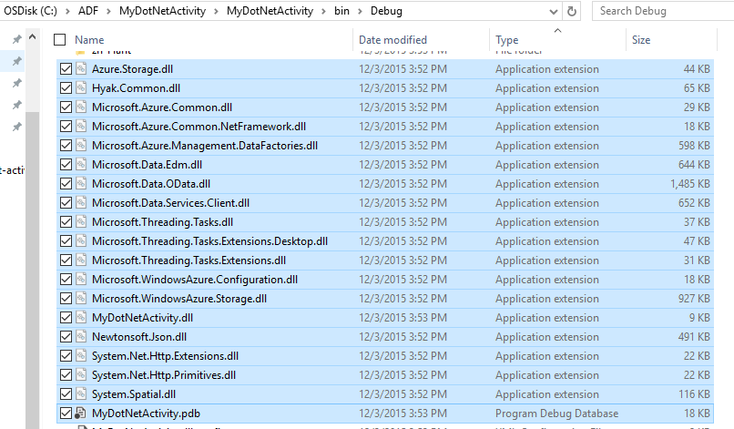
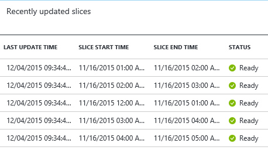

<properties
	pageTitle="Use custom activities in an Azure Data Factory pipeline"
	description="Learn how to create custom activities and use them in an Azure Data Factory pipeline."
	services="data-factory"
	documentationCenter=""
	authors="spelluru"
	manager="jhubbard"
	editor="monicar"/>

<tags
	ms.service="data-factory"
	ms.workload="data-services"
	ms.tgt_pltfrm="na"
	ms.devlang="na"
	ms.topic="article"
	ms.date="06/17/2016"
	ms.author="spelluru"/>

# Use custom activities in an Azure Data Factory pipeline
There are two types of activities that you can use in an Azure Data Factory pipeline.
 
- [Data Movement Activities](data-factory-data-movement-activities.md) to move data between [supported data stores](data-factory-data-movement-activities.md#supported-data-stores).
- [Data Transformation Activities](data-factory-data-transformation-activities.md) to transform/process data using computes such as Azure HDInsight, Azure Batch, and Azure Machine Learning. For example: HDInsight Hive and Machine Learning Batch Execution.  

If you need to move data to/from a data store that is not supported by Azure Data Factory, you can create a custom .NET activity with your own data movement logic and use the activity in the pipeline. 

Similarly, if you need to transform/process data in a way that is not supported by Data Factory, you can create a custom activity with your own data processing logic and use the activity in the pipeline. 
 
You can configure the custom .NET activity to run using either an **Azure Batch** service or an **Azure HDInsight** cluster.   

The following walkthrough provides step-by-step instructions for creating a custom .NET activity and using the custom activity in a pipeline. The walkthrough uses the **Azure Batch** linked service. To use the Azure HDInsight linked service instead, you create a linked service of type **HDInsight** (if you are using your own HDInsight cluster) or **HDInsightOnDemand** (if you want Data Factory to create an HDInsight cluster on-demand) and use it in the activity section of the pipeline JSON (**linkedServiceName**). See [Use Azure HDInsight linked services](#use-azure-hdinsight-linked-services) section for details on using Azure HDInsight to run the custom activity.

## Walkthrough 

### Prerequisites

- Visual Studio 2012/2013/2015
- Download and install [Azure .NET SDK][azure-developer-center]

### Azure Batch prerequisites
In the walkthrough, you will run your custom .NET activities using Azure Batch as a compute resource. See [Azure Batch basics][batch-technical-overview] for an overview of the Azure Batch service and see [Getting Started with the Azure Batch Library for .NET][batch-get-started] to quickly get started with the Azure Batch service.

For the purpose of the tutorial, you need to create an Azure Batch account with a pool of VMs. Here are the steps:

1. Create an **Azure Batch account** using the [Azure Portal](http://manage.windowsazure.com). See [Create and manage an Azure Batch account][batch-create-account] article for instructions. Note down the Azure Batch account name and account key.

	You can also use [New-AzureBatchAccount][new-azure-batch-account] cmdlet to create an Azure Batch account. See [Using Azure PowerShell to Manage Azure Batch Account][azure-batch-blog] for detailed instructions on using this cmdlet.
2. Create an **Azure Batch pool**.
	1. In the [Azure Portal](https://portal.azure.com), click **Browse** in the left menu, and click **Batch Accounts**. 
	2. Select your Azure Batch account to open the **Batch Account** blade. 
	3. Click **Pools** tile.
	4. In the **Pools** blade, click Add button on the toolbar to add a pool.
		1. Enter an ID for the pool (**Pool ID**). Note the **ID of the pool**; you will need it when creating the Data Factory solution. 
		2. Specify **Windows Server 2012 R2** for the Operating System Family setting.
		3. Select a **node pricing tier**. 
		3. Enter **2** as value for the **Target Dedicated** setting.
		4. Enter **2** as value for the **Max tasks per node** setting.
	5. Click **OK** to create the pool. 
 
	You can also use [New-AzureBatchPool](https://msdn.microsoft.com/library/mt628690.aspx) cmdlet to create an Azure Batch pool.	 

### High-level steps 
1.	**Create a custom activity** to use a Data Factory pipeline. The custom activity in this sample will contain the data transformation/processing logic. 
	1.	In Visual Studio, create a .NET Class Library project, add the code to process input data, and compile the project.	
	2.	Zip all the binary files and the PDB (optional) file in the output folder.	
	3.	Upload the zip file to Azure blob storage. Detailed steps are in the Create the custom activity section. 
2. **Create an Azure data factory that uses the custom activity**:
	1. Create an Azure data factory.
	2. Create linked services.
		1. AzureStorageLinkedService: Supplies storage credentials for accessing blobs.
		2. AzureBatchLinkedService: specifies Azure Batch as compute.
	3. Create datasets.
		1. InputDataset: specifies storage container and folder for the input blobs.
		1. OuputDataset: specifies storage container and folder for the output blobs.
	2. Create a pipeline that uses the custom activity.
	3. Run and test the pipeline.
	4. Debug the pipeline.

## Create the custom activity
To create a .NET custom activity, create a **.NET Class Library** project with a class that implements that **IDotNetActivity** interface. This interface has only one method: [Execute](https://msdn.microsoft.com/library/azure/mt603945.aspx) and its signature is:

	public IDictionary<string, string> Execute(
            IEnumerable<LinkedService> linkedServices, 
            IEnumerable<Dataset> datasets, 
            Activity activity, 
            IActivityLogger logger)
        

The method takes four parameters:

- **linkedServices**. This is an enumerable list of linked services that link input/output data sources (for example: Azure Blob Storage) to the data factory. In this sample, there is only one linked service of type Azure Storage used for both input and output. 
- **datasets**. This is an enumerable list of datasets. You can use this parameter to get the locations and schemas defined by input and output datasets.
- **activity**. This parameter represents the current compute entity - in this case, an Azure Batch.
- **logger**. The logger lets you write debug comments that will surface as the “User” log for the pipeline. 

The method returns a dictionary that can be used to chain custom activities together in the future. This feature is not implemented yet, so just return an empty dictionary from the method.  

### Procedure 
1.	Create a **.NET Class Library** project.
	<ol type="a">
		<li>Launch <b>Visual Studio 2015</b> or <b>Visual Studio 2013</b> or <b>Visual Studio 2012</b>.</li>
		<li>Click <b>File</b>, point to <b>New</b>, and click <b>Project</b>.</li>
		<li>Expand <b>Templates</b>, and select <b>Visual C#</b>. In this walkthrough, you use C#, but you can use any .NET language to develop the custom activity.</li>
		<li>Select <b>Class Library</b> from the list of project types on the right.</li>
		<li>Enter <b>MyDotNetActivity</b> for the <b>Name</b>.</li>
		<li>Select <b>C:\ADFGetStarted</b> for the <b>Location</b>.</li>
		<li>Click <b>OK</b> to create the project.</li>
	</ol>
2.  Click **Tools**, point to **NuGet Package Manager**, and click **Package Manager Console**.
3.	In the Package Manager Console, execute the following command to import **Microsoft.Azure.Management.DataFactories**.

		Install-Package Microsoft.Azure.Management.DataFactories

4. Import the **Azure Storage** NuGet package in to the project.

		Install-Package Azure.Storage

5. Add the following **using** statements to the source file in the project.

		using System.IO;
		using System.Globalization;
		using System.Diagnostics;
		using System.Linq;

		using Microsoft.Azure.Management.DataFactories.Models;
		using Microsoft.Azure.Management.DataFactories.Runtime;

		using Microsoft.WindowsAzure.Storage;
		using Microsoft.WindowsAzure.Storage.Blob;

6. Change the name of the **namespace** to **MyDotNetActivityNS**.

		namespace MyDotNetActivityNS

7. Change the name of the class to **MyDotNetActivity** and derive it from the **IDotNetActivity** interface as shown below.

		public class MyDotNetActivity : IDotNetActivity

8. Implement (Add) the **Execute** method of the **IDotNetActivity** interface to the **MyDotNetActivity** class and copy the following sample code to the method.

	The following sample counts the number of occurrences of the search term (“Microsoft”) in each blob associated with a data slice. 

		/// 

        /// Execute method is the only method of IDotNetActivity interface you must implement. 
        /// In this sample, the method invokes the Calculate method to perform the core logic.  
		/// 

        public IDictionary<string, string> Execute(
            IEnumerable<LinkedService> linkedServices,
            IEnumerable<Dataset> datasets,
            Activity activity,
            IActivityLogger logger)
        {
			// to get extended properties (for example: SliceStart)
			DotNetActivity dotNetActivity = (DotNetActivity)activity.TypeProperties;
            string sliceStartString = dotNetActivity.ExtendedProperties["SliceStart"];

			// to log all extended properties			
			IDictionary<string, string> extendedProperties = dotNetActivity.ExtendedProperties;
			logger.Write("Logging extended properties if any...");
			foreach (KeyValuePair<string, string> entry in extendedProperties)
			{
				logger.Write("<key:{0}> <value:{1}>", entry.Key, entry.Value);
			}
		
            // declare types for input and output data stores
            AzureStorageLinkedService inputLinkedService;

            // declare dataset types
            CustomDataset inputLocation;
            AzureBlobDataset outputLocation;

            Dataset inputDataset = datasets.Single(dataset => dataset.Name == activity.Inputs.Single().Name);
            inputLocation = inputDataset.Properties.TypeProperties as CustomDataset;

            foreach (LinkedService ls in linkedServices)
                logger.Write("linkedService.Name {0}", ls.Name);

            // using First method instead of Single since we are using the same 
            // Azure Storage linked service for input and output. 
            inputLinkedService = linkedServices.First(
                linkedService =>
                linkedService.Name ==
                inputDataset.Properties.LinkedServiceName).Properties.TypeProperties
                as AzureStorageLinkedService;

            string connectionString = inputLinkedService.ConnectionString; 

			// To create an input storage client.
            string folderPath = GetFolderPath(inputDataset);
            string output = string.Empty; // for use later.

            // create storage client for input. Pass the connection string.
            CloudStorageAccount inputStorageAccount = CloudStorageAccount.Parse(connectionString);
            CloudBlobClient inputClient = inputStorageAccount.CreateCloudBlobClient();

            // initialize the continuation token before using it in the do-while loop.
            BlobContinuationToken continuationToken = null;
            do
            {   // get the list of input blobs from the input storage client object.
                BlobResultSegment blobList = inputClient.ListBlobsSegmented(folderPath,
                                         true,
                                         BlobListingDetails.Metadata,
                                         null,
                                         continuationToken,
                                         null,
                                         null);
                
                // Calculate method returns the number of occurrences of 
                // the search term (“Microsoft”) in each blob associated
       			// with the data slice. definition of the method is shown in the next step.
 
                output = Calculate(blobList, logger, folderPath, ref continuationToken, "Microsoft");

            } while (continuationToken != null);

            // get the output dataset using the name of the dataset matched to a name in the Activity output collection.
            Dataset outputDataset = datasets.Single(dataset => dataset.Name == activity.Outputs.Single().Name);
            // convert to blob location object.
            outputLocation = outputDataset.Properties.TypeProperties as AzureBlobDataset;

            folderPath = GetFolderPath(outputDataset);

            logger.Write("Writing blob to the folder: {0}", folderPath);

            // create a storage object for the output blob.
            CloudStorageAccount outputStorageAccount = CloudStorageAccount.Parse(connectionString);
            // write the name of the file. 
            Uri outputBlobUri = new Uri(outputStorageAccount.BlobEndpoint, folderPath + "/" + GetFileName(outputDataset));

            logger.Write("output blob URI: {0}", outputBlobUri.ToString());
            // create a new blob and upload the output text.
            CloudBlockBlob outputBlob = new CloudBlockBlob(outputBlobUri, outputStorageAccount.Credentials);
            logger.Write("Writing {0} to the output blob", output);
            outputBlob.UploadText(output);

			// The dictionary can be used to chain custom activities together in the future.
			// This feature is not implemented yet, so just return an empty dictionary.  

            return new Dictionary<string, string>();
        }

9. Add the following helper methods. The **Execute** method invokes these helper methods. The **GetConnectionString** method retrieves the Azure Storage connection string and the **GetFolderPath** method retrieves the blob location. Most importantly, the **Calculate** method isolates the code that iterates through each blob.

        /// 

        /// Gets the folderPath value from the input/output dataset.
		/// 

		private static string GetFolderPath(Dataset dataArtifact)
        {
            if (dataArtifact == null || dataArtifact.Properties == null)
            {
                return null;
            }

            AzureBlobDataset blobDataset = dataArtifact.Properties.TypeProperties as AzureBlobDataset;
            if (blobDataset == null)
            {
                return null;
            }

            return blobDataset.FolderPath;
        }

        /// 

        /// Gets the fileName value from the input/output dataset.   
        /// 

        private static string GetFileName(Dataset dataArtifact)
        {
            if (dataArtifact == null || dataArtifact.Properties == null)
            {
                return null;
            }

            AzureBlobDataset blobDataset = dataArtifact.Properties.TypeProperties as AzureBlobDataset;
            if (blobDataset == null)
            {
                return null;
            }

            return blobDataset.FileName;
        }

        /// 

        /// Iterates through each blob (file) in the folder, counts the number of instances of search term in the file, 
        /// and prepares the output text that will be written to the output blob. 
        /// 

        public static string Calculate(BlobResultSegment Bresult, IActivityLogger logger, string folderPath, ref BlobContinuationToken token, string searchTerm)
        {
            string output = string.Empty;
            logger.Write("number of blobs found: {0}", Bresult.Results.Count<IListBlobItem>());
            foreach (IListBlobItem listBlobItem in Bresult.Results)
            {
                CloudBlockBlob inputBlob = listBlobItem as CloudBlockBlob;
                if ((inputBlob != null) && (inputBlob.Name.IndexOf("$$$.$$$") == -1))
                {
                    string blobText = inputBlob.DownloadText(Encoding.ASCII, null, null, null);
                    logger.Write("input blob text: {0}", blobText);
                    string[] source = blobText.Split(new char[] { '.', '?', '!', ' ', ';', ':', ',' }, StringSplitOptions.RemoveEmptyEntries);
                    var matchQuery = from word in source
                                     where word.ToLowerInvariant() == searchTerm.ToLowerInvariant()
                                     select word;
                    int wordCount = matchQuery.Count();
                    output += string.Format("{0} occurrences(s) of the search term \"{1}\" were found in the file {2}.\r\n", wordCount, searchTerm, inputBlob.Name);
                }
            }
            return output;
        }

	The GetFolderPath method returns the path to the folder that the dataset points to and the GetFileName method returns the name of the blob/file that the dataset points to. Note that if you havefolderPath defines using variables such as {Year}, {Month}, {Day} etc..., the method returns the string as it is without replacing them with runtime values. See [Access extended properties](#access-extended-properties) section for details on accessing SliceStart, SliceEnd, etc...    
	
		    "name": "InputDataset",
		    "properties": {
		        "type": "AzureBlob",
		        "linkedServiceName": "AzureStorageLinkedService",
		        "typeProperties": {
		            "fileName": "file.txt",
		            "folderPath": "adftutorial/inputfolder/",
	
	The Calculate method calculates the number of instances of keyword Microsoft in the input files (blobs in the folder). The search term (“Microsoft”) is hard coded in the code.

10. Compile the project. Click **Build** from the menu and click **Build Solution**.
11. Launch **Windows Explorer**, and navigate to **bin\debug** or **bin\release** folder depending type of build.
12. Create a zip file **MyDotNetActivity.zip** that contain all the binaries in the <project folder>\bin\Debug folder. You may want to include the **MyDotNetActivity.pdb** file so that you get additional details such as line number in the source code that caused the issue in case of a failure. All the files in the zip file for the custom activity must be at the **top level** with no sub folders.

	
13. Upload **MyDotNetActivity.zip** as a blob to the blob container: **customactivitycontainer** in the Azure blob storage that the **AzureStorageLinkedService** linked service in the **ADFTutorialDataFactory** uses.  Create the blob container **customactivitycontainer** if it does not already exist.

> [AZURE.NOTE] If you add this .NET activity project to a solution in Visual Studio that contains a Data Factory project, and add a reference to .NET activity project from the Data Factory application project, you do not need to perform the last two steps of manually creating the zip file and uploading it to the Azure blob storage. When you publish Data Factory entities using Visual Studio, these steps are automatically done by the publishing process. See [Build your first pipeline using Visual Studio](data-factory-build-your-first-pipeline-using-vs.md) and [Copy data from Azure Blob to Azure SQL](data-factory-copy-activity-tutorial-using-visual-studio.md) articles to learn about creating and publishing Data Factory entities using Visual Studio.  

### Execute method

This section provides more details and notes about the code in the **Execute** method.
 
1. The members for iterating through the input collection are found in the [Microsoft.WindowsAzure.Storage.Blob](https://msdn.microsoft.com/library/azure/microsoft.windowsazure.storage.blob.aspx) namespace. Iterating through the blob collection requires using the **BlobContinuationToken** class. In essence, you must use a do-while loop with the token as the mechanism for exiting the loop. For more information, see [How to use Blob storage from .NET](../storage/storage-dotnet-how-to-use-blobs.md). A basic loop is shown here:

		// Initialize the continuation token.
		BlobContinuationToken continuationToken = null;
		do
		{   
			// Get the list of input blobs from the input storage client object.
			BlobResultSegment blobList = inputClient.ListBlobsSegmented(folderPath,
    					              true,
    	                              BlobListingDetails.Metadata,
    	                              null,
    	                              continuationToken,
    	                              null,
    	                              null);
			// Return a string derived from parsing each blob.
    		output = Calculate(blobList, logger, folderPath, ref continuationToken, "Microsoft");
		} while (continuationToken != null);

	See the documentation for the [ListBlobsSegmented](https://msdn.microsoft.com/library/jj717596.aspx) method for details.

2.	The code for working through the set of blobs logically goes within the do-while loop. In the **Execute** method, the do-while loop passes the list of blobs to a method named **Calculate**. The method returns a string variable named **output** that is the result of having iterated through all the blobs in the segment. 

	It returns the number of occurrences of the search term (**Microsoft**) in the blob passed to the **Calculate** method. 

			output += string.Format("{0} occurrences of the search term \"{1}\" were found in the file {2}.\r\n", wordCount, searchTerm, inputBlob.Name);

3.	Once the **Calculate** method has done the work, it must be written to a new blob. So for every set of blobs processed, a new blob can be written with the results. To write to a new blob, first find the output dataset. 

			// Get the output dataset using the name of the dataset matched to a name in the Activity output collection.
			Dataset outputDataset = datasets.Single(dataset => dataset.Name == activity.Outputs.Single().Name);

			// Convert to blob location object.
			outputLocation = outputDataset.Properties.TypeProperties as AzureBlobDataset;

4.	The code also calls a helper method: **GetFolderPath** to retrieve the folder path (the storage container name).
 
			folderPath = GetFolderPath(outputDataset);

	The **GetFolderPath** casts the DataSet object to an AzureBlobDataSet, which has a property named FolderPath.
			
			AzureBlobDataset blobDataset = dataArtifact.Properties.TypeProperties as AzureBlobDataset;
			
			return blobDataset.FolderPath;

5.	The code calls the **GetFileName** method to retrieve the file name (blob name). The code is similar to the above code to get the folder path. 

			AzureBlobDataset blobDataset = dataArtifact.Properties.TypeProperties as AzureBlobDataset;

			return blobDataset.FileName;

6.	The name of the file is written by creating a new URI object. The URI constructor uses the **BlobEndpoint** property to return the container name. The folder path and file name are added to construct the output blob URI.  

			// Write the name of the file. 
			Uri outputBlobUri = new Uri(outputStorageAccount.BlobEndpoint, folderPath + "/" + GetFileName(outputDataset));

7.	The name of the file has been written and now you can write the output string from the Calculate method to a new blob:

			// Create a new blob and upload the output text.
			CloudBlockBlob outputBlob = new CloudBlockBlob(outputBlobUri, outputStorageAccount.Credentials);
			logger.Write("Writing {0} to the output blob", output);
			outputBlob.UploadText(output);

## Create the data factory using Azure Portal

In the **Create the custom activity** section, you created a custom activity and uploaded the zip file with binaries and the PDB file to an Azure blob container. In this section, you will create an Azure **data factory** with a **pipeline** that uses the **custom activity**.
 
The input dataset for the custom activity represents the blobs (files) in the input folder (adftutorial\inputfolder) in blob storage. The output dataset for the activity represents the output blobs in the output folder (adftutorial\outputfolder) in blob storage. 

Create a file named **file.txt** with the following content and upload it to **adftutorial\inputfolder** (adftutorial is the name of the Azure blob container and inputfolder is the name of the folder in that container.)

	test custom activity Microsoft test custom activity Microsoft

The input folder corresponds to a slice in Azure Data Factory even if the folder has 2 or more files. When each slice is processed by the pipeline, the custom activity iterates through all the blobs in the input folder for that slice. 

You will see one output file with in the adftutorial\output folder with 1 or more lines (same as number of blobs in the input folder):
 
	2 occurrences(s) of the search term "Microsoft" were found in the file inputfolder/2015-11-16-00/file.txt.

Here are the steps you will be performing in this section:

1. Create a **data factory**.
2. **Linked services** for the Azure Batch pool of VMs on which the custom activity will run and the Azure Storage that holds the input/output blobs. 
2. Input and output **datasets** that represent input and output of the custom activity. 
3. **Pipeline** that uses the custom activity.
4. **Data factory**. You will create one when publishing these entities to Azure. 

> [AZURE.NOTE] Create the **file.txt** and upload it to a blob container if you haven't already done so. See the instructions above.  

### Step 1: Create the data factory

1.	After logging into the Azure Portal, do the following:
	1.	Click **NEW** on the left menu.
	2.	Click **Data + Analytics** in the **New** blade.
	3.	Click **Data Factory** on the **Data analytics** blade.
2.	In the **New data factory** blade, enter **CustomActivityFactory** for the Name. The name of the Azure data factory must be globally unique. If you receive the error: **Data factory name “CustomActivityFactory” is not available**, change the name of the data factory (for example, **yournameCustomActivityFactory**) and try creating again.
3.	Click **RESOURCE GROUP NAME**, and select an existing resource group or create a new resource group. 
4.	Verify that you are using the correct **subscription** and **region** where you want the data factory to be created. 
5.	Click **Create** on the **New data factory** blade.
6.	You will see the data factory being created in the **Dashboard** of the Azure Portal.
7.	After the data factory has been created successfully, you will see the Data Factory blade, which shows you the contents of the data factory.

### Step 2: Create linked services

Linked services link data stores or compute services to an Azure data factory. In this step, you will link your Azure Storage account and Azure Batch account to your data factory.

#### Create Azure Storage linked service

1.	Click the **Author and deploy** tile on the **DATA FACTORY** blade for **CustomActivityFactory**. This launches the Data Factory Editor.
2.	Click **New data store** on the command bar and choose **Azure storage**. You should see the JSON script for creating an Azure Storage linked service in the editor.
3.	Replace **account name** with the name of your Azure storage account and **account key** with the access key of the Azure storage account. To learn how to get your storage access key, see [View, copy and regenerate storage access keys](../storage/storage-create-storage-account.md#view-copy-and-regenerate-storage-access-keys).
4.	Click **Deploy** on the command bar to deploy the linked service.

#### Create Azure Batch linked service

2. In the Data Factory Editor, click **New compute** from the command bar and select **Azure Batch** from the menu.
3. Do the following in the JSON script:
	1. Specify Azure Batch account name for the **accountName** property. The **URL** from the **Azure Batch account blade** is in the following format: http://**accountname**.region.batch.azure.com. For the **batchUri** property in the JSON, you will need to **remove "accountname."** from the URL and use the **accountname** for the **accountName** JSON property.
	2. Specify the Azure Batch account key for the **accessKey** property. 
	3. Specify the name of the pool you created as part of prerequisites for the **poolName** property. You can also specify the ID of the pool instead of the name of the pool.
	4. Specify Azure Batch URI for the **batchUri** property. See notes above for **accountName** property. Example: https://westus.batch.azure.com.  
	5. Specify the **AzureStorageLinkedService** for the **linkedServiceName** property.
		
			{
			  "name": "AzureBatchLinkedService",
			  "properties": {
			    "type": "AzureBatch",
			    "typeProperties": {
			      "accountName": "myazurebatchaccount",
				  "batchUri": "https://westus.batch.azure.com",
			      "accessKey": "<yourbatchaccountkey>",
			      "poolName": "myazurebatchpool",
			      "linkedServiceName": "AzureStorageLinkedService"
			    }
			  }
			}

		For the **poolName** property, you can also specify the ID of the pool instead of the name of the pool.

	> [AZURE.NOTE] The Data Factory service does not support an on-demand option for Azure Batch as it does for HDInsight. You can only use your own Azure Batch pool in an Azure data factory.
	
### Step 3: Create datasets
In this step, you will create datasets to represent input and output data.

#### Create input dataset
1.	In the **Editor** for the Data Factory, click **New dataset** button on the toolbar and click **Azure Blob storage** from the drop down menu.
2.	Replace the JSON in the right pane with the following JSON snippet:

			{
			    "name": "InputDataset",
			    "properties": {
			        "type": "AzureBlob",
			        "linkedServiceName": "AzureStorageLinkedService",
			        "typeProperties": {
			            "folderPath": "adftutorial/customactivityinput/",
			            "format": {
			                "type": "TextFormat"
			            }
			        },
			        "availability": {
			            "frequency": "Hour",
			            "interval": 1
			        },
			        "external": true,
			        "policy": {}
			    }
			}

	You will create a pipeline later in this walkthrough with start time: 2015-11-16T00:00:00Z and end time: 2015-11-16T05:00:00Z. It is scheduled to produce data hourly, so there will be 5 input/output slices (between **00**:00:00 -> **05**:00:00). 

	The **frequency** and **interval** for the input dataset is set to **Hour** and **1**, which means that the input slice is available hourly. In this sample, it is the same file (file.txt) in the intputfolder. 

	Here are the start times for each slice, which is represented by SliceStart system variable in the above JSON snippet. 

	
3.	Click **Deploy** on the toolbar to create and deploy the **InputDataset**. Confirm that you see the **TABLE CREATED SUCCESSFULLY** message on the title bar of the Editor.

#### Create an output dataset

1. In the **Data Factory editor**, click **New dataset**, and then click **Azure Blob storage** from the command bar.
2. Replace the JSON script in the right pane with the following JSON script:

		{
		    "name": "OutputDataset",
		    "properties": {
		        "type": "AzureBlob",
		        "linkedServiceName": "AzureStorageLinkedService",
		        "typeProperties": {
		            "fileName": "{slice}.txt",
		            "folderPath": "adftutorial/customactivityoutput",
		            "partitionedBy": [
		                {
		                    "name": "slice",
		                    "value": {
		                        "type": "DateTime",
		                        "date": "SliceStart",
		                        "format": "yyyy-MM-dd-HH"
		                    }
		                }
		            ]
		        },
		        "availability": {
		            "frequency": "Hour",
		            "interval": 1
		        }
		    }
		}

 	Output location is **adftutorial/customactivityoutput/** and output file name is yyyy-MM-dd-HH.txt where yyyy-MM-dd-HH is the year, month, date, and hour of the slice being produced. See [Developer Reference][adf-developer-reference] for details.

	An output blob/file is generated for each input slice. Here is how an output file is named for each slice. All the output files are generated in one output folder: **adftutorial\customactivityoutput**.

	| Slice | Start time | Output file |
	| :---- | :--------- | :---------- | 
	| 1	| 2015-11-16T00:00:00 | 2015-11-16-00.txt |
	| 2	| 2015-11-16T01:00:00 | 2015-11-16-01.txt |
	| 3	| 2015-11-16T02:00:00 | 2015-11-16-02.txt |
	| 4	| 2015-11-16T03:00:00 | 2015-11-16-03.txt |
	| 5	| 2015-11-16T04:00:00 | 2015-11-16-04.txt |

	Remember that all the files in an input folder are part of a slice with the start times mentioned above. When this slice is processed, the custom activity scans through each file and produces a line in the output file with the number of occurrences of search term (“Microsoft”). If there are three files in the inputfolder, there will be three lines in the output file for each hourly slice: 2015-11-16-00.txt, 2015-11-16:01:00:00.txt, etc.... 

2. Click **Deploy** on the command bar to deploy the **OutputDataset**.

### Create and run a pipeline that uses the custom activity

1. In the Data Factory Editor, click **New pipeline** on the command bar. If you do not see the command, click **... (Ellipsis)** to see it.
2. Replace the JSON in the right pane with the following JSON script. 

		{
		  "name": "ADFTutorialPipelineCustom",
		  "properties": {
		    "description": "Use custom activity",
		    "activities": [
		      {
		        "Name": "MyDotNetActivity",
		        "Type": "DotNetActivity",
		        "Inputs": [
		          {
		            "Name": "InputDataset"
		          }
		        ],
		        "Outputs": [
		          {
		            "Name": "OutputDataset"
		          }
		        ],
		        "LinkedServiceName": "AzureBatchLinkedService",
		        "typeProperties": {
		          "AssemblyName": "MyDotNetActivity.dll",
		          "EntryPoint": "MyDotNetActivityNS.MyDotNetActivity",
		          "PackageLinkedService": "AzureStorageLinkedService",
		          "PackageFile": "customactivitycontainer/MyDotNetActivity.zip",
		          "extendedProperties": {
		            "SliceStart": "$$Text.Format('{0:yyyyMMddHH-mm}', Time.AddMinutes(SliceStart, 0))"
		          }
		        },
		        "Policy": {
		          "Concurrency": 2,
		          "ExecutionPriorityOrder": "OldestFirst",
		          "Retry": 3,
		          "Timeout": "00:30:00",
		          "Delay": "00:00:00"
		        }
		      }
		    ],
    		"start": "2015-11-16T00:00:00Z",
			"end": "2015-11-16T05:00:00Z",
		    "isPaused": false
		  }
		}

	Note the following:

	- **Concurrency** is set to **2** so that 2 slices are processed in parallel by 2 VMs in the Azure Batch pool.
	- There is one activity in the activities section and it is of type: **DotNetActivity**.
	- **AssemblyName** is set to the name of the DLL: **MyActivities.dll**.
	- **EntryPoint** is set to **MyDotNetActivityNS.MyDotNetActivity**.
	- **PackageLinkedService** is set to **AzureStorageLinkedService** that points to the blob storage that contains the custom activity zip file. If you are using different Azure Storage accounts for input/output files and the custom activity zip file, you will have to create another Azure Storage linked service. This article assumes that you are using the same Azure Storage account..
	- **PackageFile** is set to **customactivitycontainer/MyDotNetActivity.zip**. It is in the format: containerforthezip/nameofthezip.zip.
	- The custom activity takes **InputDataset** as input and **OutputDataset** as output.
	- The linkedServiceName property of the custom activity points to the **HDInsightLinkedService**, which tells Azure Data Factory that the custom activity needs to run on an Azure HDInsight cluster.
	- **isPaused** property is set to **false** by default. The pipeline runs immediately in this example because the slices start in the past. You can set this property to true to pause the pipeline and set it back to false to restart. 
	- The **start** time and **end** times are **5** hours apart and slices are produced hourly, so 5 slices are produced by the pipeline. 

4. Click **Deploy** on the command bar to deploy the pipeline.

### Monitor the pipeline
 
8. In the Data Factory blade in the Azure Portal, click **Diagram**.
	
	
 
9. In the Diagram View, now click on the OutputDataset.
 
	

10. You should see that the 5 output slices are in the Ready state if they have already been produced.

	
	
12. Verify that the output files are generated in the blob storage in the **adftutorial** container.

	![output from custom activity][image-data-factory-ouput-from-custom-activity]

9. If you open the output file, you should see the output similar to the following:

	2 occurrences(s) of the search term "Microsoft" were found in the file inputfolder/2015-11-16-00/file.txt.

10.	Use the [Azure Portal][azure-preview-portal] or Azure PowerShell cmdlets to monitor your data factory, pipelines, and data sets. You can see messages from the **ActivityLogger** in the code for the custom activity in the logs (specifically user-0.log) that you can download from the portal or using cmdlets.

	![download logs from custom activity][image-data-factory-download-logs-from-custom-activity]

See [Monitor and Manage Pipelines](data-factory-monitor-manage-pipelines.md) for detailed steps for monitoring datasets and pipelines.      

### Data Factory and Batch integration
The Data Factory service creates a job in Azure Batch with the name: **adf-poolname:job-xxx**. 

A task is created for each activity run  of a slice. If there are 10 slices ready to be processed, 10 tasks are created in this job. You can have more than one slice running in parallel if you have multiple compute nodes in the pool. You can also have more than one slice running on the same compute if the maximum tasks per compute node is set to > 1. 

The following diagram illustrates the relationship between Azure Data Factory and Batch tasks. 

## Debug the pipeline
Debugging consists of a few basic techniques:

1.	If the input slice is not set to **Ready**, confirm that the input folder structure is correct and **file.txt** exists in the input folders. 
2.	In the **Execute** method of your custom activity, use the **IActivityLogger** object to log information that will help you troubleshoot issues. The logged messages will show up in the user log files (one or mote files named: user-0.log, user-1.log, user-2.log, etc...). 

	In the **OutputDataset** blade, click on the slice to see the **DATA SLICE** blade for that slice. You will see **activity runs** for that slice. You should see one activity run for the slice. If you click Run in the command bar, you can start another activity run for the same slice. 

	When you click the activity run, you will see the **ACTIVITY RUN DETAILS** blade with a list of log files. You will see logged messages in the user_0.log file. When an error occurs, you will see three activity runs because the retry count is set to 3 in the pipeline/activity JSON. When you click the activity run, you will see the log files that you can review to troubleshoot the error. 

	In the list of log files, click the **user-0.log**. In the right panel are the results of using the **IActivityLogger.Write** method. If you don't see all messages, check if you have more log files named: user_1.log, user_2.log etc.... Otherwise, the code may have failed after the last logged message.

	You should also check **system-0.log** for any system error messages and exceptions.

3.	Include the **PDB** file in the zip file so that the error details will have information such as **call stack** when an error occurs.
4.	All the files in the zip file for the custom activity must be at the **top level** with no sub folders.
5.	Ensure that the **assemblyName** (MyDotNetActivity.dll), **entryPoint**(MyDotNetActivityNS.MyDotNetActivity), **packageFile** (customactivitycontainer/MyDotNetActivity.zip), and **packageLinkedService** (should point to the Azure blob storage that contains the zip file) are set to correct values. 
6.	If you fixed an error and want to reprocess the slice, right-click the slice in the **OutputDataset** blade and click **Run**. 
7.	The custom activity does not use the **app.config** file from your package, so if your code reads any connection strings from the configuration file, it won't work at runtime. The best practice when using Azure Batch is to hold any secrets in a **Azure KeyVault**, use a certificate-based service principal to protect the **keyvault**, and distribute the certificate to Azure Batch pool. The .NET custom activity then can access secrets from the KeyVault at runtime. This is a generic solution and can scale to any type of secret, not just connection string.

	There is an easier workaround (but not a best practice): you can create a new **Azure SQL linked service** with connection string settings, create a dataset that uses the linked service, and chain the dataset as a dummy input dataset to the custom .NET activity. You can then access the linked service's connection string in the custom activity code and it should work fine at runtime.  

## Update the custom activity
If you update the code for the custom activity, build it, and upload the zip file that contains new binaries to the blob storage.

## Copy/Move data 
Copy Activity copies data from a **source** data store to a **sink** data store. See [Supported data stores](data-factory-data-movement-activities.md#supported-data-stores) for the list of data stores supported as sources and sinks for the Copy Activity. 

If you need to move data to/from a data store that is not supported by the **Copy Activity**, you may use the **custom activity** in Data Factory with your own logic for copying/moving the data. See [HTTP Data Downloader Sample](https://github.com/Azure/Azure-DataFactory/tree/master/Samples/HttpDataDownloaderSample) on GitHub.  

## Appdomain isolation 
See [Cross AppDomain Sample](https://github.com/Azure/Azure-DataFactory/tree/master/Samples/CrossAppDomainDotNetActivitySample) that shows you how to author a custom .NET activity for Azure Data Factory that is not constrained to assembly versions used by the Azure Data Factory launcher (e.g., WindowsAzure.Storage v4.3.0, Newtonsoft.Json v6.0.x, etc.).

## Access extended properties
You can declare extended properties in the activity JSON as shown below: 

	"typeProperties": {
	  "AssemblyName": "MyDotNetActivity.dll",
	  "EntryPoint": "MyDotNetActivityNS.MyDotNetActivity",
	  "PackageLinkedService": "AzureStorageLinkedService",
	  "PackageFile": "customactivitycontainer/MyDotNetActivity.zip",
	  "extendedProperties": {
	    "SliceStart": "$$Text.Format('{0:yyyyMMddHH-mm}', Time.AddMinutes(SliceStart, 0))",
		"DataFactoryName": "CustomActivityFactory"
	  }
	},

In the above example, there are two extended properties: **SliceStart** and **DataFactoryName**. The value for SliceStart is based on the SliceStart system variable. See [System Variables](data-factory-scheduling-and-execution.md#data-factory-system-variables) for a list of supported system variables. The value for DataFactoryName is hard coded to "CustomActivityFactory". 

To access these extended properties in the **Execute** method, use code similar to the following: 

	// to get extended properties (for example: SliceStart)
	DotNetActivity dotNetActivity = (DotNetActivity)activity.TypeProperties;
	string sliceStartString = dotNetActivity.ExtendedProperties["SliceStart"];

	// to log all extended properties                               
    IDictionary<string, string> extendedProperties = dotNetActivity.ExtendedProperties;
    logger.Write("Logging extended properties if any...");
    foreach (KeyValuePair<string, string> entry in extendedProperties)
    {
    	logger.Write("<key:{0}> <value:{1}>", entry.Key, entry.Value);
	}

## Auto-scaling feature of Azure Batch
You can also create an Azure Batch pool with **autoscale** feature. For example, you could create an azure batch pool with 0 dedicated VMs and an autoscale formula based on the number of pending tasks:

One VM per pending task at a time (for example: 5 pending tasks -> 5 VMs):

	pendingTaskSampleVector=$PendingTasks.GetSample(600 * TimeInterval_Second);
	$TargetDedicated = max(pendingTaskSampleVector);

Max of one VM at a time irrespective of the number of pending tasks:

	pendingTaskSampleVector=$PendingTasks.GetSample(600 * TimeInterval_Second);
	$TargetDedicated = (max(pendingTaskSampleVector)>0)?1:0;

See [Automatically scale compute nodes in an Azure Batch pool](../batch/batch-automatic-scaling.md) for details. 

If the pool is using the default [autoScaleEvaluationInterval](https://msdn.microsoft.com/library/azure/dn820173.aspx), the Batch service could take 15-30 minutes to prepare the VM before running the custom activity.  If the pool is using a different autoScaleEvaluationInterval, the Batch service could take autoScaleEvaluationInterval + 10 minutes.

## Use Azure HDInsight linked services
In the walkthrough, you used Azure Batch compute to run the custom activity. You can also use your own HDInsight cluster or have Data Factory create an on-demand HDInsight cluster and have the custom activity run on the HDInsight cluster. Here are the high level steps for using an HDInsight cluster.  

1. Create an Azure HDInsight linked service.   
2. Use HDInsight linked service in place of **AzureBatchLinkedService** in the pipeline JSON. 

You may want to change the **start** and **end** times for the pipeline so that you can test the scenario with the Azure HDInsight service.

#### Create Azure HDInsight linked service 
The Azure Data Factory service supports creation of an on-demand cluster and use it to process input to produce output data. You can also use your own cluster to perform the same. When you use on-demand HDInsight cluster, a cluster gets created for each slice. Whereas, if you use your own HDInsight cluster, the cluster is ready to process the slice immediately. Therefore, when you use on-demand cluster, you may not see the output data as quickly as when you use your own cluster.

> [AZURE.NOTE] At runtime, an instance of a .NET activity runs only on one worker node in the HDInsight cluster; it cannot be scaled to run on multiple nodes. Multiple instances of .NET activity can run in parallel on different nodes of the HDInsight cluster.

##### To use an on-demand HDInsight cluster

1. In the **Azure Portal**, click **Author and Deploy** in the Data Factory home page.
2. In the Data Factory Editor, click **New compute** from the command bar and select **On-demand HDInsight cluster** from the menu.
2. Do the following in the JSON script:
	1. For the **clusterSize** property, specify the size of the HDInsight cluster.
	3. For the **timeToLive** property, specify how long the customer can be idle before it is deleted.
	4. For the **version** property, specify the HDInsight version you want to use. If you exclude this property, the latest version is used.  
	5. For the **linkedServiceName**, specify **AzureStorageLinkedService** that you had created in the Get started tutorial.

			{
			    "name": "HDInsightOnDemandLinkedService",
			    "properties": {
			        "type": "HDInsightOnDemand",
			        "typeProperties": {
			            "clusterSize": 4,
			            "timeToLive": "00:05:00",
			            "osType": "Windows",
			            "linkedServiceName": "AzureStorageLinkedService",
			        }
			    }
			}

2. Click **Deploy** on the command bar to deploy the linked service.

##### To use your own HDInsight cluster:

1. In the **Azure Portal**, click **Author and Deploy** in the Data Factory home page.
2. In the **Data Factory Editor**, click **New compute** from the command bar and select **HDInsight cluster** from the menu.
2. Do the following in the JSON script:
	1. For the **clusterUri** property, enter the URL for your HDInsight. For example: https://<clustername>.azurehdinsight.net/     
	2. For the **UserName** property, enter the user name who has access to the HDInsight cluster.
	3. For the **Password** property, enter the password for the user.
	4. For the **LinkedServiceName** property, enter **AzureStorageLinkedService**. This is the linked service you had created in the Get started tutorial.

2. Click **Deploy** on the command bar to deploy the linked service.

See [Compute linked services](data-factory-compute-linked-services.md) for details. 

In the **pipeline JSON**, use HDInsight (on-demand or your own) linked service: 

	{
	  "name": "ADFTutorialPipelineCustom",
	  "properties": {
	    "description": "Use custom activity",
	    "activities": [
	      {
	        "Name": "MyDotNetActivity",
	        "Type": "DotNetActivity",
	        "Inputs": [
	          {
	            "Name": "InputDataset"
	          }
	        ],
	        "Outputs": [
	          {
	            "Name": "OutputDataset"
	          }
	        ],
	        "LinkedServiceName": "HDInsightOnDemandLinkedService",
	        "typeProperties": {
	          "AssemblyName": "MyDotNetActivity.dll",
	          "EntryPoint": "MyDotNetActivityNS.MyDotNetActivity",
	          "PackageLinkedService": "AzureStorageLinkedService",
	          "PackageFile": "customactivitycontainer/MyDotNetActivity.zip",
	          "extendedProperties": {
	            "SliceStart": "$$Text.Format('{0:yyyyMMddHH-mm}', Time.AddMinutes(SliceStart, 0))"
	          }
	        },
	        "Policy": {
	          "Concurrency": 2,
	          "ExecutionPriorityOrder": "OldestFirst",
	          "Retry": 3,
	          "Timeout": "00:30:00",
	          "Delay": "00:00:00"
	        }
	      }
	    ],
		"start": "2015-11-16T00:00:00Z",
		"end": "2015-11-16T05:00:00Z",
	    "isPaused": false
	  }
	}

## Examples

Sample | What custom activity does 
------ | ----------- 
[HTTP Data Downloader](https://github.com/Azure/Azure-DataFactory/tree/master/Samples/HttpDataDownloaderSample). | Downloads data from an HTTP Endpoint to Azure Blob Storage using custom C# Activity in Data Factory.
[Twitter Sentiment Analysis sample](https://github.com/Azure/Azure-DataFactory/tree/master/Samples/TwitterAnalysisSample-CustomC%23Activity) | Invokes an Azure ML model and do sentiment analysis, scoring, prediction etc.
[Run R Script](https://github.com/Azure/Azure-DataFactory/tree/master/Samples/RunRScriptUsingADFSample). | Invokes R script by running RScript.exe on your HDInsight cluster that already has R Installed on it. 
[Cross AppDomain .NET Activity](https://github.com/Azure/Azure-DataFactory/tree/master/Samples/CrossAppDomainDotNetActivitySample) | Uses different assembly versions from ones used by the Data Factory launcher  
 

## See Also

[Azure Data Factory Updates: Execute ADF Custom .NET activities using Azure Batch](https://azure.microsoft.com/blog/2015/05/01/azure-data-factory-updates-execute-adf-custom-net-activities-using-azure-batch/).

[batch-net-library]: ../batch/batch-dotnet-get-started.md
[batch-create-account]: ../batch/batch-account-create-portal.md
[batch-technical-overview]: ../batch/batch-technical-overview.md
[batch-get-started]: ../batch/batch-dotnet-get-started.md
[use-custom-activities]: data-factory-use-custom-activities.md
[troubleshoot]: data-factory-troubleshoot.md
[data-factory-introduction]: data-factory-introduction.md
[azure-powershell-install]: https://github.com/Azure/azure-sdk-tools/releases

[developer-reference]: http://go.microsoft.com/fwlink/?LinkId=516908
[cmdlet-reference]: http://go.microsoft.com/fwlink/?LinkId=517456

[new-azure-batch-account]: https://msdn.microsoft.com/library/mt125880.aspx
[new-azure-batch-pool]: https://msdn.microsoft.com/library/mt125936.aspx
[azure-batch-blog]: http://blogs.technet.com/b/windowshpc/archive/2014/10/28/using-azure-powershell-to-manage-azure-batch-account.aspx

[nuget-package]: http://go.microsoft.com/fwlink/?LinkId=517478
[azure-developer-center]: http://azure.microsoft.com/develop/net/
[adf-developer-reference]: http://go.microsoft.com/fwlink/?LinkId=516908
[azure-preview-portal]: https://portal.azure.com/

[adfgetstarted]: data-factory-copy-data-from-azure-blob-storage-to-sql-database.md
[hivewalkthrough]: data-factory-data-transformation-activities.md

[image-data-factory-ouput-from-custom-activity]: ./media/data-factory-use-custom-activities/OutputFilesFromCustomActivity.png

[image-data-factory-download-logs-from-custom-activity]: ./media/data-factory-use-custom-activities/DownloadLogsFromCustomActivity.png
