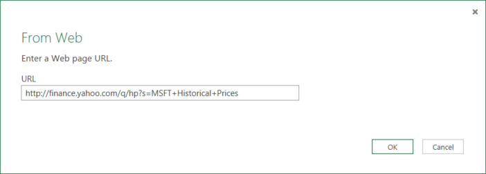
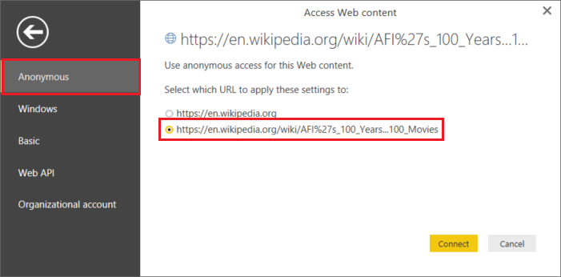
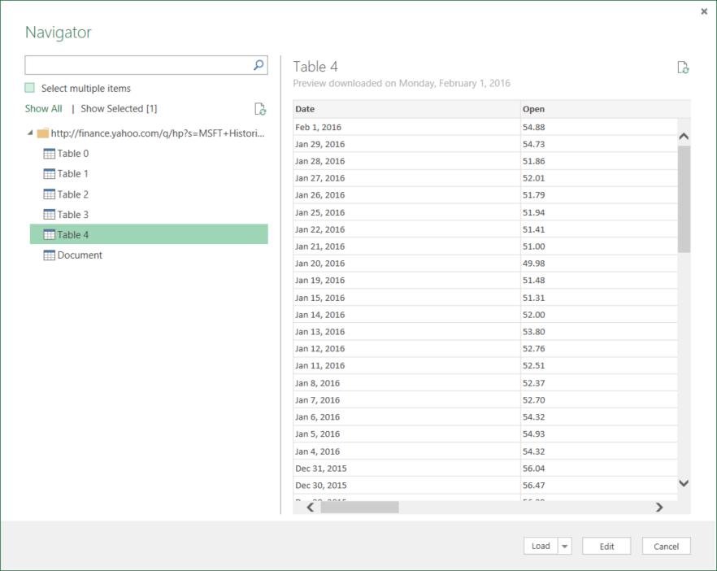

<properties 
	pageTitle="Move data from Web Table | Azure Data Factory" 
	description="Learn about how to move data from on-premises a table in a Web page using Azure Data Factory." 
	services="data-factory" 
	documentationCenter="" 
	authors="spelluru" 
	manager="jhubbard" 
	editor="monicar"/>

<tags 
	ms.service="data-factory" 
	ms.workload="data-services" 
	ms.tgt_pltfrm="na" 
	ms.devlang="na" 
	ms.topic="article" 
	ms.date="07/18/2016" 
	ms.author="spelluru"/>

# Move data from a Web table source using Azure Data Factory
This article outlines how you can use the Copy Activity in an Azure data factory to copy data from a table in a Web page to another data store. This article builds on the [data movement activities](data-factory-data-movement-activities.md) article which presents a general overview of data movement with copy activity and supported data store combinations.

Data factory currently supports only moving data from a Web table to other data stores, but not  moving data from other data stores to a Web table destination.

> [AZURE.NOTE] This Web connector currently only support extracting table content from an HTML page.

## Sample: Copy data from Web table to Azure Blob

The sample below shows:

1.	A linked service of type [Web](#web-linked-service-properties).
2.	A linked service of type [AzureStorage](data-factory-azure-blob-connector.md#azure-storage-linked-service-properties).
3.	An input [dataset](data-factory-create-datasets.md) of type [WebTable](#WebTable-dataset-properties).
4.	An output [dataset](data-factory-create-datasets.md) of type [AzureBlob](data-factory-azure-blob-connector.md#azure-blob-dataset-type-properties).
4.	A [pipeline](data-factory-create-pipelines.md) with Copy Activity that uses [WebSource](#websource-copy-activity-type-properties) and [BlobSink](data-factory-azure-blob-connector.md#azure-blob-copy-activity-type-properties).

The sample copies data from a Web table to an Azure blob every hour. The JSON properties used in these samples are described in sections following the samples. 

The following sample shows how to copy data from a Web table to an Azure blob . However, data can be copied directly to any of the sinks stated in the [Data Movement Activities](data-factory-data-movement-activities.md) article by using the Copy Activity in Azure Data Factory. 

**Web linked service**
This example uses the Web linked service with anonymous authentication. See [Web linked service](#web-linked-service-properties) section for different types of authentication you can use. 

	{
	    "name": "WebLinkedService",
	    "properties":
	    {
	        "type": "Web",
	        "typeProperties":
	        {
	            "authenticationType": "Anonymous",
	            "url" : "https://en.wikipedia.org/wiki/"
	        }
	    }
	}

**Azure Storage linked service**

	{
	  "name": "AzureStorageLinkedService",
	  "properties": {
	    "type": "AzureStorage",
	    "typeProperties": {
	      "connectionString": "DefaultEndpointsProtocol=https;AccountName=<accountname>;AccountKey=<accountkey>"
	    }
	  }
	}

**WebTable input dataset**
Setting **external**  to **true** and specifying **externalData** policy (optional) informs the Data Factory service that the table is external to the data factory and is not produced by an activity in the data factory.

> [AZURE.NOTE] See [Get index of a table in an HTML page](#get-index-of-a-table-in-an-html-page) section for steps to getting index of a table in an HTML page.  

	
	{
	    "name": "WebTableInput",
	    "properties": {
	        "type": "WebTable",
	        "linkedServiceName": "WebLinkedService",
	        "typeProperties": {
	            "index": 1,
	            "path": "AFI's_100_Years...100_Movies"
	        },
	        "external": true,
	        "availability": {
	            "frequency": "Hour",
	            "interval":  1
	        }
	    }
	}

**Azure Blob output dataset**

Data is written to a new blob every hour (frequency: hour, interval: 1). 

	{
	    "name": "AzureBlobOutput",
	    "properties":
	    {
	        "type": "AzureBlob",
	        "linkedServiceName": "AzureStorageLinkedService",
	        "typeProperties":
	        {
	            "folderPath": "adfgetstarted/Movies"
	        },
	        "availability":
	        {
	            "frequency": "Hour",
	            "interval": 1
	        }
	    }
	}

**Pipeline with Copy activity**

The pipeline contains a Copy Activity that is configured to use the above input and output datasets and is scheduled to run every hour. In the pipeline JSON definition, the **source** type is set to **WebSource** and **sink** type is set to **BlobSink**. 

See [WebSource type properties](#websource-copy-activity-type-properties) for the list of properties supported by the WebSource. 
	
	{  
	    "name":"SamplePipeline",
	    "properties":{  
	    "start":"2014-06-01T18:00:00",
	    "end":"2014-06-01T19:00:00",
	    "description":"pipeline with copy activity",
	    "activities":[  
	      {
	        "name": "WebTableToAzureBlob",
	        "description": "Copy from a Web table to an Azure blob",
	        "type": "Copy",
	        "inputs": [
	          {
	            "name": "WebTableInput"
	          }
	        ],
	        "outputs": [
	          {
	            "name": "AzureBlobOutput"
	          }
	        ],
	        "typeProperties": {
	          "source": {
	            "type": "WebSource"
	          },
	          "sink": {
	            "type": "BlobSink"
	          }
	        },
	       "scheduler": {
	          "frequency": "Hour",
	          "interval": 1
	        },
	        "policy": {
	          "concurrency": 1,
	          "executionPriorityOrder": "OldestFirst",
	          "retry": 0,
	          "timeout": "01:00:00"
	        }
	      }
	      ]
	   }
	}

## Web Linked Service properties

The following table provides description for JSON elements specific to Web linked service.

| Property | Description | Required |
| -------- | ----------- | -------- | 
| type | The type property must be set to: **Web** | Yes | 
| Url | URL to the Web source | Yes |
| authenticationType | Anonymous or Basic. | Yes |
| userName | Username for Basic authentication. | Yes (for Basic Authentication)
| password | Password for Basic authentication. | Yes (for Basic Authentication)

### Using Anonymous authentication

	{
	    "name": "web",
	    "properties":
	    {
	        "type": "Web",
	        "typeProperties":
	        {
	            "authenticationType": "Anonymous",
	            "url" : "https://en.wikipedia.org/wiki/"
	        }
	    }
	}

### Using Basic authentication
	
	{
	    "name": "web",
	    "properties":
	    {
	        "type": "Web",
	        "typeProperties":
	        {
	            "authenticationType": "basic",
	            "url" : "http://myit.mycompany.com/",
	            "userName": "Administrator",
	            "password": "password"
	        }
	    }
	}

## WebTable dataset properties

For a full list of sections & properties available for defining datasets, see the [Creating datasets](data-factory-create-datasets.md) article. Sections like structure, availability, and policy of a dataset JSON are similar for all dataset types (Azure SQL, Azure blob, Azure table, etc...).

The **typeProperties** section is different for each type of dataset and provides information about the location of the data in the data store. The typeProperties section for dataset of type **WebTable** has the following properties

Property | Description | Required
:-------- | :----------- | :--------
type	| type of the dataset. must be set to **WebTable** | Yes
path | A relative URL to the resource that contains the table. | No. When path is not specified, only the URL specified in the linked service definition is used. 
index | The index of the table in the resource. See [Get index of a table in an HTML page](#get-index-of-a-table-in-an-html-page) section for steps to getting index of a table in an HTML page. | Yes

**Example:**

	{
	    "name": "WebTableInput",
	    "properties": {
	        "type": "WebTable",
	        "linkedServiceName": "WebLinkedService",
	        "typeProperties": {
	            "index": 1,
	            "path": "AFI's_100_Years...100_Movies"
	        },
	        "external": true,
	        "availability": {
	            "frequency": "Hour",
	            "interval":  1
	        }
	    }
	}

## WebSource - Copy Activity type properties

For a full list of sections & properties available for defining activities, see the [Creating Pipelines](data-factory-create-pipelines.md) article. Properties like name, description, input and output tables, various policies etc. are available for all types of activities. 

Properties available in the typeProperties section of the activity on the other hand vary with each activity type and in case of Copy activity they vary depending on the types of sources and sinks.

In case of Copy Activity when source is of type **WebSource**, no additional properties are supported at this time. 

## Get index of a table in an HTML page

1. Launch **Excel 2016** and switch to the **Data** tab.  
2. Click **New Query** on the toolbar, point to **From Other Sources** and click **From Web**.
	
	 
3. In the **From Web** dialog box, enter **URL** that you would use in linked service JSON (for example: https://en.wikipedia.org/wiki/) along with path you would specify for the dataset (for example: AFI%27s_100_Years...100_Movies), and click **OK**. 

	 

	URL used in this example: https://en.wikipedia.org/wiki/AFI%27s_100_Years...100_Movies 
4.  If you see **Access Web content** dialog box, select the right **URL**, **authentication**, and click **Connect**. 

	
5.  Click on a **table** item in the tree view to see content from the table and then click **Edit** button at the bottom.  

	 

5. In the **Query Editor** window, click **Advanced Editor** button on the toolbar.

	

6. In the Advanced Editor dialog box, the number next to "Source" is the index.

	 

If you are using Excel 2013, use [Microsoft Power Query for Excel](https://www.microsoft.com/download/details.aspx?id=39379) to get the index. See [Connect to a web page](https://support.office.com/article/Connect-to-a-web-page-Power-Query-b2725d67-c9e8-43e6-a590-c0a175bd64d8) article for details. The steps are similar if you are using [Microsoft Power BI for Desktop](https://powerbi.microsoft.com/desktop/). 

[AZURE.INCLUDE [data-factory-column-mapping](../../includes/data-factory-column-mapping.md)]

[AZURE.INCLUDE [data-factory-structure-for-rectangualr-datasets](../../includes/data-factory-structure-for-rectangualr-datasets.md)]

## Performance and Tuning  
See [Copy Activity Performance & Tuning Guide](data-factory-copy-activity-performance.md) to learn about key factors that impact performance of data movement (Copy Activity) in Azure Data Factory and various ways to optimize it.
