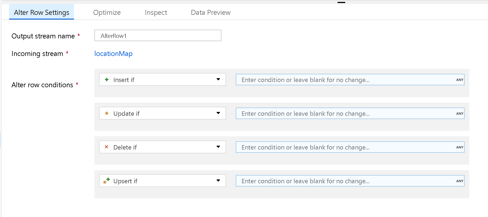
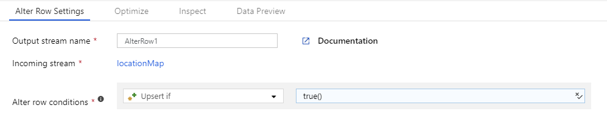
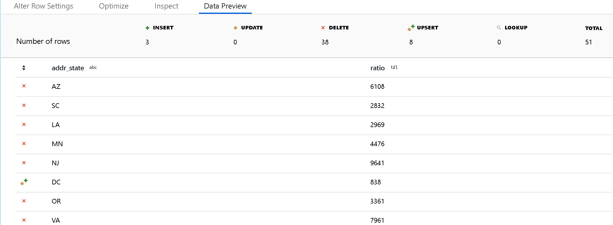

# Alter row transformation in mapping data flow

[!INCLUDE[appliesto-adf-asa-md](includes/appliesto-adf-asa-md.md)]

Use the Alter Row transformation to set insert, delete, update, and upsert policies on rows. You can add one-to-many conditions as expressions. These conditions should be specified in order of priority, as each row will be marked with the policy corresponding to the first-matching expression. Each of those conditions can result in a row (or rows) being inserted, updated, deleted, or upserted. Alter Row can produce both DDL & DML actions against your database.



Alter Row transformations will only operate on database or CosmosDB sinks in your data flow. The actions that you assign to rows (insert, update, delete, upsert) won't occur during debug sessions. Run an Execute Data Flow activity in a pipeline to enact the alter row policies on your database tables.

> [!VIDEO https://www.microsoft.com/en-us/videoplayer/embed/RE4vJYc]

## Specify a default row policy

Create an Alter Row transformation and specify a row policy with a condition of `true()`. Each row that doesn't match any of the previously defined expressions will be marked for the specified row policy. By default, each row that doesn't match any conditional expression will be marked for `Insert`.



> [!NOTE]
> To mark all rows with one policy, you can create a condition for that policy and specify the condition as `true()`.

## View policies in data preview

Use [debug mode](concepts-data-flow-debug-mode.md) to view the results of your alter row policies in the data preview pane. A data preview of an alter row transformation won't produce DDL or DML actions against your target.



Each alter row policy is represented by an icon that indicates whether an insert, update, upsert, or deleted action will occur. The top header shows how many rows are affected by each policy in the preview.

## Allow alter row policies in sink

For the alter row policies to work, the data stream must write to a database or Cosmos sink. In the **Settings** tab in your sink, enable which alter row policies are allowed for that sink.


The default behavior is to only allow inserts. To allow updates, upserts, or deletes, check the box in the sink corresponding to that condition. If updates, upserts, or, deletes are enabled, you must specify which key columns in the sink to match on.

> [!NOTE]
> If your inserts, updates, or upserts modify the schema of the target table in the sink, the data flow will fail. To modify the target schema in your database, choose **Recreate table** as the table action. This will drop and recreate your table with the new schema definition.

The sink transformation requires either a single key or a series of keys for unique row identification in your target database. For SQL sinks, set the keys in the sink settings tab. For CosmosDB, set the partition key in the settings and also set the CosmosDB system field "id" in your sink mapping. For CosmosDB, it is mandatory to include the system column "id" for updates, upserts, and deletes.

## Merges and upserts with Azure SQL Database and Synapse

ADF Data Flows supports merges against Azure SQL Database and Synapse database pool (data warehouse) with the upsert option.

However, you may run into scenarios where your target database schema utilized the identity property of key columns. ADF requires you to identify the keys that you will use to match the row values for updates and upserts. But if the target column has the identity property set and you are using the upsert policy, the target database will not allow you to write to the column. You may also run into errors when you try to upsert against a distributed table's distribution column.

Here are ways to fix that:

1. Go to the Sink transformation Settings and set "Skip writing key columns". This will tell ADF to not write the column that you have selected as the key value for your mapping.

2. If that key column is not the column that is causing the issue for identity columns, then you can use the Sink transformation pre-processing SQL option: ```SET IDENTITY_INSERT tbl_content ON```. Then, turn it off with the post-processing SQL property: ```SET IDENTITY_INSERT tbl_content OFF```.

3. For both the identity case and the distribution column case, you can switch your logic from Upsert to using a separate update condition and a separate insert condition using a Conditional Split transformation. This way, you can set the mapping on the update path to ignore the key column mapping.

## Data flow script

### Syntax

```
<incomingStream>
    alterRow(
           insertIf(<condition>?),
           updateIf(<condition>?),
           deleteIf(<condition>?),
           upsertIf(<condition>?),
        ) ~> <alterRowTransformationName>
```

### Example

The below example is an alter row transformation named `CleanData` that takes an incoming stream `SpecifyUpsertConditions` and creates three alter row conditions. In the previous transformation, a column named `alterRowCondition` is calculated that determines whether or not a row is inserted, updated, or deleted in the database. If the value of the column has a string value that matches the alter row rule, it is assigned that policy.

In the Data Factory UX, this transformation looks like the below image:


The data flow script for this transformation is in the snippet below:

```
SpecifyUpsertConditions alterRow(insertIf(alterRowCondition == 'insert'),
	updateIf(alterRowCondition == 'update'),
	deleteIf(alterRowCondition == 'delete')) ~> AlterRow
```

## Next steps

After the Alter Row transformation, you may want to [sink your data into a destination data store](data-flow-sink.md).
