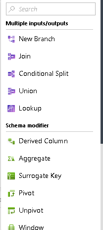
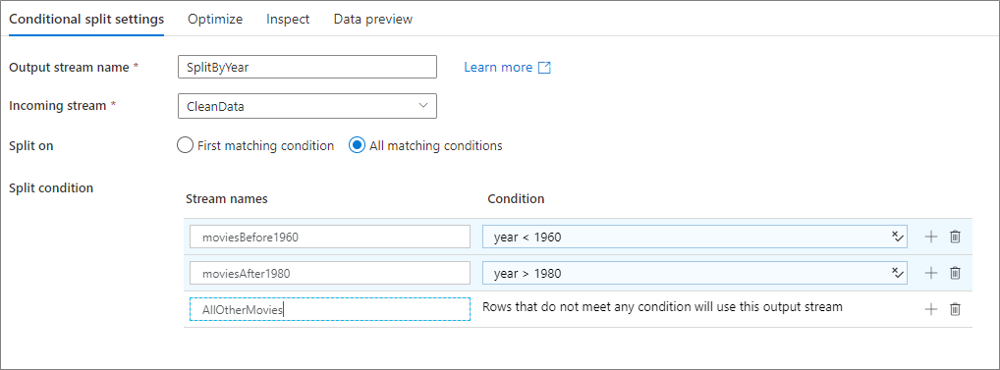
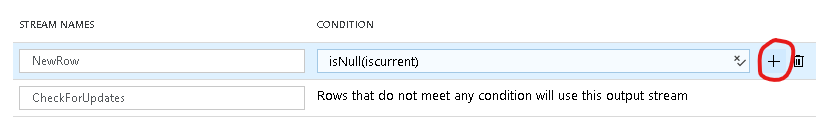

# Mapping data flow conditional split transformation

[!INCLUDE [notes](../../includes/data-factory-data-flow-preview.md)]

The Conditional Split transformation can route data rows to different streams depending on the content of the data. The implementation of the Conditional Split transformation is similar to a CASE decision structure in a programming language. The transformation evaluates expressions, and based on the results, directs the data row to the specified stream. This transformation also provides a default output, so that if a row matches no expression it is directed to the default output.

## Multiple paths

To add additional conditions, select "Add Stream" in the bottom configuration pane and click in the Expression Builder text box to build your expression.

## Next steps

Common data flow transformations used with conditional split: [Join transformation](data-flow-join.md), [Loopup transformation](data-flow-lookup.md), [Select transformation](data-flow-select.md)
