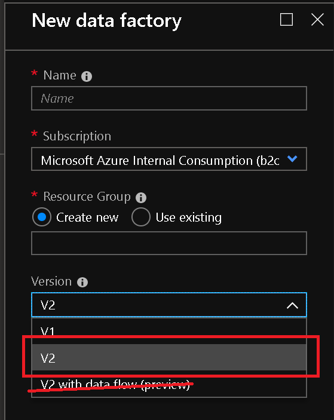

---
title: Create Azure Data Factory Mapping Data Flow
description: Create Azure Data Factory Mapping Data Flow
author: kromerm
ms.author: makromer
ms.reviewer: douglasl
ms.service: data-factory
ms.topic: conceptual
ms.date: 02/12/2019
--- 

# Create Azure Data Factory Data Flow

[!INCLUDE [notes](../../includes/data-factory-data-flow-preview.md)]

Mapping Data Flows in ADF provide a way to transform data at scale without any coding required. Design a data transformation job in the ADF Data Flow designer by constructing a series of Source Transformations, followed by data transformation steps, then sink your results in a Sink Transformation.

Start by creating a new ADF V2 factory from the Azure Portal. After creating your new factory, click on the "Author & Monitor" tile to launch the Data Factory UI.

Once you are in the Data Factory UI, you can use sample Data Flows. The samples are available from the ADF Template Gallery. In ADF, create "Pipeline from Template" and select the Data Flow category from the template gallery.

You will be prompted to enter your Azure Blob Storage account information.

[The data used for these samples can be found here](https://github.com/kromerm/adfdataflowdocs/tree/master/sampledata). Download the sample data and store the files in your Azure Blob storage accounts so that you can execute the samples.

Use the Create Resource "plus sign" button in the ADF UI to create Data Flows

