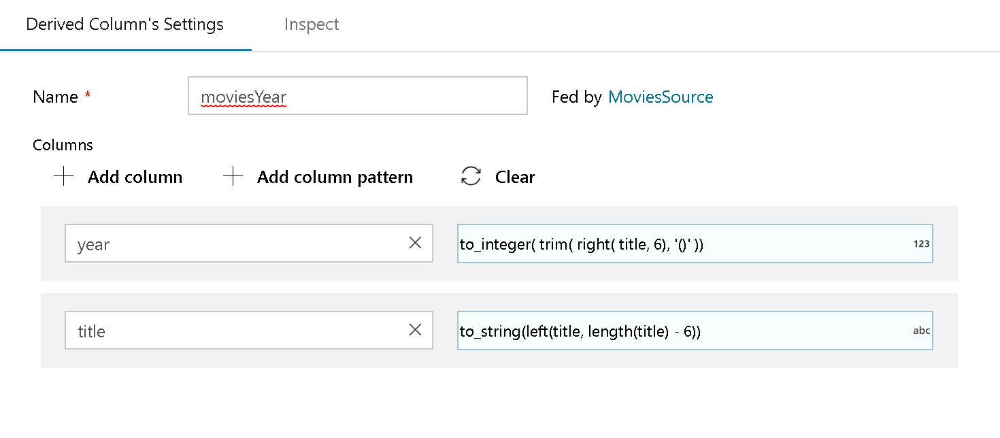
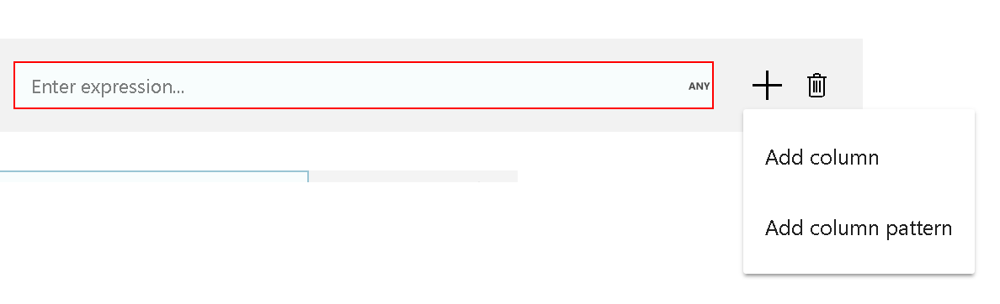

# Derived Column transformation in Mapping Data Flow

[!INCLUDE [notes](../../includes/data-factory-data-flow-preview.md)]

Use the Derived Column transformation to generate new columns in your data flow or to modify existing fields.

## Derived Column settings

To override an existing column, select it via the column dropdown. Otherwise, use the column selection field as a textbox and type in the new column's name. To build the derived column's expression, click on the 'Enter expression' box to open up the [Data Flow Expression Builder](concepts-data-flow-expression-builder.md).

To add additional derived columns, hover over an existing derived column and click '+'. Then, choose either 'Add column' or 'Add column pattern'. Column patterns may come in handy if your column names are variable from your sources. For more information, see [Column Patterns](concepts-data-flow-column-pattern.md).

## Next steps

- Learn more about the [Mapping Data Flow expression language](data-flow-expression-functions.md).
