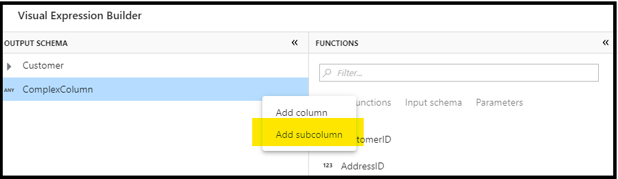
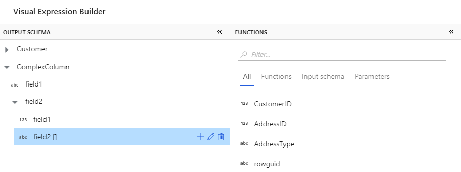
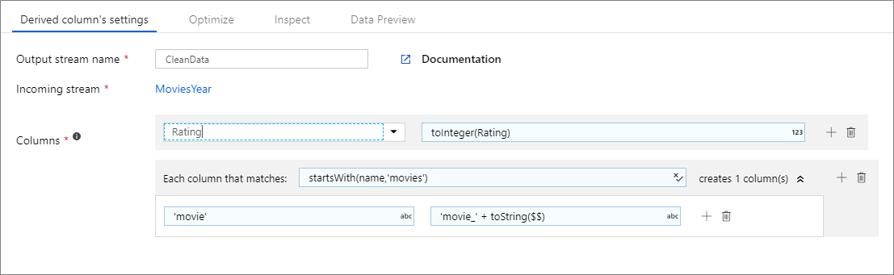

# Derived column transformation in mapping data flow

[!INCLUDE[appliesto-adf-asa-md](includes/appliesto-adf-asa-md.md)]

Use the derived column transformation to generate new columns in your data flow or to modify existing fields.

## Derived column settings

To override an existing column, select it via the column dropdown. Otherwise, use the column selection field as a textbox and type in the new column's name. To build the derived column's expression, click on the 'Enter expression' box to open up the [Data Flow Expression Builder](concepts-data-flow-expression-builder.md).


To add additional derived columns, hover over an existing derived column and click the plus icon. Choose either **Add column** or **Add column pattern**. Column patterns may come in handy if your column names are variable from your sources. For more information, see [Column Patterns](concepts-data-flow-column-pattern.md).


## Build schemas in Output Schema pane

The columns you're modifying and adding to your schema are listed in the Output Schema pane,. You can interactively build simple and complex data structures here. To add additional fields, select **Add column**. To build hierarchies, select **Add subcolumn**.



For more information on handling complex types in data flow, see [JSON handling in mapping data flow](format-json.md#mapping-data-flow-properties).



## Data flow script

### Syntax

```
<incomingStream>
    derive(
           <columnName1> = <expression1>,
           <columnName2> = <expression2>,
           each(
                match(matchExpression),
                <metadataColumn1> = <metadataExpression1>,
                <metadataColumn2> = <metadataExpression2>
               )
          ) ~> <deriveTransformationName>
```

### Example

The below example is a derived column named `CleanData` that takes an incoming stream `MoviesYear` and creates two derived columns. The first derived column replaces column `Rating` with Rating's value as an integer type. The second derived column is a pattern that matches each column whose name starts with 'movies'. For each matched column, it creates a column `movie` that is equal to the value of the matched column prefixed with 'movie_'. 

In the Data Factory UX, this transformation looks like the below image:



The data flow script for this transformation is in the snippet below:

```
MoviesYear derive(
                Rating = toInteger(Rating),
		        each(
                    match(startsWith(name,'movies')),
                    'movie' = 'movie_' + toString($$)
                )
            ) ~> CleanData
```

## Next steps

- Learn more about the [Mapping Data Flow expression language](data-flow-expression-functions.md).
