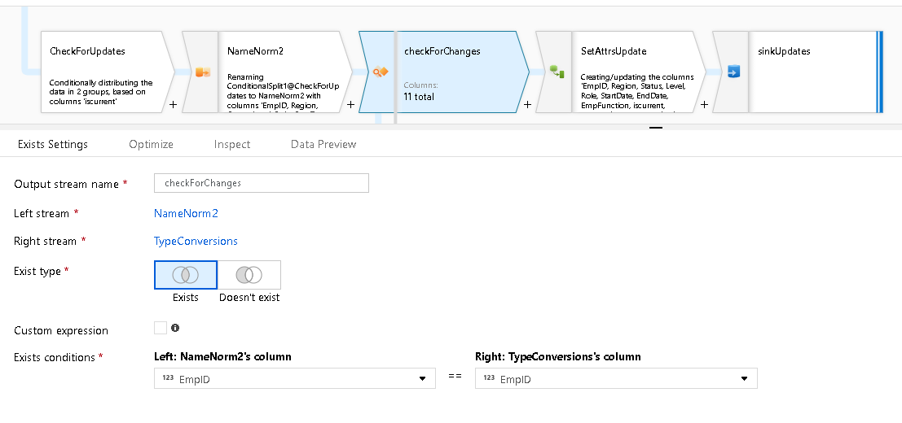
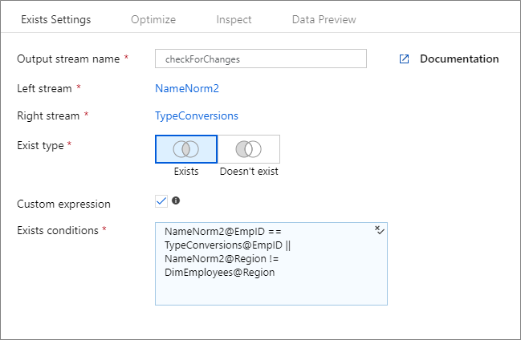

# Mapping data flow exists transformation

[!INCLUDE [notes](../../includes/data-factory-data-flow-preview.md)]

The Exists transformation is a row filtering transformation that stops or allows rows in your data to flow through. The Exists Transform is similar to ```SQL WHERE EXISTS``` and ```SQL WHERE NOT EXISTS```. After the Exists Transformation, the resulting rows from your data stream will either include all rows where column values from source 1 exist in source 2 or do not exist in source 2.



Choose the second source for your Exists so that Data Flow can compare values from Stream 1 against Stream 2.

Select the column from Source 1 and from Source 2 whose values you wish to check against for Exists or Not Exists.

## Multiple exists conditions

Next to each row in your column conditions for Exists, you'll find a + sign available when you hover over reach row. This will allow you to add multiple rows for Exists conditions. Each additional condition is an "And".

## Custom expression



You can click "Custom Expression" to instead create a free-form expression as your exists or not-exists condition. Checking this box will allow you to type in your own expression as a condition.

## Next steps

Similar transformations are [Lookup](data-flow-lookup.md) and [Join](data-flow-join.md).
