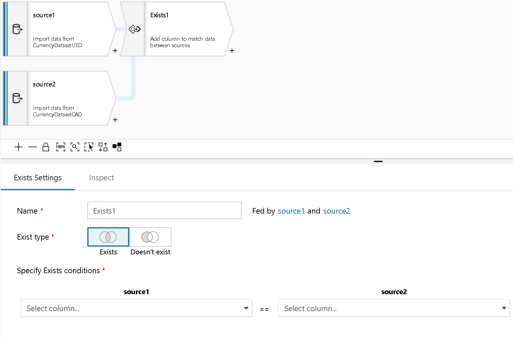

# Azure Data Factory Mapping Data Flow Exists Transformation

[!INCLUDE [notes](../../includes/data-factory-data-flow-preview.md)]

The Exists transformation is a row filtering transformation that stops or allows rows in your data to flow through. The Exists Transform is similar to ```SQL WHERE EXISTS``` and ```SQL WHERE NOT EXISTS```. After a Filter Transformation, the resulting rows from your data stream will either include all rows where column values from source 1 exist in source 2 or do not exist in source 2.



Choose the second source for your Exists so that Data Flow can compare values from Stream 1 against Stream 2.

Select the column from Source 1 and from Source 2 whose values you wish to check against for Exists or Not Exists.
