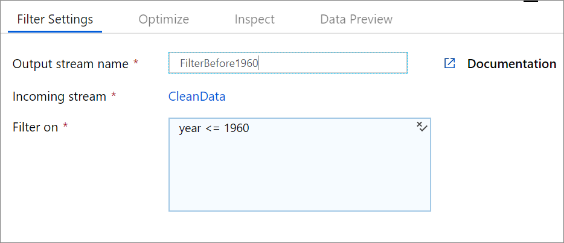

# Filter transformation in mapping data flow

[!INCLUDE[appliesto-adf-asa-md](includes/appliesto-adf-asa-md.md)]

The Filter transforms allows row filtering based upon a condition. The output stream includes all rows that matching the filtering condition. The filter transformation is similar to a WHERE clause in SQL.

> [!VIDEO https://www.microsoft.com/en-us/videoplayer/embed/RE4xnxN]

## Configuration

Use the data flow expression builder to enter an expression for the filter condition. To open the expression builder, click on the blue box. The filter condition must be of type boolean. For more information on how to create an expression, see the [expression builder](concepts-data-flow-expression-builder.md) documentation.



## Data flow script

### Syntax

```
<incomingStream>
    filter(
        <conditionalExpression>
    ) ~> <filterTransformationName>
```

### Example

The below example is a filter transformation named `FilterBefore1960` that takes in incoming stream `CleanData`. The filter condition is the expression `year <= 1960`.

In the Data Factory UX, this transformation looks like the below image:


The data flow script for this transformation is in the snippet below:

```
CleanData
    filter(
        year <= 1960
    ) ~> FilterBefore1960

```

## Next steps

Filter out columns with the [select transformation](data-flow-select.md)
