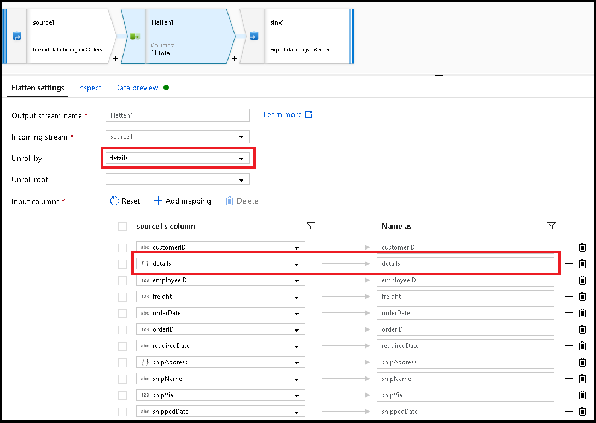

# Flatten transformation in mapping data flow

[!INCLUDE[appliesto-adf-asa-md](includes/appliesto-adf-asa-md.md)]

Use the flatten transformation to take array values inside hierarchical structures such as JSON and unroll them into individual rows. This process is known as denormalization.

## Configuration

The flatten transformation contains the following configuration settings



### Unroll by

Select an array to unroll. The output data will have one row per item in each array. If the unroll by array in the input row is null or empty, there will be one output row with unrolled values as null.

### Unroll root

By default, the flatten transformation unrolls an array to the top of the hierarchy it exists in. You can optionally select an array as your unroll root. The unroll root must be an array of complex objects that either is or contains the unroll by array. If an unroll root is selected, the output data will contain at least one row per items in the unroll root. If the input row doesn't have any items in the unroll root, it will be dropped from the output data. Choosing an unroll root will always output a less than or equal number of rows than the default behavior.

### Flatten mapping

Similar to the select transformation, choose the projection of the new structure from incoming fields and the denormalized array. If a denormalized array is mapped, the output column will be the same data type as the array. If the unroll by array is an array of complex objects that contains subarrays, mapping an item of that subarry will output an array.

Refer to the inspect tab and data preview to verify your mapping output.

## Examples

Refer to the following JSON object for the below examples of the flatten transformation

``` json
{
  "name":"MSFT","location":"Redmond", "satellites": ["Bay Area", "Shanghai"],
  "goods": {
    "trade":true, "customers":["government", "distributer", "retail"],
    "orders":[
        {"orderId":1,"orderTotal":123.34,"shipped":{"orderItems":[{"itemName":"Laptop","itemQty":20},{"itemName":"Charger","itemQty":2}]}},
        {"orderId":2,"orderTotal":323.34,"shipped":{"orderItems":[{"itemName":"Mice","itemQty":2},{"itemName":"Keyboard","itemQty":1}]}}
    ]}}
{"name":"Company1","location":"Seattle", "satellites": ["New York"],
  "goods":{"trade":false, "customers":["store1", "store2"],
  "orders":[
      {"orderId":4,"orderTotal":123.34,"shipped":{"orderItems":[{"itemName":"Laptop","itemQty":20},{"itemName":"Charger","itemQty":3}]}},
      {"orderId":5,"orderTotal":343.24,"shipped":{"orderItems":[{"itemName":"Chair","itemQty":4},{"itemName":"Lamp","itemQty":2}]}}
    ]}}
{"name": "Company2", "location": "Bellevue",
  "goods": {"trade": true, "customers":["Bank"], "orders": [{"orderId": 4, "orderTotal": 123.34}]}}
{"name": "Company3", "location": "Kirkland"}
```

### No unroll root with string array

| Unroll by | Unroll root | Projection |
| --------- | ----------- | ---------- |
| goods.customers | None | name <br> customer = goods.customer |

#### Output

```
{ 'MSFT', 'government'}
{ 'MSFT', 'distributer'}
{ 'MSFT', 'retail'}
{ 'Company1', 'store'}
{ 'Company1', 'store2'}
{ 'Company2', 'Bank'}
{ 'Company3', null}
```

### No unroll root with complex array

| Unroll by | Unroll root | Projection |
| --------- | ----------- | ---------- |
| goods.orders.shipped.orderItems | None | name <br> orderId = goods.orders.orderId <br> itemName = goods.orders.shipped.orderItems.itemName <br> itemQty = goods.orders.shipped.orderItems.itemQty <br> location = location |

#### Output

```
{ 'MSFT', 1, 'Laptop', 20, 'Redmond'}
{ 'MSFT', 1, 'Charger', 2, 'Redmond'}
{ 'MSFT', 2, 'Mice', 2, 'Redmond'}
{ 'MSFT', 2, 'Keyboard', 1, 'Redmond'}
{ 'Company1', 4, 'Laptop', 20, 'Seattle'}
{ 'Company1', 4, 'Charger', 3, 'Seattle'}
{ 'Company1', 5, 'Chair', 4, 'Seattle'}
{ 'Company1', 5, 'Lamp', 2, 'Seattle'}
{ 'Company2', 4, null, null, 'Bellevue'}
{ 'Company3', null, null, null, 'Kirkland'}
```

### Same root as unroll array

| Unroll by | Unroll root | Projection |
| --------- | ----------- | ---------- |
| goods.orders | goods.orders | name <br> goods.orders.shipped.orderItems.itemName <br> goods.customers <br> location |

#### Output

```
{ 'MSFT', ['Laptop','Charger'], ['government','distributer','retail'], 'Redmond'}
{ 'MSFT', ['Mice', 'Keyboard'], ['government','distributer','retail'], 'Redmond'}
{ 'Company1', ['Laptop','Charger'], ['store', 'store2'], 'Seattle'}
{ 'Company1', ['Chair', 'Lamp'], ['store', 'store2'], 'Seattle'}
{ 'Company2', null, ['Bank'], 'Bellevue'}
```

### Unroll root with complex array

| Unroll by | Unroll root | Projection |
| --------- | ----------- | ---------- |
| goods.orders.shipped.orderItem | goods.orders |name <br> orderId = goods.orders.orderId <br> itemName = goods.orders.shipped.orderItems.itemName <br> itemQty = goods.orders.shipped.orderItems.itemQty <br> location = location |

#### Output

```
{ 'MSFT', 1, 'Laptop', 20, 'Redmond'}
{ 'MSFT', 1, 'Charger', 2, 'Redmond'}
{ 'MSFT', 2, 'Mice', 2, 'Redmond'}
{ 'MSFT', 2, 'Keyboard', 1, 'Redmond'}
{ 'Company1', 4, 'Laptop', 20, 'Seattle'}
{ 'Company1', 4, 'Charger', 3, 'Seattle'}
{ 'Company1', 5, 'Chair', 4, 'Seattle'}
{ 'Company1', 5, 'Lamp', 2, 'Seattle'}
{ 'Company2', 4, null, null, 'Bellevue'}
```

## Data flow script

### Syntax

```
<incomingStream>
foldDown(unroll(<unroll cols>),
    mapColumn(
        name,
        each(<array>(type == '<arrayDataType>')),
        each(<array>, match(true())),
        location
    )) ~> <transformationName>
```

### Example

```
source foldDown(unroll(goods.orders.shipped.orderItems, goods.orders),
    mapColumn(
        name,
        orderId = goods.orders.orderId,
        itemName = goods.orders.shipped.orderItems.itemName,
        itemQty = goods.orders.shipped.orderItems.itemQty,
        location = location
    ),
    skipDuplicateMapInputs: false,
    skipDuplicateMapOutputs: false) 
```    

## Next steps

* Use the [Pivot transformation](data-flow-pivot.md) to pivot rows to columns.
* Use the [Unpivot transformation](data-flow-unpivot.md) to pivot columns to rows.
