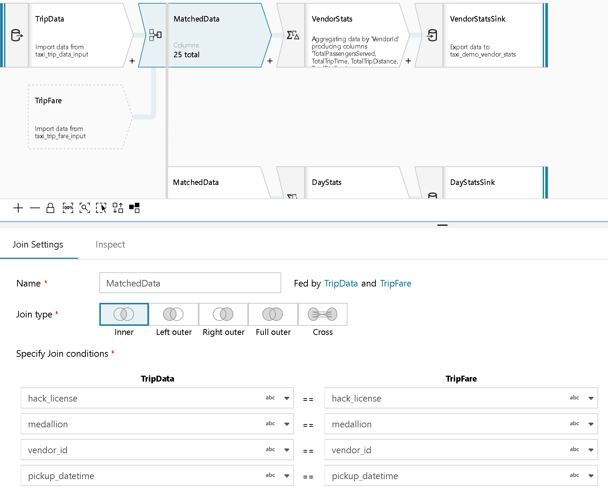
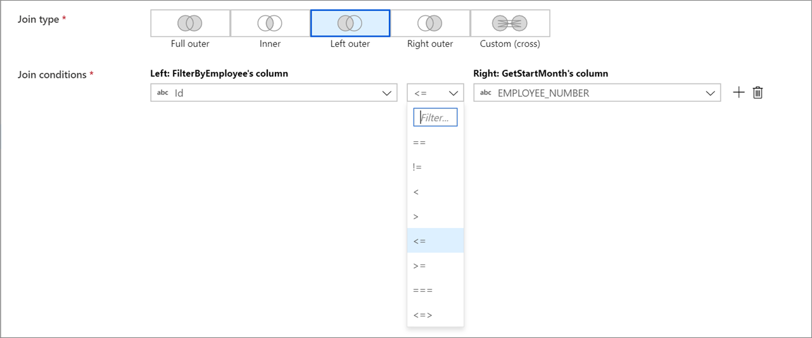
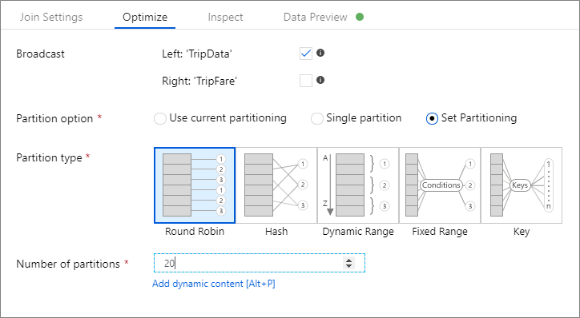
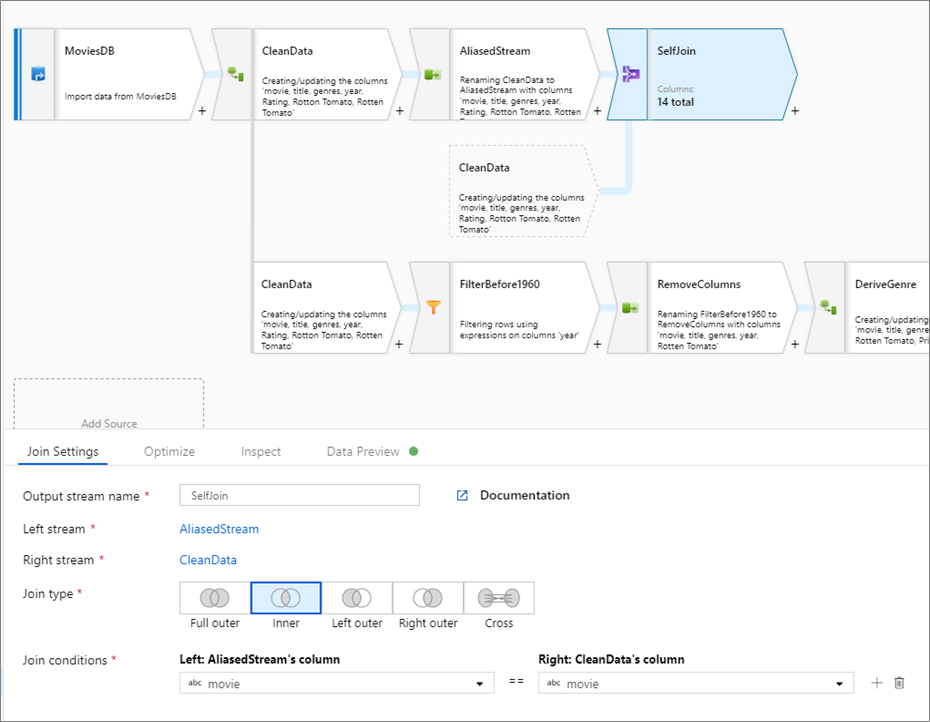
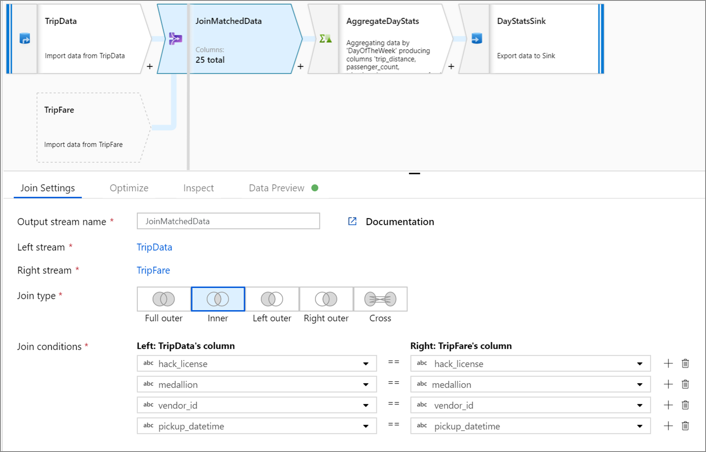
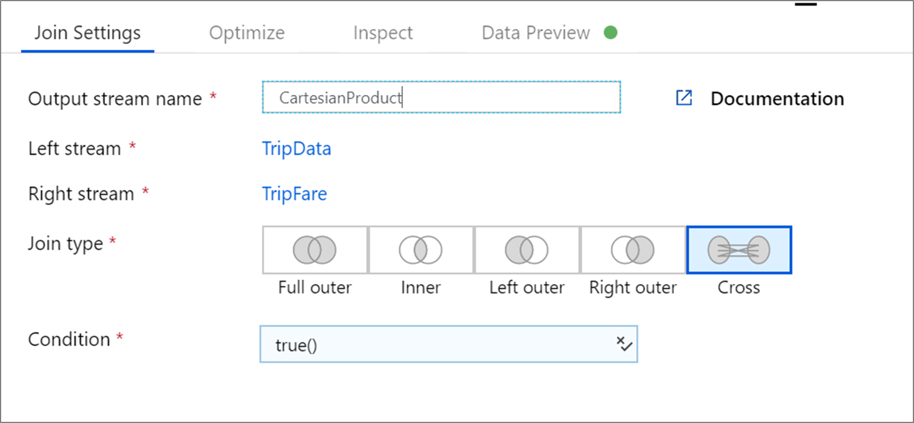

# Join transformation in mapping data flow

[!INCLUDE[appliesto-adf-asa-md](includes/appliesto-adf-asa-md.md)]

Use the join transformation to combine data from two sources or streams in a mapping data flow. The output stream will include all columns from both sources matched based on a join condition. 

## Join types

Mapping data flows currently supports five different join types.

### Inner Join

Inner join only outputs rows that have matching values in both tables.

### Left Outer

Left outer join returns all rows from the left stream and matched records from the right stream. If a row from the left stream has no match, the output columns from the right stream are set to NULL. The output will be the rows returned by an inner join plus the unmatched rows from the left stream.

> [!NOTE]
> The Spark engine used by data flows will occasionally fail due to possible cartesian products in your join conditions. If this occurs, you can switch to a custom cross join and manually enter your join condition. This may result in slower performance in your data flows as the execution engine may need to calculate all rows from both sides of the relationship and then filter rows.

### Right Outer

Right outer join returns all rows from the right stream and matched records from the left stream. If a row from the right stream has no match, the output columns from the left stream are set to NULL. The output will be the rows returned by an inner join plus the unmatched rows from the right stream.

### Full Outer

Full outer join outputs all columns and rows from both sides with NULL values for columns that aren't matched.

### Custom cross join

Cross join outputs the cross product of the two streams based upon a condition. If you're using a condition that isn't equality, specify a custom expression as your cross join condition. The output stream will be all rows that meet the join condition.

You can use this join type for non-equi joins and ```OR``` conditions.

If you would like to explicitly produce a full cartesian product, use the Derived Column transformation in each of the two independent streams before the join to create a synthetic key to match on. For example, create a new column in Derived Column in each stream called ```SyntheticKey``` and set it equal to ```1```. Then use ```a.SyntheticKey == b.SyntheticKey``` as your custom join expression.

> [!NOTE]
> Make sure to include at least one column from each side of your left and right relationship in a custom cross join. Executing cross joins with static values instead of columns from each side results in full scans of the entire dataset, causing your data flow to perform poorly.

## Configuration

1. Choose which data stream you're joining with in the **Right stream** dropdown.
1. Select your **Join type**
1. Choose which key columns you want to match on for you join condition. By default, data flow looks for equality between one column in each stream. To compare via a computed value, hover over the column dropdown and select **Computed column**.



### Non-equi joins

To use a conditional operator such as not equals (!=) or greater than (>) in your join conditions, change the operator dropdown between the two columns. Non-equi joins require at least one of the two streams to be broadcasted using **Fixed** broadcasting in the **Optimize** tab.



## Optimizing join performance

Unlike merge join in tools like SSIS, the join transformation isn't a mandatory merge join operation. The join keys don't require sorting. The join operation occurs based on the optimal join operation in Spark, either broadcast or map-side join.



In joins, lookups and exists transformation, if one or both data streams fit into worker node memory, you can optimize performance by enabling **Broadcasting**. By default, the spark engine will automatically decide whether or not to broadcast one side. To manually choose which side to broadcast, select **Fixed**.

It's not recommended to disable broadcasting via the **Off** option unless your joins are running into timeout errors.

## Self-Join

To self-join a data stream with itself, alias an existing stream with a select transformation. Create a new branch by clicking on the plus icon next to a transformation and selecting **New branch**. Add a select transformation to alias the original stream. Add a join transformation and choose the original stream as the **Left stream** and the select transformation as the **Right stream**.



## Testing join conditions

When testing the join transformations with data preview in debug mode, use a small set of known data. When sampling rows from a large dataset, you can't predict which rows and keys will be read for testing. The result is non-deterministic, meaning that your join conditions may not return any matches.

## Data flow script

### Syntax

```
<leftStream>, <rightStream>
    join(
        <conditionalExpression>,
        joinType: { 'inner'> | 'outer' | 'left_outer' | 'right_outer' | 'cross' }
        broadcast: { 'auto' | 'left' | 'right' | 'both' | 'off' }
    ) ~> <joinTransformationName>
```

### Inner join example

The below example is a join transformation named `JoinMatchedData` that takes left stream `TripData` and right stream `TripFare`.  The join condition is the expression `hack_license == { hack_license} && TripData@medallion == TripFare@medallion && vendor_id == { vendor_id} && pickup_datetime == { pickup_datetime}` that returns true if the `hack_license`, `medallion`, `vendor_id`, and `pickup_datetime` columns in each stream match. The `joinType` is `'inner'`. We're enabling broadcasting in only the left stream so `broadcast` has value `'left'`.

In the Data Factory UX, this transformation looks like the below image:



The data flow script for this transformation is in the snippet below:

```
TripData, TripFare
    join(
        hack_license == { hack_license}
        && TripData@medallion == TripFare@medallion
        && vendor_id == { vendor_id}
        && pickup_datetime == { pickup_datetime},
        joinType:'inner',
        broadcast: 'left'
    )~> JoinMatchedData
```

### Custom cross join example

The below example is a join transformation named `JoiningColumns` that takes left stream `LeftStream` and right stream `RightStream`. This transformation takes in two streams and joins together all rows where column `leftstreamcolumn` is greater than column `rightstreamcolumn`. The `joinType` is `cross`. Broadcasting is not enabled `broadcast` has value `'none'`.

In the Data Factory UX, this transformation looks like the below image:



The data flow script for this transformation is in the snippet below:

```
LeftStream, RightStream
    join(
        leftstreamcolumn > rightstreamcolumn,
        joinType:'cross',
        broadcast: 'none'
    )~> JoiningColumns
```

## Next steps

After joining data, create a [derived column](data-flow-derived-column.md) and [sink](data-flow-sink.md) your data to a destination data store.
