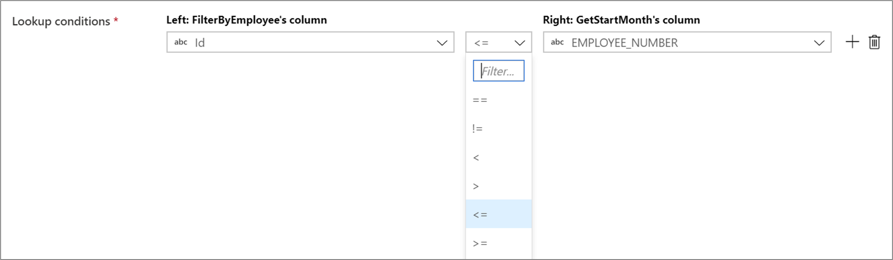
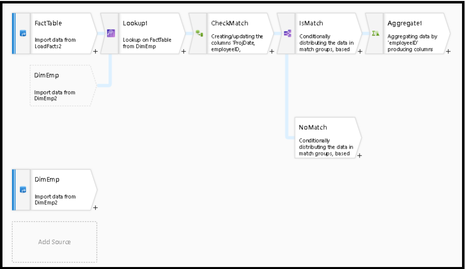
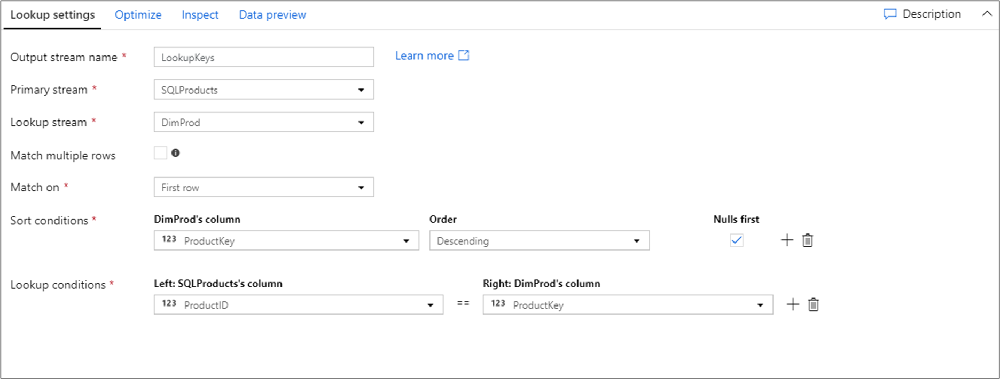

# Lookup transformation in mapping data flow

[!INCLUDE[appliesto-adf-asa-md](includes/appliesto-adf-asa-md.md)]

Use the lookup transformation to reference data from another source in a data flow stream. The lookup transformation appends columns from matched data to your source data.

A lookup transformation is similar to a left outer join. All rows from the primary stream will exist in the output stream with additional columns from the lookup stream.

> [!VIDEO https://www.microsoft.com/en-us/videoplayer/embed/RE4xsVT]

## Configuration


**Primary stream:** The incoming stream of data. This stream is equivalent to the left side of a join.

**Lookup stream:** The data that is appended to the primary stream. Which data is added is determined by the lookup conditions. This stream is equivalent to the right side of a join.

**Match multiple rows:** If enabled, a row with multiple matches in the primary stream will return multiple rows. Otherwise, only a single row will be returned based upon the 'Match on' condition.

**Match on:** Only visible if 'Match multiple rows' is not selected. Choose whether to match on any row, the first match, or the last match. Any row is recommended as it executes the fastest. If first row or last row is selected, you'll be required to specify sort conditions.

**Lookup conditions:** Choose which columns to match on. If the equality condition is met, then the rows will be considered a match. Hover and select 'Computed column' to extract a value using the [data flow expression language](data-flow-expression-functions.md).

The lookup transformation only supports equality matches. To customize the lookup expression to include other operators such as greater than, it's recommended to use a [cross join in the join transformation](data-flow-join.md#custom-cross-join). A cross join will avoid any possible cartesian product errors on execution.

All columns from both streams are included in the output data. To drop duplicate or unwanted columns, add a [select transformation](data-flow-select.md) after your lookup transformation. Columns can also be dropped or renamed in a sink transformation.

### Non-equi joins

To use a conditional operator such as not equals (!=) or greater than (>) in your lookup conditions, change the operator dropdown between the two columns. Non-equi joins require at least one of the two streams to be broadcasted using **Fixed** broadcasting in the **Optimize** tab.



## Analyzing matched rows

After your lookup transformation, the function `isMatch()` can be used to see if the lookup matched for individual rows.



An example of this pattern is using the conditional split transformation to split on the `isMatch()` function. In the example above, matching rows go through the top stream and non-matching rows flow through the ```NoMatch``` stream.

## Testing lookup conditions

When testing the lookup transformation with data preview in debug mode, use a small set of known data. When sampling rows from a large dataset, you can't predict which rows and keys will be read for testing. The result is non-deterministic, meaning that your join conditions may not return any matches.

## Broadcast optimization


In joins, lookups and exists transformation, if one or both data streams fit into worker node memory, you can optimize performance by enabling **Broadcasting**. By default, the spark engine will automatically decide whether or not to broadcast one side. To manually choose which side to broadcast, select **Fixed**.

It's not recommended to disable broadcasting via the **Off** option unless your joins are running into timeout errors.

## Data flow script

### Syntax

```
<leftStream>, <rightStream>
    lookup(
        <lookupConditionExpression>,
        multiple: { true | false },
        pickup: { 'first' | 'last' | 'any' },  ## Only required if false is selected for multiple
        { desc | asc }( <sortColumn>, { true | false }), ## Only required if 'first' or 'last' is selected. true/false determines whether to put nulls first
        broadcast: { 'auto' | 'left' | 'right' | 'both' | 'off' }
    ) ~> <lookupTransformationName>
```
### Example



The data flow script for the above lookup configuration is in the code snippet below.

```
SQLProducts, DimProd lookup(ProductID == ProductKey,
    multiple: false,
    pickup: 'first',
    asc(ProductKey, true),
    broadcast: 'auto')~> LookupKeys
```
## 
Next steps

* The [join](data-flow-join.md) and [exists](data-flow-exists.md) transformations both take in multiple stream inputs
* Use a [conditional split transformation](data-flow-conditional-split.md) with ```isMatch()``` to split rows on matching and non-matching values
