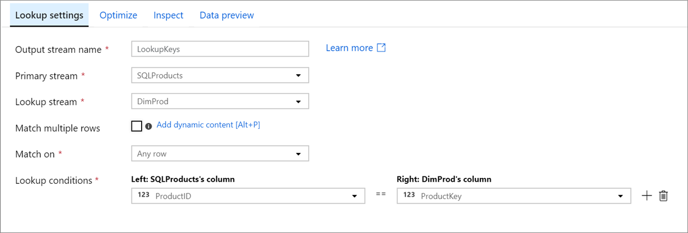
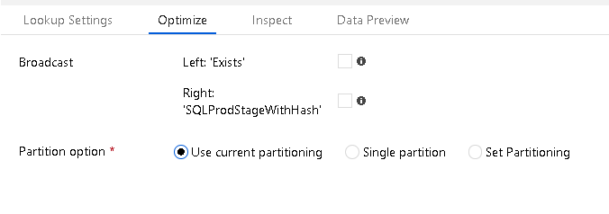

# Azure Data Factory Mapping Data Flow Lookup Transformation

[!INCLUDE [notes](../../includes/data-factory-data-flow-preview.md)]

Use Lookup to add reference data from another source to your Data Flow. The Lookup transform requires a defined source that points to your reference table and matches on key fields.

Select the key fields that you wish to match on between the incoming stream fields and the fields from the reference source. You must first have created a new source on the Data Flow design canvas to use as the right-side for the lookup.

When matches are found, the resulting rows and columns from the reference source will be added to your data flow. You can choose which fields of interest that you wish to include in your Sink at the end of your Data Flow.

## Match / No match

After your Lookup transformation, you can use subsequent transformations to inspect the results of each match row by using the expression function `isMatch()` to make further choices in your logic based on whether or not the Lookup resulted in a row match or not.

## Optimizations

In Data Factory, Data Flows execute in scaled-out Spark environments. If your dataset can fit into worker node memory space, we can optimize your Lookup performance.

### Broadcast join

Select Left and/or Right side broadcast join to request ADF to push the entire dataset from either side of the Lookup relationship into memory.

### Data partitioning

You can also specify partitioning of your data by selecting "Set Partitioning" on the Optimize tab of the Lookup transformation to create sets of data that can fit better into memory per worker.

## Next steps

[Join](data-flow-join.md) and [Exists](data-flow-exists.md) transformations perform similar tasks in ADF Mapping Data Flows. Take a look at those transformations next.
