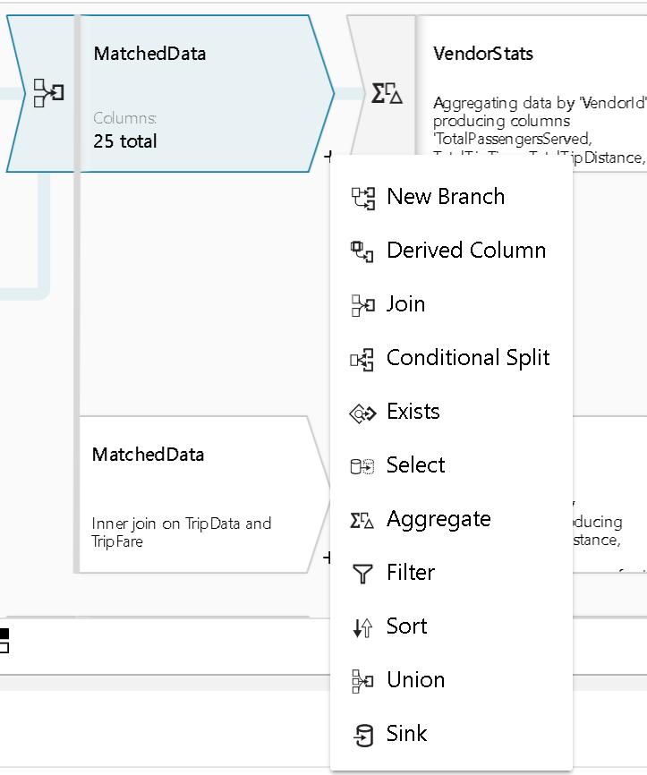
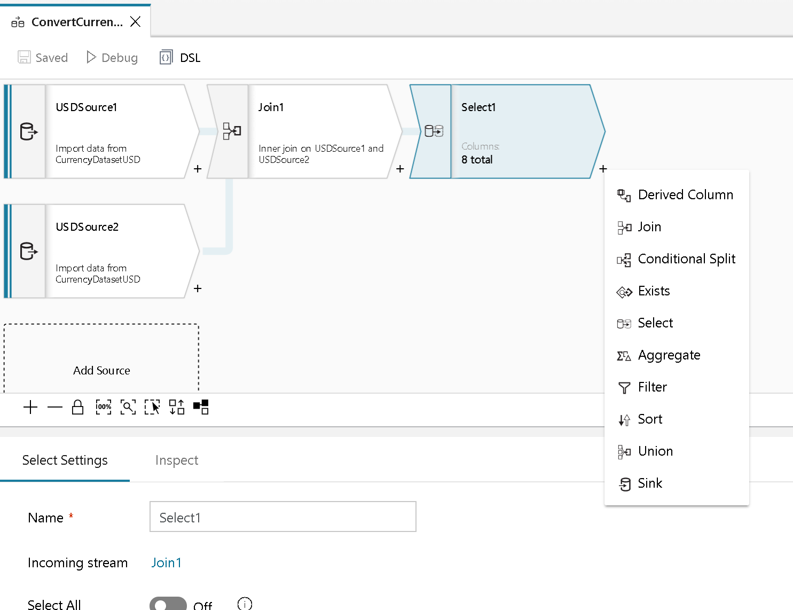

# Azure Data Factory Mapping Data Flow New Branch Transformation

[!INCLUDE [notes](../../includes/data-factory-data-flow-preview.md)]

Branching will take the current data stream in your data flow and replicate it to another stream. Use New Branch to perform multiple sets of operations and transformations against the same data stream.

Example: Your data flow has a Source Transform with a selected set of columns and data type conversions. You then place a Derived Column immediately following that Source. In the Derived Column, you've create a new field that combines first name and last name to make a new "full name" field.

You can treat that new stream with a set of transformations and a sink on one row and use New Branch to create a copy of that stream where you can transform that same data with a different set of transformations. By transforming that copied data in a separate branch, you can subsequently sink that data to a separate location.

> [!NOTE]
> "New Branch" will only show as an action on the + Transformation menu when there is a subsequent transformation following the current location where you are attempting to branch. i.e. You will not see a "New Branch" option at the end here until you add another transformation after the Select

