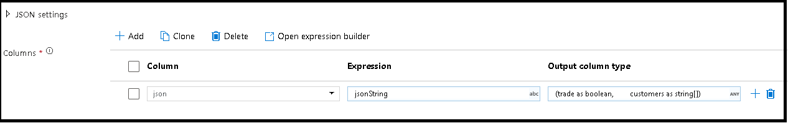
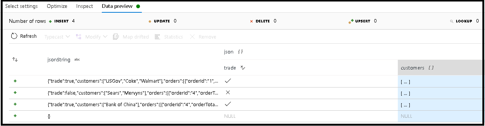

# Parse transformation in mapping data flow

[!INCLUDE[appliesto-adf-asa-md](includes/appliesto-adf-asa-md.md)]

Use the Parse transformation to parse columns in your data that are in document form. The current supported types of embedded documents that can be parsed are JSON, XML, and delimited text.

> [!VIDEO https://www.microsoft.com/en-us/videoplayer/embed/RWykdO]

## Configuration

In the parse transformation configuration panel, you will first pick the type of data contained in the columns that you wish to parse inline. The parse transformation also contains the following configuration settings.



### Column

Similar to derived columns and aggregates, this is where you will either modify an exiting column by selecting it from the drop-down picker. Or you can type in the name of a new column here. ADF will store the parsed source data in this column. In most cases, you will want to define a new column that parses the incoming embedded document field.

### Expression

Use the expression builder to set the source for your parsing. This can be as simple as just selecting the source column with the self-contained data that you wish to parse, or you can create complex expressions to parse.

#### Example expressions

* Source string data: ```chrome|steel|plastic```
  * Expression: ```(desc1 as string, desc2 as string, desc3 as string)```

* Source JSON data: ```{"ts":1409318650332,"userId":"309","sessionId":1879,"page":"NextSong","auth":"Logged In","method":"PUT","status":200,"level":"free","itemInSession":2,"registration":1384448}```
  * Expression: ```(level as string, registration as long)```

* Source XML data: ```<Customers><Customer>122</Customer><CompanyName>Great Lakes Food Market</CompanyName></Customers>```
  * Expression: ```(Customers as (Customer as integer, CompanyName as string))```

### Output column type

Here is where you will configure the target output schema from the parsing that will be written into a single column.



In this example, we have defined parsing of the incoming field "jsonString" which is plain text, but formatted as a JSON structure. We're going to store the parsed results as JSON in a new column called "json" with this schema:

```(trade as boolean, customers as string[])```

Refer to the inspect tab and data preview to verify your output is mapped properly.

## Examples

```
source(output(
		name as string,
		location as string,
		satellites as string[],
		goods as (trade as boolean, customers as string[], orders as (orderId as string, orderTotal as double, shipped as (orderItems as (itemName as string, itemQty as string)[]))[])
	),
	allowSchemaDrift: true,
	validateSchema: false,
	ignoreNoFilesFound: false,
	documentForm: 'documentPerLine') ~> JsonSource
source(output(
		movieId as string,
		title as string,
		genres as string
	),
	allowSchemaDrift: true,
	validateSchema: false,
	ignoreNoFilesFound: false) ~> CsvSource
JsonSource derive(jsonString = toString(goods)) ~> StringifyJson
StringifyJson parse(json = jsonString ? (trade as boolean,
		customers as string[]),
	format: 'json',
	documentForm: 'arrayOfDocuments') ~> ParseJson
CsvSource derive(csvString = 'Id|name|year\n\'1\'|\'test1\'|\'1999\'') ~> CsvString
CsvString parse(csv = csvString ? (id as integer,
		name as string,
		year as string),
	format: 'delimited',
	columnNamesAsHeader: true,
	columnDelimiter: '|',
	nullValue: '',
	documentForm: 'documentPerLine') ~> ParseCsv
ParseJson select(mapColumn(
		jsonString,
		json
	),
	skipDuplicateMapInputs: true,
	skipDuplicateMapOutputs: true) ~> KeepStringAndParsedJson
ParseCsv select(mapColumn(
		csvString,
		csv
	),
	skipDuplicateMapInputs: true,
	skipDuplicateMapOutputs: true) ~> KeepStringAndParsedCsv
```

## Data flow script

### Syntax

### Examples

```
parse(json = jsonString ? (trade as boolean,
                                customers as string[]),
                format: 'json|XML|delimited',
                documentForm: 'singleDocument') ~> ParseJson

parse(csv = csvString ? (id as integer,
                                name as string,
                                year as string),
                format: 'delimited',
                columnNamesAsHeader: true,
                columnDelimiter: '|',
                nullValue: '',
                documentForm: 'documentPerLine') ~> ParseCsv
```    

## Next steps

* Use the [Flatten transformation](data-flow-flatten.md) to pivot rows to columns.
* Use the [Derived column transformation](data-flow-derived-column.md) to pivot columns to rows.
