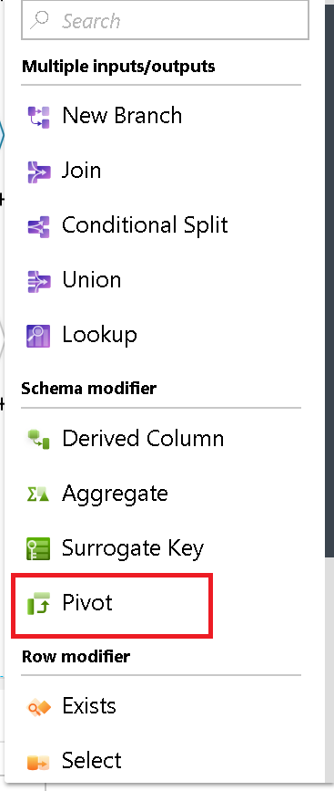

# Azure data factory pivot transformation

Use Pivot in ADF Data Flow as an aggregation where one or more grouping columns has its distinct row values transformed into individual columns. Essentially, you can Pivot row values into new columns (turn data into metadata).

## Group by

First, set the columns that you wish to group by for your pivot aggregation. You can set more than 1 column here with the + sign next to the column list.

## Pivot key

The Pivot Key is the column that ADF will pivot from row to column. By default, each unique value in the dataset for this field will pivot to a column. However, you can optionally enter the values from the dataset that you wish to pivot to column values. This is the column that will determine the new columns that will be created.

## Pivoted columns

Lastly, you will choose the aggregation that you wish to use for the pivoted values and how you would like the columns to be displayed in the new output projection from the transformation.

(Optional) You can set a naming pattern with a prefix, middle, and suffix to be added to each new column name from the row values.

For instance, pivoting "Sales" by "Region" would result in new column values from each sales value, i.e. "25", "50", "1000", etc. However, if you set a prefix value of "Sales-", each column value would add "Sales-" to the beginning of the value.

Setting the Column Arrangement to "Normal" will group together all of the pivoted columns with their aggregated values. Setting the columns arrangement to "Lateral" will alternate between column and value.

### Aggregation

To set the aggregation you wish to use for the pivot values, click on the field at the bottom of the Pivoted Columns pane. You will enter into the ADF Data Flow expression builder where you can build an aggregation expression and provide a descriptive alias name for your new aggregated values.

Use the ADF Data Flow Expression Language to describe the pivoted column transformations in the Expression Builder: https://aka.ms/dataflowexpressions.

## Pivot metadata

The Pivot transformation will produce new column names that are dynamic based on your incoming data. The Pivot Key produces the values for each new column name. If you do not specify individual values and wish to create dynamic column names for each unique value in your Pivot Key, then the UI will not display the metadata in Inspect and there will be no column propagation to the Sink transformation. If you set values for the Pivot Key, then ADF can determine the new column names and those column names will be available to you in the Inspect and Sink mapping.

### Generate a new model from dynamic columns

Pivot generates new column names dynamically based on row values. You can turn those new columns into metadata that can be referenced later in your data flow. To do this, click on the Data Preview tab. All new columns generated by the your Pivot transformation appear with a "drifted" icon in the table header. Click on the "Map drifted" button to turn those new columns into metadata, making them part of your data flow's model.

### Landing new columns in Sink

Even with dynamic column names in Pivot, you can still sink your new column names and values into your destination store. Just set "Allow Schema Drift" to on in your Sink settings. You will not see the new dynamic names in your column metadata, but the schema drift option will allow you to land the data.

### View metadata in design mode

If you wish to view the new column names as metadata in Inspect and you wish to see the columns propagate explicitly to the Sink transformation, then set explicit Values in the Pivot Key tab.

### How to rejoin original fields
The Pivot transformation will only project the columns used in the aggregation, grouping, and pivot action. If you wish to include the other columns from the previous step in your flow, use a New Branch from the previous step and use the self-join pattern to connect the flow with the original metadata.

## Next steps

Try the [unpivot transformation](data-flow-unpivot.md) to turn column values into row values. 
