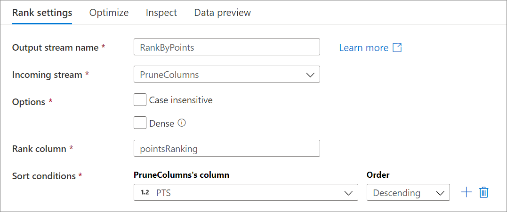

# Rank transformation in mapping data flow 

[!INCLUDE[appliesto-adf-asa-md](includes/appliesto-adf-asa-md.md)]

Use the rank transformation to generate an ordered ranking based upon sort conditions specified by the user. 

## Configuration

Below are the configuration options for the rank transformation.



**Case insensitive:** If a sort column is of type string, case will be factored into the ranking. 

**Dense:** If enabled, the rank column will be dense ranked. This means each rank count will be a consecutive number and rank values will not be skipped in the event of a tie.

**Rank column:** The name of the rank column generated. This column will be of type long.

**Sort conditions:** Choose which columns you are sorting by and in which order the sort happens. The order determines sorting priority.

The above configuration takes incoming basketball data and creates a rank column called 'pointsRanking'. The row with the highest value of the column *PTS* will have a *pointsRanking* value of 1.

## Data flow script

### Syntax

```
<incomingStream>
    rank(
        desc(<sortColumn1>),
        asc(<sortColumn2>),
        ...,
        caseInsensitive: { true | false }
        dense: { true | false }
        output(<rankColumn> as long)
    ) ~> <sortTransformationName<>
```

### Example


The data flow script for the above rank configuration is in the code snippet below.

```
PruneColumns
    rank(
        desc(PTS, true),
        caseInsensitive: false,
        output(pointsRanking as long),
        dense: false
    ) ~> RankByPoints
```

## Next steps

Filter rows based upon the rank values using the [filter transformation](data-flow-filter.md).