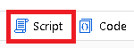
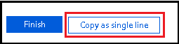

# Data flow script (DFS)

[!INCLUDE[appliesto-adf-asa-md](includes/appliesto-adf-asa-md.md)]

Data flow script (DFS) is the underlying metadata, similar to a coding language, that is used to execute the transformations that are included in a mapping data flow. Every transformation is represented by a series of properties that provide the necessary information to run the job properly. The script is visible and editable from ADF by clicking on the "script" button on the top ribbon of the browser UI.



For instance, `allowSchemaDrift: true,` in a source transformation tells the service to include all columns from the source dataset in the data flow even if they are not included in the schema projection.

## Use cases
The DFS is automatically produced by the user interface. You can click the Script button to view and customize the script. You can also generate scripts outside of the ADF UI and then pass that into the PowerShell cmdlet. When debugging complex data flows, you may find it easier to scan the script code-behind instead of scanning the UI graph representation of your flows.

Here are a few example use cases:
- Programatically producing many data flows that are fairly similar, i.e. "stamping-out" data flows.
- Complex expressions that are difficult to manage in the UI or are resulting in validation issues.
- Debugging and better understanding various errors returned during execution.

When you build a data flow script to use with PowerShell or an API, you must collapse the formatted text into a single line. You can keep tabs and newlines as escape characters. But the text must be formatted to fit inside a JSON property. There is a button on the script editor UI at the bottom that will format the script as a single line for you.



## How to add transforms
Adding transformations requires three basic steps: adding the core transformation data, rerouting the input stream, and then rerouting the output stream. This can be seen easiest in an example.
Let's say we start with a simple source to sink data flow like the following:

```
source(output(
        movieId as string,
        title as string,
        genres as string
    ),
    allowSchemaDrift: true,
    validateSchema: false) ~> source1
source1 sink(allowSchemaDrift: true,
    validateSchema: false) ~> sink1
```

If we decide to add a derive transformation, first we need to create the core transformation text, which has a simple expression to add a new uppercase column called `upperCaseTitle`:
```
derive(upperCaseTitle = upper(title)) ~> deriveTransformationName
```

Then, we take the existing DFS and add the transformation:
```
source(output(
        movieId as string,
        title as string,
        genres as string
    ),
    allowSchemaDrift: true,
    validateSchema: false) ~> source1
derive(upperCaseTitle = upper(title)) ~> deriveTransformationName
source1 sink(allowSchemaDrift: true,
    validateSchema: false) ~> sink1
```

And now we reroute the incoming stream by identifying which transformation we want the new transformation to come after (in this case, `source1`) and copying the name of the stream to the new transformation:
```
source(output(
        movieId as string,
        title as string,
        genres as string
    ),
    allowSchemaDrift: true,
    validateSchema: false) ~> source1
source1 derive(upperCaseTitle = upper(title)) ~> deriveTransformationName
source1 sink(allowSchemaDrift: true,
    validateSchema: false) ~> sink1
```

Finally we identify the transformation we want to come after this new transformation, and replace its input stream (in this case, `sink1`) with the output stream name of our new transformation:
```
source(output(
        movieId as string,
        title as string,
        genres as string
    ),
    allowSchemaDrift: true,
    validateSchema: false) ~> source1
source1 derive(upperCaseTitle = upper(title)) ~> deriveTransformationName
deriveTransformationName sink(allowSchemaDrift: true,
    validateSchema: false) ~> sink1
```

## DFS fundamentals
The DFS is composed of a series of connected transformations, including sources, sinks, and various others which can add new columns, filter data, join data, and much more. Usually, the script with start with one or more sources followed by many transformations and ending with one or more sinks.

Sources all have the same basic construction:
```
source(
  source properties
) ~> source_name
```

For instance, a simple source with three columns (movieId, title, genres) would be:
```
source(output(
        movieId as string,
        title as string,
        genres as string
    ),
    allowSchemaDrift: true,
    validateSchema: false) ~> source1
```

All transformations other than sources have the same basic construction:
```
name_of_incoming_stream transformation_type(
  properties
) ~> new_stream_name
```

For example, a simple derive transformation that takes a column (title) and overwrites it with an uppercase version would be as follows:
```
source1 derive(
  title = upper(title)
) ~> derive1
```

And a sink with no schema would simply be:
```
derive1 sink(allowSchemaDrift: true,
    validateSchema: false) ~> sink1
```

## Script snippets

Script snippets are shareable code of Data Flow Script that you can use to share across data flows. This video below talks about how to use script snippets and utilizing Data Flow Script to copy and paste portions of the script behind your data flow graphs:

> [!VIDEO https://www.microsoft.com/en-us/videoplayer/embed/RE4tA9b]


### Aggregated summary stats
Add an Aggregate transformation to your data flow called "SummaryStats" and then paste in this code below for the aggregate function in your script, replacing the existing SummaryStats. This will provide a generic pattern for data profile summary statistics.

```
aggregate(each(match(true()), $$+'_NotNull' = countIf(!isNull($$)), $$ + '_Null' = countIf(isNull($$))),
		each(match(type=='double'||type=='integer'||type=='short'||type=='decimal'), $$+'_stddev' = round(stddev($$),2), $$ + '_min' = min ($$), $$ + '_max' = max($$), $$ + '_average' = round(avg($$),2), $$ + '_variance' = round(variance($$),2)),
		each(match(type=='string'), $$+'_maxLength' = max(length($$)))) ~> SummaryStats
```
You can also use the below sample to count the number of unique and the number of distinct rows in your data. The example below can be pasted into a data flow with Aggregate transformation called ValueDistAgg. This example uses a column called "title". Be sure to replace "title" with the string column in your data that you wish to use to get value counts.

```
aggregate(groupBy(title),
	countunique = count()) ~> ValueDistAgg
ValueDistAgg aggregate(numofunique = countIf(countunique==1),
		numofdistinct = countDistinct(title)) ~> UniqDist
```

### Include all columns in an aggregate
This is a generic aggregate pattern that demonstrates how you can keep the remaining columns in your output metadata when you are building aggregates. In this case, we use the ```first()``` function to choose the first value in every column whose name is not "movie". To use this, create an Aggregate transformation called DistinctRows and then paste this in your script over top of the existing DistinctRows aggregate script.

```
aggregate(groupBy(movie),
	each(match(name!='movie'), $$ = first($$))) ~> DistinctRows
```

### Create row hash fingerprint 
Use this code in your data flow script to create a new derived column called ```DWhash``` that produces a ```sha1``` hash of three columns.

```
derive(DWhash = sha1(Name,ProductNumber,Color))
```

You can also use this script below to generate a row hash using all columns that are present in your stream, without needing to name each column:

```
derive(DWhash = sha1(columns()))
```

### String_agg equivalent
This code will act like the T-SQL ```string_agg()``` function and will aggregate string values into an array. You can then cast that array into a string to use with SQL destinations.

```
source1 aggregate(groupBy(year),
	string_agg = collect(title)) ~> Aggregate1
Aggregate1 derive(string_agg = toString(string_agg)) ~> DerivedColumn2
```

### Count number of updates, upserts, inserts, deletes
When using an Alter Row transformation, you may want to count the number of updates, upserts, inserts, deletes that result from your Alter Row policies. Add an Aggregate transformation after your alter row and paste this Data Flow Script into the aggregate definition for those counts:

```
aggregate(updates = countIf(isUpdate(), 1),
		inserts = countIf(isInsert(), 1),
		upserts = countIf(isUpsert(), 1),
		deletes = countIf(isDelete(),1)) ~> RowCount
```

## Next steps

Explore Data Flows by starting with the [data flows overview article](concepts-data-flow-overview.md)
