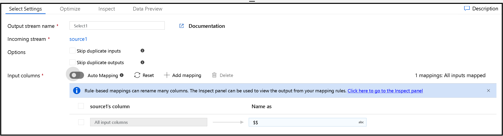
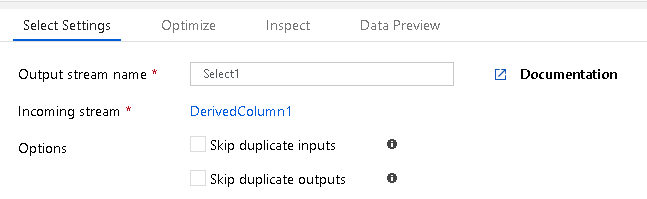

# Mapping data flow select transformation
[!INCLUDE [notes](../../includes/data-factory-data-flow-preview.md)]

Use this transformation for column selectivity (reducing number of columns), alias columns and stream names, and reorder columns.

## How to use Select Transformation
The Select transform allows you to alias an entire stream, or columns in that stream, assign different names (aliases) and then reference those new names later in your data flow. This transform is useful for self-join scenarios. The way to implement a self-join in ADF Data Flow is to take a stream, branch it with "New Branch", then immediately afterward, add a "Select" transform. That stream will now have a new name that you can use to join back to the original stream, creating a self-join:

In the above diagram, the Select transform is at the top. This is aliasing the original stream to "OrigSourceBatting". In the highlighted Join transform below it, you can see that we use this Select alias stream as the right-hand join, allowing us to reference the same key in both the Left & Right side of the Inner Join.

Select can also be used as a way de-select columns from your data flow. For example, if you have 6 columns defined in your sink, but you only wish to pick a specific 3 to transform and then flow to the sink, you can select just those 3 by using the select transform.

## Options
* The default setting for "Select" is to include all incoming columns and keep those original names. You can alias the stream by setting the name of the Select transform.
* To alias individual columns, deselect "Select All" and use the column mapping at the bottom.
* Choose Skip Duplicates to eliminate duplicate columns from Input or Output metadata.

* When you choose to skip duplicates, the results will be visible in the Inspect tab. ADF will keep the first occurrence of the column and you'll see that each subsequent occurrence of that same column has been removed from your flow.

> [!NOTE]
> To clear mapping rules, press the **Reset** button.

## Mapping
By default, the Select transformation will automatically map all columns, which will pass through all incoming columns to the same name on the output. The output stream name that is set in Select Settings will define a new alias name for the stream. If you keep the Select set for auto-map, then you can alias the entire stream with all columns the same.

If you wish to alias, remove, rename, or re-order columns, you must first switch off "auto-map". By default, you will see a default rule entered for you called "All input columns". You can leave this rule in place if you intend to always allow all incoming columns to map to the same name on their output.

However, if you wish to add custom rules, then you will click "Add mapping". Field mapping will provide you with a list of incoming and outgoing column names to map and alias. Choose "rule-based mapping" to create pattern matching rules.

## Rule-based mapping
When you choose rule-based mapping, you are instructing ADF to evaluate your matching expression to match incoming pattern rules and define the outgoing field names. You may add any combination of both field and rule-based mappings. Field names are then generated at runtime by ADF based on incoming metadata from the source. You can view the names of the generated fields during debug and using the data preview pane.

More details on pattern matching is available at the [Column Pattern documentation](concepts-data-flow-column-pattern.md).

## Next steps
* After using Select to rename, reorder, and alias columns, use the [Sink transformation](data-flow-sink.md) to land your data into a data store.
