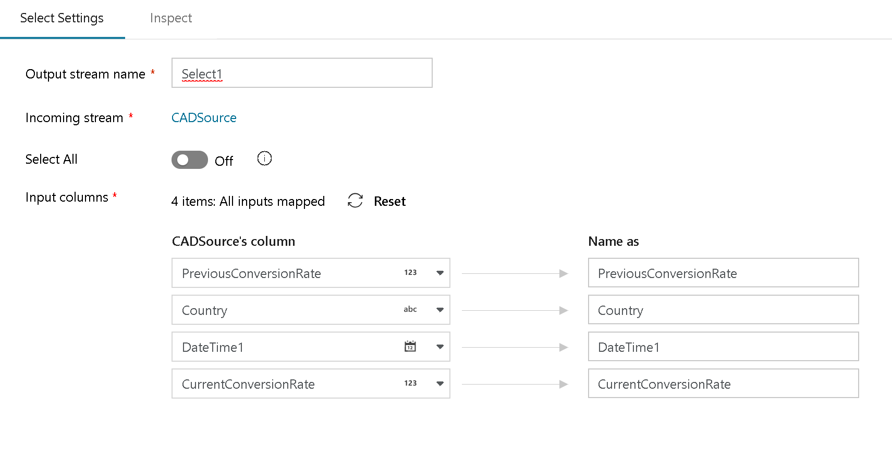

# Azure Data Factory Mapping Data Flow Select Transformation

[!INCLUDE [notes](../../includes/data-factory-data-flow-preview.md)]

Use this transformation for column selectivity (reducing number of columns) or to alias columns and stream names.

The Select transform allows you to alias an entire stream, or columns in that stream, assign different names (aliases) and then reference those new names later in your data flow. This transform is useful for self-join scenarios. The way to implement a self-join in ADF Data Flow is to take a stream, branch it with "New Branch", then immediately afterward, add a "Select" transform. That stream will now have a new name that you can use to join back to the original stream, creating a self-join:

In the above diagram, the Select transform is at the top. This is aliasing the original stream to "OrigSourceBatting". In the higlighted Join transform below it, you can see that we use this Select alias stream as the right-hand join, allowing us to reference the same key in both the Left & Right side of the Inner Join.

Select can also be used as a way de-select columns from your data flow. For example, if you have 6 columns defined in your sink, but you only wish to pick a specific 3 to transform and then flow to the sink, you can select just those 3 by using the select transform.

> [!NOTE]
> You must switch off "Select All" to pick only specific columns

Options

The default setting for "Select" is to include all incoming columns and keep those original names. You can alias the stream by setting the name of the Select transform.

To alias individual columns, deselect "Select All" and use the column mapping at the bottom.

