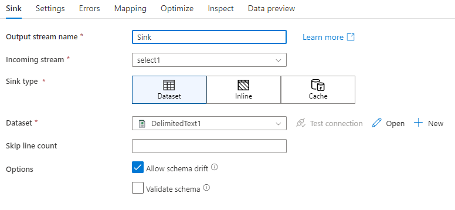
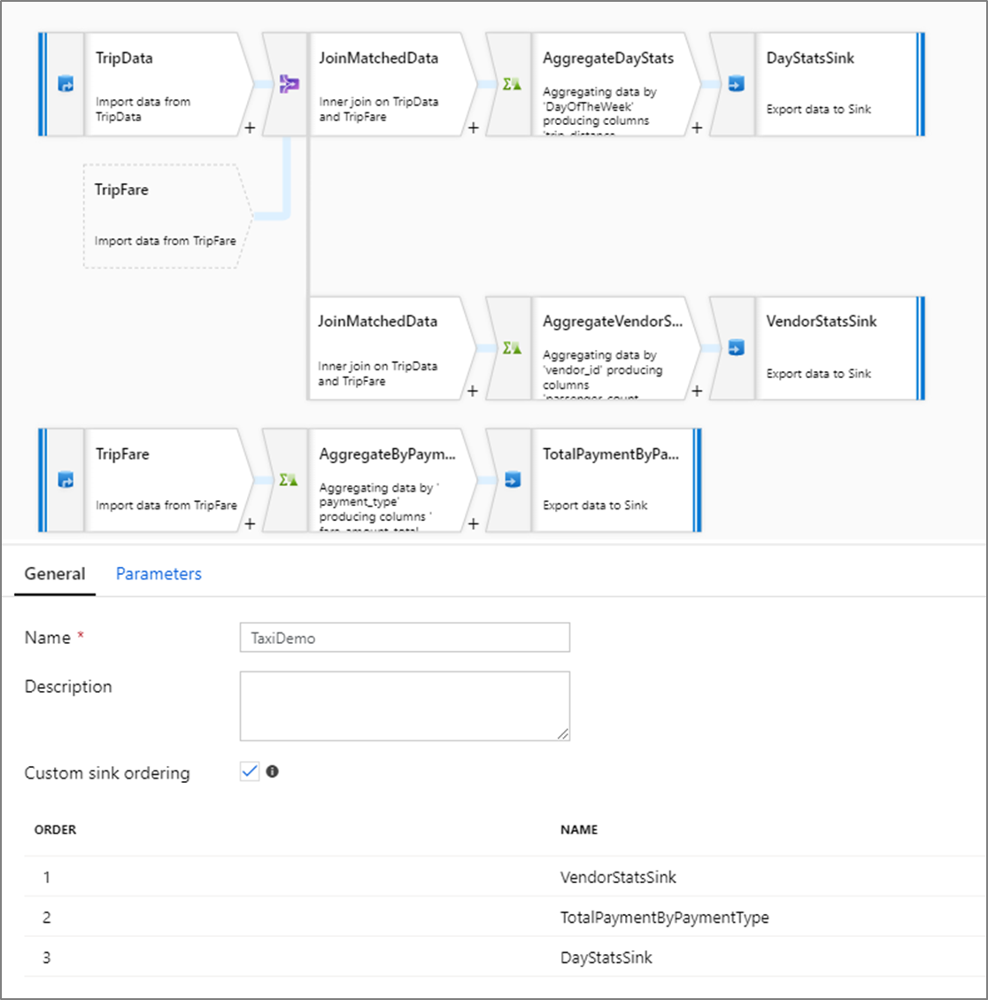

# Sink transformation in mapping data flow

[!INCLUDE[appliesto-adf-asa-md](includes/appliesto-adf-asa-md.md)]

After you finish transforming your data, write it into a destination store using the sink transformation. Every data flow requires at least one sink transformation, but you can write to as many sinks as necessary to complete your transformation flow. To write to additional sinks, create new streams via new branches and conditional splits.

Each sink transformation is associated with exactly one Azure Data Factory dataset object or linked service. The sink transformation determines the shape and location of the data you want to write to.

## Inline datasets

When creating a sink transformation, choose whether your sink information is defined inside a dataset object or within the sink transformation. Most formats are only available in one or the other. Please reference the appropriate connector document to learn how to use a specific connector.

When a format is supported for both inline and in a dataset object, there are benefits to both. Dataset objects are reusable entities that can be leveraged in other data flows and activities such as Copy. These are especially useful when using a hardened schema. Datasets are not based in Spark and occasionally you may need to override certain settings or schema projection in the sink transformation.

Inline datasets are recommended when using flexible schemas, one-off sink instances, or parameterized sinks. If your sink is heavily parameterized, in-line datasets allow you to not create a "dummy" object. Inline datasets are based in spark and their properties are native to data flow.

To use an inline dataset, select the desired format in the **Sink type** selector. Instead of selecting a sink dataset, you select the linked service you wish to connect to.

##   Supported sink types

Mapping Data Flow follows an extract, load, transform (ELT) approach and works with *staging* datasets that are all in Azure. Currently the following datasets can be used in a source transformation:

| Connector | Format | Dataset/inline |
| --------- | ------ | -------------- |
| [Azure Blob Storage](connector-azure-blob-storage.md#mapping-data-flow-properties) | [JSON](format-json.md#mapping-data-flow-properties)   [Avro](format-avro.md#mapping-data-flow-properties)   [Delimited text](format-delimited-text.md#mapping-data-flow-properties)   [Parquet](format-parquet.md#mapping-data-flow-properties) | ✓/-   ✓/-   ✓/-   ✓/- |
| [Azure Data Lake Storage Gen1](connector-azure-data-lake-store.md#mapping-data-flow-properties) | [JSON](format-json.md#mapping-data-flow-properties)   [Avro](format-avro.md#mapping-data-flow-properties)   [Delimited text](format-delimited-text.md#mapping-data-flow-properties)   [Parquet](format-parquet.md#mapping-data-flow-properties)  | ✓/-   ✓/-   ✓/-   ✓/- |
| [Azure Data Lake Storage Gen2](connector-azure-data-lake-storage.md#mapping-data-flow-properties) | [JSON](format-json.md#mapping-data-flow-properties)   [Avro](format-avro.md#mapping-data-flow-properties)   [Delimited text](format-delimited-text.md#mapping-data-flow-properties)   [Parquet](format-parquet.md#mapping-data-flow-properties)    [Common Data Model (preview)](format-common-data-model.md#sink-properties) | ✓/-   ✓/-   ✓/-   ✓/-   -/✓ |
| [Azure Synapse Analytics](connector-azure-sql-data-warehouse.md#mapping-data-flow-properties) | | ✓/- |
| [Azure SQL Database](connector-azure-sql-database.md#mapping-data-flow-properties) | | ✓/- |
| [Azure CosmosDB (SQL API)](connector-azure-cosmos-db.md#mapping-data-flow-properties) | | ✓/- |

Settings  specific to these connectors are located in the **Settings** tab. Information and data flow script examples on these settings are located in the connector documentation. 

Azure Data Factory has access to over [90 native connectors](connector-overview.md). To write data to those other sources from your data flow, use the Copy Activity to load that data from a supported sink.

## Sink settings

Once you have added a sink, configure via the **Sink** tab. Here you can pick or create the dataset your sink writes to. Below is a video explaining a number of different Sink options for text delimited file types:

> [!VIDEO https://www.microsoft.com/videoplayer/embed/RE4tf7T]

**Schema drift:** [Schema Drift](concepts-data-flow-schema-drift.md) is data factory's ability to natively handle flexible schemas in your data flows without needing to explicitly define column changes. Enable **Allow schema drift** to write additional columns on top of what is defined in the sink data schema.

**Validate schema:** If validate schema is selected, the data flow will fail if any column of the incoming source schema is not found in the source projection, or if the data types do not match. Use this setting to enforce that the source data meets the contract of your defined projection. It is very useful in database source scenarios to signal that column names or types have changed.

## Field mapping

Similar to a Select transformation, in the **Mapping** tab of the sink, you can decide which incoming columns will get written. By default, all input columns, including drifted columns, are mapped. This is known as **Auto-mapping**.

When you turn off auto-mapping, you'll have the option to add either fixed column-based mappings or rule-based mappings. Rule-based mappings allow you to write expressions with pattern matching while fixed mapping will map logical and physical column names. For more information on rule-based mapping, see [column patterns in mapping data flow](concepts-data-flow-column-pattern.md#rule-based-mapping-in-select-and-sink).

## Custom sink ordering

By default, data is written to multiple sinks in a nondeterministic order. The execution engine will write data in parallel as the transformation logic is completed and the sink ordering may vary each run. To specify and exact sink ordering, enable **Custom sink ordering** in the general tab of the data flow. When enabled, sinks will be written sequentially in increasing order.

## Data preview in sink

When fetching a data preview on a debug cluster, no data will be written to your sink. A snapshot of what the data looks like will be returned, but nothing will be written to your destination. To test writing data into your sink, run a pipeline debug from the pipeline canvas.

## Next steps
Now that you've created your data flow, add a [Data Flow activity to your pipeline](concepts-data-flow-overview.md).
