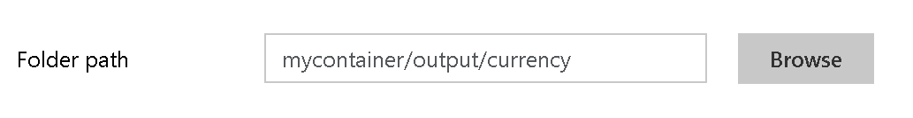
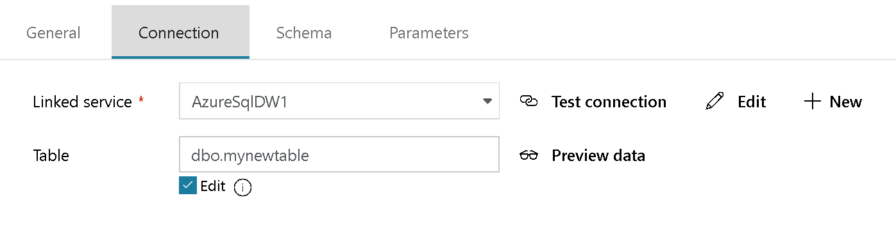
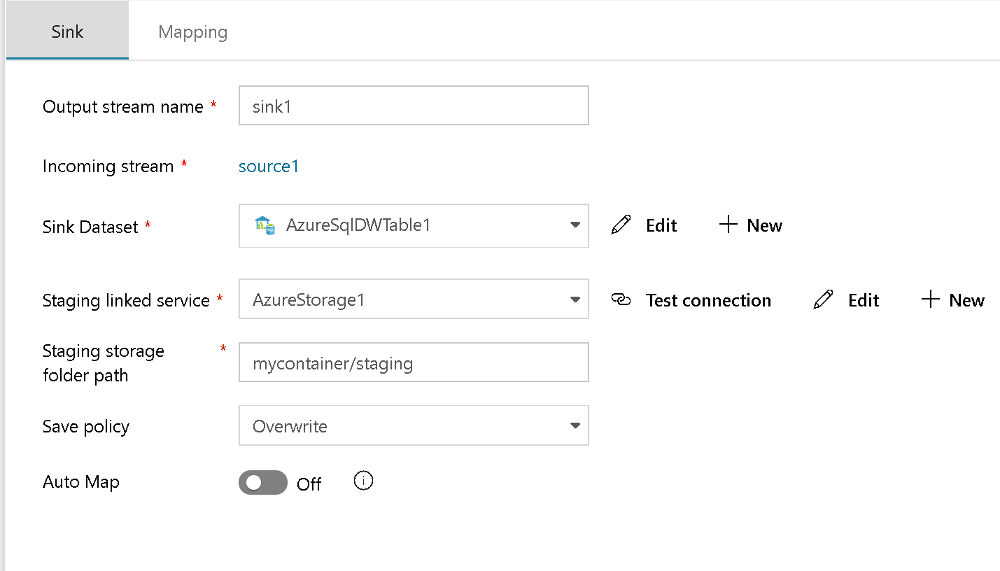

---
title: Azure Data Factory Mapping Data Flow Sink Transformation
description: Azure Data Factory Mapping Data Flow Sink Transformation
author: kromerm
ms.author: makromer
ms.reviewer: douglasl
ms.service: data-factory
ms.topic: conceptual
ms.date: 02/03/2019
--- 

# Azure Data Factory Mapping Data Flow Sink Transformation

[!INCLUDE [notes](../../includes/data-factory-data-flow-preview.md)]

At the completion of your data flow transformation, you can sink your transformed data into a destination dataset. In the Sink transformation, you can choose the dataset definition that you wish to use for the destination output data.

A common practice to account for changing incoming data and to account for schema drift is to sink the output data to a folder without a defined schema in the output dataset. You can additionally account for all column changes in your sources by selecting "Allow Schema Drift" at the Source and then automap all fields in the Sink.

You can choose to overwrite, append, or fail the data flow when sinking to a dataset.

You can also choose "automap" to sink all incoming fields. If you wish to choose the fields that you want to sink to the destination, or if you would like to change the names of the fields at the destination, choose "Off" for "automap" and then click on the Mapping tab to map output fields:

## Output to one File
For Azure Storage Blob or Data Lake sink types, you will output the transformed data into a folder. Spark will generate partitioned output data files based on the partitioning scheme being used in the Sink transform. You can set the partitioning scheme by clicking on the "Optimize" tab. If you would like ADF to merge your output into a single file, click on the "Single Partition" radio button.

## Blob Storage Folder
When Sinking your data transformations to Blob Store, choose a blob *folder* as your destination folder path, not a file. ADF Data Flow will generate the output files for you in that folder.

## Optional Azure SQL Data Warehouse Sink

We are releasing an early beta of the ADW Sink Dataset for Data Flow. This will allow you to land your transformed data directly into Azure SQL DW within Data Flow without the need of adding a Copy Activity in your pipeline.

Start by creating an ADW dataset, just as you would for any other ADF pipeline, with a Linked Service that includes your ADW credentials and choose the database that you wish to connect to. In the table name, either select an existing table or type in the name of the table that you would like Data Flow to automatically create for you from in the incoming fields.

Back on the Sink tranformation (ADW is currently only supported as a Sink) you will choose the ADW Dataset that you created as well as the Storage account you wish to use for staging the data for the Polybase load into ADW. The path field is of the format: "containername/foldername".

### Save Policy

Overwrite will truncate the table if it exists, then recreate it and load the data. Append will insert the new rows. If the table from the Dataset table name does not exist at all in the target ADW, Data Flow will create the table, then load the data.

If you deselect "Auto Map", you can map the fields to your destination table manually.

### Max Concurrent Connections

You can set the maximum concurrent connections in the Sink transformation when writing your data to an Azure database connection.

