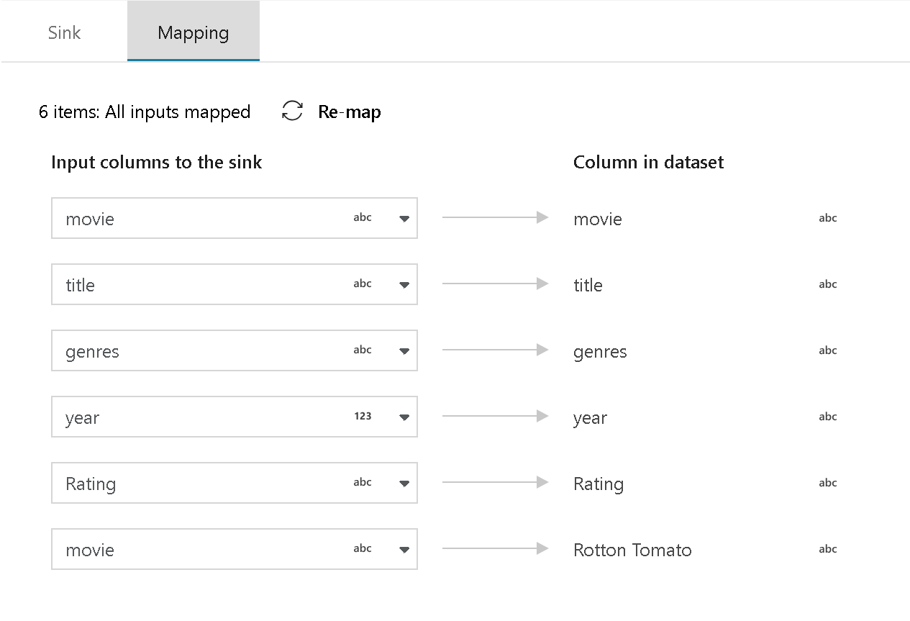
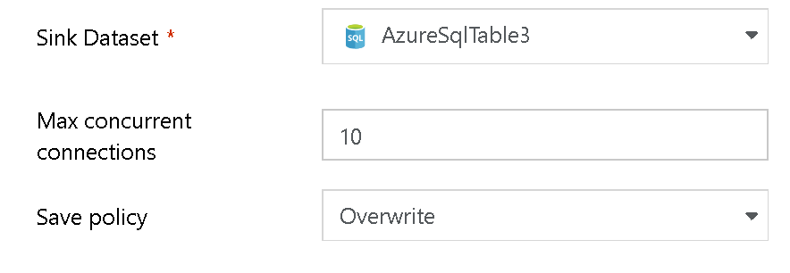
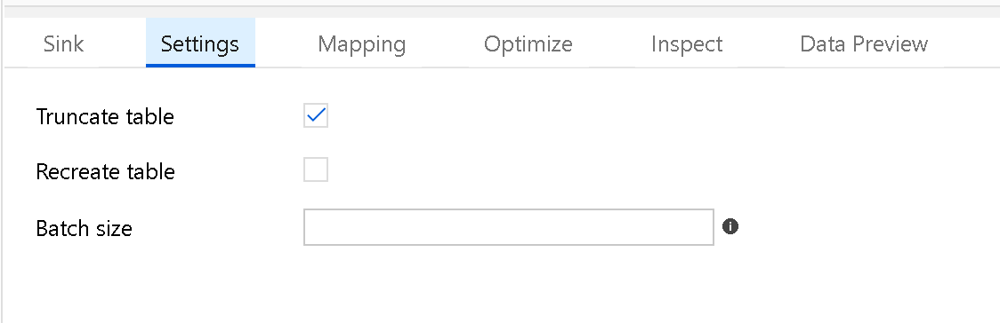

# Mapping Data Flow Sink Transformation

[!INCLUDE [notes](../../includes/data-factory-data-flow-preview.md)]

At the completion of your data flow transformation, you can sink your transformed data into a destination dataset. In the Sink transformation, you can choose the dataset definition that you wish to use for the destination output data. You may have as many Sink transformation as your data flow requires.

A common practice to account for changing incoming data and to account for schema drift is to sink the output data to a folder without a defined schema in the output dataset. You can additionally account for all column changes in your sources by selecting "Allow Schema Drift" at the Source and then automap all fields in the Sink.

You can choose to overwrite, append, or fail the data flow when sinking to a dataset.

You can also choose "automap" to sink all incoming fields. If you wish to choose the fields that you want to sink to the destination, or if you would like to change the names of the fields at the destination, choose "Off" for "automap" and then click on the Mapping tab to map output fields:

## Output to one File
For Azure Storage Blob or Data Lake sink types, you will output the transformed data into a folder. Spark will generate partitioned output data files based on the partitioning scheme being used in the Sink transform. You can set the partitioning scheme by clicking on the "Optimize" tab. If you would like ADF to merge your output into a single file, click on the "Single Partition" radio button.

### Output settings

Overwrite will truncate the table if it exists, then recreate it and load the data. Append will insert the new rows. If the table from the Dataset table name does not exist at all in the target ADW, Data Flow will create the table, then load the data.

If you deselect "Auto Map", you can map the fields to your destination table manually.

#### Field Mapping

On the Mapping tab of your Sink transformation, you can map the incoming (left side) columns to the destination (right side). When you sink data flows to files, ADF will always write new files to a folder. When you map to a database dataset, you can choose to either generate a new table with this schema (set Save Policy to "overwrite") or insert new rows to an existing table and map the fields to the existing schema.

You can use multi-select in the mapping table to Link multiple columns with one click, Delink multiple columns or map multiple rows to the same column name.

If you'd like to reset your columns mappings, press the "Remap" button to reset the mappings.

### Updates to Sink Transformation for ADF V2 GA Version

* Allow Schema Drift and Validate Schema options are now available in Sink. This will allow you to instruct ADF to either fully accept flexible schema definitions (Schema Drift) or fail the Sink if the schema changes (Validate Schema).

* Clear the Folder. ADF will truncate the sink folder contents before writing the destination files in that target folder.

* File name options

   * Default: Allow Spark to name files based on PART defaults
   * Pattern: Enter a name for your output files
   * Per partition: Enter a file name per partition
   * As data in column: Set the output file to the value of a column

> [!NOTE]
> File operations will only execute when you are running the Execute Data Flow activity, not while in Data Flow Debug mode

With the SQL sink types, you can set:

* Truncate table
* Recreate table (performs drop/create)
* Batch size for large data loads. Enter a number to bucket writes into chunks.

## Next steps

Now that you've created your data flow, add an [Execute Data Flow activity to your pipeline](https://docs.microsoft.com/azure/data-factory/concepts-data-flow-overview).
