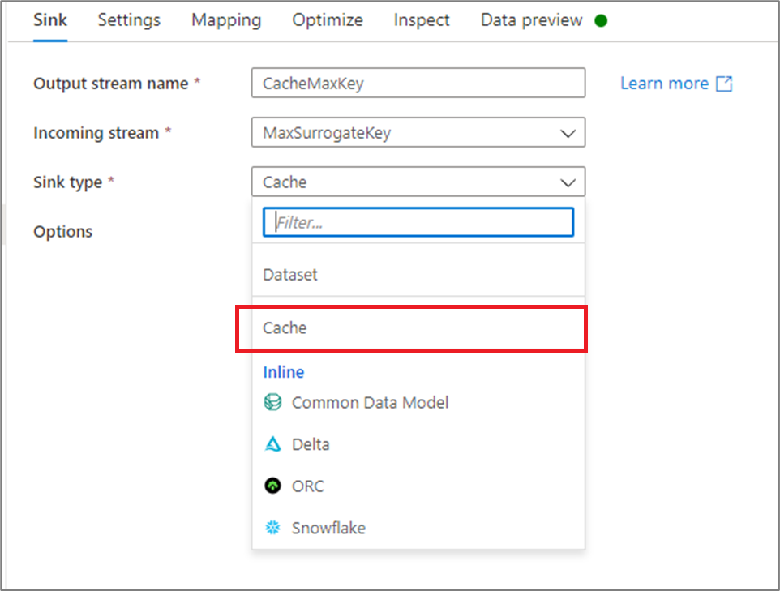
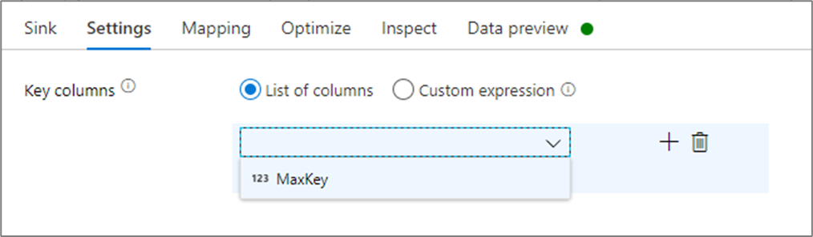

# Sink transformation in mapping data flow

[!INCLUDE[appliesto-adf-asa-md](includes/appliesto-adf-asa-md.md)]

After you finish transforming your data, write it into a destination store by using the sink transformation. Every data flow requires at least one sink transformation, but you can write to as many sinks as necessary to complete your transformation flow. To write to additional sinks, create new streams via new branches and conditional splits.

Each sink transformation is associated with exactly one Azure Data Factory dataset object or linked service. The sink transformation determines the shape and location of the data you want to write to.

## Inline datasets

When you create a sink transformation, choose whether your sink information is defined inside a dataset object or within the sink transformation. Most formats are available in only one or the other. To learn how to use a specific connector, see the appropriate connector document.

When a format is supported for both inline and in a dataset object, there are benefits to both. Dataset objects are reusable entities that can be used in other data flows and activities such as Copy. These reusable entities are especially useful when you use a hardened schema. Datasets aren't based in Spark. Occasionally, you might need to override certain settings or schema projection in the sink transformation.

Inline datasets are recommended when you use flexible schemas, one-off sink instances, or parameterized sinks. If your sink is heavily parameterized, inline datasets allow you to not create a "dummy" object. Inline datasets are based in Spark, and their properties are native to data flow.

To use an inline dataset, select the format you want in the **Sink type** selector. Instead of selecting a sink dataset, you select the linked service you want to connect to.

##   Supported sink types

Mapping data flow follows an extract, load, and transform (ELT) approach and works with *staging* datasets that are all in Azure. Currently, the following datasets can be used in a source transformation.

| Connector | Format | Dataset/inline |
| --------- | ------ | -------------- |
| [Azure Blob Storage](connector-azure-blob-storage.md#mapping-data-flow-properties) | [JSON](format-json.md#mapping-data-flow-properties)   [Avro](format-avro.md#mapping-data-flow-properties)   [Delimited text](format-delimited-text.md#mapping-data-flow-properties)   [Delta (preview)](format-delta.md)   [ORC](format-orc.md#mapping-data-flow-properties)  [Parquet](format-parquet.md#mapping-data-flow-properties) | ✓/-   ✓/-   ✓/-   -/✓  ✓/✓  ✓/- |
| [Azure Data Lake Storage Gen1](connector-azure-data-lake-store.md#mapping-data-flow-properties) | [JSON](format-json.md#mapping-data-flow-properties)   [Avro](format-avro.md#mapping-data-flow-properties)   [Delimited text](format-delimited-text.md#mapping-data-flow-properties)   [ORC](format-orc.md#mapping-data-flow-properties)  [Parquet](format-parquet.md#mapping-data-flow-properties) | ✓/-   ✓/-   ✓/-  ✓/✓  ✓/- |
| [Azure Data Lake Storage Gen2](connector-azure-data-lake-storage.md#mapping-data-flow-properties) | [JSON](format-json.md#mapping-data-flow-properties)   [Avro](format-avro.md#mapping-data-flow-properties)   [Delimited text](format-delimited-text.md#mapping-data-flow-properties)   [Delta (preview)](format-delta.md)   [ORC](format-orc.md#mapping-data-flow-properties)  [Parquet](format-parquet.md#mapping-data-flow-properties)    [Common Data Model (preview)](format-common-data-model.md#sink-properties) | ✓/-   ✓/-   ✓/-   -/✓  ✓/✓  ✓/-   -/✓ |
| [Azure Synapse Analytics](connector-azure-sql-data-warehouse.md#mapping-data-flow-properties) | | ✓/- |
| [Azure SQL Database](connector-azure-sql-database.md#mapping-data-flow-properties) | | ✓/- |
| [Azure SQL Managed Instance (preview)](connector-azure-sql-managed-instance.md#mapping-data-flow-properties) | | ✓/- |
| [Azure Cosmos DB (SQL API)](connector-azure-cosmos-db.md#mapping-data-flow-properties) | | ✓/- |
| [Snowflake](connector-snowflake.md) | | ✓/✓ |

Settings  specific to these connectors are located on the **Settings** tab. Information and data flow script examples on these settings are located in the connector documentation.

Azure Data Factory has access to more than [90 native connectors](connector-overview.md). To write data to those other sources from your data flow, use the Copy Activity to load that data from a supported sink.

## Sink settings

After you've added a sink, configure via the **Sink** tab. Here you can pick or create the dataset your sink writes to. Development values for dataset parameters can be configured in [Debug settings](concepts-data-flow-debug-mode.md). (Debug mode must be turned on.)

The following video explains a number of different sink options for text-delimited file types.

> [!VIDEO https://www.microsoft.com/videoplayer/embed/RE4tf7T]

**Schema drift**: [Schema drift](concepts-data-flow-schema-drift.md) is the ability of Data Factory to natively handle flexible schemas in your data flows without needing to explicitly define column changes. Enable **Allow schema drift** to write additional columns on top of what's defined in the sink data schema.

**Validate schema**: If validate schema is selected, the data flow will fail if any column of the incoming source schema isn't found in the source projection, or if the data types don't match. Use this setting to enforce that the source data meets the contract of your defined projection. It's useful in database source scenarios to signal that column names or types have changed.

**Use TempDB:** By default, Data Factory will use a global temporary table to store data as part of the loading process. You can alternatively uncheck the "Use TempDB" option and instead, ask Data Factory to store the temporary holding table in a user database that is located in the database that is being used for this Sink.

## Cache sink
 
A *cache sink* is when a data flow writes data into the Spark cache instead of a data store. In mapping data flows, you can reference this data within the same flow many times using a *cache lookup*. This is useful when you want to reference data as part of an expression but don't want to explicitly join the columns to it. Common examples where a cache sink can help are looking up a max value on a data store and matching error codes to an error message database. 

To write to a cache sink, add a sink transformation and select **Cache** as the sink type. Unlike other sink types, you don't need to select a dataset or linked service because you aren't writing to an external store. 

In the sink settings, you can optionally specify the key columns of the cache sink. These are used as matching conditions when using the `lookup()` function in a cache lookup. If you specify key columns, you can't use the `outputs()` function in a cache lookup. To learn more about the cache lookup syntax, see [cached lookups](concepts-data-flow-expression-builder.md#cached-lookup).

For example, if I specify a single key column of `column1` in a cache sink called `cacheExample`, calling `cacheExample#lookup()` would have one parameter specifies which row in the cache sink to match on. The function outputs a single complex column with subcolumns for each column mapped.

> [!NOTE]
> A cache sink must be in a completely independent data stream from any transformation referencing it via a cache lookup. A cache sink also must the first sink written. 

## Field mapping

Similar to a select transformation, on the **Mapping** tab of the sink, you can decide which incoming columns will get written. By default, all input columns, including drifted columns, are mapped. This behavior is known as *automapping*.

When you turn off automapping, you can add either fixed column-based mappings or rule-based mappings. With rule-based mappings, you can write expressions with pattern matching. Fixed mapping maps logical and physical column names. For more information on rule-based mapping, see [Column patterns in mapping data flow](concepts-data-flow-column-pattern.md#rule-based-mapping-in-select-and-sink).

## Custom sink ordering

By default, data is written to multiple sinks in a nondeterministic order. The execution engine writes data in parallel as the transformation logic is completed, and the sink ordering might vary each run. To specify an exact sink ordering, enable **Custom sink ordering** on the **General** tab of the data flow. When enabled, sinks are written sequentially in increasing order.

> [!NOTE]
> When utilizing [cached lookups](https://docs.microsoft.com/en-us/azure/data-factory/concepts-data-flow-expression-builder#cached-lookup), make sure that your sink ordering has the cached sinks set to 0.

## Data preview in sink

When fetching a data preview on a debug cluster, no data will be written to your sink. A snapshot of what the data looks like will be returned, but nothing will be written to your destination. To test writing data into your sink, run a pipeline debug from the pipeline canvas.

## Next steps
Now that you've created your data flow, add a [data flow activity to your pipeline](concepts-data-flow-overview.md).
