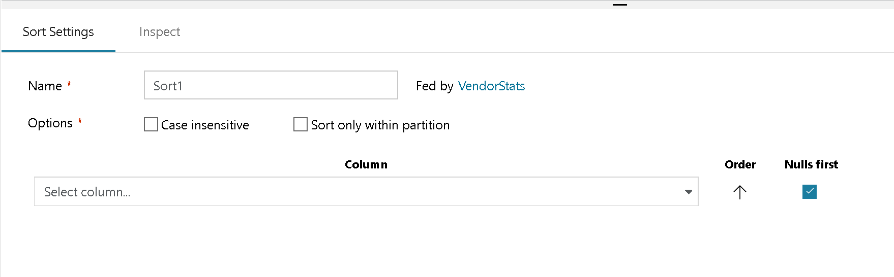

# Sort transformation in mapping data flow

[!INCLUDE[appliesto-adf-asa-md](includes/appliesto-adf-asa-md.md)]

The sort transformation allows you to sort the incoming rows on the current data stream. You can choose individual columns and sort them in ascending or descending order.

> [!NOTE]
> Mapping data flows are executed on spark clusters which distribute data across multiple nodes and partitions. If you choose to repartition your data in a subsequent transformation, you may lose your sorting due to reshuffling of data.

## Configuration



**Case insensitive:** Whether or not you wish to ignore case when sorting string or text fields

**Sort Only Within Partitions:** As data flows are run on spark, each data stream is divided into partitions. This setting sorts data only within the incoming partitions rather than sorting the entire data stream. 

**Sort conditions:** Choose which columns you are sorting by and in which order the sort happens. The order determines sorting priority. Choose whether or not nulls will appear at the beginning or end of the data stream.

### Computed columns

To modify or extract a column value before applying the sort, hover over the column and select "computed column". This will open the expression builder to create an expression for the sort operation instead of using a column value.

## Data flow script

### Syntax

```
<incomingStream>
    sort(
        desc(<sortColumn1>, { true | false }),
        asc(<sortColumn2>, { true | false }),
        ...
    ) ~> <sortTransformationName<>
```

### Example


The data flow script for the above sort configuration is in the code snippet below.

```
BasketballStats sort(desc(PTS, true),
    asc(Age, true)) ~> Sort1
```

## Next steps

After sorting, you may want to use the [Aggregate Transformation](data-flow-aggregate.md)
