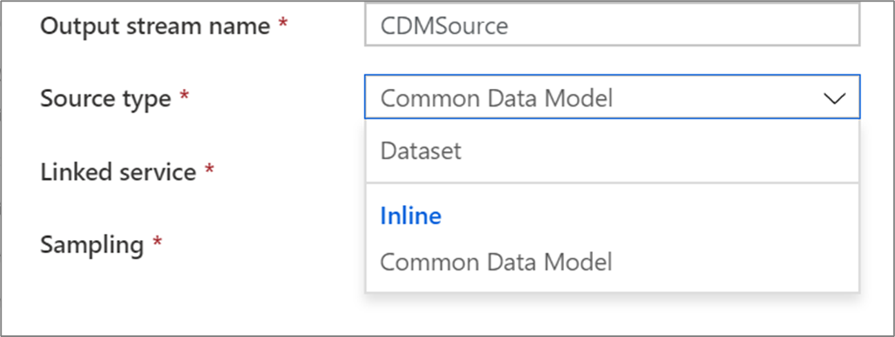
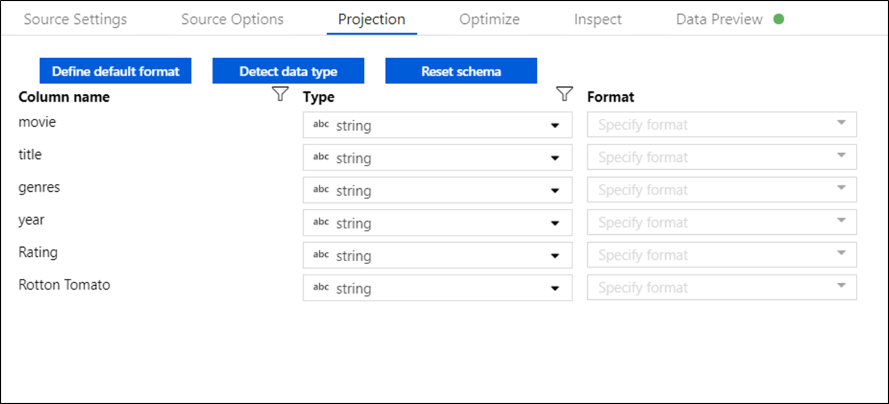

# Source transformation in mapping data flow 

[!INCLUDE[appliesto-adf-asa-md](includes/appliesto-adf-asa-md.md)]

A source transformation configures your data source for the data flow. When designing data flows, your first step will always be configuring a source transformation. To add a source, click on the **Add Source** box in the data flow canvas.

Every data flow requires at least one source transformation, but you can add as many sources as necessary to complete your data transformations. You can join those sources together with a join, lookup, or a union transformation.

Each source transformation is associated with exactly one dataset or linked service. The dataset defines the shape and location of the data you want to write to or read from. If using a file-based dataset, you can use wildcards and file lists in your source to work with more than one file at a time.

## Inline datasets

The first decision you make when creating a source transformation is whether your source information is defined inside a dataset object or within the source transformation. Most formats are only available in one or the other. Please reference the appropriate connector document to learn how to use a specific connector.

When a format is supported for both inline and in a dataset object, there are benefits to both. Dataset objects are reusable entities that can be leveraged in other data flows and activities such as Copy. These are especially useful when using a hardened schema. Datasets are not based in Spark and occasionally you may need to override certain settings or schema projection in the source transformation.

Inline datasets are recommended when using flexible schemas, one-off source instances, or parameterized sources. If your source is heavily parameterized, in-line datasets allow you to not create a "dummy" object. Inline datasets are based in spark and their properties are native to data flow.

To use an inline dataset, select the desired format in the **Source type** selector. Instead of selecting a source dataset, you select the linked service you wish to connect to.

##   Supported source types

Mapping Data Flow follows an extract, load, transform (ELT) approach and works with *staging* datasets that are all in Azure. Currently the following datasets can be used in a source transformation:

| Connector | Format | Dataset/inline |
| --------- | ------ | -------------- |
| [Azure Blob Storage](connector-azure-blob-storage.md#mapping-data-flow-properties) | [JSON](format-json.md#mapping-data-flow-properties)   [Avro](format-avro.md#mapping-data-flow-properties)   [Delimited text](format-delimited-text.md#mapping-data-flow-properties)   [Parquet](format-parquet.md#mapping-data-flow-properties) | ✓/-   ✓/-   ✓/-   ✓/- |
| [Azure Data Lake Storage Gen1](connector-azure-data-lake-store.md#mapping-data-flow-properties) | [JSON](format-json.md#mapping-data-flow-properties)   [Avro](format-avro.md#mapping-data-flow-properties)   [Delimited text](format-delimited-text.md#mapping-data-flow-properties)   [Parquet](format-parquet.md#mapping-data-flow-properties)  | ✓/-   ✓/-   ✓/-   ✓/- |
| [Azure Data Lake Storage Gen2](connector-azure-data-lake-storage.md#mapping-data-flow-properties) | [JSON](format-json.md#mapping-data-flow-properties)   [Avro](format-avro.md#mapping-data-flow-properties)   [Delimited text](format-delimited-text.md#mapping-data-flow-properties)   [Parquet](format-parquet.md#mapping-data-flow-properties)    [Common Data Model (preview)](format-common-data-model.md#source-properties) | ✓/-   ✓/-   ✓/-   ✓/-   -/✓ |
| [Azure Synapse Analytics](connector-azure-sql-data-warehouse.md#mapping-data-flow-properties) | | ✓/- |
| [Azure SQL Database](connector-azure-sql-database.md#mapping-data-flow-properties) | | ✓/- |
| [Azure CosmosDB (SQL API)](connector-azure-cosmos-db.md#mapping-data-flow-properties) | | ✓/- |

Settings  specific to these connectors are located in the **Source options** tab. Information and data flow script examples on these settings are located in the connector documentation. 

Azure Data Factory has access to over [90 native connectors](connector-overview.md). To include data from those other sources in your data flow, use the Copy Activity to load that data into one of the supported staging areas.

## Source settings

Once you have added a source, configure via the **Source Settings** tab. Here you can pick or create the dataset your source points at. You can also select schema and sampling options for your data.

**Output stream name:** The name of the source transformation.

**Source type:** Choose whether you want to use an inline dataset or an existing dataset object.
 
**Test connection:** Test whether or not data flow's spark service can successfully connect to the linked service used in your source dataset. Debug mode must be on for this feature to be enabled.

**Schema drift:** [Schema Drift](concepts-data-flow-schema-drift.md) is data factory's ability to natively handle flexible schemas in your data flows without needing to explicitly define column changes.

* Check the **Allow schema drift** box if the source columns will change often. This setting allows all incoming source fields to flow through the transformations to the sink.

* Choosing **Infer drifted column types** will instruct data factory to detect and define data types for each new column discovered. With this feature turned off, all drifted columns will be of type string.

**Validate schema:** If validate schema is selected, the data flow will fail to run if the incoming source data doesn't match the defined schema of the dataset.

**Skip line count:** The skip line count field specifies how many lines to ignore at the beginning of the dataset.

**Sampling:** Enable sampling to limit the number of rows from your source. Use this setting when you test or sample data from your source for debugging purposes.

To validate your source is configured correctly, turn on debug mode and fetch a data preview. For more information, see [Debug mode](concepts-data-flow-debug-mode.md).

> [!NOTE]
> When debug mode is turned on, the row limit configuration in debug settings will overwrite the sampling setting in the source during data preview.

## Source options

The source options tab contains settings specific to the connector and format chosen. For more information and examples, reference the relevant [connector documentation](#supported-sources).

## Projection

Like schemas in datasets, the projection in a source defines the data columns, types, and formats from the source data. For most dataset types such as SQL and Parquet, the projection in a source is fixed to reflect the schema defined in a dataset. When your source files aren't strongly typed (for example, flat csv files rather than Parquet files), you can define the data types for each field in the source transformation.

If your text file has no defined schema, select **Detect data type** so that Data Factory will sample and infer the data types. Select **Define default format** to autodetect the default data formats.

**Reset schema** resets the projection to what is defined in the referenced dataset.

You can modify the column data types in a down-stream derived-column transformation. Use a select transformation to modify the column names.

### Import schema

The **Import Schema** button on the **Projection** tab allows you to use an active debug cluster to create a schema projection. Available in every source type, importing the schema here will override the projection defined in the dataset. The dataset object will not be changed.

This is useful in datasets like Avro and CosmosDB that support complex data structures do not require schema definitions to exist in the dataset. For inline datasets, this is the only way to reference column metadata without schema drift.

## Optimize the source transformation

The **Optimize** tab allows for editing of partition information at each transformation step. In most cases, **Use current partitioning** will optimize for the ideal partitioning structure for a source.

If you are reading from  an Azure SQL Database source, custom **Source** partitioning will likely read data the fastest. ADF will read large queries by making connections to your database in parallel. This source partitioning can be done on a column or using a query.

For more information on optimization within mapping data flow, see the [Optimize tab](concepts-data-flow-overview.md#optimize).

## Next steps

Begin building your data flow with a [derived-column transformation](data-flow-derived-column.md) and a [select transformation](data-flow-select.md).
