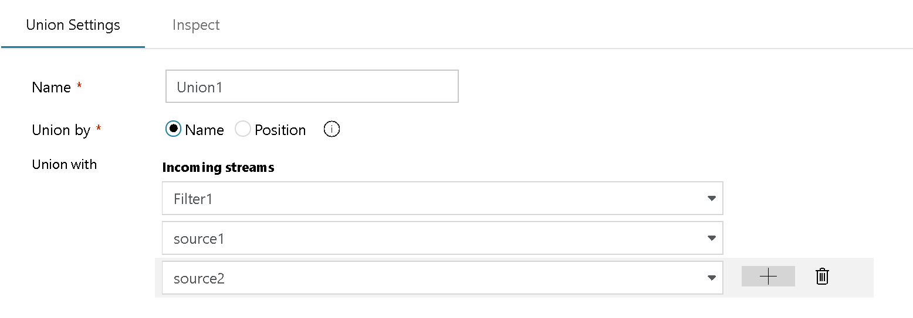
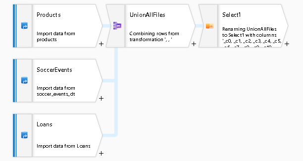
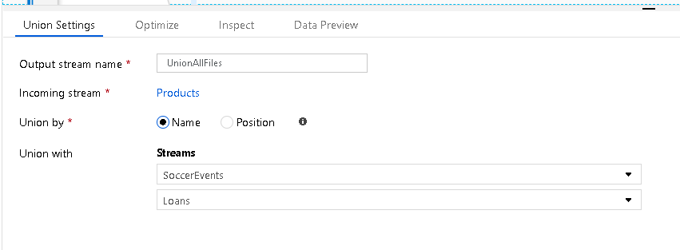
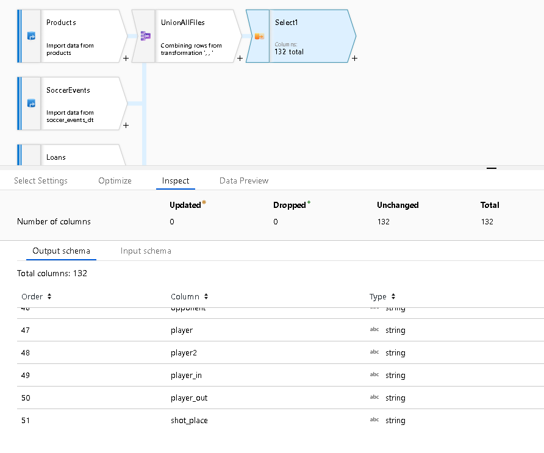
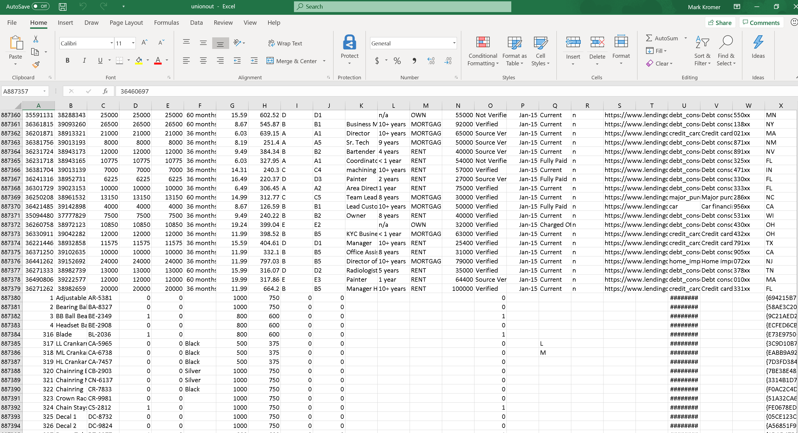

# Mapping data flow union transformation

[!INCLUDE [notes](../../includes/data-factory-data-flow-preview.md)]

Union will combine multiple data streams into one, with the SQL Union of those streams as the new output from the Union transformation. All of the schema from each input stream will be combined inside of your data flow, without needing to have a join key.

You can combine n-number of streams in the settings table by selecting the "+" icon next to each configured row, including both source data as well as streams from existing transformations in your data flow.

In this case, you can combine disparate metadata from multiple sources (in this example, three different source files) and combine them into a single stream:

To achieve this, add additional rows in the Union Settings by including all source you wish to add. There is no need for a common lookup or join key:

If you set a Select transformation after your Union, you will be able to rename overlapping fields or fields that were not named from headerless sources. Click on "Inspect" to see the combine metadata with 132 total columns in this example from three different sources:

## Name and position

When you choose "union by name", each column value will drop into the corresponding column from each source, with a new concatenated metadata schema.

If you choose "union by position", each column value will drop into the original position from each corresponding source, resulting in a new combined stream of data where the data from each source is added to the same stream:

## Next steps

Explore similar transformations including [Join](data-flow-join.md) and [Exists](data-flow-exists.md).
