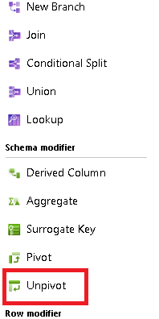
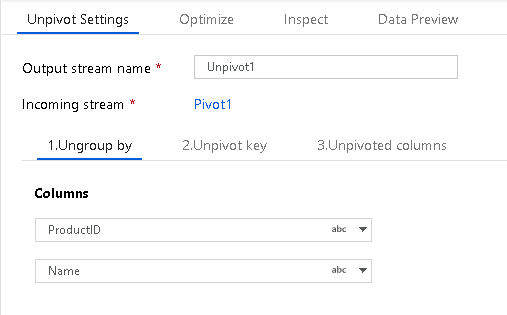
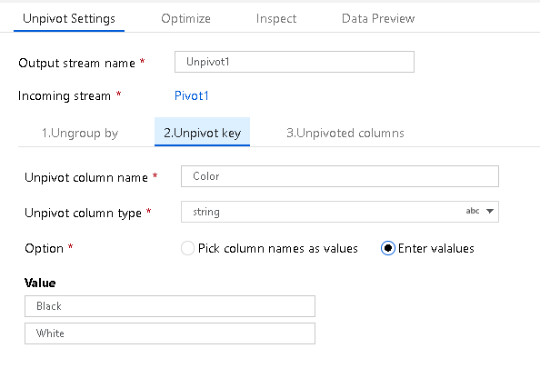
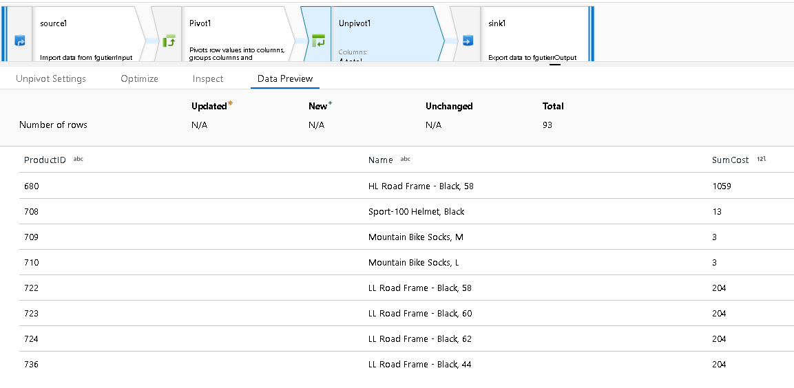
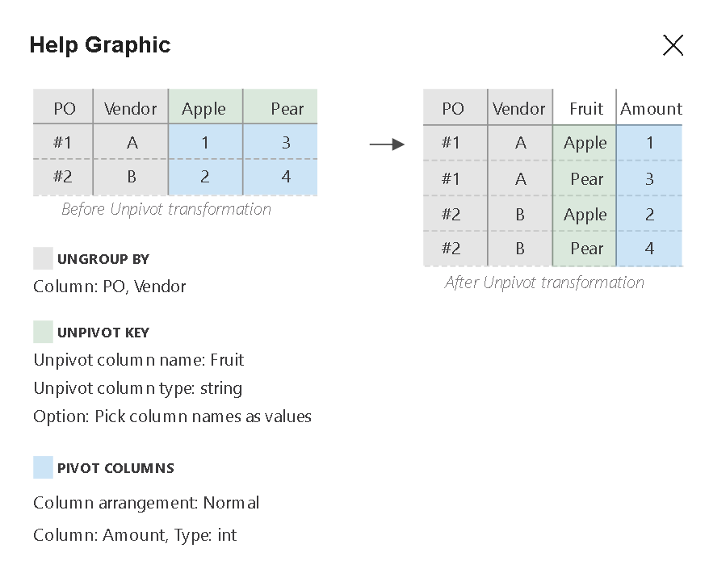

# Azure Data Factory Unpivot Transformation

[!INCLUDE[appliesto-adf-asa-md](includes/appliesto-adf-asa-md.md)]

Use Unpivot in ADF mapping data flow as a way to turn an unnormalized dataset into a more normalized version by expanding values from multiple columns in a single record into multiple records with the same values in a single column.

## Ungroup By

First, set the columns that you wish to group by for your pivot aggregation. Set one or more columns for ungrouping with the + sign next to the column list.

## Unpivot Key

The Pivot Key is the column that ADF will pivot from row to column. By default, each unique value in the dataset for this field will pivot to a column. However, you can optionally enter the values from the dataset that you wish to pivot to column values.

## Unpivoted Columns

Lastly, choose the aggregation that you wish to use for the pivoted values and how you would like the columns to be displayed in the new output projection from the transformation.

(Optional) You can set a naming pattern with a prefix, middle, and suffix to be added to each new column name from the row values.

For instance, pivoting "Sales" by "Region" would simply give you new column values from each sales value. For example: "25", "50", "1000", ... However, if you set a prefix value of "Sales", then "Sales" will be prefixed to the values.

Setting the Column Arrangement to "Normal" will group together all of the pivoted columns with their aggregated values. Setting the columns arrangement to "Lateral" will alternate between column and value.

The final unpivoted data result set shows the column totals now unpivoted into separate row values.

## Next steps

Use the [Pivot transformation](data-flow-pivot.md) to pivot rows to columns.
