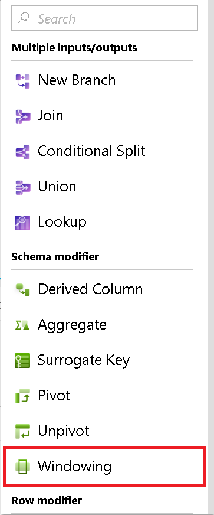
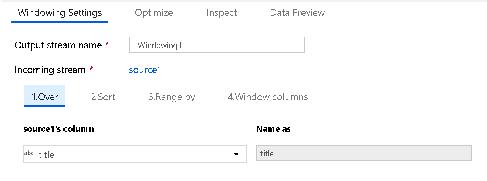
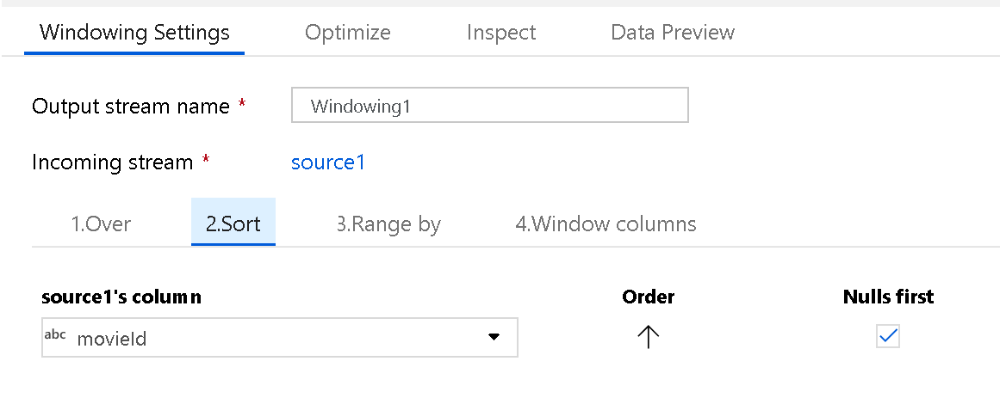
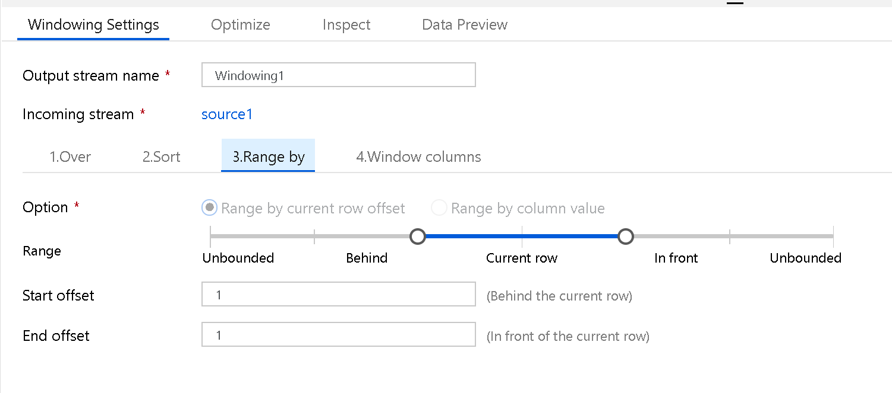

# Window transformation in mapping data flow

[!INCLUDE[appliesto-adf-asa-md](includes/appliesto-adf-asa-md.md)]

The Window transformation is where you will define window-based aggregations of columns in your data streams. In the Expression Builder, you can define different types of aggregations that are based on data or time windows (SQL OVER clause) such as LEAD, LAG, NTILE, CUMEDIST, RANK, etc.). A new field will be generated in your output that includes these aggregations. You can also include optional group-by fields.



> [!VIDEO https://www.microsoft.com/videoplayer/embed/RE4IAVu]

## Over
Set the partitioning of column data for your window transformation. The SQL equivalent is the ```Partition By``` in the Over clause in SQL. If you wish to create a calculation or create an expression to use for the partitioning, you can do that by hovering over the column name and select "computed column".



## Sort
Another part of the Over clause is setting the ```Order By```. This will set the data sort ordering. You can also create an expression for a calculate value in this column field for sorting.



## Range By
Next, set the window frame as Unbounded or Bounded. To set an unbounded window frame, set the slider to Unbounded on both ends. If you choose a setting between Unbounded and Current Row, then you must set the Offset start and end values. Both values will be positive integers. You can use either relative numbers or values from your data.

The window slider has two values to set: the values before the current row and the values after the current row. The Start and End offset matches the two selectors on the slider.



## Window columns
Lastly, use the Expression Builder to define the aggregations you wish to use with the data windows such as RANK, COUNT, MIN, MAX, DENSE RANK, LEAD, LAG, etc.


The full list of aggregation and analytical functions available for you to use in the ADF Data Flow Expression Language via the Expression Builder are listed here: https://aka.ms/dataflowexpressions.

## Next steps

If you are looking for a simple group-by aggregation, use the [Aggregate transformation](data-flow-aggregate.md)
