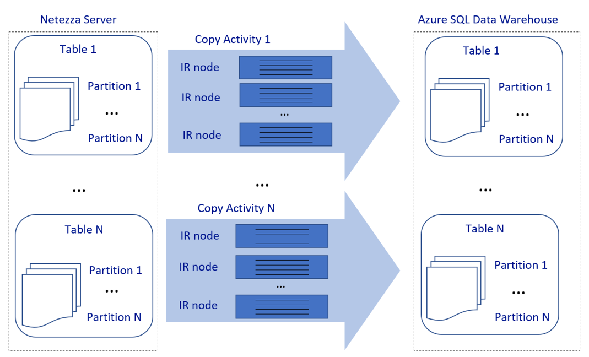
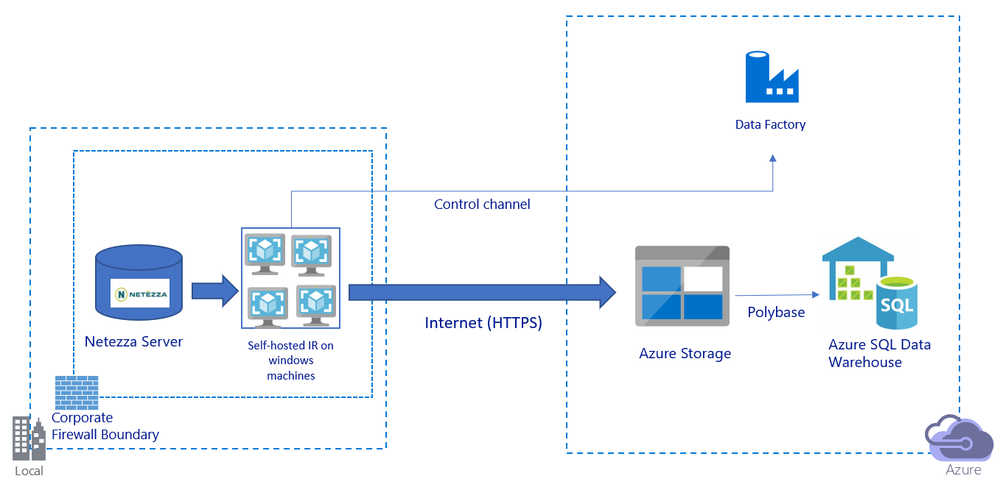
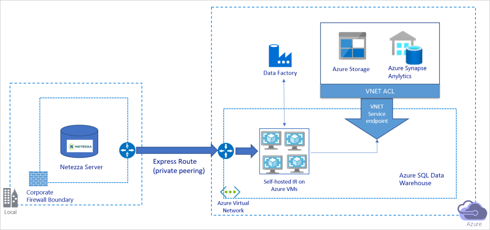
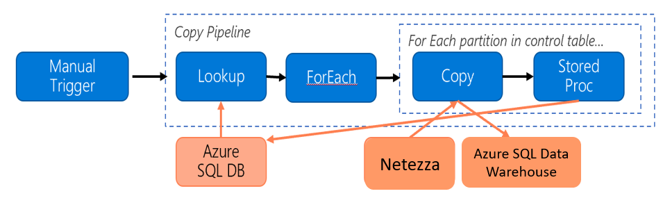
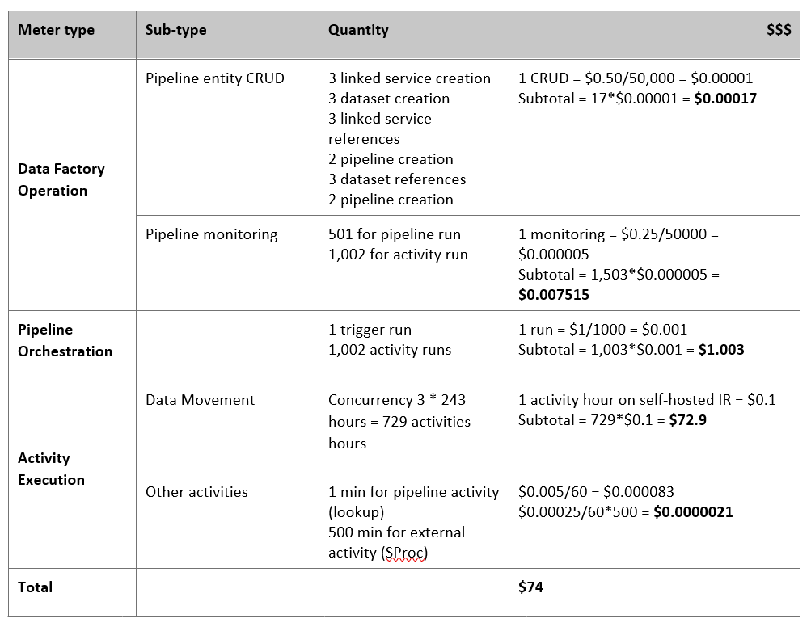

# Use Azure Data Factory to migrate data from an on-premises Netezza server to Azure 

[!INCLUDE[appliesto-adf-xxx-md](includes/appliesto-adf-xxx-md.md)]

Azure Data Factory provides a performant, robust, and cost-effective mechanism to migrate data at scale from an on-premises Netezza server to your Azure storage account or Azure SQL Data Warehouse database. 

This article provides the following information for data engineers and developers:

> [!div class="checklist"]
> * Performance​ 
> * Copy resilience
> * Network security
> * High-level solution architecture 
> * Implementation best practices  

## Performance

Azure Data Factory offers a serverless architecture that allows parallelism at various levels. If you're a developer, this means you can build pipelines to fully use both network and database bandwidth to maximize data movement throughput for your environment.

The preceding diagram can be interpreted as follows:

- A single copy activity can take advantage of scalable compute resources. When you use Azure Integration Runtime, you can specify [up to 256 DIUs](https://docs.microsoft.com/azure/data-factory/copy-activity-performance#data-integration-units) for each copy activity in a serverless manner. With a self-hosted integration runtime (self-hosted IR), you can manually scale up the machine or scale out to multiple machines ([up to four nodes](https://docs.microsoft.com/azure/data-factory/create-self-hosted-integration-runtime#high-availability-and-scalability)), and a single copy activity distributes its partition across all nodes. 

- A single copy activity reads from and writes to the data store by using multiple threads. 

- Azure Data Factory control flow can start multiple copy activities in parallel. For example, it can start them by using a [For Each loop](https://docs.microsoft.com/azure/data-factory/control-flow-for-each-activity). 

For more information, see [Copy activity performance and scalability guide](https://docs.microsoft.com/azure/data-factory/copy-activity-performance).

## Resilience

Within a single copy activity run, Azure Data Factory has a built-in retry mechanism, which enables it to handle a certain level of transient failures in the data stores or in the underlying network.

With Azure Data Factory copy activity, when you copy data between source and sink data stores, you have two ways to handle incompatible rows. You can either abort and fail the copy activity or continue to copy the rest of the data by skipping the incompatible data rows. In addition, to learn the cause of the failure, you can log the incompatible rows in Azure Blob storage or Azure Data Lake Store, fix the data on the data source, and retry the copy activity.

## Network security 

By default, Azure Data Factory transfers data from the on-premises Netezza server to an Azure storage account or Azure SQL Data Warehouse database by using an encrypted connection over Hypertext Transfer Protocol Secure (HTTPS). HTTPS provides data encryption in transit and prevents eavesdropping and man-in-the-middle attacks.

Alternatively, if you don't want data to be transferred over the public internet, you can help achieve higher security by transferring data over a private peering link via Azure Express Route. 

The next section discusses how to achieve higher security.

## Solution architecture

This section discusses two ways to migrate your data.

### Migrate data over the public internet

The preceding diagram can be interpreted as follows:

- In this architecture, you transfer data securely by using HTTPS over the public internet.

- To achieve this architecture, you need to install the Azure Data Factory integration runtime (self-hosted) on a Windows machine behind a corporate firewall. Make sure that this integration runtime can directly access the Netezza server. To fully use your network and data stores bandwidth to copy data, you can manually scale up your machine or scale out to multiple machines.

- By using this architecture, you can migrate both initial snapshot data and delta data.

### Migrate data over a private network 

The preceding diagram can be interpreted as follows:

- In this architecture, you migrate data over a private peering link via Azure Express Route, and data never traverses over the public internet. 

- To achieve this architecture, you need to install the Azure Data Factory integration runtime (self-hosted) on a Windows virtual machine (VM) within your Azure virtual network. To fully use your network and data stores bandwidth to copy data, you can manually scale up your VM or scale out to multiple VMs.

- By using this architecture, you can migrate both initial snapshot data and delta data.

## Implement best practices 

### Manage authentication and credentials 

- To authenticate to Netezza, you can use [ODBC authentication via connection string](https://docs.microsoft.com/azure/data-factory/connector-netezza#linked-service-properties). 

- To authenticate to Azure Blob storage: 

   - We highly recommend using [managed identities for Azure resources](https://docs.microsoft.com/azure/data-factory/connector-azure-blob-storage#managed-identity). Built on top of an automatically managed Azure Data Factory identity in Azure Active Directory (Azure AD), managed identities allows you to configure pipelines without having to supply credentials in the Linked Service definition.  

   - Alternatively, you can authenticate to Azure Blob storage by using [service principal](https://docs.microsoft.com/azure/data-factory/connector-azure-blob-storage#service-principal-authentication), a [shared access signature](https://docs.microsoft.com/azure/data-factory/connector-azure-blob-storage#shared-access-signature-authentication), or a [storage account key](https://docs.microsoft.com/azure/data-factory/connector-azure-blob-storage#account-key-authentication). 

- To authenticate to Azure Data Lake Storage Gen2: 

   - We highly recommend using [managed identities for Azure resources](https://docs.microsoft.com/azure/data-factory/connector-azure-data-lake-storage#managed-identity).
   
   - You can also use [service principal](https://docs.microsoft.com/azure/data-factory/connector-azure-data-lake-storage#service-principal-authentication) or a [storage account key](https://docs.microsoft.com/azure/data-factory/connector-azure-data-lake-storage#account-key-authentication). 

- To authenticate to Azure SQL Data Warehouse:

   - We highly recommend using [managed identities for Azure resources](https://docs.microsoft.com/azure/data-factory/connector-azure-sql-data-warehouse#managed-identity).
   
   - You can also use [service principal](https://docs.microsoft.com/azure/data-factory/connector-azure-sql-data-warehouse#service-principal-authentication) or [SQL authentication](https://docs.microsoft.com/azure/data-factory/connector-azure-sql-data-warehouse#sql-authentication).

- When you're not using managed identities for Azure resources, we highly recommend [storing the credentials in Azure Key Vault](https://docs.microsoft.com/azure/data-factory/store-credentials-in-key-vault) to make it easier to centrally manage and rotate keys without having to modify Azure Data Factory linked services. This is also one of the [best practices for CI/CD](https://docs.microsoft.com/azure/data-factory/continuous-integration-deployment#best-practices-for-cicd). 

### Migrate initial snapshot data 

For small tables (that is, tables with a volume of less than 100 GB or that can be migrated to Azure within two hours), you can make each copy job load data per table. For greater throughput, you can run multiple Azure Data Factory copy jobs to load separate tables concurrently. 

Within each copy job, to run parallel queries and copy data by partitions, you can also reach some level of parallelism by using the [`parallelCopies` property setting](https://docs.microsoft.com/azure/data-factory/copy-activity-performance#parallel-copy) with either of the following data partition options:

- For help achieve greater efficiency, we encourage you to start from a data slice.  Make sure that the value in the `parallelCopies` setting is less than the total number of data-slice partitions in your table on the Netezza server.  

- If the volume of each data-slice partition is still large (for example, 10 GB or greater), we encourage you to switch to a dynamic range partition. This option gives you greater flexibility to define the number of partitions and the volume of each partition by partition column, upper bound and lower bound.

For larger tables (that is, tables with a volume of 100 GB or greater or that *can't* be migrated to Azure within two hours), we recommend that you partition the data by custom query and then make each copy-job copy one partition at a time. For better throughput, you can run multiple Azure Data Factory copy jobs concurrently. For each copy-job target of loading one partition by custom query, you can increase throughput by enabling parallelism via either data slice or dynamic range. 

If any copy job fails because of a network or data store transient issue, you can rerun the failed copy job to reload that specific partition from the table. Other copy jobs that load other partitions aren't affected.

When you load data into an Azure SQL Data Warehouse database, we suggest that you enable PolyBase within the copy job with Azure Blob storage as staging.

### Migrate delta data 

To identify the new or updated rows from your table, use a timestamp column or an incrementing key within the schema. You can then store the latest value as a high watermark in an external table and then use it to filter the delta data the next time you load data. 

Each table can use a different watermark column to identify its new or updated rows. We suggest that you create an external control table. In the table, each row represents one table on the Netezza server with its specific watermark column name and high watermark value. 

### Configure a self-hosted integration runtime

If you're migrating data from the Netezza server to Azure, whether the server is on-premises behind your corporation firewall or within a virtual network environment, you need to install a self-hosted IR on a Windows machine or VM, which is the engine that's used to move data. As you're installing the self-hosted IR, we recommend the following approach:

- For each Windows machine or VM, start with a configuration of 32 vCPU and 128-GB memory. You can keep monitoring the CPU and memory usage of the IR machine during the data migration to see whether you need to further scale up the machine for better performance or scale down the machine to save cost.

- You can also scale out by associating up to four nodes with a single self-hosted IR. A single copy job that's running against a self-hosted IR automatically applies all VM nodes to copy the data in parallel. For high availability, start with four VM nodes to avoid a single point of failure during the data migration.

### Limit your partitions

As a best practice, conduct a performance proof of concept (POC) with a representative sample dataset, so that you can determine an appropriate partition size for each copy activity. We suggest that you load each partition to Azure within two hours.  

To copy a table, start with a single copy activity with a single, self-hosted IR machine. Gradually increase the `parallelCopies` setting based on the number of data-slice partitions in your table. See whether the entire table can be loaded to Azure within two hours, according to the throughput that results from the copy job. 

If it can't be loaded to Azure within two hours, and the capacity of the self-hosted IR node and the data store are not fully used, gradually increase the number of concurrent copy activities until you reach the limit of your network or the bandwidth limit of the data stores. 

Keep monitoring the CPU and memory usage on the self-hosted IR machine, and be ready to scale up the machine or scale out to multiple machines when you see that the CPU and memory are fully used. 

When you encounter throttling errors, as reported by Azure Data Factory copy activity, either reduce the concurrency or `parallelCopies` setting in Azure Data Factory, or consider increasing the bandwidth or I/O operations per second (IOPS) limits of the network and data stores. 

### Estimate your pricing 

Consider the following pipeline, which is constructed to migrate data from the on-premises Netezza server to an Azure SQL Data Warehouse database:

Let's assume that the following statements are true: 

- The total data volume is 50 terabytes (TB). 

- We're migrating data by using first-solution architecture (the Netezza server is on-premises, behind the firewall).

- The 50-TB volume is divided into 500 partitions, and each copy activity moves one partition.

- Each copy activity is configured with one self-hosted IR against four machines and achieves a throughput of 20 megabytes per second (MBps). (Within copy activity, `parallelCopies` is set to 4, and each thread to load data from the table achieves a 5-MBps throughput.)

- The ForEach concurrency is set to 3, and the aggregate throughput is 60 MBps.

- In total, it takes 243 hours to complete the migration.

Based on the preceding assumptions, here's the estimated price: 

> [!NOTE]
> The pricing shown in the preceding table is hypothetical. Your actual pricing depends on the actual throughput in your environment. The price for the  Windows machine (with the self-hosted IR installed) is not included. 

### Additional references

For more information, see the following articles and guides:

- [Migrate data from an on-premises relational Data Warehouse database to Azure by using Azure Data Factory](https://azure.microsoft.com/resources/data-migration-from-on-premise-relational-data-warehouse-to-azure-data-lake-using-azure-data-factory/)
- [Netezza connector](https://docs.microsoft.com/azure/data-factory/connector-netezza)
- [ODBC connector](https://docs.microsoft.com/azure/data-factory/connector-odbc)
- [Azure Blob storage connector](https://docs.microsoft.com/azure/data-factory/connector-azure-blob-storage)
- [Azure Data Lake Storage Gen2 connector](https://docs.microsoft.com/azure/data-factory/connector-azure-data-lake-storage)
- [Azure SQL Data Warehouse connector](https://docs.microsoft.com/azure/data-factory/connector-azure-sql-data-warehouse)
- [Copy activity performance tuning guide](https://docs.microsoft.com/azure/data-factory/copy-activity-performance)
- [Create and configure a self-hosted integration runtime](https://docs.microsoft.com/azure/data-factory/create-self-hosted-integration-runtime)
- [Self-hosted integration runtime HA and scalability](https://docs.microsoft.com/azure/data-factory/create-self-hosted-integration-runtime#high-availability-and-scalability)
- [Data movement security considerations](https://docs.microsoft.com/azure/data-factory/data-movement-security-considerations)
- [Store credentials in Azure Key Vault](https://docs.microsoft.com/azure/data-factory/store-credentials-in-key-vault)
- [Copy data incrementally from one table](https://docs.microsoft.com/azure/data-factory/tutorial-incremental-copy-portal)
- [Copy data incrementally from multiple tables](https://docs.microsoft.com/azure/data-factory/tutorial-incremental-copy-multiple-tables-portal)
- [Azure Data Factory pricing page](https://azure.microsoft.com/pricing/details/data-factory/data-pipeline/)

## Next steps

- [Copy files from multiple containers by using Azure Data Factory](solution-template-copy-files-multiple-containers.md)
