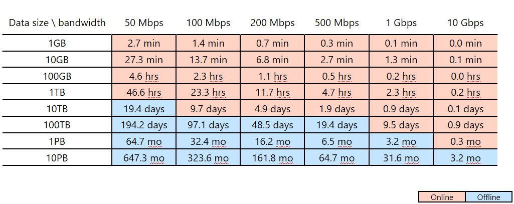

# Use Azure Data Factory to migrate data from your data lake or data warehouse to Azure

[!INCLUDE[appliesto-adf-xxx-md](includes/appliesto-adf-xxx-md.md)]

If you want to migrate your data lake or enterprise data warehouse (EDW) to Microsoft Azure, consider using Azure Data Factory. Azure Data Factory is well-suited to the following scenarios:

- Big data workload migration from Amazon Simple Storage Service (Amazon S3) or an on-premises Hadoop Distributed File System (HDFS) to Azure
- EDW migration from Oracle Exadata, Netezza, Teradata, or Amazon Redshift to Azure

Azure Data Factory can move petabytes (PB) of data for data lake migration, and tens of terabytes (TB) of data for data warehouse migration​.

## Why Azure Data Factory can be used for data migration

- Azure Data Factory can easily scale up the amount of processing power to move data in a serverless manner with high performance, resilience, and scalability. And you pay only for what you use. Also note the following: 
  - Azure Data Factory has no limitations on data volume or on the number of files.
  - Azure Data Factory can fully use your network and storage bandwidth to achieve the highest volume of data movement throughput in your environment.
  - Azure Data Factory uses a pay-as-you-go method, so that you pay only for the time you actually use to run the data migration to Azure.  
- Azure Data Factory can perform both a one-time historical load and scheduled incremental loads.
- Azure Data Factory uses Azure integration runtime (IR) to move data between publicly accessible data lake and warehouse endpoints. It can also use self-hosted IR for moving data for data lake and warehouse endpoints inside Azure Virtual Network (VNet) or behind a firewall.
- Azure Data Factory has enterprise-grade security: You can use Windows Installer (MSI) or Service Identity for secured service-to-service integration, or use Azure Key Vault for credential management.
- Azure Data Factory provides a code-free authoring experience and a rich, built-in monitoring dashboard.  

## Online vs. offline data migration

Azure Data Factory is a standard online data migration tool to transfer data over a network (internet, ER, or VPN). Whereas with offline data migration, users physically ship data-transfer devices from their organization to an Azure Data Center.  

There are three key considerations when you choose between an online and offline migration approach:  

- Size of data to be migrated
- Network bandwidth
- Migration window

For example, assume you plan to use Azure Data Factory to complete your data migration within two weeks (your *migration window*). Notice the pink/blue cut line in the following table. The lowest pink cell for any given column shows the data size/network bandwidth pairing whose migration window is closest to but less than two weeks. (Any size/bandwidth pairing in a blue cell has an online migration window of more than two weeks.) 

This table helps you determine whether you can meet your intended migration window through online migration (Azure Data Factory) based on the size of your data and your available network bandwidth. If the online migration window is more than two weeks, you'll want to use offline migration.

> [!NOTE]
> By using online migration, you can achieve both historical data loading and incremental feeds end-to-end through a single tool.  Through this approach, your data can be kept synchronized between the existing store and the new store during the entire migration window. This means you can rebuild your ETL logic on the new store with refreshed data.

## Next steps

- [Migrate data from AWS S3 to Azure](data-migration-guidance-s3-azure-storage.md)
- [Migrate data from on-premises hadoop cluster to Azure](data-migration-guidance-hdfs-azure-storage.md)
- [Migrate data from on-premises Netezza server to Azure](data-migration-guidance-netezza-azure-sqldw.md)
