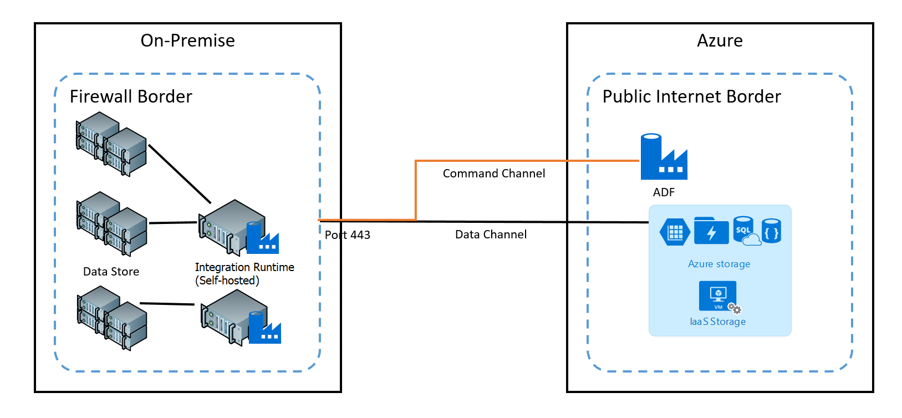
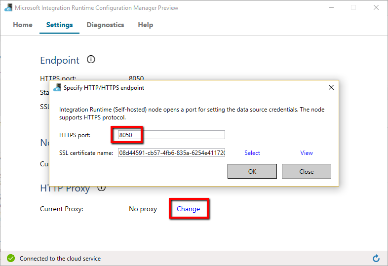
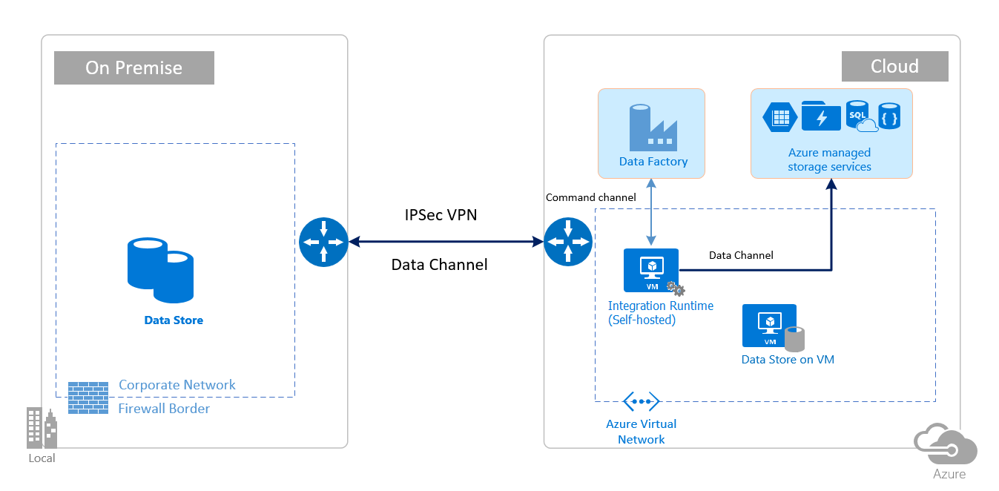

# Azure Data Factory - Security considerations for data movement
> [!div class="op_single_selector" title1="Select the version of Data Factory service you are using:"]
> * [Version 1 - GA](v1/data-factory-data-movement-security-considerations.md)
> * [Version 2 - Preview](data-movement-security-considerations.md)

This article describes basic security infrastructure that data movement services in Azure Data Factory use to secure your data. Azure Data Factory management resources are built on Azure security infrastructure and use all possible security measures offered by Azure.

> [!NOTE]
> This article applies to version 2 of Data Factory, which is currently in preview. If you are using version 1 of the Data Factory service, which is generally available (GA), see [data movement security considerations for Data Factory version 1](v1/data-factory-data-movement-security-considerations.md).

In a Data Factory solution, you create one or more data [pipelines](concepts-pipelines-activities.md). A pipeline is a logical grouping of activities that together perform a task. These pipelines reside in the region where the data factory was created. 

Even though Data Factory is available in only **East US** and **East US 2** region (version 2 preview), the data movement service is available [globally in several regions](concepts-integration-runtime.md#azure-ir). If the data movement service is not yet deployed to that region, the Data Factory service ensures that data does not leave a geographical area/ region unless you explicitly instruct the service to use an alternate region. 

Azure Data Factory itself does not store any data except for linked service credentials for cloud data stores, which are encrypted using certificates. It lets you create data-driven workflows to orchestrate movement of data between [supported data stores](copy-activity-overview.md#supported-data-stores-and-formats) and processing of data using [compute services](compute-linked-services.md) in other regions or in an on-premises environment. It also allows you to monitor and manage workflows using SDKs and Azure Monitor.

Data movement using Azure Data Factory has been **certified** for:
-	[HIPAA/HITECH](https://www.microsoft.com/en-us/trustcenter/Compliance/HIPAA) 
-	[ISO/IEC 27001](https://www.microsoft.com/en-us/trustcenter/Compliance/ISO-IEC-27001)  
-	[ISO/IEC 27018](https://www.microsoft.com/en-us/trustcenter/Compliance/ISO-IEC-27018)
-	[CSA STAR](https://www.microsoft.com/en-us/trustcenter/Compliance/CSA-STAR-Certification)

If you are interested in Azure compliance and how Azure secures its own infrastructure, visit the [Microsoft Trust Center](https://www.microsoft.com/TrustCenter/default.aspx). 

In this article, we review security considerations in the following two data movement scenarios: 

- **Cloud scenario**- In this scenario, both your source and destination are publicly accessible through internet. These include managed cloud storage services like Azure Storage, Azure SQL Data Warehouse, Azure SQL Database, Azure Data Lake Store, Amazon S3, Amazon Redshift, SaaS services such as Salesforce, and web protocols such as FTP and OData. You can find a complete list of supported data sources [here](copy-activity-overview.md#supported-data-stores-and-formats).
- **Hybrid scenario**- In this scenario, either your source or destination is behind a firewall or inside an on-premises corporate network or the data store is in a private network/ virtual network (most often the source) and is not publicly accessible. Database servers hosted on virtual machines also fall under this scenario.

## Cloud scenarios
###Securing data store credentials
- Store encrypted credentials in Azure Data Factory managed store.

   Azure Data Factory protects your data store credentials by **encrypting** them by using **certificates managed by Microsoft**. These certificates are rotated every **two years** (which includes renewal of certificate and migration of credentials). These encrypted credentials are securely stored in an **Azure Storage managed by Azure Data Factory management services**. For more information about Azure Storage security, refer [Azure Storage Security Overview](../security/security-storage-overview.md).
- Store credentials in Azure Key Vault 

   You can now choose to store data store's credential in [Azure Key Vault](https://azure.microsoft.com/services/key-vault/), then let Azure Data Factory to retrieve it during execution of an activity. For more information, see [Store credential in Azure Key Vault](store-credentials-in-key-vault.md).

   > [!NOTE]
   > Currently, only [Dynamics connector](connector-dynamics-crm-office-365.md) supports this feature. 

### Data encryption in transit
If the cloud data store supports HTTPS or TLS, all data transfers between data movement services in Data Factory and a cloud data store are via secure channel HTTPS or TLS.

> [!NOTE]
> All connections to **Azure SQL Database** and **Azure SQL Data Warehouse** always require encryption (SSL/TLS) while data is in transit to and from the database. While authoring a pipeline using JSON, add the **encryption** property and set it to **true** in the **connection string**. For **Azure Storage**, you can use **HTTPS** in the connection string.

### Data encryption at rest
Some data stores support encryption of data at rest. We suggest that you enable data encryption mechanism for those data stores. 

#### Azure SQL Data Warehouse
Transparent Data Encryption (TDE) in Azure SQL Data Warehouse helps with protecting against the threat of malicious activity by performing real-time encryption and decryption of your data at rest. This behavior is transparent to the client. For more information, see [Secure a database in SQL Data Warehouse](../sql-data-warehouse/sql-data-warehouse-overview-manage-security.md).

#### Azure SQL Database
Azure SQL Database also supports transparent data encryption (TDE), which helps with protecting against the threat of malicious activity by performing real-time encryption and decryption of the data without requiring changes to the application. This behavior is transparent to the client. For more information, see [Transparent Data Encryption with Azure SQL Database](/sql/relational-databases/security/encryption/transparent-data-encryption-with-azure-sql-database). 

#### Azure Data Lake Store
Azure Data Lake store also provides encryption for data stored in the account. When enabled, Data Lake store automatically encrypts data before persisting and decrypts before retrieval, making it transparent to the client accessing the data. For more information, see [Security in Azure Data Lake Store](../data-lake-store/data-lake-store-security-overview.md). 

#### Azure Blob Storage and Azure Table Storage
Azure Blob Storage and Azure Table storage supports Storage Service Encryption (SSE), which automatically encrypts your data before persisting to storage and decrypts before retrieval. For more information, see [Azure Storage Service Encryption for Data at Rest](../storage/common/storage-service-encryption.md).

#### Amazon S3
Amazon S3 supports both client and server encryption of data at Rest. For more information, see [Protecting Data Using Encryption](http://docs.aws.amazon.com/AmazonS3/latest/dev/UsingEncryption.html). Currently, Data Factory does not support Amazon S3 inside a virtual private cloud (VPC).

#### Amazon Redshift
Amazon Redshift supports cluster encryption for data at rest. For more information, see [Amazon Redshift Database Encryption](http://docs.aws.amazon.com/redshift/latest/mgmt/working-with-db-encryption.html). Currently, Data Factory does not support Amazon Redshift inside a VPC. 

#### Salesforce
Salesforce supports Shield Platform Encryption that allows encryption of all files, attachments, custom fields. For more information, see [Understanding the Web Server OAuth Authentication Flow](https://developer.salesforce.com/docs/atlas.en-us.api_rest.meta/api_rest/intro_understanding_web_server_oauth_flow.htm).  

## Hybrid scenarios (using self-hosted integration runtime)
Hybrid scenarios require self-hosted integration runtime to be installed in an on-premises network or inside a virtual network (Azure) or a virtual private cloud (Amazon). The self-hosted integration runtime must be able to access the local data stores. For more information about the self-hosted integration runtime, see [self-hosted integration runtime](create-self-hosted-integration-runtime.md). 

The **command channel** allows communication between data movement services in Data Factory and self-hosted integration runtime. The communication contains information related to the activity. The data channel is used for transferring data between on-premises data stores and cloud data stores.    

### On-premises data store credentials
The credentials for your on-premises data stores are always encrypted and stored. It can be either stored locally on the self-hosted integration runtime machine or in Azure Data Factory managed storage (just like cloud store credentials). 

1. You can choose to **store credentials locally**. If you want to encrypt and store credentials locally on the self-hosted integration runtime, follow the steps in [encrypting credentials on self-hosted integration runtime](encrypt-credentials-self-hosted-integration-runtime.md). All connectors support this option. The self-hosted integration runtime uses Windows [DPAPI](https://msdn.microsoft.com/library/ms995355.aspx) to encrypt the sensitive data/ credential information. 

   Use **New-AzureRmDataFactoryV2LinkedServiceEncryptedCredential** cmdlet to encrypt Linked Service credentials/ encrypt sensitive details in Linked Service. You can then use the JSON returned (with  **EncryptedCredential** element in the **connectionString**) to create a Linked Service by **Set-AzureRmDataFactoryV2LinkedSevrice** cmdlet.  

2. If you do not use **New-AzureRmDataFactoryV2LinkedServiceEncryptedCredential** cmdlet as described in the above step, and instead directly use **Set-AzureRmDataFactoryV2LinkedSevrice** cmdlet with the connection strings/ credentials inline in the JSON then the Linked Service will be **encrypted and stored on Azure Data Factory managed storage**. The sensitive information is still encrypted by certificate and these certificates are managed by Microsoft.

#### Ports used during encrypting Linked Service on self-hosted integration runtime
By default, PowerShell uses the port **8050** on the machine with self-hosted integration runtime for secure communication. If necessary, this port can be changed.  

 

### Encryption in transit
All data transfers are via secure channel **HTTPS** and **TLS over TCP** to prevent man-in-the-middle attacks during communication with Azure services.

You can also use [IPSec VPN](../vpn-gateway/vpn-gateway-about-vpn-devices.md) or [Express Route](../expressroute/expressroute-introduction.md) to further secure the communication channel between your on-premises network and Azure.

Virtual network is a logical representation of your network in the cloud. You can connect an on-premises network to your Azure virtual network (VNet) by setting up IPSec VPN (site-to-site) or Express Route (Private Peering)		

The following table summarizes the network and self-hosted integration runtime configuration recommendations based on different combinations of source and destination locations for hybrid data movement.

| Source      | Destination                              | Network configuration                    | Integration runtime setup                |
| ----------- | ---------------------------------------- | ---------------------------------------- | ---------------------------------------- |
| On-premises | Virtual machines and cloud services deployed in virtual networks | IPSec VPN (point-to-site or site-to-site) | The self-hosted integration runtime can be installed either on-premises or on an Azure virtual machine (VM) in VNet |
| On-premises | Virtual machines and cloud services deployed in virtual networks | ExpressRoute (Private Peering)           | The self-hosted integration runtime can be installed either on-premises or on an Azure VM in VNet |
| On-premises | Azure-based services that have a public endpoint | ExpressRoute (Public Peering)            | The self-hosted integration runtime must be installed on-premises |

The following images show the usage of self-hosted integration runtime for moving data between an on-premises database and Azure services using Express route and IPSec VPN (with Virtual Network):

**Express Route:**

 

**IPSec VPN:**

### Firewall configurations and whitelisting IP address (self-hosted integration runtime)

#### Firewall requirements for on-premises/private network	
In an enterprise, a **corporate firewall** runs on the central router of the organization. And, **Windows firewall** runs as a daemon on the local machine on which the self-hosted integration runtime is installed. 

The following table provides **outbound port** and domain requirements for the **corporate firewall**.

| Domain names                  | Outbound ports | Description                              |
| ----------------------------- | -------------- | ---------------------------------------- |
| `*.servicebus.windows.net`    | 443, 80        | Required by the self-hosted integration runtime to connect to data movement services in Data Factory |
| `*.core.windows.net`          | 443            | Used by the self-hosted integration runtime to connect to Azure Storage Account when you use the [staged copy](copy-activity-performance.md#staged-copy) feature. |
| `*.frontend.clouddatahub.net` | 443            | Required by the self-hosted integration runtime to connect to the Azure Data Factory service. |
| `*.database.windows.net`      | 1433           | (OPTIONAL) needed when your destination is Azure SQL Database/ Azure SQL Data Warehouse. Use the staged copy feature to copy data to Azure SQL Database/Azure SQL Data Warehouse without opening the port 1433. |
| `*.azuredatalakestore.net`    | 443            | (OPTIONAL) needed when your destination is Azure Data Lake store |

> [!NOTE] 
> You may have to manage ports/ whitelisting domains at the corporate firewall level as required by respective data sources. This table only uses Azure SQL Database, Azure SQL Data Warehouse, Azure Data Lake Store as examples.   

The following table provides **inbound port** requirements for the **Windows firewall**.

| Inbound ports | Description                              |
| ------------- | ---------------------------------------- |
| 8050 (TCP)    | Required by PowerShell Encryption cmdlet as described in [encrypting credentials on self-hosted integration runtime](encrypt-credentials-self-hosted-integration-runtime.md)/ credential manager application to securely set credentials for on-premises data stores on the self-hosted integration runtime. |

 

#### IP configurations/whitelisting in data store
Some data stores in the cloud also require whitelisting of IP address of the machine accessing them. Ensure that the IP address of the self-hosted integration runtime machine is whitelisted/ configured in firewall appropriately.

The following cloud data stores require whitelisting of IP address of the self-hosted integration runtime machine. Some of these data stores, by default, may not require whitelisting of the IP address. 

- [Azure SQL Database](../sql-database/sql-database-firewall-configure.md) 
- [Azure SQL Data Warehouse](../sql-data-warehouse/sql-data-warehouse-get-started-provision.md#create-a-server-level-firewall-rule-in-the-azure-portal)
- [Azure Data Lake Store](../data-lake-store/data-lake-store-secure-data.md#set-ip-address-range-for-data-access)
- [Azure Cosmos DB](../cosmos-db/firewall-support.md)
- [Amazon Redshift](http://docs.aws.amazon.com/redshift/latest/gsg/rs-gsg-authorize-cluster-access.html) 

## Frequently asked questions

**Question:** Can the self-hosted integration runtime be shared across different data factories?
**Answer:** We do not support this feature yet. We are actively working on it.

**Question:** What are the port requirements for the self-hosted integration runtime to work?
**Answer:** The self-hosted integration runtime makes HTTP-based connections to open internet. The **outbound ports 443 and 80** must be opened for self-hosted integration runtime to make this connection. Open **Inbound Port 8050** only at the machine level (not at corporate firewall level) for Credential Manager application. If Azure SQL Database or Azure SQL Data Warehouse is used as source/ destination, then you need to open **1433** port as well. For more information, see [Firewall configurations and whitelisting IP addresses](#firewall-configurations-and-whitelisting-ip-address-of gateway) section. 

## Next steps
For information about performance of copy activity, see [Copy activity performance and tuning guide](copy-activity-performance.md).

 
