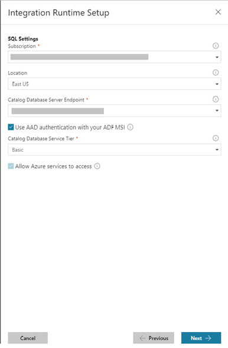

# Enable Azure Active Directory authentication for Azure-SSIS Integration Runtime

This article shows you how to enable Azure Active Directory (Azure AD) authentication with the managed identity for your Azure Data Factory (ADF) and use it instead of SQL authentication to create an Azure-SSIS Integration Runtime (IR) that will in turn provision SSIS catalog database (SSISDB) in Azure SQL Database server/Managed Instance on your behalf.

For more info about the managed identity for your ADF, see [Managed identiy for Data Factory](https://docs.microsoft.com/azure/data-factory/data-factory-service-identity).

> [!NOTE]
>-  In this scenario, Azure AD authentication with the managed identity for your ADF is only used in the creation and subsequent starting operations of your SSIS IR that will in turn provision and connect to SSISDB. For SSIS package executions, your SSIS IR will still connect to SSISDB using SQL authentication with fully managed accounts that are created during SSISDB provisioning.
>-  If you have already created your SSIS IR using SQL authentication, you can not reconfigure it to use Azure AD authentication via PowerShell at this time, but you can do so via Azure portal/ADF app. 

[!INCLUDE [updated-for-az](../../includes/updated-for-az.md)]

## Enable Azure AD on Azure SQL Database

Azure SQL Database server supports creating a database with an Azure AD user. First, you need to create an Azure AD group with the managed identity for your ADF as a member. Next, you need to set an Azure AD user as the Active Directory admin for your Azure SQL Database server and then connect to it on SQL Server Management Studio (SSMS) using that user. Finally, you need to create a contained user representing the Azure AD group, so the managed identity for your ADF can be used by Azure-SSIS IR to create SSISDB on your behalf.

### Create an Azure AD group with the managed identity for your ADF as a member

You can use an existing Azure AD group or create a new one using Azure AD PowerShell.

1.  Install the [Azure AD PowerShell](https://docs.microsoft.com/powershell/azure/active-directory/install-adv2) module.

2.  Sign in using `Connect-AzureAD`, run the following cmdlet to create a group, and save it in a variable:

    ```powershell
    $Group = New-AzureADGroup -DisplayName "SSISIrGroup" `
                              -MailEnabled $false `
                              -SecurityEnabled $true `
                              -MailNickName "NotSet"
    ```

    The result looks like the following example, which also displays the variable value:

    ```powershell
    $Group

    ObjectId DisplayName Description
    -------- ----------- -----------
    6de75f3c-8b2f-4bf4-b9f8-78cc60a18050 SSISIrGroup
    ```

3.  Add the managed identity for your ADF to the group. You can follow the article [Managed identiy for Data Factory](https://docs.microsoft.com/azure/data-factory/data-factory-service-identity) to get the principal Managed Identity Object ID (e.g. 765ad4ab-XXXX-XXXX-XXXX-51ed985819dc, but do not use Managed Identity Application ID for this purpose).

    ```powershell
    Add-AzureAdGroupMember -ObjectId $Group.ObjectId -RefObjectId 765ad4ab-XXXX-XXXX-XXXX-51ed985819dc
    ```

    You can also check the group membership afterwards.

    ```powershell
    Get-AzureAdGroupMember -ObjectId $Group.ObjectId
    ```

### Configure Azure AD authentication for Azure SQL Database server

You can [Configure and manage Azure AD authentication with SQL](https://docs.microsoft.com/azure/sql-database/sql-database-aad-authentication-configure) using the following steps:

1.  In Azure portal, select **All services** -> **SQL servers** from the left-hand navigation.

2.  Select your Azure SQL Database server to be configured with Azure AD authentication.

3.  In the **Settings** section of the blade, select **Active Directory admin**.

4.  In the command bar, select **Set admin**.

5.  Select an Azure AD user account to be made administrator of the server, and then select **Select.**

6.  In the command bar, select **Save.**

### Create a contained user in Azure SQL Database server representing the Azure AD group

For this next step, you need [Microsoft SQL Server Management Studio](https://docs.microsoft.com/sql/ssms/download-sql-server-management-studio-ssms) (SSMS).

1. Start SSMS.

2. In the **Connect to Server** dialog, enter your Azure SQL Database server name in
   the **Server name** field.

3. In the **Authentication** field, select **Active Directory - Universal with MFA support** (you can also use the other two Active Directory authentication types, see [Configure and manage Azure AD authentication with SQL](https://docs.microsoft.com/azure/sql-database/sql-database-aad-authentication-configure)).

4. In the **User name** field, enter the name of Azure AD account that you set as the server administrator, e.g. testuser@xxxonline.com.

5. select **Connect** and complete the sign-in process.

6. In the **Object Explorer**, expand the **Databases** -> **System Databases** folder.

7. Right-click on **master** database and select **New query**.

8. In the query window, enter the following T-SQL command, and select **Execute** on the toolbar.

   ```sql
   CREATE USER [SSISIrGroup] FROM EXTERNAL PROVIDER
   ```

   The command should complete successfully, creating a contained user to represent the group.

9. Clear the query window, enter the following T-SQL command, and select **Execute** on the toolbar.

   ```sql
   ALTER ROLE dbmanager ADD MEMBER [SSISIrGroup]
   ```

   The command should complete successfully, granting the contained user the ability to create a database (SSISDB).

10. If your SSISDB was created using SQL authentication and you want to switch to use Azure AD authentication for your Azure-SSIS IR to access it, right-click on **SSISDB** database and select **New query**.

11. In the query window, enter the following T-SQL command, and select **Execute** on the toolbar.

    ```sql
    CREATE USER [SSISIrGroup] FROM EXTERNAL PROVIDER
    ```

    The command should complete successfully, creating a contained user to represent the group.

12. Clear the query window, enter the following T-SQL command, and select **Execute** on the toolbar.

    ```sql
    ALTER ROLE db_owner ADD MEMBER [SSISIrGroup]
    ```

    The command should complete successfully, granting the contained user the ability to access SSISDB.

## Enable Azure AD on Azure SQL Database Managed Instance

Azure SQL Database Managed Instance supports creating a database with the managed identity for your ADF directly. You need not join the managed identity for your ADF to an Azure AD group nor create a contained user representing that group in your Managed Instance.

### Configure Azure AD authentication for Azure SQL Database Managed Instance

Follow the steps in [Provision an Azure Active Directory administrator for your Managed Instance](https://docs.microsoft.com/azure/sql-database/sql-database-aad-authentication-configure#provision-an-azure-active-directory-administrator-for-your-managed-instance).

### Add the managed identity for your ADF as a user in Azure SQL Database Managed Instance

For this next step, you need [Microsoft SQL Server Management Studio](https://docs.microsoft.com/sql/ssms/download-sql-server-management-studio-ssms) (SSMS).

1.	Start SSMS.

2.	Connect to your Managed Instance using a SQL Server account that is a **sysadmin**. This is a temporary limitation that will be removed once Azure AD server principals (logins) for Azure SQL Database Managed Instance becomes GA. You will see the following error if you try to use an Azure AD admin account to create the login: Msg 15247, Level 16, State 1, Line 1 User does not have permission to perform this action.

3.	In the **Object Explorer**, expand the **Databases** -> **System Databases** folder.

4.	Right-click on **master** database and select **New query**.

5.	Get the managed identity for your ADF. You can follow the article [Managed identiy for Data Factory](https://docs.microsoft.com/azure/data-factory/data-factory-service-identity) to get the principal Managed Identity Application ID (but do not use Managed Identity Object ID for this purpose).

6.	In the query window, execute the following T-SQL script to convert the managed identity for your ADF to binary type:

    ```sql
    DECLARE @applicationId uniqueidentifier = '{your Managed Identity Application ID}'
    select CAST(@applicationId AS varbinary)
    ```
    
    The command should complete successfully, displaying the managed identity for your ADF as binary.

7.	Clear the query window and execute the following T-SQL script to add the managed identity for your ADF as a user

    ```sql
    CREATE LOGIN [{a name for the managed identity}] FROM EXTERNAL PROVIDER with SID = {your Managed Identity Application ID as binary}, TYPE = E
    ALTER SERVER ROLE [dbcreator] ADD MEMBER [{the managed identity name}]
    ALTER SERVER ROLE [securityadmin] ADD MEMBER [{the managed identity name}]
    ```
    
    The command should complete successfully, granting the managed identity for your ADF the ability to create a database (SSISDB).

8.  If your SSISDB was created using SQL authentication and you want to switch to use Azure AD authentication for your Azure-SSIS IR to access it, right-click on **SSISDB** database and select **New query**.

9.  In the query window, enter the following T-SQL command, and select **Execute** on the toolbar.

    ```sql
    CREATE USER [{the managed identity name}] FOR LOGIN [{the managed identity name}] WITH DEFAULT_SCHEMA = dbo
    ALTER ROLE db_owner ADD MEMBER [{the managed identity name}]
    ```

    The command should complete successfully, granting the managed identity for your ADF the ability to access SSISDB.

## Provision Azure-SSIS IR in Azure portal/ADF app

When you provision your Azure-SSIS IR in Azure portal/ADF app, on **SQL Settings** page, select **Use AAD authentication with the managed identity for your ADF** option. The following screenshot shows the settings for IR with Azure SQL Database server hosting SSISDB. For IR with Managed Instance hosting SSISDB, the **Catalog Database Service Tier** and **Allow Azure services to access** settings are not applicable, while other settings are the same.

For more info about how to create an Azure-SSIS IR, see [Create an Azure-SSIS integration runtime in Azure Data Factory](https://docs.microsoft.com/azure/data-factory/create-azure-ssis-integration-runtime).



## Provision Azure-SSIS IR with PowerShell

To provision your Azure-SSIS IR with PowerShell, do the following things:

1.  Install [Azure PowerShell](https://github.com/Azure/azure-powershell/releases/tag/v5.5.0-March2018) module.

2.  In your script, do not set `CatalogAdminCredential` parameter. For example:

    ```powershell
    Set-AzDataFactoryV2IntegrationRuntime -ResourceGroupName $ResourceGroupName `
                                               -DataFactoryName $DataFactoryName `
                                               -Name $AzureSSISName `
                                               -Description $AzureSSISDescription `
                                               -Type Managed `
                                               -Location $AzureSSISLocation `
                                               -NodeSize $AzureSSISNodeSize `
                                               -NodeCount $AzureSSISNodeNumber `
                                               -Edition $AzureSSISEdition `
                                               -MaxParallelExecutionsPerNode $AzureSSISMaxParallelExecutionsPerNode `
                                               -CatalogServerEndpoint $SSISDBServerEndpoint `
                                               -CatalogPricingTier $SSISDBPricingTier

    Start-AzDataFactoryV2IntegrationRuntime -ResourceGroupName $ResourceGroupName `
                                                 -DataFactoryName $DataFactoryName `
                                                 -Name $AzureSSISName
   ```
