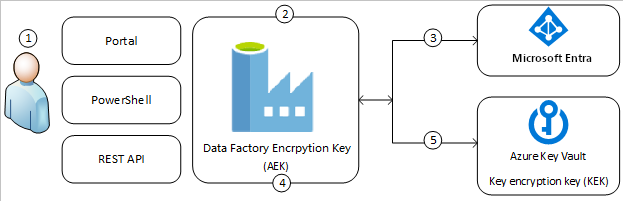
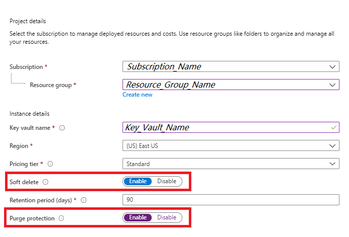
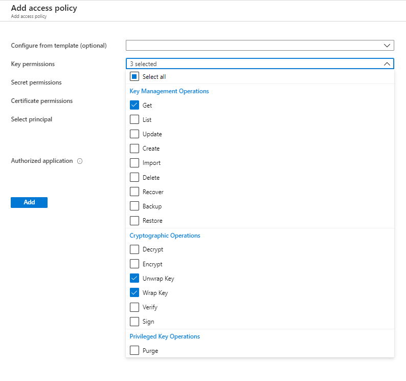
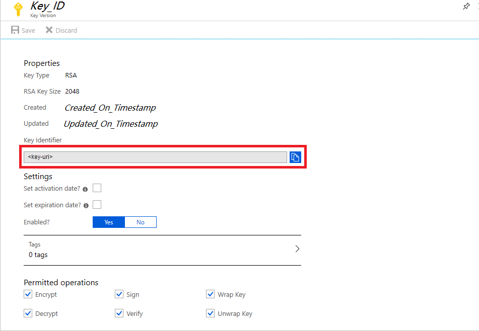
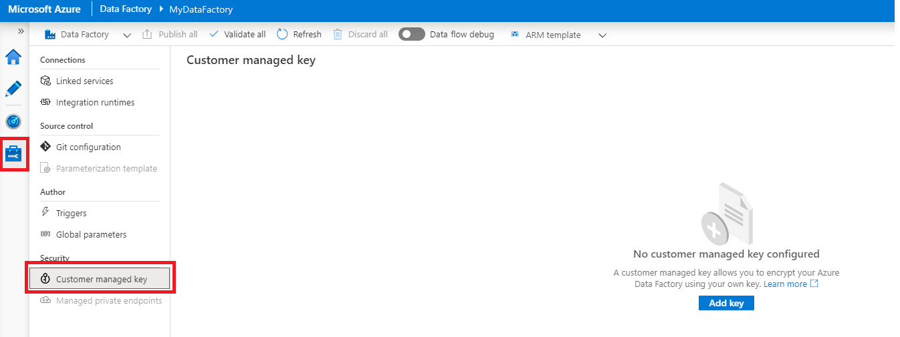

# Encrypt Azure Data Factory with customer-managed keys

[!INCLUDE[appliesto-adf-xxx-md](includes/appliesto-adf-xxx-md.md)]

Azure Data Factory encrypts data at rest, including entity definitions, any data cached while runs are in progress, and data cached for Data Preview. By default, data is encrypted with a randomly generated Microsoft-managed key that is uniquely assigned to your data factory. For additional security guarantees, you can now enable Bring Your Own Key (BYOK) with customer-managed keys feature in Azure Data Factory. When you specify a customer-managed key, Data Factory uses __both__ the factory system key and the CMK to encrypt customer data. Missing either would result in Deny of Access to data and factory.

Azure Key Vault is required to store customer-managed keys. You can either create your own keys and store them in a key vault, or you can use the Azure Key Vault APIs to generate keys. Key vault and Data Factory must be in the same Azure Active Directory (Azure AD) tenant and in the same region, but they may be in different subscriptions. For more information about Azure Key Vault, see [What is Azure Key Vault?](../key-vault/general/overview.md)

> [!NOTE]
> A customer-managed key can only be configured on an empty data Factory. The data factory can't contain any resources such as linked services, pipelines and data flows. It is recommended to enable customer-managed key right after factory creation.

## About customer-managed keys

The following diagram shows how Data Factory uses Azure Active Directory and Azure Key Vault to make requests using the customer-managed key:

  

The following list explains the numbered steps in the diagram:

1. An Azure Key Vault admin grants permissions to encryption keys to the managed identity that's associated with the Data Factory
1. A Data Factory admin enables customer-managed key feature in the factory
1. Data Factory uses the managed identity that's associated with the factory to authenticate access to Azure Key Vault via Azure Active Directory
1. Data Factory wraps the factory encryption key with the customer key in Azure Key Vault
1. For read/write operations, Data Factory sends requests to Azure Key Vault to unwrap the account encryption key to perform encryption and decryption operations

## Prerequisites - configure Azure Key Vault and generate keys

### Enable Soft Delete and Do Not Purge on Azure Key Vault

Using customer-managed keys with Data Factory requires two properties to be set on the Key Vault, __Soft Delete__ and __Do Not Purge__. These properties can be enabled using either PowerShell or Azure CLI on a new or existing key vault. To learn how to enable these properties on an existing key vault, see the sections titled _Enabling soft-delete_ and _Enabling Purge Protection_ in one of the following articles:

- [How to use soft-delete with PowerShell](../key-vault/general/soft-delete-powershell.md)
- [How to use soft-delete with CLI](../key-vault/general/soft-delete-cli.md)

If you are creating a new Azure Key Vault through Azure portal, __Soft Delete__ and __Do Not Purge__ can be enabled as follows:

  

### Grant Data Factory access to Azure Key Vault

Make sure that Azure Key Vault and Azure Data Factory are in the same Azure Active Directory (Azure AD) tenant and in the _same region_. From Azure Key Vault access control, grant data factory's Managed Service Identity (MSI) following permissions: _Get_, _Unwrap Key_, and _Wrap Key_. These permissions are required to enable customer-managed keys in Data Factory.

  

### Generate or upload customer-managed key to Azure Key Vault

You can either create your own keys and store them in a key vault, or you can use the Azure Key Vault APIs to generate keys. Only 2048-bit RSA keys are supported with Data Factory encryption. For more information, see [About keys, secrets, and certificates](../key-vault/general/about-keys-secrets-certificates.md).

  

## Enable customer-managed keys

1. Ensure the Data Factory is empty. The data factory can't contain any resources such as linked services, pipelines and data flows. For now, deploying customer-managed key to a non-empty factory will result in an error.

1. To locate the key URI in the Azure portal, navigate to Azure Key Vault, and select the Keys setting. Select the wanted key, then click the key to view its versions. Select a key version to view the settings

1. Copy the value of the Key Identifier field, which provides the URI

    

1. Launch Azure Data Factory portal, and using the navigation bar on the left, jump to Data Factory Home Page

1. Click on the __Customer manged key__ icon

    

1. Enter the URI for customer-managed key that you copied before

1. Click __Save__ and customer-manged key encryption is enabled for Data Factory

## Update Key Version

When you create a new version of a key, update data factory to use the new version. Follow similar steps as described in section _Enable Customer-Managed Keys_, including:

1. Locate the URI for the new key version through Azure Key Vault Portal

1. Navigate to __Customer-managed key__ setting

1. Replace and paste in the URI for the new key

1. Click __Save__ and Data Factory will now encrypt with the new key version

## Use a Different Key

To change key used for Data Factory encryption, you have to manually update the settings in Data Factory. Follow similar steps as described in section _Enable Customer-Managed Keys_, including:

1. Locate the URI for the new key through Azure Key Vault Portal

1. Navigate to __Customer manged key__ setting

1. Replace and paste in the URI for the new key

1. Click __Save__ and Data Factory will now encrypt with the new key

## Disable Customer-Managed Keys

By design, once the customer-managed key feature is enabled, you can't remove the extra security step. We will always expect a customer provided key to encrypt factory and data.

## Next steps

Go through the [tutorials](tutorial-copy-data-dot-net.md) to learn about using Data Factory in more scenarios.
