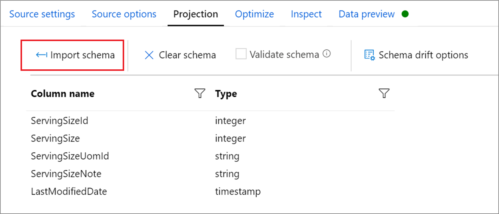
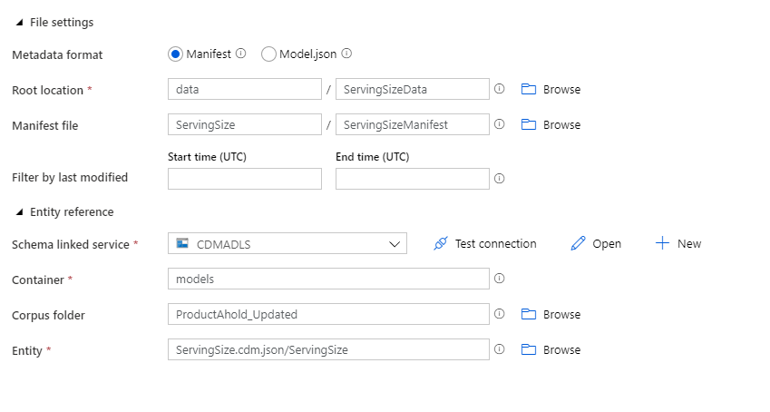
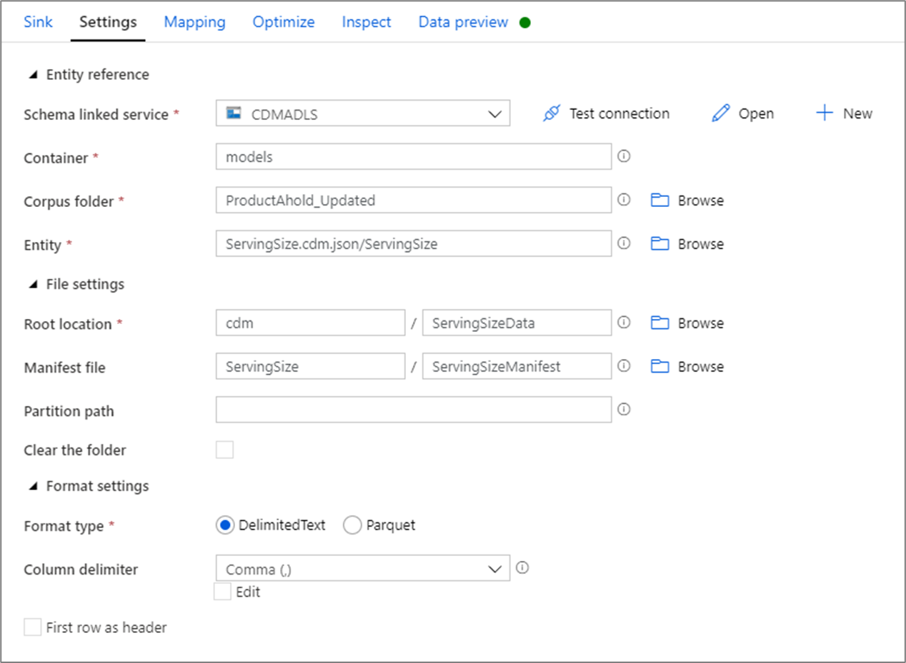

# Common Data Model format in Azure Data Factory
[!INCLUDE[appliesto-adf-asa-md](includes/appliesto-adf-asa-md.md)]

The Common Data Model (CDM) metadata system makes it possible for data and its meaning to be easily shared across applications and business processes. To learn more, see the [Common Data Model](https://docs.microsoft.com/common-data-model/) overview.

In Azure Data Factory, users can transform to and from CDM entities stored in [Azure Data Lake Store Gen2](connector-azure-data-lake-storage.md) (ADLS Gen2) using mapping data flows.

> [!NOTE]
> Common Data Model (CDM) format connector for ADF data flows is currently available as a public preview.

## Mapping data flow properties

The Common Data Model is available as an [inline dataset](data-flow-source.md#inline-datasets) in mapping data flows as both a source and a sink.

### Source properties

The below table lists the properties supported by a CDM source. You can edit these properties in the **Source options** tab.

| Name | Description | Required | Allowed values | Data flow script property |
| ---- | ----------- | -------- | -------------- | ---------------- |
| Format | Format must be `cdm` | yes | `cdm` | format |
| Metadata format | Where the entity reference to the data is located. If using CDM version 1.0, choose manifest. If using a CDM version before 1.0, choose model.json. | Yes | `'manifest'` or `'model'` | manifestType |
| Root location: container | Container name of the CDM folder | yes | String | fileSystem |
| Root location: folder path | Root folder location of CDM folder | yes | String | folderPath |
| Manifest file: Entity path | Folder path of the entity within the root folder | no | String | entityPath |
| Manifest file: Manifest name | Name of the manifest file. Default value is 'default'  | No | String | manifestName |
| Filter by last modified | Choose to filter files based upon when they were last altered | no | Timestamp | modifiedAfter <br> modifiedBefore | 
| Schema linked service | The linked service where the corpus is located | yes, if using manifest | `'adlsgen2'` or `'github'` | corpusStore | 
| Entity reference container | Container corpus is in | yes, if using manifest and corpus in ADLS Gen2 | String | adlsgen2_fileSystem |
| Entity reference Repository | GitHub repository name | yes, if using manifest and corpus in GitHub | String | github_repository |
| Entity reference Branch | GitHub repository branch | yes, if using manifest and corpus in GitHub | String |  github_branch |
| Corpus folder | the root location of the corpus | yes, if using manifest | String | corpusPath |
| Corpus entity | Path to entity reference | yes | String | entity |
| Allow no files found | If true, an error is not thrown if no files are found | no | `true` or `false` | ignoreNoFilesFound |

#### Import schema

CDM is only available as an inline dataset and, by default, doesn't have an associated schema. To get column metadata, click the **Import schema** button in the **Projection** tab. This will allow you to reference the column names and data types specified by the corpus. To import the schema, a [data flow debug session](concepts-data-flow-debug-mode.md) must be active.



### CDM source example

The below image is an example of a CDM source configuration in mapping data flows.



The associated data flow script is:

```
source(output(
		ServingSizeId as integer,
		ServingSize as integer,
		ServingSizeUomId as string,
		ServingSizeNote as string,
		LastModifiedDate as timestamp
	),
	allowSchemaDrift: true,
	validateSchema: false,
	entity: 'ServingSize.cdm.json/ServingSize',
	format: 'cdm',
	manifestType: 'manifest',
	manifestName: 'ServingSizeManifest',
	entityPath: 'ServingSize',
	corpusPath: 'ProductAhold_Updated',
	corpusStore: 'adlsgen2',
	adlsgen2_fileSystem: 'models',
	folderPath: 'ServingSizeData',
	fileSystem: 'data') ~> CDMSource
```

### Sink properties

The below table lists the properties supported by a CDM sink. You can edit these properties in the **Settings** tab.

| Name | Description | Required | Allowed values | Data flow script property |
| ---- | ----------- | -------- | -------------- | ---------------- |
| Format | Format must be `cdm` | yes | `cdm` | format |
| Root location: container | Container name of the CDM folder | yes | String | fileSystem |
| Root location: folder path | Root folder location of CDM folder | yes | String | folderPath |
| Manifest file: Entity path | Folder path of the entity within the root folder | no | String | entityPath |
| Manifest file: Manifest name | Name of the manifest file. Default value is 'default' | No | String | manifestName |
| Schema linked service | The linked service where the corpus is located | yes | `'adlsgen2'` or `'github'` | corpusStore | 
| Entity reference container | Container corpus is in | yes, if corpus in ADLS Gen2 | String | adlsgen2_fileSystem |
| Entity reference Repository | GitHub repository name | yes, if corpus in GitHub | String | github_repository |
| Entity reference Branch | GitHub repository branch | yes, if corpus in GitHub | String |  github_branch |
| Corpus folder | the root location of the corpus | yes | String | corpusPath |
| Corpus entity | Path to entity reference | yes | String | entity |
| Partition path | Location where the partition will be written | no | String | partitionPath |
| Clear the folder | If the destination folder is cleared prior to write | no | `true` or `false` | truncate |
| Format type | Choose to specify parquet format | no | `parquet` if specified | subformat |
| Column delimiter | If writing to DelimitedText, how to delimit columns | yes, if writing to DelimitedText | String | columnDelimiter |
| First row as header | If using DelimitedText, whether the column names are added as a header | no | `true` or `false` | columnNamesAsHeader |

### CDM sink example

The below image is an example of a CDM sink configuration in mapping data flows.



The associated data flow script is:

```
CDMSource sink(allowSchemaDrift: true,
	validateSchema: false,
	entity: 'ServingSize.cdm.json/ServingSize',
	format: 'cdm',
	entityPath: 'ServingSize',
	manifestName: 'ServingSizeManifest',
	corpusPath: 'ProductAhold_Updated',
	partitionPath: 'adf',
	folderPath: 'ServingSizeData',
	fileSystem: 'cdm',
	subformat: 'parquet',
	corpusStore: 'adlsgen2',
	adlsgen2_fileSystem: 'models',
	truncate: true,
	skipDuplicateMapInputs: true,
	skipDuplicateMapOutputs: true) ~> CDMSink

```

## Next steps

Create a [source transformation](data-flow-source.md) in mapping data flow.
