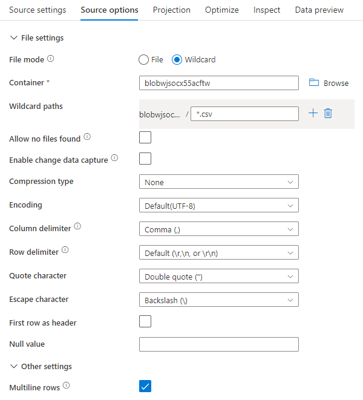
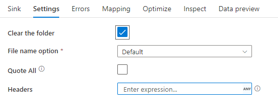

# Delimited text format in Azure Data Factory
[!INCLUDE[appliesto-adf-asa-md](includes/appliesto-adf-asa-md.md)]

Follow this article when you want to **parse the delimited text files or write the data into delimited text format**. 

Delimited text format is supported for the following connectors: [Amazon S3](connector-amazon-simple-storage-service.md), [Azure Blob](connector-azure-blob-storage.md), [Azure Data Lake Storage Gen1](connector-azure-data-lake-store.md), [Azure Data Lake Storage Gen2](connector-azure-data-lake-storage.md), [Azure File Storage](connector-azure-file-storage.md), [File System](connector-file-system.md), [FTP](connector-ftp.md), [Google Cloud Storage](connector-google-cloud-storage.md), [HDFS](connector-hdfs.md), [HTTP](connector-http.md), and [SFTP](connector-sftp.md).

## Dataset properties

For a full list of sections and properties available for defining datasets, see the [Datasets](concepts-datasets-linked-services.md) article. This section provides a list of properties supported by the delimited text dataset.

| Property         | Description                                                  | Required |
| ---------------- | ------------------------------------------------------------ | -------- |
| type             | The type property of the dataset must be set to **DelimitedText**. | Yes      |
| location         | Location settings of the file(s). Each file-based connector has its own location type and supported properties under `location`.  | Yes      |
| columnDelimiter  | The character(s) used to separate columns in a file. <br>The default value is **comma  `,`**. When the column delimiter is defined as empty string which means no delimiter, the whole line is taken as a single column.<br>Currently, column delimiter as empty string or multi-char is only supported for mapping data flow but not Copy activity.  | No       |
| rowDelimiter     | The single character or "\r\n" used to separate rows in a file. <br>The default value is any of the following values **on read: ["\r\n", "\r",  "\n"]**, and **"\n" or “\r\n” on write** by mapping data flow and Copy activity respectively. <br>When the row delimiter is set to no delimiter (empty string), the column delimiter must be set as no delimiter (empty string) as well, which means to treat the entire content as a single value.<br>Currently, row delimiter as empty string is only supported for mapping data flow but not Copy activity. | No       |
| quoteChar        | The single character to quote column values if it contains column delimiter. <br>The default value is **double quotes** `"`. <br>For mapping data flow, `quoteChar` cannot be an empty string. <br>For Copy activity, when `quoteChar` is defined as empty string, it means there is no quote char and column value is not quoted, and `escapeChar` is used to escape the column delimiter and itself. | No       |
| escapeChar       | The single character to escape quotes inside a quoted value.<br>The default value is **backslash `\`**. <br>For mapping data flow, `escapeChar` cannot be an empty string. <br/>For Copy activity, when `escapeChar` is defined as empty string, the `quoteChar` must be set as empty string as well, in which case make sure all column values don’t contain delimiters. | No       |
| firstRowAsHeader | Specifies whether to treat/make the first row as a header line with names of columns.<br>Allowed values are **true** and **false** (default). | No       |
| nullValue        | Specifies the string representation of null value. <br>The default value is **empty string**. | No       |
| encodingName     | The encoding type used to read/write test files. <br>Allowed values are as follows: "UTF-8", "UTF-16", "UTF-16BE", "UTF-32", "UTF-32BE", "US-ASCII", “UTF-7”, "BIG5", "EUC-JP", "EUC-KR", "GB2312", "GB18030", "JOHAB", "SHIFT-JIS", "CP875", "CP866", "IBM00858", "IBM037", "IBM273", "IBM437", "IBM500", "IBM737", "IBM775", "IBM850", "IBM852", "IBM855", "IBM857", "IBM860", "IBM861", "IBM863", "IBM864", "IBM865", "IBM869", "IBM870", "IBM01140", "IBM01141", "IBM01142", "IBM01143", "IBM01144", "IBM01145", "IBM01146", "IBM01147", "IBM01148", "IBM01149", "ISO-2022-JP", "ISO-2022-KR", "ISO-8859-1", "ISO-8859-2", "ISO-8859-3", "ISO-8859-4", "ISO-8859-5", "ISO-8859-6", "ISO-8859-7", "ISO-8859-8", "ISO-8859-9", "ISO-8859-13", "ISO-8859-15", "WINDOWS-874", "WINDOWS-1250", "WINDOWS-1251", "WINDOWS-1252", "WINDOWS-1253", "WINDOWS-1254", "WINDOWS-1255", "WINDOWS-1256", "WINDOWS-1257", "WINDOWS-1258”.<br>Note mapping data flow doesn’t support UTF-7 encoding. | No       |
| compressionCodec | The compression codec used to read/write text files. <br>Allowed values are **bzip2**, **gzip**, **deflate**, **ZipDeflate**, **snappy**, or **lz4**. Default is not compressed. <br>**Note** currently Copy activity doesn’t support "snappy" & "lz4", and mapping data flow doesn’t support "ZipDeflate". <br>**Note** when using copy activity to decompress **ZipDeflate** file(s) and write to file-based sink data store, by default files are extracted to the folder: `<path specified in dataset>/<folder named as source zip file>/`, use `preserveZipFileNameAsFolder` on [copy activity source](#delimited-text-as-source) to control whether to preserve zip file name as folder structure. | No       |
| compressionLevel | The compression ratio. <br>Allowed values are **Optimal** or **Fastest**.<br>- **Fastest:** The compression operation should complete as quickly as possible, even if the resulting file is not optimally compressed.<br>- **Optimal**: The compression operation should be optimally compressed, even if the operation takes a longer time to complete. For more information, see [Compression Level](https://msdn.microsoft.com/library/system.io.compression.compressionlevel.aspx) topic. | No       |

Below is an example of delimited text dataset on Azure Blob Storage:

```json
{
    "name": "DelimitedTextDataset",
    "properties": {
        "type": "DelimitedText",
        "linkedServiceName": {
            "referenceName": "<Azure Blob Storage linked service name>",
            "type": "LinkedServiceReference"
        },
        "schema": [ < physical schema, optional, retrievable during authoring > ],
        "typeProperties": {
            "location": {
                "type": "AzureBlobStorageLocation",
                "container": "containername",
                "folderPath": "folder/subfolder",
            },
            "columnDelimiter": ",",
            "quoteChar": "\"",
            "escapeChar": "\"",
            "firstRowAsHeader": true,
            "compressionCodec": "gzip"
        }
    }
}
```

## Copy activity properties

For a full list of sections and properties available for defining activities, see the [Pipelines](concepts-pipelines-activities.md) article. This section provides a list of properties supported by the delimited text source and sink.

### Delimited text as source 

The following properties are supported in the copy activity ***\*source\**** section.

| Property       | Description                                                  | Required |
| -------------- | ------------------------------------------------------------ | -------- |
| type           | The type property of the copy activity source must be set to **DelimitedTextSource**. | Yes      |
| formatSettings | A group of properties. Refer to **Delimited text read settings** table below. | No       |
| storeSettings  | A group of properties on how to read data from a data store. Each file-based connector has its own supported read settings under `storeSettings`. | No       |

Supported **delimited text read settings** under `formatSettings`:

| Property      | Description                                                  | Required |
| ------------- | ------------------------------------------------------------ | -------- |
| type          | The type of formatSettings must be set to **DelimitedTextReadSettings**. | Yes      |
| skipLineCount | Indicates the number of **non-empty** rows to skip when reading data from input files. <br>If both skipLineCount and firstRowAsHeader are specified, the lines are skipped first and then the header information is read from the input file. | No       |
| compressionProperties | A group of properties on how to decompress data for a given compression codec. | No       |
| preserveZipFileNameAsFolder<br>(*under `compressionProperties`*) | Applies when input dataset is configured with **ZipDeflate** compression. Indicates whether to preserve the source zip file name as folder structure during copy. When set to true (default), Data Factory writes unzipped files to `<path specified in dataset>/<folder named as source zip file>/`; when set to false, Data Factory writes unzipped files directly to `<path specified in dataset>`.  | No |

```json
"activities": [
    {
        "name": "CopyFromDelimitedText",
        "type": "Copy",
        "typeProperties": {
            "source": {
                "type": "DelimitedTextSource",
                "storeSettings": {
                    "type": "AzureBlobStorageReadSettings",
                    "recursive": true
                },
                "formatSettings": {
                    "type": "DelimitedTextReadSettings",
                    "skipLineCount": 3,
                    "compressionProperties": {
                        "type": "ZipDeflateReadSettings",
                        "preserveZipFileNameAsFolder": false
                    }
                }
            },
            ...
        }
        ...
    }
]
```

### Delimited text as sink

The following properties are supported in the copy activity ***\*sink\**** section.

| Property       | Description                                                  | Required |
| -------------- | ------------------------------------------------------------ | -------- |
| type           | The type property of the copy activity source must be set to **DelimitedTextSink**. | Yes      |
| formatSettings | A group of properties. Refer to **Delimited text write settings** table below. |          |
| storeSettings  | A group of properties on how to write data to a data store. Each file-based connector has its own supported write settings under `storeSettings`.  | No       |

Supported **delimited text write settings** under `formatSettings`:

| Property      | Description                                                  | Required                                              |
| ------------- | ------------------------------------------------------------ | ----------------------------------------------------- |
| type          | The type of formatSettings must be set to **DelimitedTextWriteSettings**. | Yes                                                   |
| fileExtension | The file extension used to name the output files, e.g. `.csv`, `.txt`. It must be specified when the `fileName` is not specified in the output DelimitedText dataset. When file name is configured in the output dataset, it will be used as the sink file name and the file extension setting will be ignored.  | Yes when file name is not specified in output dataset |

## Mapping data flow properties

In mapping data flows, you can read and write to delimited text format in the following data stores: [Azure Blob Storage](connector-azure-blob-storage.md#mapping-data-flow-properties), [Azure Data Lake Storage Gen1](connector-azure-data-lake-store.md#mapping-data-flow-properties), and [Azure Data Lake Storage Gen2](connector-azure-data-lake-storage.md#mapping-data-flow-properties).

### Source properties

The below table lists the properties supported by a delimited text source. You can edit these properties in the **Source options** tab.

| Name | Description | Required | Allowed values | Data flow script property |
| ---- | ----------- | -------- | -------------- | ---------------- |
| Wild card paths | All files matching the wildcard path will be processed. Overrides the folder and file path set in the dataset. | no | String[] | wildcardPaths |
| Partition root path | For file data that is partitioned, you can enter a partition root path in order to read partitioned folders as columns | no | String | partitionRootPath |
| List of files | Whether your source is pointing to a text file that lists files to process | no | `true` or `false` | fileList |
| Multiline rows | Does the source file contain rows that span multiple lines. Multiline values must be in quotes. | no `true` or `false` | multiLineRow |
| Column to store file name | Create a new column with the source file name and path | no | String | rowUrlColumn |
| After completion | Delete or move the files after processing. File path starts from the container root | no | Delete: `true` or `false` <br> Move: `['<from>', '<to>']` | purgeFiles <br> moveFiles |
| Filter by last modified | Choose to filter files based upon when they were last altered | no | Timestamp | modifiedAfter <br> modifiedBefore |

### Source example

The below image is an example of a delimited text source configuration in mapping data flows.



The associated data flow script is:

```
source(
	allowSchemaDrift: true,
	validateSchema: false,
	multiLineRow: true,
	wildcardPaths:['*.csv']) ~> CSVSource
```

### Sink properties

The below table lists the properties supported by a delimited text sink. You can edit these properties in the **Settings** tab.

| Name | Description | Required | Allowed values | Data flow script property |
| ---- | ----------- | -------- | -------------- | ---------------- |
| Clear the folder | If the destination folder is cleared prior to write | no | `true` or `false` | truncate |
| File name option | The naming format of the data written. By default, one file per partition in format `part-#####-tid-<guid>` | no | Pattern: String <br> Per partition: String[] <br> As data in column: String <br> Output to single file: `['<fileName>']`  | filePattern <br> partitionFileNames <br> rowUrlColumn <br> partitionFileNames |
| Quote all | Enclose all values in quotes | no | `true` or `false` | quoteAll |

### Sink example

The below image is an example of a delimited text sink configuration in mapping data flows.



The associated data flow script is:

```
CSVSource sink(allowSchemaDrift: true,
	validateSchema: false,
	truncate: true,
	skipDuplicateMapInputs: true,
	skipDuplicateMapOutputs: true) ~> CSVSink
```

## Next steps

- [Copy activity overview](copy-activity-overview.md)
- [Mapping data flow](concepts-data-flow-overview.md)
- [Lookup activity](control-flow-lookup-activity.md)
- [GetMetadata activity](control-flow-get-metadata-activity.md)
