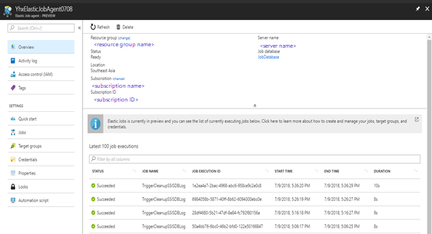

# Clean up SSISDB logs with Azure Elastic Database Jobs

This article describes how to use Azure Elastic Database Jobs to trigger the stored procedure that cleans up logs for the SQL Server Integration Services catalog database, `SSISDB`.

Elastic Database Jobs is an Azure service that makes it easy to automate and run jobs against a database or a group of databases. You can schedule, run, and monitor these jobs by using the Azure portal, Transact-SQL, PowerShell, or REST APIs. Use the Elastic Database Job to trigger the stored procedure for log cleanup one time or on a schedule. You can choose the schedule interval based on SSISDB resource usage to avoid heavy database load.

For more info, see [Manage groups of databases with Elastic Database Jobs](../sql-database/elastic-jobs-overview.md).

The following sections describe how to trigger the stored procedure `[internal].[cleanup_server_retention_window_exclusive]`, which removes SSISDB logs that are outside the retention window set by the administrator.

## Clean up logs with Power Shell

The following sample PowerShell scripts create a new Elastic Job to trigger the stored procedure for SSISDB log cleanup. For more info, see [Create an Elastic Job agent using PowerShell](../sql-database/elastic-jobs-powershell.md).

### Create parameters

``` powershell
# Parameters needed to create the Job Database
param(
$ResourceGroupName = $(Read-Host "Please enter an existing resource group name"),
$AgentServerName = $(Read-Host "Please enter the name of an existing Azure SQL server(for example, yhxserver) to hold the SSISDBLogCleanup job database"),
$SSISDBLogCleanupJobDB = $(Read-Host "Please enter a name for the Job Database to be created in the given SQL Server"),
# The Job Database should be a clean,empty,S0 or higher service tier. We set S0 as default.
$PricingTier = "S0",

# Parameters needed to create the Elastic Job agent
$SSISDBLogCleanupAgentName = $(Read-Host "Please enter a name for your new Elastic Job agent"),

# Parameters needed to create the job credential in the Job Databse to connect to SSISDB
$PasswordForSSISDBCleanupUser = $(Read-Host "Please provide a new password for SSISDBLogCleanup job user to connect to SSISDB database for log cleanup"),
# Parameters needed to create a login and a user in the SSISDB of the target server
$SSISDBServerEndpoint = $(Read-Host "Please enter the name of the target Azure SQL server which contains SSISDB you need to cleanup, for example, myserver") + '.database.windows.net',
$SSISDBServerAdminUserName = $(Read-Host "Please enter the target server admin username for SQL authentication"),
$SSISDBServerAdminPassword = $(Read-Host "Please enter the target server admin password for SQL authentication"),
$SSISDBName = "SSISDB",

# Parameters needed to set job scheduling to trigger execution of cleanup stored procedure
$RunJobOrNot = $(Read-Host "Please indicate whether you want to run the job to cleanup SSISDB logs outside the log retention window immediately(Y/N). Make sure the retention window is set appropriately before running the following powershell scripts. Those removed SSISDB logs cannot be recoverd"),
$IntervalType = $(Read-Host "Please enter the interval type for the execution schedule of SSISDB log cleanup stored procedure. For the interval type, Year, Month, Day, Hour, Minute, Second can be supported."),
$IntervalCount = $(Read-Host "Please enter the detailed interval value in the given interval type for the execution schedule of SSISDB log cleanup stored procedure"),
# StartTime of the execution schedule is set as the current time as default. 
$StartTime = (Get-Date)
```

### Trigger the cleanup stored procedure

```powershell
# Install the latest PackageManagement powershell package which PowershellGet v1.6.5 is dependent on
Find-Package PackageManagement -RequiredVersion 1.1.7.2 | Install-Package -Force
# You may need to restart the powershell session
# Install the latest PowershellGet module which adds the -AllowPrerelease flag to Install-Module
Find-Package PowerShellGet -RequiredVersion 1.6.5 | Install-Package -Force

# Place AzureRM.Sql preview cmdlets side by side with existing AzureRM.Sql version
Install-Module -Name AzureRM.Sql -AllowPrerelease -Force

# Sign in to your Azure account
Connect-AzureRmAccount

# Create a Job Database which is used for defining jobs of triggering SSISDB log cleanup stored procedure and tracking cleanup history of jobs
Write-Output "Creating a blank SQL database to be used as the SSISDBLogCleanup  Job Database ..."
$JobDatabase = New-AzureRmSqlDatabase -ResourceGroupName $ResourceGroupName -ServerName $AgentServerName -DatabaseName $SSISDBLogCleanupJobDB -RequestedServiceObjectiveName $PricingTier
$JobDatabase

# Enable the Elastic Jobs preview in your Azure subscription
Register-AzureRmProviderFeature -FeatureName sqldb-JobAccounts -ProviderNamespace Microsoft.Sql

# Create the Elastic Job agent
Write-Output "Creating the Elastic Job agent..."
$JobAgent = $JobDatabase | New-AzureRmSqlElasticJobAgent -Name $SSISDBLogCleanupAgentName
$JobAgent

# Create the job credential in the Job Database to connect to SSISDB database in the target server for log cleanup
Write-Output "Creating job credential to connect to SSISDB database..."
$JobCredSecure = ConvertTo-SecureString -String $PasswordForSSISDBCleanupUser -AsPlainText -Force
$JobCred = New-Object -TypeName "System.Management.Automation.PSCredential" -ArgumentList "SSISDBLogCleanupUser", $JobCredSecure
$JobCred = $JobAgent | New-AzureRmSqlElasticJobCredential -Name "SSISDBLogCleanupUser" -Credential $JobCred

# In the master database of the target SQL server which contains SSISDB to cleanup 
# - Create the job user login
Write-Output "Grant permissions on the master database of the target server..."
$Params = @{
  'Database' = 'master'
  'ServerInstance' = $SSISDBServerEndpoint
  'Username' = $SSISDBServerAdminUserName
  'Password' = $SSISDBServerAdminPassword
  'OutputSqlErrors' = $true
  'Query' = "CREATE LOGIN SSISDBLogCleanupUser WITH PASSWORD = '" + $PasswordForSSISDBCleanupUser + "'"
}
Invoke-SqlCmd @Params

# For SSISDB database of the target SQL server
# - Create the SSISDBLogCleanup user from the SSISDBlogCleanup user login
# - Grant permissions for the execution of SSISDB log cleanup stored procedure 
Write-Output "Grant appropriate permissions on SSISDB database..."
$TargetDatabase = $SSISDBName
$CreateJobUser = "CREATE USER SSISDBLogCleanupUser FROM LOGIN SSISDBLogCleanupUser"
$GrantStoredProcedureExecution = "GRANT EXECUTE ON internal.cleanup_server_retention_window_exclusive TO SSISDBLogCleanupUser"

$TargetDatabase | % {
  $Params.Database = $_
  $Params.Query = $CreateJobUser
  Invoke-SqlCmd @Params
  $Params.Query = $GrantStoredProcedureExecution
  Invoke-SqlCmd @Params
}

# Create a target group which includes SSISDB database needed to cleanup
Write-Output "Creating the target group including only SSISDB databse needed to cleanup ..."
$SSISDBTargetGroup = $JobAgent | New-AzureRmSqlElasticJobTargetGroup -Name "SSISDBTargetGroup"
$SSISDBTargetGroup | Add-AzureRmSqlElasticJobTarget -ServerName $SSISDBServerEndpoint -Database $SSISDBName 

# Create the job to trigger execution of SSISDB log cleanup stored procedure
Write-Output "Creating a new job to trigger execution of the stored procedure for SSISDB log cleanup"
$JobName = "CleanupSSISDBLog"
$Job = $JobAgent | New-AzureRmSqlElasticJob -Name $JobName -RunOnce
$Job

# Add the job step to execute internal.cleanup_server_retention_window_exclusive
Write-Output "Adding the job step for the cleanup stored procedure execution"
$SqlText = "EXEC internal.cleanup_server_retention_window_exclusive"
$Job | Add-AzureRmSqlElasticJobStep -Name "step to execute cleanup stored procedure" -TargetGroupName $SSISDBTargetGroup.TargetGroupName -CredentialName $JobCred.CredentialName -CommandText $SqlText

# Run the job to immediately start cleanup stored procedure execution for once
IF(($RunJobOrNot = "Y") -Or ($RunJobOrNot = "y"))
{
Write-Output "Start a new execution of the stored procedure for SSISDB log cleanup immediately..."
$JobExecution = $Job | Start-AzureRmSqlElasticJob
$JobExecution
}

# Schedule the job running to trigger stored procedure execution on schedule for removing SSISDB logs outside the retention window
Write-Output "Start the execution schedule of the stored procedure for SSISDB log cleanup..."
$Job | Set-AzureRmSqlElasticJob -IntervalType $IntervalType -IntervalCount $IntervalCount -StartTime $StartTime -Enable
```

## Clean up logs with Transact-SQL

The following sample Transact-SQL scripts create a new Elastic Job to trigger the stored procedure for SSISDB log cleanup. For more info, see [Use Transact-SQL (T-SQL) to create and manage Elastic Database Jobs](../sql-database/elastic-jobs-tsql.md).

1. Create or identify an empty S0 or higher Azure SQL Database to be the SSISDBCleanup Job Database. Then create an Elastic Job Agent in the [Azure portal](https://ms.portal.azure.com/#create/Microsoft.SQLElasticJobAgent).

2. In the Job Database, create a credential for the SSISDB log cleanup job. This credential is used to connect to your SSISDB database to clean up the logs.

    ```sql
    -- Connect to the job database specified when creating the job agent
    -- Create a database master key if one does not already exist, using your own password.  
    CREATE MASTER KEY ENCRYPTION BY PASSWORD= '<EnterStrongPasswordHere>';  

    -- Create a credential for SSISDB log cleanup.  
    CREATE DATABASE SCOPED CREDENTIAL SSISDBLogCleanupCred WITH IDENTITY = 'SSISDBLogCleanupUser', SECRET = '<EnterStrongPasswordHere>'; 
    ```

3. Define the target group that includes the SSISDB database for which you want to run the cleanup stored procedure.

    ```sql
    -- Connect to the job database 
    -- Add a target group 
    EXEC jobs.sp_add_target_group 'SSISDBTargetGroup'

    -- Add SSISDB database into the target group
    EXEC jobs.sp_add_target_group_member 'SSISDBTargetGroup',
    @target_type = 'SqlDatabase',
    @server_name = '<EnterSSISDBTargetServerName>',
    @database_name = '<EnterSSISDBName>'

    --View the recently created target group and target group members
    SELECT * FROM jobs.target_groups WHERE target_group_name = 'SSISDBTargetGroup';
    SELECT * FROM jobs.target_group_members WHERE target_group_name = 'SSISDBTargetGroup';
    ```
4. Grant appropriate permissions for the SSISDB database. The SSISDB catalog must have proper permissions for the stored procedure to run SSISDB log cleanup successfully. For detailed guidance, see [Manage logins](../sql-database/sql-database-manage-logins.md).

    ```sql
    -- Connect to the master database in the target server including SSISDB 
    CREATE LOGIN SSISDBLogCleanupUser WITH PASSWORD = '<strong_password>';

    -- Connect to SSISDB database in the target server to cleanup logs
    CREATE USER SSISDBLogCleanupUser FROM LOGIN SSISDBLogCleanupUser;
    GRANT EXECUTE ON internal.cleanup_server_retention_window_exclusive TO SSISDBLogCleanupUser
    ```
5. Create the job and add a job step to trigger the execution of the stored procedure for SSISDB log cleanup.

    ```sql
    --Connect to the job database 
    --Add the job for the execution of SSISDB log cleanup stored procedure.
    EXEC jobs.sp_add_job @job_name='CleanupSSISDBLog', @description='Remove SSISDB logs which are outside the retention window'

    --Add a job step to execute internal.cleanup_server_retention_window_exclusive
    EXEC jobs.sp_add_jobstep @job_name='CleanupSSISDBLog',
    @command=N'EXEC internal.cleanup_server_retention_window_exclusive',
    @credential_name='SSISDBLogCleanupCred',
    @target_group_name='SSISDBTargetGroup'
    ```
6. Before you continue, make sure the retention window has been set appropriately. SSISDB logs outside the window are deleted and can't be recovered.

   Then you can run the job immediately to begin SSISDB log cleanup.

    ```sql
    --Connect to the job database 
    --Run the job immediately to execute the stored procedure for SSISDB log cleanup
    declare @je uniqueidentifier
    exec jobs.sp_start_job 'CleanupSSISDBLog', @job_execution_id = @je output

    --Watch the execution results for SSISDB log cleanup 
    select @je
    select * from jobs.job_executions where job_execution_id = @je
    ```
7. Optionally, schedule job executions to remove SSISDB logs outside the retention window on a schedule. Use a similar statement to update the job parameters.

    ```sql
    --Connect to the job database 
    EXEC jobs.sp_update_job
    @job_name='CleanupSSISDBLog',
    @enabled=1,
    @schedule_interval_type='<EnterIntervalType(Month,Day,Hour,Minute,Second)>',
    @schedule_interval_count='<EnterDetailedIntervalValue>',
    @schedule_start_time='<EnterProperStartTimeForSchedule>',
    @schedule_end_time='<EnterProperEndTimeForSchedule>'
    ```

## Monitor the cleanup job in the Azure portal

You can monitor the execution of the cleanup job in the Azure portal. For each execution, you see the status, start time, and end time of the job.



## Monitor the cleanup job with Transact-SQL

You can also use Transact-SQL to view the execution history of the cleanup job.

```sql
--Connect to the job database 
--View all execution statuses for the job to cleanup SSISDB logs
SELECT * FROM jobs.job_executions WHERE job_name = 'CleanupSSISDBLog' 
ORDER BY start_time DESC

-- View all active executions
SELECT * FROM jobs.job_executions WHERE is_active = 1
ORDER BY start_time DESC
```

## Next steps

For management and monitoring tasks related to the Azure-SSIS Integration Runtime, see the following articles. The Azure-SSIS IR is the runtime engine for SSIS packages stored in SSISDB in Azure SQL Database.

-   [Reconfigure the Azure-SSIS integration runtime](manage-azure-ssis-integration-runtime.md)

-   [Monitor the Azure-SSIS integration runtime](monitor-integration-runtime.md#azure-ssis-integration-runtime).
