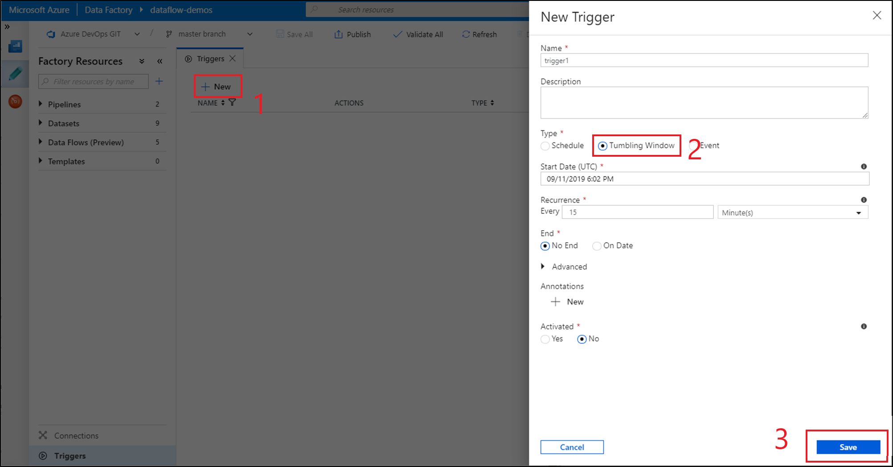

# Create a trigger that runs a pipeline on a tumbling window
[!INCLUDE[appliesto-adf-asa-md](includes/appliesto-adf-asa-md.md)]

This article provides steps to create, start, and monitor a tumbling window trigger. For general information about triggers and the supported types, see [Pipeline execution and triggers](concepts-pipeline-execution-triggers.md).

Tumbling window triggers are a type of trigger that fires at a periodic time interval from a specified start time, while retaining state. Tumbling windows are a series of fixed-sized, non-overlapping, and contiguous time intervals. A tumbling window trigger has a one-to-one relationship with a pipeline and can only reference a singular pipeline. Tumbling window trigger is a more heavy weight alternative for schedule trigger offering a suite of features for complex scenarios([dependency on other tumbling window triggers](#tumbling-window-trigger-dependency), [rerunning a failed job](tumbling-window-trigger-dependency.md#monitor-dependencies) and [set user retry for pipelines](#user-assigned-retries-of-pipelines)). To further understand the difference between schedule trigger and tumbling window trigger, please visit [here](concepts-pipeline-execution-triggers.md#trigger-type-comparison).

## Data Factory UI

1. To create a tumbling window trigger in the Data Factory UI, select the **Triggers** tab, and then select **New**. 
1. After the trigger configuration pane opens, select **Tumbling Window**, and then define your tumbling window trigger properties. 
1. When you're done, select **Save**.



## Tumbling window trigger type properties

A tumbling window has the following trigger type properties:

```
{
    "name": "MyTriggerName",
    "properties": {
        "type": "TumblingWindowTrigger",
        "runtimeState": "<<Started/Stopped/Disabled - readonly>>",
        "typeProperties": {
            "frequency": <<Minute/Hour>>,
            "interval": <<int>>,
            "startTime": "<<datetime>>",
            "endTime: <<datetime – optional>>,
            "delay": <<timespan – optional>>,
            "maxConcurrency": <<int>> (required, max allowed: 50),
            "retryPolicy": {
                "count": <<int - optional, default: 0>>,
                "intervalInSeconds": <<int>>,
            },
			"dependsOn": [
				{
					"type": "TumblingWindowTriggerDependencyReference",
					"size": <<timespan – optional>>,
					"offset": <<timespan – optional>>,
					"referenceTrigger": {
						"referenceName": "MyTumblingWindowDependency1",
						"type": "TriggerReference"
					}
				},
				{
					"type": "SelfDependencyTumblingWindowTriggerReference",
					"size": <<timespan – optional>>,
					"offset": <<timespan>>
				}
			]
        },
        "pipeline": {
            "pipelineReference": {
                "type": "PipelineReference",
                "referenceName": "MyPipelineName"
            },
            "parameters": {
                "parameter1": {
                    "type": "Expression",
                    "value": "@{concat('output',formatDateTime(trigger().outputs.windowStartTime,'-dd-MM-yyyy-HH-mm-ss-ffff'))}"
                },
                "parameter2": {
                    "type": "Expression",
                    "value": "@{concat('output',formatDateTime(trigger().outputs.windowEndTime,'-dd-MM-yyyy-HH-mm-ss-ffff'))}"
                },
                "parameter3": "https://mydemo.azurewebsites.net/api/demoapi"
            }
        }
    }
}
```

The following table provides a high-level overview of the major JSON elements that are related to recurrence and scheduling of a tumbling window trigger:

| JSON element | Description | Type | Allowed values | Required |
|:--- |:--- |:--- |:--- |:--- |
| **type** | The type of the trigger. The type is the fixed value "TumblingWindowTrigger". | String | "TumblingWindowTrigger" | Yes |
| **runtimeState** | The current state of the trigger run time.<br/>**Note**: This element is \<readOnly>. | String | "Started," "Stopped," "Disabled" | Yes |
| **frequency** | A string that represents the frequency unit (minutes or hours) at which the trigger recurs. If the **startTime** date values are more granular than the **frequency** value, the **startTime** dates are considered when the window boundaries are computed. For example, if the **frequency** value is hourly and the **startTime** value is 2017-09-01T10:10:10Z, the first window is (2017-09-01T10:10:10Z, 2017-09-01T11:10:10Z). | String | "minute," "hour"  | Yes |
| **interval** | A positive integer that denotes the interval for the **frequency** value, which determines how often the trigger runs. For example, if the **interval** is 3 and the **frequency** is "hour," the trigger recurs every 3 hours. <br/>**Note**: The minimum window interval is 5 minutes. | Integer | A positive integer. | Yes |
| **startTime**| The first occurrence, which can be in the past. The first trigger interval is (**startTime**, **startTime** + **interval**). | DateTime | A DateTime value. | Yes |
| **endTime**| The last occurrence, which can be in the past. | DateTime | A DateTime value. | Yes |
| **delay** | The amount of time to delay the start of data processing for the window. The pipeline run is started after the expected execution time plus the amount of **delay**. The **delay** defines how long the trigger waits past the due time before triggering a new run. The **delay** doesn’t alter the window **startTime**. For example, a **delay** value of 00:10:00 implies a delay of 10 minutes. | Timespan<br/>(hh:mm:ss)  | A timespan value where the default is 00:00:00. | No |
| **maxConcurrency** | The number of simultaneous trigger runs that are fired for windows that are ready. For example, to back fill hourly runs for yesterday results in 24 windows. If **maxConcurrency** = 10, trigger events are fired only for the first 10 windows (00:00-01:00 - 09:00-10:00). After the first 10 triggered pipeline runs are complete, trigger runs are fired for the next 10 windows (10:00-11:00 - 19:00-20:00). Continuing with this example of **maxConcurrency** = 10, if there are 10 windows ready, there are 10 total pipeline runs. If there's only 1 window ready, there's only 1 pipeline run. | Integer | An integer between 1 and 50. | Yes |
| **retryPolicy: Count** | The number of retries before the pipeline run is marked as "Failed."  | Integer | An integer, where the default is 0 (no retries). | No |
| **retryPolicy: intervalInSeconds** | The delay between retry attempts specified in seconds. | Integer | The number of seconds, where the default is 30. | No |
| **dependsOn: type** | The type of TumblingWindowTriggerReference. Required if a dependency is set. | String |  "TumblingWindowTriggerDependencyReference", "SelfDependencyTumblingWindowTriggerReference" | No |
| **dependsOn: size** | The size of the dependency tumbling window. | Timespan<br/>(hh:mm:ss)  | A positive timespan value where the default is the window size of the child trigger  | No |
| **dependsOn: offset** | The offset of the dependency trigger. | Timespan<br/>(hh:mm:ss) |  A timespan value that must be negative in a self-dependency. If no value specified, the window is the same as the trigger itself. | Self-Dependency: Yes<br/>Other: No  |

> [!NOTE]
> After a tumbling window trigger is published, **interval** and **frequency** can't be edited.

### WindowStart and WindowEnd system variables

You can use the **WindowStart** and **WindowEnd** system variables of the tumbling window trigger in your **pipeline** definition (that is, for part of a query). Pass the system variables as parameters to your pipeline in the **trigger** definition. The following example shows you how to pass these variables as parameters:

```
{
    "name": "MyTriggerName",
    "properties": {
        "type": "TumblingWindowTrigger",
            ...
        "pipeline": {
            "pipelineReference": {
                "type": "PipelineReference",
                "referenceName": "MyPipelineName"
            },
            "parameters": {
                "MyWindowStart": {
                    "type": "Expression",
                    "value": "@{concat('output',formatDateTime(trigger().outputs.windowStartTime,'-dd-MM-yyyy-HH-mm-ss-ffff'))}"
                },
                "MyWindowEnd": {
                    "type": "Expression",
                    "value": "@{concat('output',formatDateTime(trigger().outputs.windowEndTime,'-dd-MM-yyyy-HH-mm-ss-ffff'))}"
                }
            }
        }
    }
}
```

To use the **WindowStart** and **WindowEnd** system variable values in the pipeline definition, use your "MyWindowStart" and "MyWindowEnd" parameters, accordingly.

### Execution order of windows in a backfill scenario

If the startTime of trigger is in the past, then based on this formula, M=(CurrentTime- TriggerStartTime)/TriggerSliceSize, the trigger will generate {M} backfill(past) runs in parallel, honoring trigger concurrency, before executing the future runs. The order of execution for windows is deterministic, from oldest to newest intervals. Currently, this behavior can't be modified.

### Existing TriggerResource elements

The following points apply to update of existing **TriggerResource** elements:

* The value for the **frequency** element (or window size) of the trigger along with **interval** element cannot be changed once the trigger is created. This is required for proper functioning of triggerRun reruns and dependency evaluations
* If the value for the **endTime** element of the trigger changes (added or updated), the state of the windows that are already processed is *not* reset. The trigger honors the new **endTime** value. If the new **endTime** value is before the windows that are already executed, the trigger stops. Otherwise, the trigger stops when the new **endTime** value is encountered.

### User assigned retries of pipelines

In case of pipeline failures, tumbling window trigger can retry the execution of the referenced pipeline automatically, using the same input parameters, without the user intervention. This can be specified using the property "retryPolicy" in the trigger definition.

### Tumbling window trigger dependency

If you want to make sure that a tumbling window trigger is executed only after the successful execution of another tumbling window trigger in the data factory, [create a tumbling window trigger dependency](tumbling-window-trigger-dependency.md). 

## Sample for Azure PowerShell

[!INCLUDE [updated-for-az](../../includes/updated-for-az.md)]

This section shows you how to use Azure PowerShell to create, start, and monitor a trigger.

1. Create a JSON file named **MyTrigger.json** in the C:\ADFv2QuickStartPSH\ folder with the following content:

    > [!IMPORTANT]
    > Before you save the JSON file, set the value of the **startTime** element to the current UTC time. Set the value of the **endTime** element to one hour past the current UTC time.

    ```json
    {
      "name": "PerfTWTrigger",
      "properties": {
        "type": "TumblingWindowTrigger",
        "typeProperties": {
          "frequency": "Minute",
          "interval": "15",
          "startTime": "2017-09-08T05:30:00Z",
          "delay": "00:00:01",
          "retryPolicy": {
            "count": 2,
            "intervalInSeconds": 30
          },
          "maxConcurrency": 50
        },
        "pipeline": {
          "pipelineReference": {
            "type": "PipelineReference",
            "referenceName": "DynamicsToBlobPerfPipeline"
          },
          "parameters": {
            "windowStart": "@trigger().outputs.windowStartTime",
            "windowEnd": "@trigger().outputs.windowEndTime"
          }
        },
        "runtimeState": "Started"
      }
    }
    ```

2. Create a trigger by using the **Set-AzDataFactoryV2Trigger** cmdlet:

    ```powershell
    Set-AzDataFactoryV2Trigger -ResourceGroupName $ResourceGroupName -DataFactoryName $DataFactoryName -Name "MyTrigger" -DefinitionFile "C:\ADFv2QuickStartPSH\MyTrigger.json"
    ```
    
3. Confirm that the status of the trigger is **Stopped** by using the **Get-AzDataFactoryV2Trigger** cmdlet:

    ```powershell
    Get-AzDataFactoryV2Trigger -ResourceGroupName $ResourceGroupName -DataFactoryName $DataFactoryName -Name "MyTrigger"
    ```

4. Start the trigger by using the **Start-AzDataFactoryV2Trigger** cmdlet:

    ```powershell
    Start-AzDataFactoryV2Trigger -ResourceGroupName $ResourceGroupName -DataFactoryName $DataFactoryName -Name "MyTrigger"
    ```

5. Confirm that the status of the trigger is **Started** by using the **Get-AzDataFactoryV2Trigger** cmdlet:

    ```powershell
    Get-AzDataFactoryV2Trigger -ResourceGroupName $ResourceGroupName -DataFactoryName $DataFactoryName -Name "MyTrigger"
    ```

6. Get the trigger runs in Azure PowerShell by using the **Get-AzDataFactoryV2TriggerRun** cmdlet. To get information about the trigger runs, execute the following command periodically. Update the **TriggerRunStartedAfter** and **TriggerRunStartedBefore** values to match the values in your trigger definition:

    ```powershell
    Get-AzDataFactoryV2TriggerRun -ResourceGroupName $ResourceGroupName -DataFactoryName $DataFactoryName -TriggerName "MyTrigger" -TriggerRunStartedAfter "2017-12-08T00:00:00" -TriggerRunStartedBefore "2017-12-08T01:00:00"
    ```
    
To monitor trigger runs and pipeline runs in the Azure portal, see [Monitor pipeline runs](quickstart-create-data-factory-resource-manager-template.md#monitor-the-pipeline).

## Next steps

* For detailed information about triggers, see [Pipeline execution and triggers](concepts-pipeline-execution-triggers.md#trigger-execution).
* [Create a tumbling window trigger dependency](tumbling-window-trigger-dependency.md)
